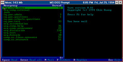
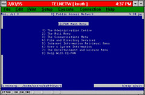
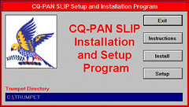

David Jones, 1000 Users on a 486, SAGE-AU’95, Wollongong and AUUG‘95, Sydney. (Best paper at SAGE-AU'95)

## Abstract

The Central Queensland University Public Access Network ([CQ-PAN](http://cq-pan.cqu.edu.au/)) is a research project within the [Department of Maths & Computing](http://mc.cqu.edu.au/) at [Central Queensland University](http://www.cqu.edu.au/). CQ-PAN has been providing Internet access to Central Queensland residents in one form or another since the middle of 1993. Access is currently being provided to over 1000 people using software obtained from the Internet, the efforts of a number computing students and a 486DX2-66 running Linux. This paper will relate the achievements, methods, software, problems, joys and the lessons learnt during the last two years.

## Introduction

As of August 1995 access to the Internet is still a dream the residents of Central Queensland (CQ) and other regional Queensland centres. To the people of CQ the Internet is nothing more than the subject of media beat ups about pornography and bomb making. CQ residents can only gain access to the Internet if they are University staff or students, or if they are prepared to pay for STD charges to Brisbane. However, the recent advent of [OpenNet](http://www.opennet.net.au/) has meant that students and teachers can now gain access for a local phone call.

Since late 1993 the Central Queensland University Public Access Network ([CQ-PAN](http://cq-pan.cqu.edu.au/)) has been providing Internet access to some residents of CQ. Access has been provided using software obtained from the Internet, the efforts of [computing students](http://cq-pan.cqu.edu.au/current/admin/cq-pan-admin.html) from Central Queensland University ([CQU](http://www.cqu.edu.au/)) and next to no other resources. The access provided by [CQ-PAN](http://cq-pan.cqu.edu.au/) has been restricted to [CQU](http://www.cqu.edu.au/) [students](http://cq-pan.cqu.edu.au/current/students/students.html), [local schools](http://cq-pan.cqu.edu.au/schools/local-schools.html) and thirty local residents.

The remainder of this paper will provide a brief introduction to [CQ-PAN](http://cq-pan.cqu.edu.au/), its aims and a brief history of its development. It will also provide a description of the hardware and software used by [CQ-PAN](http://cq-pan.cqu.edu.au/) to implement the different types of Internet access it has provided. The paper will also describe the different community groups that have enjoyed Internet access and what they have done with that access. The final portion of the paper will examine a collection of the highs and lows during the two years of [CQ-PAN](http://cq-pan.cqu.edu.au/)'s lifetime and also make some observations about the implementation of Internet access based on that experience.

## Introducing [CQ-PAN](http://cq-pan.cqu.edu.au/)

The Central Queensland University's ([CQU](http://www.cqu.edu.au/)) Public Access Network ([CQ-PAN](http://cq-pan.cqu.edu.au/)) is a research project within the [Department of Maths & Computing](http://mc.cqu.edu.au/). The project has the following aims

- investigate and develop new methods of using computer mediated communications (CMC) and the Internet,
- make the advantages of CMC and the Internet available to the Central Queensland community as inexpensively and simply as possible,
- perform research into how the technology is used and what effects it has, and
- provide the students studying the Department's Bachelor of Information Technology degree experience in developing and maintaining a computer system with a real purpose and real users.

Early on it was decided that [CQ-PAN](http://cq-pan.cqu.edu.au/) would only use software that is available on the Internet, either freely or as shareware. In addition any software developed by [CQ-PAN](http://cq-pan.cqu.edu.au/) would in turn be made available on the Internet.

Since the beginning [CQ-PAN](http://cq-pan.cqu.edu.au/) has operated on a shoestring budget with next to no resources. All of the computing hardware and office supplies used by [CQ-PAN](http://cq-pan.cqu.edu.au/) have been provided by the [Department of Maths & Computing](http://mc.cqu.edu.au/). In recent times an increasing number of research projects have provided additional funding. All the work has been carried out by students either as part of projects or as volunteer work.

While [CQ-PAN](http://cq-pan.cqu.edu.au/) will continue, the need for additional investment is increasingly important as [CQ-PAN](http://cq-pan.cqu.edu.au/) outgrows the power of the high end personal computers it has been using as servers. Any company or individual who is eager to be associated with a project effecting the lives of over a 1000 Central Queenslanders please feel free to contact the [author](mailto:d.jones@cqu.edu.au).

## The History of [CQ-PAN](http://cq-pan.cqu.edu.au/)

#### 1993

The idea of [CQ-PAN](http://cq-pan.cqu.edu.au/) was first floated in early 1993 by a computing student who was an avid user of the Cleveland Freenet. His desire was to construct a similar system in Central Queensland. However the environment at [CQU](http://www.cqu.edu.au/) meant that providing Internet access to the general community was extremely unlikely and in fact generated some heated debate.

The first Internet connections provided by [CQ-PAN](http://cq-pan.cqu.edu.au/) (it wasn't called [CQ-PAN](http://cq-pan.cqu.edu.au/) at the time) were provided to two local school teachers in the middle of 1993. The aim behind this access was to test whether or not Internet access would benefit local schools and whether or not we could support them.

The two teachers were provided with a UNIX command line account on an Amiga 3000 (aldur) running Commodore's version of SVR4 UNIX. The access provided suffered from a number of problems including

- the operating system on aldur was restricted to two users, aldur was also used by the author for his Internet access. Three users on a machine with a two user limit causes a fairly obvious problem.
- there was no direct method to get from the University's modem pool to aldur, The access provided to the teachers was done "quietly" and as a result there was no direct connection between the University's modems and aldur. Instead the teachers had to dial the University modem pool, connect from the modem pool to a DECStation located in the [Faculty of Business](http://www.bus.cqu.edu.au), login to an account on the DECStation that performed a captive telnet to aldur and finally login to aldur using their own account.
- the UNIX command line interface was not designed for novices, and
- a variety of problems with the teacher's computers, modems and phone lines, including the fact that Telecom will only guarantee 2400bps (if you can get 2400 don't bother ringing them).

The combination of these difficulties meant that one of the teachers dropped out without getting any real benefit from his Internet access. After two or three months the remaining teacher was starting to make significant use of the system and has since developed into one of the major users and promoters of [CQ-PAN](http://cq-pan.cqu.edu.au/). He is currently starting work on a funded project to develop a World-Wide Web (WWW) resource for [secondary mathematics assessment](http://cq-pan.cqu.edu.au/schools/smad/smad.html).

#### 1994

The benefits enjoyed by the remaining teacher and the growing use of the Internet was enough to convince us that the next step should be taken. At the start of 1994 a group of six computing students started work on a project that was to become [CQ-PAN](http://cq-pan.cqu.edu.au/).

It was obvious that aldur would not be sufficient for the project. In response we were able to obtain the services of bertha. bertha was one of the first 486DX2-66s (so early in fact it had a CPU fan and 30 pin SIMS). bertha with 16Mb RAM, 400 Mb of disk space and with Linux as its operating system became the [CQ-PAN](http://cq-pan.cqu.edu.au/) server.

The six students, Shane Atkinson, Brett Carter, Jason Lockwood, Terry Manderson, Sean O'Kelly and Chris Parry, involved with [CQ-PAN](http://cq-pan.cqu.edu.au/) during 1994 developed the online menu system and the offline email and news system. These systems formed the foundation of [CQ-PAN](http://cq-pan.cqu.edu.au/) and are still the major systems used today. A more detailed description of these two systems is given below.

By the end of 1994 [CQ-PAN](http://cq-pan.cqu.edu.au/) was providing

- email and Usenet news to over 250 users from 8 local schools,
- simple text based Internet access using a menu system to over 160 [CQU](http://www.cqu.edu.au/) students, 10 local school teachers, a class of 12 primary school students in Gladstone and nurses from a local retirement village.

#### 1995 and Beyond

At the start of 1995 interest in [CQ-PAN](http://cq-pan.cqu.edu.au/) and the Internet was growing rapidly. Indicative of this increased interest was the 15 students who volunteered to work on [CQ-PAN](http://cq-pan.cqu.edu.au/) at the start of 1995. With the increased involvement [CQ-PAN](http://cq-pan.cqu.edu.au/) expanded its 1995 development to include

- further development on the offline and online menu systems developed during 1994,
- development of software to provide SLIP/PPP access,
- development of a WWW server and WWW authoring software, and
- development of a Mud/MOO for use in administering [CQ-PAN](http://cq-pan.cqu.edu.au/) and for virtual tutorials for subjects offered by the Department of Maths & Computing.

The other major plan for 1995 was providing Internet access to the general CQ public. The work of [CQ-PAN](http://cq-pan.cqu.edu.au/) during 1994 and the publicity generated as a result of that work combined with the increasing publicity in the media about the Internet turned around opposition within [CQU](http://www.cqu.edu.au/) to providing Internet access to the general community.

What happened when [CQ-PAN](http://cq-pan.cqu.edu.au/) started providing general public access is documented in a section below titled "Oops!! [CQU](http://www.cqu.edu.au/) is an affiliate member of AARNET not a VAR".

By August 1995, bertha was groaning under the strain of

- 880 users from 21 schools and families using the offline system,
- 34 general community users with either POP mail accounts or on-line menu accounts,
- 286 [CQU](http://www.cqu.edu.au/) students using the on-line menu account,
- 43 mailing lists, and
- a World-Wide Web server getting around 2000 hits a week.

It is planned in the near future (hopefully by the time I present this paper) to have migrated [CQ-PAN](http://cq-pan.cqu.edu.au/) onto a Pentium 90 (that can't divide) with 2.4Gb of disk space. This will provide much needed relief to bertha.

During 1995 [CQ-PAN](http://cq-pan.cqu.edu.au/) also started supporting a number of other projects. In conjunction with the Priority Country Area Program (PCAP), the off-line system is being used by the families of 11 primary school students studying via correspondence. To support the PCAP project a 486DX2-66 running Linux, with two internal modems has been placed onto [CQU](http://www.cqu.edu.au/)'s Emerald campus to act as a server for western based students.

A number of other schools in western Central Queensland have been supplied with the offline system as part of a project with the Capricornia Aboriginal and Islander Tertiary Education Centre (CAITEC).

## The Types of Access

There are many different ways by which Internet access can be provided. [CQ-PAN](http://cq-pan.cqu.edu.au/) currently provides three types of Internet access. Each type of access is designed to fulfil the needs and capabilities of a particular group. [CQ-PAN](http://cq-pan.cqu.edu.au/) provides

- an off-line email and Usenet news system,
- a simple, text based, menu system, and
- SLIP/PPP access.

IBM PC clones have been the target platform for all of the [CQ-PAN](http://cq-pan.cqu.edu.au/) client software. The reasons for this emphasis include

- it is the platform [CQU](http://www.cqu.edu.au/) students are most familiar with,
- it is the platform the department recommends for students and as a result the department has a number of MS-DOS machines available, and
- it is the platform used by a majority of our target users (including the schools).

#### The Off-Line System

At the start of 1994 it was decided that local schools would be one of the primary target groups to which Internet access should be provided. Schools were chosen for three reasons

- they were a group that could greatly benefit from access,
- they were the group least likely to gain access in the near future, and
- providing access to them was seen as a good way to advertise the University among its major source of potential students.

Most of the schools in Central Queensland can be characterised as having

- a user population of a few hundred or more,
- a tendency to have IBM PC compatible computers,
- some of the schools have a local area network either Novell (by far the most popular) or Lantastic,
- a 2400bps (or less) modem (slowly changing), and
- no money to spend (this will never change).

In deciding on the type of Internet access to provide to local schools the following design guidelines were adopted

- provide Internet access to all the school's students and staff,
- make use of existing hardware within the school, and
- provide schools with an introduction to the Internet without requiring them to spend any money.

The result was an off-line system that can provide an entire school population with access to Internet email and Usenet news. With the off-line system there is no direct human interaction with the Internet. When students and teachers are reading and replying to email they are accessing information stored on a local drive or local network drive. The connection to the Internet is kept separate from the act of reading and replying in an effort to minimise communication costs.

Each day the school dials up the University computer and the two computers automatically exchange incoming and outgoing email and news. The exchange of information can be timed to occur at anytime of the day without the need for human interaction. This ability can be used to make use of cheap STD rates if necessary.

The off-line system was developed by Brett Carter, Jason Lockwood, Sean O'Kelly and Chris Parry and uses the following software

- Yarn, an MS-DOS based off-line email and news reader, written by Chin Huang (no connection to [CQU](http://www.cqu.edu.au/))
- MS-Kermit and some automated scripts to transfer information between the school's computer and the [CQ-PAN](http://cq-pan.cqu.edu.au/) server,
- the compression program lha to compress information moving between the schools and the University,
- uqwk, a UNIX based program that packs email and news into SOUP (simple offline user packet) format packets that can be read by Yarn, and
- a collection of shell scripts and batch files to automate the packing of email and news, the creation of new users and the registering of newsgroups.

Figure 1 - The [CQ-PAN](http://cq-pan.cqu.edu.au/) Off-line Interface (the YARN newsreader).

The off-line system can be installed onto either a stand alone machine or onto a local area network. With either system all the students and teachers at the school can have individual email accounts. Each school can create new accounts and subscribe or unsubscribe from newsgroups as needed.

The minimum resources required to use the system are

- an MS-DOS computer with 5-10Mb of disk space ( [Glenmore High](http://cq-pan.cqu.edu.au/schools/local-schools/ghs/ghs.html) started with an XT),
- a modem that can connect to the computer, and
- a phone line to connect the modem to (usually the greatest expense for schools).

The system has been used on Novell and Lantastic local area networks and can be installed onto any local area network that provides

- the ability to share files and directories amongst users,
- separate password protected login accounts for each user,
- the ability to base an environment variable on a user's login name.
- the ability to share files for simultaneous reading,
- a scheme to prevent non-privileged users from modifying or deleting files while still providing access to read and execute these files is desirable,
- all users be able to have sufficient access to write to a common directory.

As of August 1995 the system is

- being used by over 880 users from 21 schools and families in the Central Queensland region,
- being installed into schools in Biloela, Barcaldine, Blackwater, Moronbah, Moura and Emerald in conjunction with CAITEC,
- in conjunction with the Priority Country Area Program being used by over 11 families with year 7 students studying via correspondence in a project, and
- is being used by the Rockhampton Computer Club's bulletin board system to provide email and Usenet news access.

While the system works, the installation and management of the system is still very much a work in progress. Installing the system onto a local area network is not a task to be undertaken by a network novice, which means most teachers managing networks in schools. Documentation for administering and using the system has been produced but requires further work. A 1995 project student is currently working on developing an improved system for the management of users and newsgroups.

The off-line system, while not perfect, provides schools with a taste of the Internet for the cost of a phone call a day.

#### The Menu System

At the start of 1994 most [CQU](http://www.cqu.edu.au/) students did not have any form of Internet access. The lack of Internet access was in most part due to the abuses of Internet access by previous students. Those lucky few who did have access were provided with either VMS or UNIX command line accounts.

This type of access suffered from two problems

- it was extremely difficult for most students to use and thereby prevented any but the most committed from completing any useful work, and
- was very insecure (especially the UNIX command line).

During 1994, Shane Atkinson and Chris Parry imagined, designed and implemented a system that provides full Internet access using a simple to use, text based menu system. The system provides two important benefits

- users need not know anything about the UNIX or VMS command lines, and
- it is considerably more secure than a command line account.

Figure 2 - The [CQ-PAN](http://cq-pan.cqu.edu.au/) Menu System.

The primary users of the system have been [CQU](http://www.cqu.edu.au/) students but the system has also been used by primary school students in Gladstone and by local teachers. As of August 1995, 290 [CQU](http://www.cqu.edu.au/) students had accounts on the system.

#### SLIP Access

Towards the end of 1994 modifications to the [CQU](http://www.cqu.edu.au/) modem pool meant it was now possible to provide SLIP and PPP access. At the start of 1995 Iain Whyte developed the Windows based [CQ-PAN](http://cq-pan.cqu.edu.au/) SLIP software package. The package includes Trumpet Winsock, Netscape, Eudora, WinVN and Windows clients for telnet, FTP and ping. Installation was accomplished using a Visual Basic installation application (Figure 3).

The system is being used by the [CQ-PAN](http://cq-pan.cqu.edu.au/) public users, local schools and by staff within the Department of Maths & Computing.

## Services

Providing access to the Internet is only the first step in the process. [CQ-PAN](http://cq-pan.cqu.edu.au/)'s future is increasingly based on providing additional services for the people it has connected to the Internet. The services currently supplied by [CQ-PAN](http://cq-pan.cqu.edu.au/) include

- local email lists, and
- World-Wide Web publishing.

Figure 3 - The [CQ-PAN](http://cq-pan.cqu.edu.au/) SLIP Installation Window.

#### Mailing Lists

Since mid-1994 [CQ-PAN](http://cq-pan.cqu.edu.au/) has been using the Majordomo mailing list manager to provide mailing lists for a number of purposes. Mailing lists have been set up for

- school projects,
- [CQU](http://www.cqu.edu.au/) students with particular interests or hobbies,
- the [CQ-PAN](http://cq-pan.cqu.edu.au/) administrators, and
- subjects taught by the Department of Maths & Computing.

Towards the end of 1994 the Year 9 Geography class at Glenmore High school set up a project entitled "What can Indigenous people teach us about the environment?". For this project a number of mailing lists were set up for discussion about particular indigenous people including Maoris, Kung, American Indians and Aborigines.

Glenmore students would post questions about the indigenous people and other members of the mailing lists would answer these questions. The membership of the mailing lists included University academics, University students and members of each of the indigenous populations.

The 280 [CQU](http://www.cqu.edu.au/) students using the menu system have used mailing lists for discussion of a number of topics including

- gaming,
- humour,
- poetry,
- stories, and
- virtual reality.

Mailing lists have also been the primary form of communication between the [CQ-PAN](http://cq-pan.cqu.edu.au/) administrators. The mailing lists are used by the administrators for

- discussion of issues related to the on-going development of [CQ-PAN](http://cq-pan.cqu.edu.au/),
- notification of changes to the system,
- destination for the output of many of the system scripts including user creation.

Much of the work carried out by [CQ-PAN](http://cq-pan.cqu.edu.au/) makes a contribution to the teaching of subjects offered by the Department of Maths & Computing. [CQU](http://www.cqu.edu.au/) is a distance education centre that means that many of the students studying with the Department never attend classes on-campus. Email, mailing lists and World Wide Web are useful tools in increasing the interaction between distance students, on-campus students and lecturers. During first semester 1995 the [CQ-PAN](http://cq-pan.cqu.edu.au/) machine provided mailing lists for thirteen subjects offered by the department.

#### World Wide Web

The ability to publish WWW pages is quickly becoming the most popular service provided by [CQ-PAN](http://cq-pan.cqu.edu.au/). During 1995, Andrew Newman started development on a simple Windows based HTML authoring system. In combination with the [CQ-PAN](http://cq-pan.cqu.edu.au/) WWW server the authoring system provides [CQ-PAN](http://cq-pan.cqu.edu.au/) users the ability to publish WWW pages.

The HTML authoring system includes

- Windows based HTML authoring software including HTMLAsst, standalone versions of Netscape and Mosaic,
- a collection of HTML pages explaining how to create HTML pages,
- a collection of public domain icons for use in the pages,
- a set of guidelines for the format of links and how users can upload their pages onto the [CQ-PAN](http://cq-pan.cqu.edu.au/) WWW server.

The first WWW pages were placed onto the [CQ-PAN](http://cq-pan.cqu.edu.au/) machine in early May 1995. At the end of June the [CQ-PAN](http://cq-pan.cqu.edu.au/) WWW server had 45Mb of information taken up with

- the [CQ-PAN](http://cq-pan.cqu.edu.au/) administrator's home pages, these pages provide the administrators with an introduction to HTML and allow the [CQ-PAN](http://cq-pan.cqu.edu.au/) users put faces to names,
- home pages developed by three local schools including the pages of the [Glenmore Primary School](http://cq-pan.cqu.edu.au/schools/local-schools/gps/gps.html) that were featured in the June issue of Internet Australasia,
- pages developed by two [CQU](http://www.cqu.edu.au/) students testing methods to be used by all the menu users after August,
- the [CQU](http://www.cqu.edu.au/) student newspaper [Felix Culpa](http://cq-pan.cqu.edu.au/felix-culpa/felix-culpa.html), and
- a prototype set of WWW pages for the [Department of Maths & Computing](http://mc.cqu.edu.au/).

During June the [CQ-PAN](http://cq-pan.cqu.edu.au/) WWW server has been averaging about 2000 hits a week. From the start of second semester 1995 all [CQ-PAN](http://cq-pan.cqu.edu.au/) online menu users, including almost 300 [CQU](http://www.cqu.edu.au/) students, will have the ability to create personal WWW pages. We are currently in the planning stages for a WWW page design competition to promote interest in WWW publishing.

## The Users

[CQ-PAN](http://cq-pan.cqu.edu.au/) has provided Internet access to the following

- schools in Rockhampton, Yeppoon, Biloela, Moura, Barcaldine, and Blackwater using the off-line system with some also having SLIP access,
- a primary school in Gladstone using the on-line menu system from [CQU](http://www.cqu.edu.au/)'s Gladstone campus,
- [CQU](http://www.cqu.edu.au/) students using the menu system,
- primary school students studying via correspondence from remote areas throughout CQ using the off-line system,
- 30 community users (including one from Townsville) using SLIP access

The group who have benefited greatly from Internet access have been the local teachers. As a professional development tool the Internet is unsurpassed. The following example is from the first teacher [CQ-PAN](http://cq-pan.cqu.edu.au/) provided access to

> When preparing my semester planner for the new Maths B course, I was unable to find any pre-calculus applications of polynomials. I posted a request to the K12.ed.math newsgroup. In a few days I received a five page reply from a teacher in New Hampshire in the US. Wonderful! \[[Boggs 1994](../publications/cyberspace-the-new-educational-frontier/index.md)\]

School students have used Internet access to obtain keypals (the electronic equivalent of penpals) and in a number of specific projects. A class of primary students from Gladstone West Primary School used IRC to "speak" to native French speakers as part of their French LOTE classes. The students at [Glenmore Primary](http://cq-pan.cqu.edu.au/schools/local-schools/gps/gps.html), [Glenmore High](http://cq-pan.cqu.edu.au/schools/local-schools/ghs/ghs.html) and [Yeppoon High](http://cq-pan.cqu.edu.au/schools/local-schools/yhs/yhs.html) are involved with the creation of WWW pages about their schools and the local region.

## Trials, Tribulations, Lessons and Success

The last two years of providing Internet access has provided its share of highs and lows and has been a great source of learning for everyone involved. The following sections are just some of these experiences.

#### Oops!! [CQU](http://www.cqu.edu.au/) is an affiliate member of AARNET not a VAR

After much cajoling it was eventually possible to persuade the [CQU](http://www.cqu.edu.au/) hierarchy that it would be a good idea to provide Internet access to the CQ community. It was planned to provide access in early 1995 for a three month trial period. Prospective users would be given the choice of either a SLIP connection or access via the [CQ-PAN](http://cq-pan.cqu.edu.au/) online menu system.

The charges were to be inline with a joint decision made by Queensland Universities during 1994. SLIP access would be available for $37.50 a month ($450 per annum). menu access would be $30.00 a month ($300 per annum). These are flat fee, one-time charges. There is no time based charging.

With the software developed, user documentation written and everything ready the [CQU](http://www.cqu.edu.au/) Community Relations division distributed a press release. The press release resulted in articles in the local Rockhampton newspaper, the Australian and the Courier Mail and a story on the local television news. Within two weeks (much of the publicity occurred during the second week) we had 30 users including a couple of local businesses and a user from Townsville (STD charges to Rockhampton are cheaper than those to Brisbane).

The article in the Courier Mail, the last newspaper article to appear, generated a couple of phone calls including one from AARNET. Since [CQU](http://www.cqu.edu.au/) is an affiliate member of AARNET and not a value added reseller, selling access to the community was not allowed (actually selling access and publicising the fact was not allowed, selling was okay as long as it was kept quiet). The University decided that no more new users would be added.

The next two months were spent explaining to people why we were no longer able to provide access. I'm still receiving a phone call every couple of weeks from people enquiring about how they can get Internet access.

#### I have a friend who knows a bit about computers and he said....

To anyone in computing this phrase must be one of the most frightening phrases in the English language. It is certainly one the students manning the [CQ-PAN](http://cq-pan.cqu.edu.au/) help desk learnt to hate over the few weeks the new public users were installing their software.

#### We didn't want to hurt the Internet

Two of the community users who signed up for a SLIP connection were a middle aged couple with no computer experience at all. In fact, they went out and purchased a computer specifically to get access to the Internet. Their first mistake was purchasing a computer from one of the less reputable computer dealers in Rockhampton. Due to the quality of the computer they purchased, they suffered a number of problems in getting the software and their modem installed and working.

We were able to remedy the problems with their computer after they visited the [CQU](http://www.cqu.edu.au/) campus. So with a working system they went home eager to get onto the Internet. A week later we received another phone call from them reporting some problems with Eudora and Netscape. It appears they were getting a number of error messages whenever they started Eudora or any of the other software supplied by [CQ-PAN](http://cq-pan.cqu.edu.au/).

Eventually, after talking for sometime trying to solve their problem they were asked, "Have you got your modem on?". Their response, "Oh no. We didn't want to hurt the Internet so we were practising without the modem."

#### Mailing lists and Senders

Two of the headers of an email message are Reply-To and Sender. Both headers contain email addresses that are the destination of email messages when particular events occur.

The Reply-To header is used when the person receiving an email message replies to it. The reply is sent to the address in the Reply-To header (usually, but not always, the original sender of the message).

The Sender header is used when an error occurs with the delivery of a mail message, e.g. no such address. In the case of an error an email message specifying the error is sent the address in the Sender header.

[CQ-PAN](http://cq-pan.cqu.edu.au/) uses the Majordomo mailing list program to manage its mailing lists. Majordomo was installed and configured by Brett Carter in 1994 specifically to support the indigenous people project for the Glenmore High School geography class.

Every mailing list managed by Majordomo has an individual command-line like the following

cmc: "|/usr/local/majordomo/wrapper resend -l cmc -f owner-cmc -h cq-pan.cqu.edu.au -s -r cmc cmc-outgoing"

The \-f flag specifies the address for the Sender header. The \-r flag specifies the address for the Reply-To. So for the above list any error messages are sent to the address owner-cmc (usually the person in charge of the list). Any replies to messages sent by the list are sent back to the list (ask the members of the SAGE-AU mailing lists the fun this can cause).

The following is the initial command line from one of the mailing lists for the indigenous people project

maori: "|/usr/local/majordomo/wrapper resend -l maori -f maori -h cq-pan.cqu.edu.au -s -r maori maori-outgoing"

Notice the problem? The Sender header points to the address for the list and not the owner of the list. Another problem that contributed to the final disaster was that one of the email addresses on the mailing lists was incorrect.

The disaster occurred when the project organiser sent (on a Sunday morning) the first introductory messages to the mailing lists. The introductory message was sent to all the email addresses on the lists, including the incorrect address. The email sent to the incorrect address, generated an error message and that error message was then sent to the address specified in the Sender field. Which of course, was the mailing list itself.

This resulted in a new email message having to be delivered to all the addresses on the mailing list **including** the non-existent address. This generated another error message that was sent back to the list, and so on, and so ........

Luckily someone came into work on the Sunday afternoon and stopped the loop before the message count got much further than 20.

#### What a teenage boy will say in K12.tag.

The newsgroup k12.tag is used for discussion of teaching talented and gifted students. One of the Glenmore High students posted a lovely message to this newsgroup using the [CQ-PAN](http://cq-pan.cqu.edu.au/) offline system. The message, "You are all a bunch of F\*\*\*wits!". Our first knowledge of the event was an email from the moderator of the newsgroup. Needless to say we had to organise a punishment for the student and for him to post an apology to the newsgroup.

## Observations

The past two years has provided a good opportunity to make some observations about the adoption of the Internet, in particular by schools.

#### University students are an untapped resource

Have you ever thought why University computing students spend their lives breaking into computer systems? The contributing factors include the facts that they have

- access to computers and networks,
- knowledge about how they work,
- plenty of free time, and
- no useful work to fill that time.

One of the aims of [CQ-PAN](http://cq-pan.cqu.edu.au/) is to provide University students with something useful to do. The experience of [CQ-PAN](http://cq-pan.cqu.edu.au/) has shown that giving students the responsibility and ownership of a project results in them working hard on the project. Many of [CQU](http://www.cqu.edu.au/)'s hackers have become some of the most productive [CQ-PAN](http://cq-pan.cqu.edu.au/) team members.

[CQ-PAN](http://cq-pan.cqu.edu.au/) would not have been possible without the efforts of the [CQU](http://www.cqu.edu.au/) students involved with the project. In a world where computers are increasingly prevalent in the community the knowledge and experience of University computing students is a tremendous untapped resource.

The [CQU](http://www.cqu.edu.au/) students involved with [CQ-PAN](http://cq-pan.cqu.edu.au/) aren't perfect. Many find it hard to make the transition from University assignments to projects with real world users. The major problem is that seven out of ten is good enough for an assignment, it isn't good enough for a real world project.

The other major problem the students must overcome is how to interact with the people using [CQ-PAN](http://cq-pan.cqu.edu.au/). The ability to listen to a user, identify their problem and then solve it while remaining cool, calm and friendly is not something every student has.

Another problem is that most students have no experience of working with someone they dislike. In the past if they didn't like someone they could avoid them. However when working on [CQ-PAN](http://cq-pan.cqu.edu.au/), like working in the "real-world", who just have to work with people you don't like. Learning to work productively with someone they don't like is probably the hardest task for most of the [CQ-PAN](http://cq-pan.cqu.edu.au/) student administrators.

#### Schools are under-funded, under-equipped and under staffed

The implementation of computing technology into schools, especially state schools, has not been a great success. The only reason computers have succeeded in schools has been the extraordinary efforts of individual teachers. One of the reasons for the failure of computing technology is that schools are given money for the hardware and nothing else including maintenance or training.

In particular, there has been next to no technical training for the teachers responsible for maintaining the computers. In fact the teachers who are responsible for a school's computers are usually picked due to random factors. They might have a touch more computer knowledge or they might have a smaller teaching load in a semester.

On a recent visit to a primary school two [CQU](http://www.cqu.edu.au/) students were confronted with a number of IBM PC clones and a Novell network. No-one at the school knew anything about the Novell network and the teacher in charge of computers had to be walked through the procedure of setting an environment variable in the autoexec.bat file (a very basic operation for an MS-DOS user).

The current rumours about plans by the government to provide every school in the country with an ISDN connection to the Internet is frightening! Most schools can't manage their local area networks (if they have one) let alone having to cope with a full-time Internet connection and the problems that implies.

## Conclusions

[CQ-PAN](http://cq-pan.cqu.edu.au/) has provided Internet access to a thousand people from the Central Queensland region including schools, [CQU](http://www.cqu.edu.au/) students and local residents. This access has been provided using a 486DX2-66 computer running Linux, software taken from the Internet and the efforts of students from the Central Queensland University.

The whole project has been a learning experience about the management and implementation of Internet technology for the author and has provided important experience for [CQU](http://www.cqu.edu.au/) computing students in developing and maintaining systems with a real user base. Above all the project has provided a wonderful opportunity to observe the excitement and benefits an Internet connection can provide.

## Acknowledgments

[CQ-PAN](http://cq-pan.cqu.edu.au/) would not have happened without the extraordinary efforts of the over 20 [CQU](http://www.cqu.edu.au/) students who have contributed to its development, maintenance and on-going growth. The "class of 1994" who developed [CQ-PAN](http://cq-pan.cqu.edu.au/) from scratch with little or no input from anyone else were Shane Atkinson, Brett Carter, Jason Lockwood, Terry Manderson, Sean O'Kelly and Chris Parry.

The "class of 1995" who have taken that foundation and extended it into new frontiers are Shane Atkinson, Jason Lockwood, Robin Marshall, Bradley Bristow-Stagg, Andrew Newman, Matthew Joyce, Andrew Whyte, Iain Whyte, David Kearney, Kerrod Wells, Simon Attwell, Ben Bonnell, Philip Saunders, Matthew Aldous, Nigel Joyce and Andrew Gough.

There have been over 1000 people who have contributed to [CQ-PAN](http://cq-pan.cqu.edu.au/) as users. Each and everyone of them have my thanks for their contributions to [CQ-PAN](http://cq-pan.cqu.edu.au/). The success of a system like [CQ-PAN](http://cq-pan.cqu.edu.au/) depends a great deal on its users.

Some of [CQ-PAN](http://cq-pan.cqu.edu.au/)'s users deserve special mention. I would like to thank Rex Boggs who has been involved with [CQ-PAN](http://cq-pan.cqu.edu.au/) from the start and provided much of the effort that has resulted in [CQ-PAN](http://cq-pan.cqu.edu.au/) being adopted into different schools.

David Hausen and Roy Kennedy also deserve thanks for their never-ending struggles with the offline system in its early days. Thanks go to David in particular for his assistance in helping us with the vagaries of Novell (which is still to be totally conquered).

Wayne Real must also be thanked for the extraordinary effort he has put in organising the Glenmore Primary School Web pages and for driving us to have the system up and going.

I mustn't forget the efforts of [CQU](http://www.cqu.edu.au/)'s Information Technology Division. After a bit of persuading, ITD have provided an effort above and beyond what was required of them. In particular I would like to thank Ian Jenkins, John Voss, Roy Gregory, Lyn Kempter, Damien Malczewski, Chris Parry (a [CQ-PAN](http://cq-pan.cqu.edu.au/) "graduate"), David Sturgess and of course Elly James who have all contributed to [CQ-PAN](http://cq-pan.cqu.edu.au/) in some way.

The Department of Maths & Computing must also be thanked for providing the resources necessary for [CQ-PAN](http://cq-pan.cqu.edu.au/) to start and grow. No other department or faculty at [CQU](http://www.cqu.edu.au/) could have provided the environment where [CQ-PAN](http://cq-pan.cqu.edu.au/) could develop. Much of that is owed to the Head of Department, Professor John Smith. Thanks must also go to the Department's computing managers, Mark Thorley and Brett Carter (a [CQ-PAN](http://cq-pan.cqu.edu.au/) "graduate") for their assistance.

## References

Boggs, R. Jones, D. (1994), [Lessons Learnt in Connecting Schools to the Internet](../publications/lessons-learnt-in-connecting-schools-to-the-internet/index.md), Australian Educational Computing, 9(2), Australian Council for Computers in Education, ISSN 0816-9020

Carter, B. Lockwood, J. O'Kelly, S. Parry, C. Jones, D. (1995), [CQ-PAN: Putting Schools in Cyberspace](../publications/cq-pan-putting-schools-into-cyberspace/index.md). Proceedings Information On-Line and On-Disc '95, Sydney. January 1995. pp 203-219.

Boggs, R. Jones, D. (1994), [Cyberspace: The New Educational Frontier](../publications/cyberspace-the-new-educational-frontier/index.md), Proceedings QSITE State Conference, Rockhampton. April 1994.