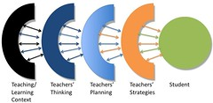

---
categories:
- addie
- ascilitementor
- elearning
date: 2007-04-29 21:13:15+10:00
next:
  text: University learning and teaching publications - rankings and RQF
  url: /blog/2007/05/17/university-learning-and-teaching-publications-rankings-and-rqf/
previous:
  text: Personality type - INTP
  url: /blog/2007/04/09/personality-type-intp/
title: A model for evaluating teaching - a useful lens?
type: post
template: blog-post.html
comments:
    - approved: '1'
      author: Kathleen Gray
      author_email: kgray@unimelb.edu.au
      author_ip: 128.250.6.244
      author_url: null
      content: "Hi David:\n\nI think that the limitations of Trigwell\xE2\x80\x99s paper\
        \ to resolve your problem statement arise from your moving quite quickly from\
        \ one question \xE2\x80?what is good teaching\xE2\x80? to another \xE2\x80\x9C\
        what is good academic development\" (aka AD, instructional development, educational\
        \ development).\n\nIt seems to me that while AD has to be based on a view about\
        \ what good teaching is, it can\xE2\x80\x99t luxuriate in working - or \xE2\x80\
        \x9Cjudging\xE2\x80? as in Trigwell - at the level of one teacher and one student,\
        \ but is called on to address the plurality of academics and students in the contexts\
        \ of higher education.  In pursuing a university degree, a student never has only\
        \ one teacher, and a teacher never has only one student, and teachers and students\
        \ never work with each other outside of what you call the current state of affairs\
        \ (globalisation, massification, privatisation, etc.). AD has to deal with this\
        \ systematically, I feel, and this moves us from your first question to your second.\n\
        \nIn introductory conversations about how to think about the work of AD, I pretty\
        \ well always suggest doing a personal inventory (much like the personality-type\
        \ quiz that helped you identify yourself as INTP) based on Ray Land\xE2\x80\x99\
        s paper Agency, context and change in academic development. (International Journal\
        \ for Academic Development, May 2001, 6 (1), p.4-20.)  Decide whether your tacit\
        \ orientation to AD work is: Opportunist entrepreneurial / Reflective practitioner\
        \ / Interpretive-hermeneutic / Romantic (outreach) / Professional competence (activist-modeller)\
        \ / Political strategist (pragmatist) / Consultant researcher / Disciplinary /\
        \ Managerial HRM ...\n\nIt\xE2\x80\x99s also a good exercise for us all to routinely\
        \ examine our consciences for \"colonial\" approaches to AD (ref Doing Educational\
        \ Development Ambivalently: Applying post\xE2\x80?colonial metaphors to educational\
        \ development? by Catherine Manathunga. International Journal for Academic Development,\
        \ May 2006, 11(1), p.19-29.)\n\nCheers!"
      date: '2007-05-04 15:32:25'
      date_gmt: '2007-05-04 05:32:25'
      id: '1538'
      parent: '0'
      type: comment
      user_id: '0'
    
pingbacks:
    - approved: '1'
      author: Helping create innovative, good quality learning and teaching &laquo; The
        Weblog of (a) David Jones
      author_email: null
      author_ip: 72.233.96.141
      author_url: https://djon.es/blog/2007/06/10/helping-create-innovative-good-quality-learning-and-teaching/
      content: '[...] create innovative, good quality learning and&nbsp;teaching  In an
        earlier post I drew on a &#8220;model of teaching&#8221; from Trigwell (2001).
        The model is shown [...]'
      date: '2009-01-28 14:19:53'
      date_gmt: '2009-01-28 04:19:53'
      id: '1539'
      parent: '0'
      type: pingback
      user_id: '0'
    
---
As part of [CQU's](http://www.cqu.edu.au/) moves around improving its evaluation of good teaching I was sent a paper by [Keith Trigwell](http://www.itl.usyd.edu.au/aboutus/keithtrigwell.htm) (2001), "Judging university teaching".

From that paper comes the following "model of teaching (or a framework for judging teaching)"

My interest in this model is the assistance it can provide in thinking about how a group charged with helping academics design, develop and delivery quality learning can understand and go about it's task. This is a problem I face in my new job.

I think it also offers a useful framework for thinking about literature that may help such a task. Also in framing the research and evaluation tasks which such a group might do to help achieve its goals.

Time to think more deeply about this and whether or not it is really useful, comes later. Time now to write down some of the initial ideas the model has generated, before they're lost due to the fallibility of an aging memory.

The initial ideas include the following (some expanded below):

- Research reinforcing the primacy of the academics' influence of the student experience  
    A colleague has already done some surveys around online learning in which one of the questions really reinforced this view. An area for more research and literature review.
- It's more than what the student wants.
- Knowing the current state of affairs.
- The fine line between manipulation and assistance.
- Investigating the model, fleshing it out in more detail.

All of this is framed around trying to understand the problem

> How can you effectively and efficiently bring about change for the better in university learning and teaching?

### It's more than what the student wants

While it is important to understand what the student is experiencing and the preferences, desires etc of the student body. This, by itself, is not sufficient to make any meaningful change.

There needs to be an emphasis on how to communicate this knowledge to the teaching staff. Thought needs to be given about how the knowledge of the students' preferences and experience can be appropriately harnessed/disseminated to change the teaching and learning context and the thinking, planning and strategies of the teaching staff.

If you don't change these, then the student experience won't change to any significant level. - there's a question to be researched.

### Knowing the current state of affairs

A group that is attempting to improve (i.e. change) the learning and teaching practices of an organisation and its members (leaving aside, for the moment, questions about the ethics and desirability of such a group thinking it can, or even should, improve/change such things) really should have a good handle on the current state of affairs.

In talking about "good teachers" Trigwell (2001) says that they "recognize the importance of context, and adapt their teaching accordingly; they know how to modify their strategies according to the particular students, subject matter, and learning environment."

Obviously, at least for me, the same applies for the group trying to improve learning and teaching. It needs to know the current state of affairs with respect to teachers' strategies, planning, and thinking, as well as the teaching and learning context.

The institution's teaching and learning context implies both internally and externally to the institution. So knowledge of technology, government and other external influences on the practice of learning and teaching is needed. As is knowledge about the institution. Most importantly, perhaps, is that this needs to be based on the perceptions of the teaching staff. Whether or not senior management believe something may be beside the point in terms of influencing student learning.

### The line between manipulation and assistance

It is possible that some of the above can be seen as a framework for understanding how to manipulate academics to achieve the goals of the few. You could certainly use this approach for that. I would hope that's not what we'll do, but it is a fine line between [descriptive and normative development](http://cq-pan.cqu.edu.au/david-jones/blog/?p=109).

### Fleshing out the model

As I look more at the model, a few questions appear.

Why are the arrows to the outer "skins" apparently one way?

Why is there only one arrow to the teaching and learning context? It's as if the student influences and is influenced by all the four outer skins. But Teacher's thinking has a much more limited influence.

### References

Keith Trigwell, [Judging University Teaching](http://www.ingentaconnect.com/content/routledg/rija/2001/00000006/00000001/art00007), The International Journal for Academic Development, 6(1):65-73