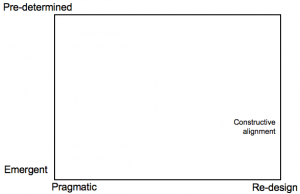
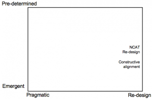
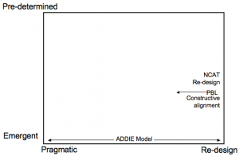
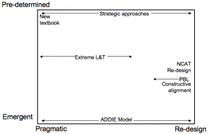

---
categories:
- addie
- c2d2
- elearning
- paperideas
date: 2008-05-18 00:01:03+10:00
next:
  text: We're looking for good people for a PLE project
  url: /blog2/2008/06/01/were-looking-for-good-people-for-a-ple-project/
previous:
  text: Initial thoughts from CogEdge accreditation course
  url: /blog2/2008/03/16/initial-thoughts-from-cogedge-accreditation-course/
title: Understanding approaches to improving a course
type: post
template: blog-post.html
---
Theoretically [the group](http://cddu.cqu.edu.au/) I work with is charged with helping staff at [CQU](http://www.cqu.edu.au/) improve the quality of their learning and teaching. To improve the courses they teach. A task that is not particularly easy for any number of reasons. Including the one identifed by [Farhad Saba](http://edweb.sdsu.edu/people/FSaba/FSaba.html) in this [post](http://www.distance-educator.com/blog/saba/?p=7). i.e. that academics by nature are a fairly solitary bunch and aren't used to, or particularly like, work with other people to help improve a course. I know this from two perspectives, working where I am now and because I was just such an academic.

Arising from this preference for solitary work is that most academics generally have their own ideas, preferences and methods for improving their courses. This is tied to their conceptualisation of learning and teaching and also their past experience. This variety in how to improve a course raises some interesting problems for those charged with helping them. How do provide assistance to a large number of people who are doing things differently?

One step towards answering that question might be to try and understand the full spectrum of different approaches that people are using. Perhaps if you understand this variety, a way forward might arise.

The following post attempts to formulate a framework to understand the full spectrum of different approaches that I have seen used. The aim is to be descriptive, to understand the different approaches. The intent is not to limit understanding to "proper" instructional design approaches, rather it is to understand all of the different approaches that are used.

### The Framework

Within the information systems discipline (and others) two by two frameworks are all rage for this type of thing. So why should I buck the trend. Here's a first stab.

This framework concentrates on two particular dimensions:

1. When is the improvement decided upon (the y/vertical axis).  
    At some stage a decision is made about what improvement(s) will be made to the course. There are two extremes:
    1. Emergent - where there is no pre-determined outcome or idea about how to improve the course. What will be improved in the course emerges out of the improvement process.
    2. Pre-determined - the particular improvement is known prior to commencing the improvement process.There is a lot of space between the two extremes.
2. The type of improvement process  
    This dimension is concerned with the nature of the particular process used to improve the course. There are two extremes:
    1. Pragmatic - the process is aimed at making some form of pragmatic improvement to a particular aspect of the course. Much, even most, of the course will not change.
    2. Re-design - the aim of the improvement is a complete is typically aimed at a complete re-examination and re-thinking of the course.

### Examples

Many 2x2 frameworks encapsulate 4 categories and seek to place examples into a particular box. This is not that type of framework. In part because this is a very rough, early idea and also because I'm not sure that the area of interest (how do academics seek to improve their courses) can be understood with specific categories. Each of the two dimensions in the framework are meant to represent a spectrum of possibilities. The framework is more a graph.

The placement of the following examples into the framework are meant to be broadly representative and illustrative and not quantitatively calculated, exact placements. I also expect that there might be some disagreement about the placement of some examples.

### Constructive Alignment

[Constructive alignment](http://www.engsc.ac.uk/er/theory/constructive_alignment.asp) is a common type of re-design process and is the preferred method for [CDDU](http://cddu.cqu.edu.au/).

Constructive alignment seeks to change the fundamental design of a course. It generally questions the conceptualisation of learning and teaching of the teacher. So it's high on the re-design dimension.

The outcomes are pre-determined to some extent. The constructive part of alignment assumes that learning is best achieved when the student is actively constructing meaning. That "pre-determination" still allows for emergent design, as long as it tends to stay within the constraints of the constructive perspective. The alignment component also provides a bit of pre-determination.

### NCAT Program in Course Re-design

The [NCAT Program in Course Re-design](http://center.rpi.edu/PCR.htm) is also high up the re-design end of the process type dimension. In fact, one of the six characteristics common to these types of projects is "Whole course design" (Twigg, 2003).

However, a number of the other listed characteristics (e.g. active learning, mastery learning, computer-based learning resources) also act to increase the pre-determination.

### ADDIE Model

The [ADDIE Model](http://en.wikipedia.org/wiki/ADDIE_Model) is a generic design process (more a design model) and consequently doesn't pre-determine anything. Knowledge found during the analysis, informs the design which identifies what will be done. However, it might be argued that due to the nature of human beings that such a generic process will be pre-determined due to preferences/experience of the designers involved in the process. But I'll ignore that for now, this argument could be said to apply to all approaches.

However, ADDIE doesn't necessarily have to produce a complete re-design. It might just result in a simple and small modification of one aspect. It can range over a broad area of the type of design process dimension.

### Problem-based learning

Using [problem-based learning](http://en.wikipedia.org/wiki/Problem-based_learning) as basis for improvement will typically be a re-design process, at least if PBL isn't already being used.

The outcome is, to some extent, pre-determined as use of PBL limits the possible improvements to those which are consistent with the beliefs/assumptions of PBL. Though, as with constructive alignment, this area of pre-determination is not exactly narrow.

### Choosing a new textbook

The purists may not see this one as valid. However, it's probably the most common approach in certain places.

As a process, it generally involves looking at all the relevant textbooks, choosing one and then modifying the content of the course to fit. Hence this is not likely to be a re-design of the course.

It's also a fairly high on the pre-determined dimension as this approach typically assumes that the course will not change. The improvement is the new text and the use of its associated resources (lecture slides, quiz questions etc.). There is also not likely to be large change as most textbooks assume pretty much the same pedagogy (lectures, tutorials, assignments, exams).

### Strategic approaches

This is what I'm calling the situation where the leadership of an organisational unit (be it program/degree, school, faculty, or entire university) decides to adopt a common approach to all courses. This might include a particular pedagogical approach (e.g. PBL) or delivery model/approach (e.g. all courses will have a website that follows a particular template).

Such an approach is generally pre-determined for all courses offered by the unit. The purpose of a strategic approach is typically to achieve a common goal for all courses.

These type of approaches can run the full spectrum from pragmatic to re-design depending on the nature of the type of improvement (from brand new pedagogical foundation through to adoption of a particular web site template).

### Solution driven approaches

These are the type of approaches which can be said, from the most cynical perspective, to be "solutions looking for problems". These types of approaches often arise from fads. Someone becomes aware of a new idea, approach or technology and decides to use it within their course. The Web, web 2.0, Second Life etc. are just some of the technical examples of this approach. But it's just not technology. Small tactics or approaches (e.g. [minute papers](http://www.maa.org/SAUM/maanotes49/87.html)) can also be used this way.

These types of approach are typically pre-determined. It's been decided to use the particular solution already. It's just a matter of how.

They are also typically pragmatic. It's only this particular solution that is being adopted to improve an aspect of the course. Not a complete re-design.

### Extreme learning and teaching

The nascent idea of [extreme learning and teaching](http://cddu.cqu.edu.au/index.php/Extreme_learning_and_teaching) is a one of mine and still somewhat questionable and under development. However, it is a little different and I thought I'd include to see if this might help me think more about where it fits.

Extreme learning and teaching takes it's basic idea from [extreme programming](http://en.wikipedia.org/wiki/Extreme_programming). In particular the idea that there are some known practices/principles in software engineering that work. So, let's take those to the extreme. Have a development process that focuses on them. Extreme L&T draws on [Chickering and Gamson's 7 principles for good practice in education](http://www.tltgroup.org/seven/home.htm) as the principles to maximise.

The idea is to identify how you improve a course you look at the 7 principles and seek strategies to maximise them.

Such an approach is to somewhat pre-determined, it has to maximise at least one of the 7 principles. But that is still a very large area of pre-determination.

It's also likely to be a fairly pragmatic approach. It's likely that entire courses wouldn't be re-designed, but instead small, evolutionary changes. That said, it might be possible to re-design a course (just a bit unlikely).

### Futher thoughts

How can this sort of thing help?

A group like [CDDU](http://cddu.cqu.edu.au/), seeking to help people improve their courses, should be aiming to offer support for the methods that are being used to improve courses. Different areas along both dimensions of this graph/framework require different types of support. If you know where the approaches used by people are located you can target resources to provide the appropriate types of support.

Similarly, different parts of the framework are also going to have different characteristics, strengths and weaknesses. For example,

- Approaches with high levels of pre-determination will not be able to adapt to differences in courses and context.
- Approaches with high levels of re-design are likely to be much more difficult and time-consuming.
- Very pragmatic approaches may not achieve large improvements in learning outcomes, but they'll be a lot easier to implement.

The purpose of this type of framework is to help improve understanding. Being able to show people where their approach to improving a course fits and explain its likely needs in terms of support, its characteristics