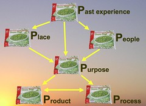
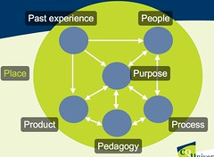

See also: [[blog-home | Home]]

The Ps Framework is a taxonomy/framework that has arisen out of my attempts to understand the literature around e-learning within universities. It's main aim is to serve as the structure for chapter 2 of [my thesis](/blog2/research/phd-thesis/). This blog post seeks to summarise some of the origins and potential futures of the Ps framework and also to explain why I think it might be useful.

### Origins

The Ps Framework started life as "the missing Ps". As part of my thesis I was seeking to identify what I thought was missing from the literature and practice e-learning within universities and demonstrate how the information systems design theory (ISDT) that I'm developing addresses some of these holes. The first public airing of the missing Ps was in the following presentation.

!!! warning "Outdated content no longer available"

    Presentation from Slideshare no long available

Wow, in finding that slideshow presentation, I've just discovered the presentation has been viewed 3900+ times. And that's for a presentation that was incomplete because time got away from me. If you want, you can [view the video of the presentation](http://video.google.com/videoplay?docid=5012901113240908756&hl=en). I should note that the original presentation made a lot of use of background images, but Slideshare's limitation on file size meant that I had to remove them from the online version. The video will show you the full version and you can also (at least for now) [download the full powerpoint file](http://cq-pan.cqu.edu.au/david-jones/Publications/Presentations/missingPs_all.ppt).

Since then the missing Ps have evolved into the Ps Framework and been used for two publications

1. PLEs: Frameing one future for lifelong learning, e-learning and universities  
    [Presentation](http://www.slideshare.net/davidj/ples-framing-one-future-for-lifelong-learning-elearning-and-universities/) and [paper](/blog2/publications/ples-framing-one-future-for-lifelong-learning-e-learning-and-universities/).
2. The Ps Framework: Mapping the educational technology landscape for the PLEs@CQUni project  
    [Presentation](http://www.slideshare.net/davidj/the-ps-framework-mapping-the-educational-technology-landscape-for-the-plescquni-project/) (including video) and [paper](/blog2/publications/the-ps-framework-mapping-the-landscape-for-the-plescquni-project/).

And the near term future might actually be used for their intended purpose - chapter 2 of my thesis.

### Rationale

In the 15+ years I've been muddling with e-learning within universities the defining characteristic I would ascribe to both the practice and research within this sphere is that of [inattentional blindness](http://en.wikipedia.org/wiki/Inattentional_blindness), with [bounded rationality"](http://en.wikipedia.org/wiki/Bounded_rationality) not too far behind.

Take a look at the following video

[Bet you can't do this](http://vids.myspace.com/index.cfm?fuseaction=vids.individual&videoid=43809287)  

When it comes to e-learning, the same problem arises. No matter who looks at e-learning their answers to the question of "how to do e-learning" is almost always limited by their background and experience. They do not see the whole picture, they only focus on what they know and that drives how the answer the question "how to do e-learning". Some examples include:

- If you employ a consultant that is an expert in product X or approach Y they will almost certainly recommend you use product X or approach Y regardless of whether or not it is a good fit for you or your organisation.
- If an expert in IT looks at the problem, any solution you will get will emphasise security, IT governance, scalability, uptime, and other IT issues, rather than learning and teaching.
- If an expert in lifelong learning looks at the problem, any solution you get will emphasise that.

The Ps Framework is based on a couple of assumptions:

1. People will always make decisions based on what is familiar with them.
2. The implementation of e-learning within a university is an example of a [wicked design problem](http://en.wikipedia.org/wiki/Wicked_problems). Some of the characteristics of a wicked design problem listed on the [wikipedia page](http://en.wikipedia.org/wiki/Wicked_problems) include:
    - There is no definitive formulation of a wicked problem.
    - Stakeholders have radically different world views and different frames for understanding the problem.
    - No unique “correct” view of the problem.

A lot of the limitations in the practice of e-learning with universities comes from people who don't agree with/recognise these assumptions. People who are not aware of and/or fail to engage with the variety of perspectives and recognise that their perspectives are inherently limited.

Lastly, if you accept some of the other characteristics of wicked problems:

- The problem is not understood until after formulation of a solution.
- Constraints and resources to solve the problem change over time.
- Consequences difficult to imagine.
- Considerable uncertainty, ambiguity.

It becomes almost impossible to see how any perspective, no matter how diverse and well informed, could continue to remain a reasonable perspective.

### The Ps Framework - summarise potential different perpsective

Initially the Ps Framework was developed simply to highlight the limitations of the common perspectives within e-learning practice and literature. This was the approach used in the [first presentation](http://www.slideshare.net/davidj/the-missing-ps-lessons-for-the-adoption-and-implementation-of-learning-management-systems/). Some examples.

- Product - almost all university based e-learning (from the late 1990s to now) assumes that the organisation must choose a [LMS](http://en.wikipedia.org/wiki/Learning_management_system) (e.g. Blackboard, Sakai, Moodle etc.). The only major change, in terms of organisational practice, over recent years has been the recognition that it is okay if the product is open source.
- Process - almost all university based e-learning is teleological. It ignores and in many cases actively attacks ateleological development. [Jones and Muldoon](/blog2/publications/the-teleological-reason-why-icts-limit-choice-for-university-learners-and-learning/) (2007) go into more detail on this point.
- Place - almost all university based e-learning, like most organisational practice, assumes that the nature of the organisation in which it operates is simple. Dave Snowden's [Cynefin framework](http://en.wikipedia.org/wiki/Cynefin) identifies four other types of system. Each of these systems have radically different characteristics which mean many of the assumptions behind strategies used in the simple type of system are completely and utterly inappropriate.

### The Ps Framework as part of a sensemaking process

The most recent paper using the Ps Framework ([Presentation](http://www.slideshare.net/davidj/the-ps-framework-mapping-the-educational-technology-landscape-for-the-plescquni-project/) (including video) and [paper](/blog2/publications/the-ps-framework-mapping-the-landscape-for-the-plescquni-project/)) is starting a move away from the Ps Framework embodying a pre-defined checklist of different perspectives.

The [paper](/blog2/publications/the-ps-framework-mapping-the-landscape-for-the-plescquni-project/) still, to a certain extent, reads as a simple list of one perspective of the educational technology landscape. In discussions with others and the intent of the paper is to move towards using the Ps Framework as a tool in a [sensemaking](http://en.wikipedia.org/wiki/Sensemaking) process in the pre-decision stage of an educational technology project.

That is, use the Ps Framework, with a yet undeveloped process, to

- Develop a collection of very different perspectives of the situation and the project.
- Have the decision makers actively engage with those different perspectives to improve the quality and possibly consistency of their perspectives of the problem/project.
- As the project progresses, revisit the perspectives of many different folk in order to understand where things are up to, and where they should go now.

### Representing the Ps Framework

An increasingly regular request is for a pretty diagram or table to summarise the Ps Framework. To make it easier for folk to understand the components of the Ps Framework. In the past I have been guilty of producing rather ugly and simple diagrams to represent the Ps Framework.

The very first version, from the first presentation tried to establish some sort of order or hierarchy.

The 2008 version keeps some of that, tries to emphasise the on-going impact each of the Ps have on each other and that place is the fundamental underlying consideration

One source of my reluctance to have a diagram is that there is an expectation to show relationships between the components. I believe there are problems with that. In the latest paper I wrote

> The context of implementing educational technology within a university is too complex for such a simple reductionist view. It is also likely that different actors within a particular organization will have very different perspectives on the components of the Ps Frameworks in any given context.

Any diagram that shows some sort of connection, is liable to lead people to see relationships that aren't there. This is also likely to limit/impact its use as a sensemaking aid. Too much structure will bias folk and their perspectives.

Perhaps there is a need for multiple, diverse representations of the Ps Framework.

Time to drink some rum