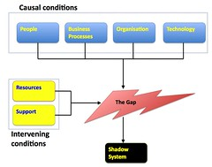

[T. S. Elliot's](http://en.wikipedia.org/wiki/T._S._Eliot) poem [The Hollow Men](http://en.wikipedia.org/wiki/The_Hollow_Men) has a section that goes

> Between the idea And the reality Between the motion And the act Falls the Shadow

I find some connection with this section due to my interest in [shadow systems](http://en.wikipedia.org/wiki/Shadow_system). Applications of information technology that arise within organisations without the knowledge of, and often in spite of, the official, centralised information technology division.

### The idea

The typical response of organisational officialdom is that shadow systems are horrible, beastly things that must be stamped out. These horribly inefficient, unscalable, incorrect toys cobbled together by amateurs create problems for the organisation with no corresponding benefit. All IT development must be done by the heroic, rigorous and knowledgeable folk within the central IT division. This is the idea that underpins much of the existing IT development practice within organisations.

The content of the current [wikipedia page](http://en.wikipedia.org/wiki/Shadow_system) on shadow systems gives some insight into this view. The wikipedia page has three sections:

1. Overview - general summary of shadow systems and what they are.
2. Cause - some general points about what leads to the development of shadow systems.
3. Problems - a larger list of the problems shadow systems exhibit. Including, poorly designed, not scalable, poorly documented, untested, may allow unauthorised access to information, easy to introduce errors, one hard disk failure away from disaster, and several versions of the truth.

There is no mention of any potential benefits that shadow systems may provide. One potential benefit that is somewhat mentioned gets twisted. Often shadow systems will enable the real work of the organisation to go ahead in spite of unresponsive IT systems. This gets a mention but in a negative way as a cause of shadow systems, not as a benefit. The description of this "benefit" on the page places shadow systems in a negative light and uncritically accentuate the positives of centralised IT divisions. For example, (emphasis added)

> **Quite properly**, when a reporting system is put together by IT professionals, they need to consider all aspects of how the system will be used.
> 
> The various skills that are required to achieve all of this means that inevitably a number of different people will all be involved in the task of creating the new report. This increases the amount of time and effort it takes to put a **rigorously engineered solution** in place. **Shadow Systems** typically **ignore this kind of rigor**, making them much faster to implement, but **less reliable and more difficult to maintain**.

I find it particularly interesting that the current Wikipedia page on shadow systems seems to contain much of the same content that appears on a [commercial website](http://www.shadowdatasystems.com/) that is linked to from the Wikipedia page. I find it increasingly interesting that the purpose of the commercial website is promote the idea of business intelligence applications and if you dig a bit further is associated with a company selling "ERP" solutions.

### The reality

Behrens and Sedera (2004) developed a model (shown below) in an attempt to explain why shadow systems exist.

The model suggests that shadow systems are created by a gap between the needs of organisation and its use of information technology and the features provided by the organisational IT systems. This mismatch can arise due to characteristics of the people, business processes, organisation and technology. How the gap is overcome is mediated by the available resources and support.

The reality is that the organisational information technology resources are not providing the features required. They are failing.

### The shadow

The shadow system becomes the method by which the people within the organisation overcome this gap. How they attempt to address the failing of the organisational information technology division to provide what is required by the organisation.

### Overcoming the negative perception of shadow systems

Members of the central IT divisions really hate shadow systems because, at least sub-conciously, they are aware that shadow systems point out where they have failed. And no-one likes having their failures pointed out. Especially folk within central IT divisions who generally have a pretty tough time of it. Especially because most of them have this image of themselves as the supreme, rigorous rationalists. They believe they can and do spend sufficient time and intelligence analysing the situation and coming up with the best solution for the organisation.

What they don't realise is that there is never going to be one best solution. The implementation and use of information technology within any sufficiently large and complex organisation is going to be a [wicked problem](http://en.wikipedia.org/wiki/Wicked_problems) and one of the defining characteristics of a wicked problem is that there is no one best solution.

There appears to be some value for IT and broader organisational management to overcome this automatic and negative reaction to shadow systems and learn that they can help identify, and perhaps, solve organisational failures by valuing and seeking to understand shadow systems and the gap between idea and reality.

Perhaps rather than seeking to squash shadow systems, IT divisions should seek to encourage the development of shadow systems and put in place practices and support which mitigate some of the flaws of shadow systems. Such a practice might leverage the increasing capability of the current generation of end-user tools that make "shadow system" development so easy and also seek to address the problem of reducing costs most IT divisions seek.

There is a great chance that shadow systems are almost certainly going to be the source of more innovation than central IT divisions. This is because there will be more diversity of perspective around the development of shadow systems than exist within the development arms of central IT divisions. And [diversity](/blog2/2008/10/29/the-importance-of-diversity-to-improving-learning-and-teaching/) and through it perspective shift is a necessary condition for innovation.

### References

Sandy Behrens, Wasana Sedera, [Why do Shadow Systems Exist after an ERP Implementation? Lessons from a Case Study](http://www.infocom.cqu.edu.au/Staff/Sandy_Behrens/Publications/PACIS.PDF), Proceedings of PACIS'2004, Shanghai, China