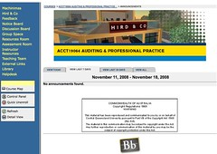
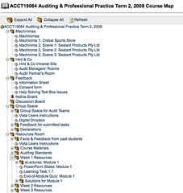
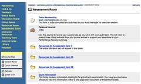
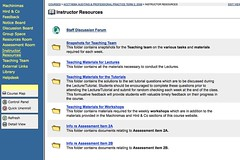
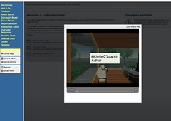

See also: [[blog-home | Home]]

As [proposed earlier](/blog2/2008/11/18/evaluating-an-lms-by-understanding-the-underpinning-model/) this post is the first step in attempting to evaluate the differences between three learning management systems. This post attempts to understand and describe the model underpinning Blackboard version 6.3.

### Hierarchical

Blackboard like most web-based systems of a certain vintage (mid-1990s to early/mid 2000s) tend to structure websites as a hierarchical collection of documents and folders (files and directories for those of us from the pre-desktop metaphor based interface days). This approach has its source in a number of places, but most directly it comes from [computer file systems](http://en.wikipedia.org/wiki/File_system)

[Webopedia](http://www.webopedia.com/TERM/H/hierarchical.html) has a half way decent page explaining the concept. The mathematicians amongst you could talk on in great detail about the plusses and minuses of this approach over other structures.

In it's simplest form a hierarchical structure starts with

- A single root document or node.  
    Underneath this will be a sequence of other collections/folders/drawers.
    - Like this one
    - And yet another one  
        Each of these collections can in turn contain other collections.
        - Like this sub-collection.
        - And this one.  
            This hierarchical structure can continue for quite some time. Getting deeper and deeper as you go.
    - And probably another one.  
        Best practice guidlines are that each collection should never contain much more the 7+/-2 elements as this is a known limitation of short term memory.

### Blackboard's idea of hierachy

One of the problems with Blackboard is that it's underpinning models don't always match what people assume from their what they see in the interface. This applies somewhat to the hierarchical model underpinning Blackboard.

Normally in a hierarchical structure there is one root document or node that is at the "top" of the pyramid of content. What Blackboard does is that each course site has a collection of content areas and then you nominate one of those as the "home" page. i.e. the one that appears when people first login. It's not really the top of the pyramid.

Let's get to an example, the image is the home page for the ACCT19064 course.

**Note:** I currently have "admin" access on this installation of Blackboard. Some of what appears in the interface is based on that access and is not normally seen by student or other staff users.

The links in the course menu on the left hand side of the image are (mostly) the top levels of the hierarchical structure of the Blackboard course. There are 13 main areas

- Machinimas
- Hird & Co
- Feedback
- Notice Board
- Discussion Board
- Group Space
- Resources Room
- Assessment Room
- Instructor Resources
- Teaching Team
- External Links
- Library
- Helpdesk

The "home page" in the large right hand frame, which would be at the top of the hierarchy if Blackboard followed this practice, is the Announcements page. The link to the announcements page in ACCT19064 is provided by the "Notice board" course menu link.

The other complicating factor is that the course menu links for Helpdesk and Library aren't really part of the Blackboard course site. They are links to other resources.

> **Feature:** Blackboard allows top level folders to be links to external resources and also ad hoc elements within the course site.

The bit above is a new strategy. Everytime I come to something that I think is somewhat strange/unique or a feature of Blackboard I am going to record it in the text and also on [this page](http://cddu.cqu.edu.au/index.php/LMS_Features).

> **Feature:** The course home page can be set to a selection of "pages" within the site.

**Other bits that don't fit**

Underneath the course menu links there are a couple of panels. The content of some of these can be controlled by the coordinator. In the example above the designer has removed as many of the links on these panels as possible. Normally, there would be two links

- Communication; and  
    Links to a page of the default communication tools Blackboard provides each course including: announcements, collaboration, discussion board, group pages, email and class roster.
- Course tools  
    Links to a page of the default course tools (not communication tools) Blackboard provides including: address book, calendar, journal, dictionary, dropbox, glossary..... This list can be supplemented.

The links to these tools are not part of the hierarchical structure of the course. They are always there, though the designer can remove the links. Confusingly, most staff leave these links and so students waste time checking the tools out, even if they aren't used in the course (and most aren't).

**Feature:** Blackboard does not maintain the hierarchy metaphor at all well. Confuses it with "tools" which sit outside the hierarchy.

**The course map feature**

To really reinforce the hierarchical nature of a Blackboard course site, Blackboard provides a course map feature which provides a very familiar "Windows explorer" link representation of the structure of a course website. The following image is of a part of the course map for the ACCT19064 course site.

### What's do the course menu links point to?

The links in the course menu can point to the following items

- Content area  
    This is the default content holder in Blackboard. If the designers wants to create a collection of content (HTML, uploaded files, tools etc.) they create a content area. More on these below.
- Tool link  
    This is a link to one of the communication or course tools mentioned above.
- Course link  
    A link to some other page/item within the course, usually within a content area.
- External link  
    A URL to some external resource.

The course menu link for ACCT19064 points the following

- Machinimas - content area with 5 elements
- Hird & Co - content area with 3 elements
- Feedback - content area with 3 elements
- Notice Board - link to the announcements tool
- Discussion Board - direct link to the course level discussion conference
- Group Space - a content area with 5 elements
- Resources Room - a content area with 15 or so elements
- Assessment Room - a content area with 6 elements
- Instructor Resources - a content area with 1 element (see below)
- Teaching Team - a link to the "Staff Information" tools
- External Links - a content area with a number of links
- Library - a direct link to the [Library website](http://library.cqu.edu.au/).
- Helpdesk - a mailto: link for the helpdesk

The number of elements I mention in each content area might be wrong. Blackboard supports the controlled release of content in a content area. Some people may not be able to see all of the content in a content area - explained more in the "Controlling Access" section below.

### What's in a content area?

A content area consists of a number of items. The items are displayed one under the other. The following image is of the Assessment Room in the ACCT19064 course site. It has 6 items. Not the alternating background colour to identify different items.

The edit view link in the top right hand corner appears when the user has permission to edit the content area. This is how you add, modify or remove an item from the content area.

An item in a content area can be one of the following

- A "content" item  
    i.e. something that contains some text, perhaps links to an uploaded file.
- A folder  
    This is how you get the hierarchical structure. A folder creates another level in the hierarchy within/underneath the current content area. This folder contains another content area.
- An external link.
- A course link.
- A link to various tools or services.  
    e.g. to tests or a range of different services and tools provided by Blackboard and its add ons.

Each item is associated with a particular "icon". A folder item will have a small folder icon. A content item will have a simple document.

**Feature:** The icon associated with each item cannot easily be changed, especially for an individual course. It can also not be made invisible (easily) and causes problems for designers.

For example, the following image is from what was intended to be the home page for a Blackboard course. A nice image and text ruined by the document icon in the top left hand corner.

### Controlling access

Blackboard provides a facility to limit who can see and access items within a content area and also what links can be seen in the course menu. However, it's done consistently.

**Feature:** Different approaches with different functionality is available to restrict access/viewing of the course menu links (very simple) and individual items in content areas (very complex and featured). Restrictions on discussion forums also appear some what limited.

The following image is of the "Instructor Resources" content area of the ACCT19064 course site. It is being viewed as a user who is not a member of the staff for this course. Actually not a member of the blackboard group "Teaching Staff".

What follows is the same page with the same content area. However, it is now viewed as a user who is a member of the "Teaching staff" group.

Access to items can be restricted in the following ways

- Visible or not  
    A simple switch which says everyone can see it, or they can't.
- Date based ranges  
    Specify a date/time range in which it is visible.
- Group based membership  
    You can see it if you are part of the right group or in a specified list of users.
- Assessment related  
    You can only see if if you have attempted a piece of assessment or achieved a grade within a specific range.

The specification of rules to restrict access can be combined.

**Feature:** Access to items can be restricted based on simple on/off, date, group membership, assessment.

### A description of the ACCT19064 site

At initial look the course site is designed as a container for the content and tools used within the course. The design of the course site itself does not inherently provide any guidance to what the students are meant to do. i.e. there is no study schedule or similar showing up in the course menu links.

However, looking at the announcements for the course. It appears that this type of guidance and support for the students is given by an announcement from the course coordinator on the Sunday at the start of each week. This announcement is very specific. It outlines the individual and team-based tasks which the on-campus and off-campus students are meant to complete. There is also some additional comments, sometimes errata and sometimes the odd big of advice.

Interestingly, these guidance announcements didn't link students directly to the tasks.

**Breaking down the content of the site**

The following describes in more detail the content within each of the course menu links, at least those that point to content areas.

- Machinimas - content area with 5 elements. There is no adaptive release.  
    
    - Description of the machinimas and their purpose.
    - Four external links to web pages that contain video of the machinima.
    
    > **Feature:** Blackboard uses breadcrumbs for navigation. Including external web pages can be made more transparent if the breadcrumbs can be re-created on those external pages.
    
    The machinima pages, with the video playing, look like the following image
    
    
- Hird & Co - content area with 3 elements. No adaptive release This is meant to represent the imaginary audit company used throughout the course
    - External link to a "intranet" site for an imaginary audit company.
    - External link to an external discussion forum used by AIC campuses for discussion about questions prior to face-to-face classes.
    - A link to a Blackboard discussion forum used by the Audit Partner (the coordinator)
- Feedback - content area with 3 elements  
    Actually it's 4 elements. One is not visible due to adaptive release. The missing element is a course experience survey. This section is entirely set aside to getting feedback from students about the course. I'm guessing it was added late in the term.
    - Content item linking to an information sheet
    - Content item linking to a consent form
    - A link to survey tool for the actual survey
    - An external link with help on an issue with the survey.
- Notice Board - link to the announcements tool
- Discussion Board - direct link to the course level discussion conference
- Group Space - a content area with 5 elements
    - Link to a folder for the "Group Space for Audit Teams" - content area with 3 elements
        - Link to the groups page for the course  
            This is one of the Blackboard communication tools that is supported by a group allocation/management system. It allows each group to have a collection of pages/tools which are unique and only accessible by members of the group.
            
            Typically this includes a group discussion conference, collaboration, file exchange and email.
            
        - Content item containing an announcement about groups
        - Content item containing details of group allocation - group names and student members
    - Content item linking to a document explaining problems faced by Vista users
    - Link to the Blackboard drop box tool
    - Folder containing feedback for submitted tasks
    - Folder containing declarations for each quiz
- Resources Room - a content area with 15 or so elements  
    Apart from a content item describing solutions to problems for users of Vista, this content area consists entirely of folders used to group resources associated with a particular week or activity. There are
    - 12 folders for each week of term  
        These are a collection of folders and content items providing access to various weekly materials such as: eLectures, powerpoint lecture slides, activity sheets as Word docs, weekly quizzes and solutions (available only after a specified time).
    - one containing feedback and facts from previous students,  
        A simple collection of content items with pass results and qualitative student feedback.
    - one containing general course materials (e.g. course profile and study guide),  
        Two external links to the course profile and study guide.
    - one on auditing standards  
        Two external links to the auditing standards applicable to the course.
    - One containing a course revision presentation
- Assessment Room - a content area with 6 elements
    - Team membership - content item links to a word doc that students must complete and return
    - Personal journal - link to Blackboard journal tool that is used for personal reflection and integrated into assessment and weekly activities.
    - Resources for assessment items 1, 2a and 2b  
        Each contains a range of content items, folders and external links pointing to resources specific to each assessement item.
    - Exam information - collection of information about the exam
- Instructor Resources - a content area with 7 elements, a number under adaptive release
    - Staff discussion forum - external link to an external discussion forum
    - Snapshots for teaching team - collection of word documents explainining activities/tasks for the various weeks.
    - Teaching materials for lectures - collection of materials for staff to give lectures
    - Teaching materials for the tutorials - ditto for tutorials
    - Teaching materials for the workshops - ditto for workshops
    - Information on Assessment item 2a - misc additional background on assessment item
    - Information on assessment item 2b
- Teaching Team - a link to the "Staff Information" tools
- External Links - a content area with a number of links
- Library - a direct link to the [Library website](http://library.cqu.edu.au/).
- Helpdesk - a mailto: link for the helpdesk

### Overview

A fairly traditional hierarchical design for a course website. Students receive direction on what tasks to do from weekly announcements, not from some fixed "schedule" page.

Heavy use is made of groups.

There are some significant differences between tasks/activities for on-campus versus off-campus students. While educationally appropriate this does tend to make things more difficult for the coordinator and students. i.e. there has to be two sets of instructions created by the coordinator and students have to discern which they should follow.

Some use of external discussion forums. Probably due to the limitation in how Blackboard allows discussion forums to be configured. i.e. one discussion conference per course and one discussion conference per group.

Staff information not integrated with CQU systems, require duplication of effort. Same applies for the provision of links to course profile and to some extent lectures.