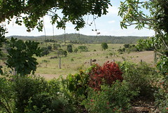

See also: [[blog-home | Home]]

Memory card ([SanDisk eXtreme 3](http://www.sandisk.com/Products/Item\(1856\)-SDCFX3-008G-A31-SanDisk_Extreme_III_CompactFlash_8GB.aspx) 8Gb) and bag ([Tamrac expedition 5x](http://www.tamrac.com/frame_exp.htm)) have been successfully purchased and returned home. The camera is finally together and the first shot has been taken.

And yes, the image files are significantly larger than those produced by the C-770. Seems there will be some reading to do. Both for simple camera operation but also, potentially more importantly, about photography in general.

### What to "read"?

Being a "net" sort of guy, one would assume that I should be looking at the net for resources and communities in which to participate. Rather than follow my first instinct to refer to the couple of books we bought for Anna last Xmas.

Given I'm a [user of flickr](http://www.flickr.com/), perhaps that's a good place to start. Searching the groups part of Flickr reveals tht there are 1282 groups about "learning" and "photography". Sorting by group size reveals that the group search ain't all that effective.

A quick look at the Flickr groups and nothing stikes me as interesting. I did get taken to [digital photography school](http://digital-photography-school.com/blog/) which looks interesting.

A google search reveals the number one hit being onto [photo.net](http://photo.net/) which is like coming home. [Philip Greenspun](http://photo.net/photodb/user?user_id=23069) is almost an "old friend" given his work in web-based systems development in the 1990s. Don't think I'll be reading too much, at least initially, online.