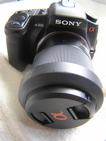

---
categories:
- photography
date: 2008-11-21 09:08:32+10:00
next:
  text: Kant - separation of reason and experience
  url: /blog2/2008/11/21/kant-separation-of-reason-and-experience/
previous:
  text: More on the expert designer - efficiency and effectiveness
  url: /blog2/2008/11/21/more-on-the-expert-designer-efficiency-and-effectiveness/
title: Starting a new journey and hobby - photography
type: post
template: blog-post.html
comments:
    []
    
pingbacks:
    - approved: '1'
      author: Selecting a tripod &laquo; The Weblog of (a) David Jones
      author_email: null
      author_ip: 66.135.48.184
      author_url: https://djon.es/blog/2008/11/29/selecting-a-tripod/
      content: '[...] a&nbsp;tripod   It&#8217;s been a week or so since I purchased the
        new camera. Last weekend I had to buy Aperture 2 for my Mac so I could easily
        pull the raw photos off the [...]'
      date: '2008-11-29 16:16:57'
      date_gmt: '2008-11-29 06:16:57'
      id: '1899'
      parent: '0'
      type: pingback
      user_id: '0'
    
---
Bit the bullet yesterday and upgraded to a DSLR. The Olympus C-770 we've had for almost four years seems a bit the worse for wear after [Zach and Zeke](http://www.flickr.com/photos/david_jones/3030788393/) dropped it while battling for control. Plus there's the size issues, 4MP is not cutting it anymore.

!!! warning "Broken image link"

The C-770 has some nostalgia value. It was purchased the day [Zach](http://www.flickr.com/photos/david_jones/sets/739762/) was born back in 2005, primarily for the purpose of recording the new arrival and his impact on the rest of the family. Sandy complained, or at least teased me, about the price, but not the results.

### The replacement

So a few tens of thousands of shots later the C-770 is being replaced by a Sony A300 DSLR. The C-770 will be passed onto the boys as a toy.

And so begins the journey of trying to get to understand and use the new beast to a level worthy of the price. The price is a bit of a step up and so some extra effort is going to be required to justify it. In particular, time to learn something about focal lengths, aperture and the other dark arts of photograpy.

So in the search of a new hobby I've decided to take this on and blog my learning journey. Or at least that is the current intention. How far the intention lasts in the cold light of reality will remain to be seen.

### First step, memory card

In getting started with unpacking and getting it together it became obvious that it was missing two important bits: the battery and a memory card. The battery turns out to have been an oversight by the store. The camera was the last one in stock it was on display and so consequently all the bits were spread around the place. Not neatly residing in a shrink wrapped box.

The second was the memory card. The camera did not come with one and such a thing is necessary if you wish to actually take some photos which are recorded for future viewing pleasure. So the journey begins to find what I should buy.

From [this page](http://www.crutchfield.com/S-Vsl28CvVdf5/p_158A300K/Sony-DSLR-A300-Kit.html) the details are

> memory card slot accepts CompactFlash® (Type I and II), and Microdrive™ (also accepts Memory Stick® PRO Duo™/Memory Stick PRO-HG Duo via an optional CF card adapter)

From this it would appear that the CompactFlash cards are the way to go. An adaptor doesn't sound like a plan for long term hassle-free use. The joy of the internet is that someone has always [asked the question](http://www.cameralabs.com/forum/viewtopic.php?t=8048&sid=a9f0c7d53c89c12eb28167030cd88fee) and gotten some answers. Not to mention articles giving help on the [selection process](http://reviews.cnet.com/4520-6451_7-6296352-1.html).

The first suggestion, not surprisingly, is to get as large as possible. The [CNET review](http://reviews.cnet.com/4520-6451_7-6296352-1.html) suggests at least 4GB for a 10MP camera. First indications suggest at least $AUD100. Ahh, the Sony site is isting an 8Gb 300x for $300. 2Gb ($59.95) and 4Gb ($94.95) 133x cards are a bit cheaper.

Probably cheaper online, but I feel the need to start using the camera now. So I'll have to take what I can get in town today.

### A bag?

Of course, I'm also going to have to get a bag to carry all this stuff around in. More expense. I can hear Sandy grinding her teeth already, and quietly calculating how this can be used as ammunition to obtain her objectives.

Don't like the normal camera bag "over the shoulder" look. Wonder if they make back packs that are suitable? Again, probably going to be limited to what I can find in town.