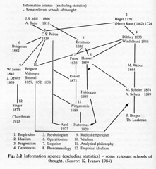

---
categories:
- chapter-3
- design-theory
- thesis
date: 2008-11-23 14:16:56+10:00
next:
  text: An experiment in blog-based discussions
  url: /blog/2008/11/26/an-experiment-in-blog-based-discussions/
previous:
  text: First photo
  url: /blog/2008/11/21/first-photo/
title: '"Information Systems Epistemology: An Historical Perspective"'
type: post
template: blog-post.html
comments:
    - approved: '1'
      author: jocene
      author_email: j.vallack@cqu.edu.au
      author_ip: 138.77.2.131
      author_url: null
      content: 'What an exciting post. I look forward to having a moment to blog on this.
        Trouble is I''ll have to think for a couple of days in order to prepare the blog!
    
        Schutz worries me. Being a sociologist, he sees everything in ontological rather
        than epistemological terms. He knows only through the life-world (as I recall.
        And yes, I am being subversive).
    
        ''Apodictic'' knowledge, in the Husserlian sense, connects with Plato''s ideal
        forms - "archetypes'' (Jung) if you like. Aristotle wasn''t quite as bright as
        Plato. I''m not certain where the Sophists fit in here, but I am sure they have
        their place.
    
        Careful David, you''ll become obsessed and metaphysical. ''Better stick with Schutz
        after all.
    
        This is really interesting.
    
        I don''t think you could refer to Decartes as a major source of positivism could
        you? "I drink therefore I am?" Well I hadn''t thought of the Cartesian dilemma
        like that before, but...
    
        and the first photo - beautiful. Good to see the new perspective through the lens
        of a fine piece of technology.
    
        I think you should buy your camera bag (the good one) in Paris. Paris could represent
        your new perspective through your new lens - the eighth P (for Paris)!'
      date: '2008-11-25 17:54:05'
      date_gmt: '2008-11-25 07:54:05'
      id: '1886'
      parent: '0'
      type: comment
      user_id: '0'
    
pingbacks:
    - approved: '1'
      author: "20160309RES701 \u2013 BLOG#2:TRUTH | nmit chris d&#039;E"
      author_email: null
      author_ip: 192.0.112.235
      author_url: https://nmitchris.wordpress.com/2016/03/08/20160309res701-blog1research/
      content: '[&#8230;] Historical perspective, [&#8230;]'
      date: '2016-03-13 12:15:11'
      date_gmt: '2016-03-13 02:15:11'
      id: '1887'
      parent: '0'
      type: pingback
      user_id: '0'
    
---
Information Systems Epistemology: An Historical Perspective

This is a summary, review, attempt to understand, and pick tidbits from the following book chapter

> Hirschheim, R. A. (1992). Information Systems Epistemology: An Historical Perspective. In R. Galliers (Ed.), Information Systems Research: Issues, Methods and Practical Guidelines (pp. 28-60). London: Blackweel Scientific Publications.

It's an attempt to start moving on Chapter 3 of [my thesis](/blog/research/phd-thesis/).

### Basic summary

Provides a basic overview/introduction to the history of epistemology

The bits I found particularly interesting, given my current state of understanding and work, include

- quotes about the role of science being the search for understanding
- Suggestions that better to view science as problem solving - Poper quot that understanding is the same as problem solving. Particularly appropriate for what I understand as design research.
- Very nice quote about researchers needing to be tool builders

- Quotes from early anti-positivists of a need to complement positivism, not replace it.
- Quote from Schutz about the main function of social science being understanding, subject meaning and action. Does this imply design research type work?

### Abstract

The paper aims to take a look at the history of epistemology within the IS discipline and consequently expose hidden assumptions beneath the conception of valid research and research methods.

### Abstract

> It is my contention that information systems epistemology draws heavily from the social sciences because information systems are, fundamentally, social rather than technical systems.

The suggestion is that the natural sciences scientific paradigm is only appropriate as much as it is appropriate for the social sciences.

### Fundamental aspects of epistemology

**epistemology** - our theory of knowledge, how we acquire knowledge.

**What is knowledge** - the author considers it to roughly synonymous with understanding.

Raises two questions

1. What is knowledge - a simple problem
2. How do we obtain valid knowledge - more problematic

#### What is knowledge?

Mentions the Greeks and their two types of knowledge

1. doxa - knowledge believed to be true
2. episteme - knowledge known to be true

This leads into the Sophists. How do we know something is true?

Author suggests it's a straightforward problem. Since we cannot transcend our language/cultural system there is no chance of obtaining any absolute viewpoint. Hence knowledge must be "asserted", knowledge claims are conceived in a probalistic sense. Knowledge is not infalible but conditional, a social convention, relative to both time and place, of societal or group acceptance.

### How do we obtain knowledge

"This is the role of science". But science itself is related to societal norms and expectations. So it can be argued about. **"In its most conceptual scence, it is nothing more than the search for understanding" (p30)**

This implies that, given any particular cultural/societal view, just about any "scholarly" attempt to acquiring knowledge can be labeled "science". Distinguishing between science and non-science is blurred. If you take a "multi-cultural" approach. Any particular culture may well have fairly well defined boundary.

> **"The conventions we agree to are those that have proved successful in the past. If, however, the conventions - and therefore our scientific process - cease to be successful then it would be time to reconsider"** (p30-31)

It could be suggested that this is the origins of design research. A pushing of conventions because of perceived limitations.

> Many of us are concerned that the present accepted research methods are no longer appropriate for the subject - indeed, they may never have been. What is needed is a fresh look at the field; in particular what is the most appropriate epistemological stance.

### Science and method

Begins by laying the groundwork about the limitations/lack of success of the natural science approach. e.g. "yielded many knowledge claims but most do not have widespread community acceptance" (p31). Relates it to similar literature in the social sciences.

Some have suggested that science is better described in terms of problem or puzzle solving. If this is done, then many problems disappear because the emphasis has shifted away from correlations, statistical significance to simply looking for an appropriate way to solve a problem.

**This is very much similar to some of the underpinnings of the design research work.**

Author goes onto quote Poper (1972) **"The activity of understanding is, essentially, the same as that of problem solving."**. Science, in this view, becomes more about practical solutions to problems.

The following paragraph has some interesting implications for design research.

> Some chose to view the process of problem solving as a craft (Pettigrew, 1985). Within this context the researcher should be viewed as a craftsman or a tool builder - one who builds tools, as separate from and in addition to, the researcher as tool users. Unfortunately, it is apparent that the common conception of researchers/scientists is different. They are people who use a particular tool (or a set of tools). This, to my mind, is undesirable because if scientists are viewed in terms of tool users rather than tool builders then we run the risk of distorted knowledge acquisition techniques. As an old proverb states: 'For he who has but one tool, the hammer, the whole world looks like a nail'. We certainly need to guard against such a view, yet the way we practice 'science' leads us directly to that view.

Eventually gets to to the point about positivism being the predominant conception of science. Defines it as "an epistemology which posits beliefs (emerging from the search for regularity and causal relationships) and scrutinizes them through empirical testing".

### Positivist science

Seeks to define/understand positivist science, uses 5 points

1. Unity of the scientific method  
    The scientific method - the accepted approach for knowledge acquisition - is universally applicable regardless of the domain of study.

3. The search for human causal relationships  
    There is a desire for regularity and causal relationships amongst the elements of the study. Elements of the whole which are reduced down into constituent parts - reductionism.
4. The belief in empiricism  
    The only valid data is those which are experienced through the senses. Subjective perception, extrasensory experience etc are not acceptable.
5. The value-free nature of science (and its process)  
    There are no connections between the practice of the scientific method and the political, ideological or moral beliefs.

7. The logical and mathematical foundation of science  
    They provide the formal basis for the quantitative analysis in the search for causal relationships.

#### Ontology of positivism

Ontology - the nature of the world around us and the part of it which the scientist examines

Positivism has a realist ontology. i.e. the universe consists of objectively given, immutable objects and structures that exist as empirical entities and are independent of the observer's appreciation of them.

Which contrasts with relativism or instrumentalism which holds that reality is a subjective construction of the mind. The names and descriptions of reality that are communicated impact on how reality is perceived and structured....more on this

Positivism has had success in natural sciences, somewhat more checkered in social sciences.

Author provides some summaries of the historical development of epistemology and in particular draws on one provided by Ivanov (1984) which is shown in the following image.

### History of IS epistemology

Divides up and introduces a history of IS epistemology into 4 stages

1. The arrival of positivism  
    - starts with the dark ages of the church and study of god as only intellectual pursuits, emergence of science through to 17th century
    - Descartes major source of positivism. Mathematics as sole based for study. All properties could be reduced to mathematical form. separation of mind and matter/mind and body.
    - positivism and empiricism came out of the late renaissance period. Backon and the inductive-experimental method. Gailileo - nature is consistent, not random. Newton stressing need for experimental confirmation. HObbes - humans could be studied using the same methods as physical phenomena.
    
    - and more into the 1900s.
2. The entering of anti-positivism  
    - Arriving in the latter part of the 19th century concerned the positivism was missing the fundamental experience of life.
    
    - A number talked about the need for something apart from positivism **not something to replace it, something to complement it**, hence the name: anti-positivism
    - Traces it back to a number of authors and gives summaries of their position. I found the description of Kant, interesting.  
        Kant believed you achieve knowledge through a synthesis (which he called 'transcendental') of concept (understanding) and experience. The philosophy that arises is called 'transcendental idealism' in which there is a difference between theoretical (dealing with knowledge of appearances - the realm of nature) and practical reason (oral reasoning - issues).
        
        Okay, so less interesting towards the end. Is this perhaps the limitation of the short description in the paper. What does [wikipedia say?](http://en.wikipedia.org/wiki/Kant) Ahh, this quote pricks my interest
        
        > Kant argues, however, that using reason without applying it to experience will only lead to illusions, while experience will be purely subjective without first being subsumed under pure reason.
        
        I can see this being applied to a range of issues and problems I'm currently thinking of including: Kaplan's law of instrument, teleological design etc.
        
        Similarly interesting is the discussion of [Dilthey](http://en.wikipedia.org/wiki/Wilhelm_Dilthey) and a couple of comments on his belief. First, the suggestion that life cannot be "understood as a mchine, as Hobbes suggested". This might be useful for Sandy and her work.
        
        Secondly, is that life cannot be understood using the explanatory model and its attempt to classify events according to lawas of nature. Connetions with Shirley's theory of theories stuff.
        
        The [wikipedia page on Dilthey](http://en.wikipedia.org/wiki/Wilhelm_Dilthey) has this to say
        
        > Dilthey strongly rejected using a model formed exclusively from the natural sciences (Naturwissenschaften), and instead proposed developing a separate model for the human sciences (Geisteswissenschaften). His argument centered around the idea that in the natural sciences we seek to explain phenomena in terms of cause and effect, or the general and the particular; in contrast, in the human sciences, we seek to understand in terms of the relations of the part and the whole. In the social sciences we may also combine the two approaches, a point stressed by German sociologist Max Weber.
        
        And lastly, a nice quote for the Ps Framework
        
        > Because individuals do not exist in isolation, they cannote be studied as isolated units; they have to be understood in the ocntext of their connections to cultural and social life.
        
        which apparently is a quote from Polkinghorne (1983).
        
3. The re-entering of positivism (through logical positivism)  
    Logical positivism suggested to be dominanat epistemology of contemporary sciecnce. But still rooted in positivism.
    

5. The arrival of the contemporary critics  
    Everyone's a critic, so logical positivism didn't last long. Some of the criticisms
    
    - Does not separate observable from theory  
        What you observe is influenced by the theories. **"In fact, it is unlikely that obervation can be theory free"**.
    - Lack of success in using deductive reasoning to overcome the problem of induction
    
    - the idea of value-free science In the guise of neutrality, the researcher is in fact tacitly supporting the status quo.
    
    Goes on about a range of others. Interestingly, [Schutz](http://en.wikipedia.org/wiki/Alfred_Schutz) influenced by Weber and Husserl got into phenomenology. **"Schutz contended that Weber's concept that the main function of the social scientist was to interpret, did not go far enough. He believed the main characteristics of social science must be 'understanding', 'subjective' meaning and 'action'".** This has some interesting implications for the work of Hevner et al that separate out natural/social sciences from design - perhaps.
    
6. Post-positivism - being a fifth stage which the author suggests is currently emerging  
    Arising out of growing band of researchers unhappy with postivism. Picks up the line of thought that knowledge is not [apodeictic](http://en.wikipedia.org/wiki/Apodicticity) (i.e. a logical certainity, self-evident). Instead knowledge is accepted by some community which accepts it as an imporvement of previous understanding.
    
    Suggested that it is more a belief about knowledge than a school of thought with agreed tenets. The [wikipedia page](http://en.wikipedia.org/wiki/Postpositivism) seems to suggest a little differently
    
    > The main tenets of postpositivism (and where it differs from positivism) are that the knower and known cannot be separated, and the absence of a shared, single reality.
    
    A part of this is a methodological pluralism i.e. that there is no correct method, simply many that may be contigent on the problem being studied or **the 'kind' of knowledge desired'**.