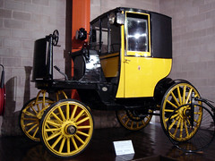

---
categories:
- ple
- plescquni
date: 2008-11-26 09:11:45+10:00
next:
  text: Some resources for around blogs and discussion forums
  url: /blog2/2008/11/26/some-resources-for-around-blogs-and-discussion-forums/
previous:
  text: 'Information Systems Epistemology: An Historical Perspective'
  url: /blog2/2008/11/23/information-systems-epistemology-an-historical-perspective/
title: An experiment in blog-based discussions
type: post
template: blog-post.html
comments:
    []
    
pingbacks:
    - approved: '1'
      author: More on blogs and discussion &laquo; The Weblog of (a) David Jones
      author_email: null
      author_ip: 72.233.2.30
      author_url: https://djon.es/blog/2008/11/26/more-on-blogs-and-discussion/
      content: '[...] on blogs and&nbsp;discussion   In some previous posts (the original
        post and the followup post) I&#8217;ve been playing around using blogs for multiple
        discussion forums. [...]'
      date: '2008-11-26 22:23:50'
      date_gmt: '2008-11-26 12:23:50'
      id: '1901'
      parent: '0'
      type: pingback
      user_id: '0'
    - approved: '1'
      author: Indications of limitations - blog based discussions &laquo; The Weblog of
        (a) David Jones
      author_email: null
      author_ip: 76.74.254.21
      author_url: https://djon.es/blog/2008/11/27/indications-of-limitations-blog-based-discussions/
      content: '[...] of limitations - blog based&nbsp;discussions   I&#8217;m trying
        to run an experiment in blog-based discussions. Trying to understand, from experience,
        the realities of using individual blogs for a multi-person [...]'
      date: '2008-11-27 16:10:54'
      date_gmt: '2008-11-27 06:10:54'
      id: '1902'
      parent: '0'
      type: pingback
      user_id: '0'
    - approved: '1'
      author: Trackbacks? &laquo; Bowes Clan
      author_email: null
      author_ip: 72.233.44.27
      author_url: http://bowesclan.wordpress.com/2008/11/28/trackbacks/
      content: '[...]    David Jones started up a conversation via trackbacks, however
        my initial attempt and subsequent fiddlings still haven&#8217;t made my [...]'
      date: '2008-11-28 14:22:26'
      date_gmt: '2008-11-28 04:22:26'
      id: '1903'
      parent: '0'
      type: pingback
      user_id: '0'
    
---
One of the major tools used (and mis-used) in most university-based e-learning is the discussion forum, or mailing list, or some other form of software for managing/creating multi-person dialogue. The [PLEs@CQUni project](http://cddu.cqu.edu.au/index.php/PLEs%40CQUni) is attempting to figure out and experiment with social media tools as a way to improve existing practice. An obvious need is to identify if, how and with what limitations these tools can be used to manage/create multi-person dialogues of the sort most academic staff associate with discussion forums.

The perceived need for this type of identification is mostly pragmatic. It is based on the observation that the decisions and actions people take are mostly based on patterns formed by previous experience. This is why most e-learning continues to be of the "horseless carriage" type. Being able to show academic staff that a new technology can re-create aspects of previous practice is an important step in getting them to move. This is the first step in the journey. We have to help get them out the door.

### The question and assumptions

Chances are that blogs are going to be a major component of a PLE. Some of the [more interesting work](http://www.chrislott.org/2008/11/05/wcet-2008-day-1/) in this area certainly suggests this. So the modified question for this post and the activity I hope will arise from it is

> What are the mechanics, benefits and limitations of using individual blogs to manage a multi-person discussion?

The idea is **not** to have a single blog on which everyone posts. The idea is to encourage the PLE type assumption where each participant in the discussion has their own blog and uses their blog to make their contribution.

The assumption should be that, if possible, each participant in the conversation can have their own blog on a different provider. i.e. everyone shouldn't have to get a blog on [Wordpress.com](http://wordpress.com/) to engage in the discussion.

### Method

This should be a type of action research. We're not going to talk about it. We're actually going to try and do it, and learn from the doing. This blog post will serve as the first part of an artifact that will arise out of this process. Those who participate will attempt to use this post as the first part of a conversation, by using their own blog.

Your task is to use whatever blog-based means you like to continue this conversation. The aim of the conversation is to discuss and come to some conclusion about the question listed above.

I will kick the ball rolling by sharing some resources arising from a quick google. A link to it should appear below ASAP.