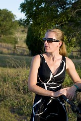
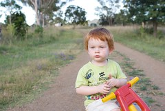

It's been a week or so since I purchased the [new camera](/blog2/2008/11/21/starting-a-new-journey-and-hobby-photography/). Last weekend I had to buy Aperture 2 for my Mac so I could easily pull the raw photos off the camera. Have been fairly happy with that purchase and the photos have [flowed](/blog2/2008/11/21/first-photo/).

I've only put 10 to 20 of them onto my [Flickr photostream](http://www.flickr.com/photos/david_jones/), a lot more sitting on the hard drive and I've yet to take on any assignments. I need to do this to start really learning something about photography, rather than simply some trial and error.

Of the photos I've placed on Flickr so far, the shot of the missus is the most visited. Though that probably has something to do with the title and/or the subject, rather than the quality of the photography.

Was going to try and pick a favourite, but couldn't decide. I don't mind this one of Zeke.

### The next accessory

Now it is time to think about the next additional expense/accessory for the camera, a tripod.

The missus and I are off to Paris in a week or so. [Paris in December](http://goparis.about.com/od/planningyourtrip/a/ParisDecember.htm) means lights. Night-time displays of decorative, Xmas lights along the Champs-Elysees and department stores. A tripod is likely to be required.

I'm somewhat reluctant to go the whole hog and get a "real" tripod. The size, weight and apparent clumsiness of them suggest I don't want to be walking around Paris with one. Which is why I was interested to see a [gorillapod](http://www.joby.com/products/gorillapod/) in a local store. It seemed small enough to fit into a bag.

There seem to have been some fairly positive reviews - [one](https://sharedreviews.com/review/review_view/21410-photography-equipment-joby-gorillapod-joby-gorillapod) and [two](http://www.backpackgeartest.org/reviews/Cameras/Photography%20Accessories/Joby%20Gorilla%20Pod/Test%20Report%20by%20Pamela%20Wyant/), and one [a little more restrained](http://www.shadowsandlight.ca/reviews/review-of-joby-gorillapod-slr-zoom/), but still positive.

The last review makes the point that this is not a replacement for a real tripod. Mmm, do I want/need one for what I want to do?