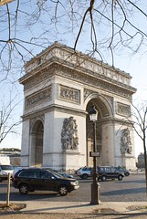
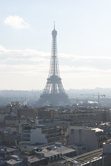
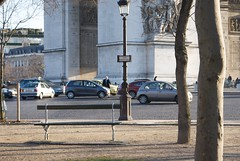
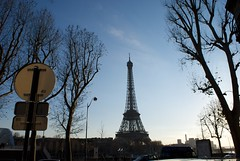
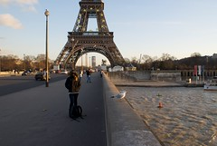
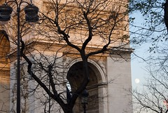

See also: [[blog-home | Home]]

After our flight we spent the afternoon of the 12th wondering around Paris, seeing what we could see. The plane was mostly to look at the Champs Elysees and the Eiffel Tower.

Walked along the Champs Elysees to the Arch de Triomphe, all not very far from where the apartment is. We're we feeling somewhat hungry by this stage, time for some lunch. Ended up settling for one of the places close by, which are undoubtedly of the type to pander to tourists that haven't ventured too far from the sights.

We can't complain. I had a brilliant [Steak au poivre](http://en.wikipedia.org/wiki/Steak_au_poivre) and pommes frites. Very, very nice. Sandy had some sort of salmon dish, the fish melted in your mouth.

Full of energy we decided to climb the Arc de Triomphe and see what we could see. Your certainly get a good view of Paris from the top. Provided an opportunity to understand where things lay. The following shot of the Eiffel Tower was taken from the top of the Arc de Triomphe.

You get to the Arc de Triomphe via an underground tunnel that goes underneath the round about that runs around it. It's an experience in itself simply to stand and watch the traffic as it goes around. It certainly appears that the Australian round about rules don't apply. There are no lanes - choose your own. And you give way to any folk to your right. Which means cars do stop on the roundabout to allow for in coming traffic. I guess that cessation of motion causes the odd bingle. And we happened to catch the end result of such.

After this we headed down the Champs Elysees and through some other streets to get to the Eiffel Tower. The grand plan being that we would go up the top and perhaps partake in some ice skating. The following shot was taken on the way there. During this journey, the closer we got to the Eiffel the greater the concentration of hawkers trying to make money selling souvenirs.

Once we arrived at the Eiffel tower the grand plan to head up the top was thwarted by three factors. First, and foremost, was that it was cold. Too cold for Sandy she was not looking forward to being out for too much longer. Second, was the line. Even on a winter's afternoon the line was quite long. Lastly, by this stage we were getting pretty tired. 30+ hours of travel was starting to take its toll so sadly, we wussed out and started walking back to the apartment for sleep.

By the time we were getting back near the Arc de Triomphe the moon was up and so we had the opportunity for the following shot. After this we stopped at some small stores in a "square" just near the apartment and purchased some coke (to go with the 12 yo Scotch) and some bakery products for food. Retired to the apartment for an early dinner and then to bed.

