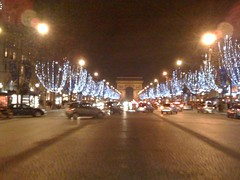

See also: [[blog-home | Home]]

Friday night we were booked in to eat at [Lasserre](http://www.restaurant-lasserre.com/uk/navigation.htm). A two-star Michelin restaurant of the haute cuisine style.

Given we were still dealing with jet lag we headed out a bit early for a walk to the restaurant and needed to waste a bit of time. So we had a chance to see the Eiffel Tower at night and to really enjoy the lovely weather.

Even then we still arrived a bit early and had to wait in a small alcove. We weren't all that worried as it was warm. Of course, a place this up market did have a dress code - the men had to have a jacket. I was obviously not the first crass person to arrive as they did have a collection of jackets to borrow.

Our reservation was for 7pm, which is quite early for Paris and we were the first folk to enter the dining room. The decor was very nice, but somewhat ruined by having a crew of (it seemed) 20+ wait staff all staring at these strange individuals entering their domain.

Dinner commenced with the sommelier asking if we wanted an aperitif. At this stage it's worthwhile to describe that I don't have a taste for wine. Though Paris is probably a good place to develop it and Lasserre is meant to have one of the best cellars in Paris. This probably explains why the sommelier looked so annoyed at our choice of Riesling - one of the cheaper available options. While not showing appropriate appreciation for his trade and the cellar we were happy with the choice and I actually enjoyed drinking it.

Sadly I forgot to bring the phone so there are no photos of dinner. We chose the degustation menu. The following description is developed from memory and going by some details from the website. May not be 100% correct, but you'll get the gist.

1. Three canapes - these seemed to be served to everyone.
2. A soup with beans, pumpkin and foie gras.  
    I'm not a soup person, but I enjoyed this.
3. A scallop and oyster dish. The oysters were served with leeks.  
    From the menu, the description was "Scallops and nuts, green apple, leeks with oysters"
    
    Again, I'm not traditionally a seafood person. But this was very nice. Perhaps it has to do with the quality of seafood that is inflicted upon folk in Rockhampton. That may also be an explanation for the wine. A few of the reds we've had since this night have been purchased cheap from the local shop and I've found them to be more drinkable than some of the stuff at home.
    

5. Next was a foie gras dish with a variety of fruits and sauces - very nice.
6. The duck dish was next. Had a fillet of duck with a small "pie" - duck leg meat and various other bits and pieces wrapped in pastry and then all served with a sauce.
7. Next was a cheese dish. A big slab of what Sandy thinks was a French version of parmesan - if there is such a thing - served with a variety of pastes.
8. And so now commenced the desserts. First was a raspberry and vanilla cream concoction served in a small glass - bit like a shot glass. From the menu this appears to have been "Raspberries, litchi and rose petals flowers candied, granity with green chartreuse"
9. Next, was three different types of chocolate. Which we believe from the menu was "Chocolate grand cru variation with mikan tangerine".  
    At this stage we were struggling with food.
10. At this stage our recollections of the night start to diverge and we can't agree on what was last. I believe we had yet another small dessert. But can't remember what.

It was certainly an experience. Something I would recommend everyone do. I don't think either of us will be rushing back to eat at this type of restaurant again. To put it prosaically, I'm not sure the cost benefit ratio is sufficient. In the end the meal cost us pretty close to $1000. A once in a life time experience.

Should point out that while we were the first in, we were not the first to leave and by the time we were leaving the place was pretty full. Given that we were also very full by this time we walked back to the apartment. This was essentially straight up the Champs Elysees at night - about 9:30 or so. The Champs Elysees at night in December is one of the things to see. Sadly the photos are taken with the iPhone, so not the best quality but you get the idea.

There were a lot of folk out. More so than we had seen in the day. Friday night shopping and going out was obviously in full swing.

