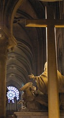

See also: [[blog-home | Home]]

Today we were due to receive visitors who were going to stay with us for the next few days. My PhD supervisor (and fellow [ICIS'2008 attendee](http://www.icis2008.org/)) and her husband were due to arrive around 10:30. So Sandy and I spent a lazy morning inside reading and waiting for them to arrive. Of course, we hadn't provided all the necessary instructions and had them waiting on the sidewalk for a bit before getting inside.

After the visitors were settled our plan was to head to [Notre Dame de Paris](http://en.wikipedia.org/wiki/Notre_Dame_de_Paris) using the second day of our ticket on the tour bus. This was a good thing given that it was still raining. I should make a point that "rain" in Paris is not like the sub-tropical rain one gets in Rockhampton. We've never seen much more than a very light drizzle but combine it with walking a few kilometres, a low single digit temperature and the occasional gust of wind and it is not all that comfortable.

Even on a wet, windy, cold December day the crowds at the cathedral were quite large. We only spent some time inside the cathedral and did not both climbing the stairs - yet another line. Instead spent some time wandering around inside. Even with a lot of people it was an experience.

All the standard cathedral stuff was there. Chapels, statues, windows, altars etc. But the history of a building started in the 1100s and which has hosted a range of events adds something. Of course there were also tourists ignoring various rules (e.g. flash photography) and the odd homeless person enjoying the warmth.

After one complete lap around the cathedral and sometime sitting in the pews it was time to head outside again. We spent some time browsing the "high class" shops selling the cheap, standard souviners that you see all around Paris. One of these days we will complete our list of purchases to palm off on the folk at home.

After that it was back on the tour bus for a drive around town until it returned to the Champs Elysees and a walk back home to the apartment. The early return was required because, alas, it was time to pick up the real reason we came to Paris, [ICIS'2008](http://www.icis2008.org).

Sunday night was the opening reception. We collected Shirley and John from the apartment and made our way to the Palais de Congres for the opening reception. A lot of people in a room with the heating turned up and one free drink did not make for an environment in which a long time was to be spent.

After a minimal amount of time 6 of us retired to a local Indian restaurant for quite a good dinner. Then it was back to bed, early, as two of the 6 had presentations to give in the morning.