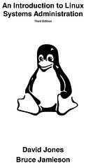
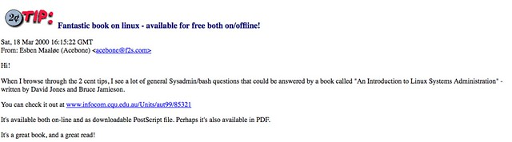
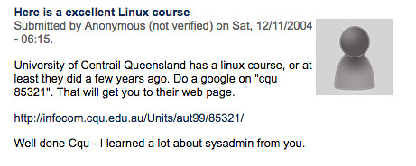
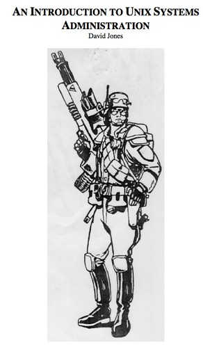

---
categories:
- teaching
date: 2008-12-22 13:22:46+10:00
next:
  text: What tree is this?
  url: /blog/2008/12/23/what-tree-is-this/
previous:
  text: It is official - a best publication for IS in 2007
  url: /blog/2008/12/22/it-is-official-a-best-publication-for-is-in-2007/
tags:
- linux-systemsadministration
title: An introduction to Linux Systems administration - 1st and 4th editions
type: post
template: blog-post.html
comments:
    []
    
pingbacks:
    - approved: '1'
      author: 'Open Educational Practice: the boring way and more interesting ways &#8211;
        The Weblog of (a) David Jones'
      author_email: null
      author_ip: 192.0.101.48
      author_url: https://davidtjones.wordpress.com/2016/08/07/open-educational-practice-the-boring-way-and-more-interesting-ways/
      content: '[&#8230;] know, I&#8217;ve been through that. The image to the right (with
        the penguin) is the cover from the open text book some colleagues and I wrote
        in the late 1990s. Creating an open text book might actually be a [&#8230;]'
      date: '2016-08-07 09:04:29'
      date_gmt: '2016-08-06 23:04:29'
      id: '1922'
      parent: '0'
      type: pingback
      user_id: '0'
    
---

For various reasons I'm in a process of capturing some ancient history before it potentially gets lost in the great cyberspace rubbish bin.

The most recent find/rediscovery has been the [Fourth edition of An Introduction to Linux Systems Administration](https://djon.es/Publications/all_small.pdf). This text was used for the Systems Administration course I used to teach. The 4th edition is from 1999 and was the last time I taught the course all the way through.

Ahh, the good old days.

Sadly, the text hasn't been maintained to the same level nor have subsequent versions of it been openly available.

Sadest of all is that none of the 140 links returned on Google are to a site associated with the course for which the book was created. The university for that course is no longer getting any of the free publicity and attention it once got.

Back in 2003 alone, a PDF of the fourth edition was downloaded over 65,000 times.

### Comments

In its hey day this was a much read text, used by a couple of other institutions and even translated into other languages. A quick google search "an introduction to linux systems administration" used to show 140 hits including [this one](http://tldp.org/LDP/LGNET/issue52/lg_tips52.html) that has a nice, short review.  The following couple of images (click on them to see larger versions) are screenshots of user comments I've discovered on the open web (saved as images for posterity).    Misc other comments received by email included:

I just ran across your On-line book ... called, 'An Introduction to Linux System Administration'. I skimmed through it and was very impressed with the book. I especially like your writing style which I feel aims to explain difficult abstract topics in easy to understand language and tries to ease student anxiety levels. … In reviewing my 50+ collection of other books on the same subject, I feel that most other authors know the topics they are writing about well enough for their own understanding, their occupations and even to publish a book. However, it takes real super stars to be able to take abstract concepts and make them seem concrete enough for a person of average intelligence to understand. I commend both of you for a job well done!

### Heading back further

Thanks to [Internet Archive's Wayback Machine](http://archive.org/web/) I've been able to locate [the first edition](http://web.archive.org/web/19970808232808/http://mc.cqu.edu.au/subjects/85321/study-guide/index.html) of the text - circa 1996.

[Available here](https://davidtjones.files.wordpress.com/2016/08/1994_version.pdf) as a PDF.