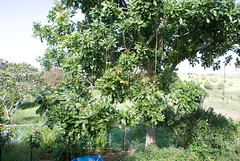
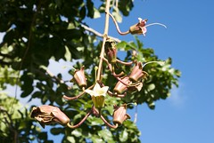
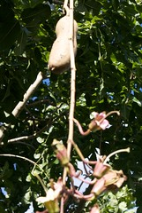

See also: [[blog-home | Home]]

The above tree is sitting in our front yard. It's grown a lot over the last five years and is developing in a really nice way. The trouble is we have no idea what type of tree it is. Do you? Can you help us identify this tree? Our google searches have failed. Click on the above photo to see larger pictures

A couple of years ago we noticed it developed some flowers that grow in a bunch off stems which hang down from the branches. The flowers are yellow inside but have a dirty red/maroon outside.

Then just in the last few weeks the tree has developed woody looking seed pods which hang down the same way as the flowers.

