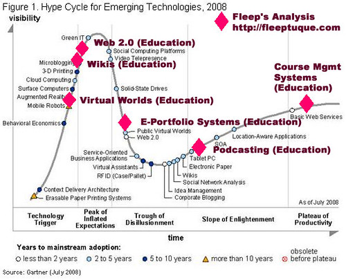

---
categories:
- chapter-2
- elearning
- missingps
- thesis
date: 2009-01-21 23:01:54+10:00
next:
  text: Somethings that are broken with evaluation of university teaching
  url: /blog2/2009/01/25/somethings-that-are-broken-with-evaluation-of-university-teaching/
previous:
  text: Why am I a ePortfolio skeptic?
  url: /blog2/2009/01/21/why-am-i-a-eportfolio-skeptic/
title: Open source learning management systems - the latest fad in e-learning
type: post
template: blog-post.html
comments:
    - approved: '1'
      author: davidtjones
      author_email: d.jones@cqu.edu.au
      author_ip: 59.154.24.147
      author_url: https://djon.es/blog/
      content: 'I should point out that the above is <strong>NOT</strong> an argument
        to say that open source learning management systems are good or bad. It''s an
        argument that the decisions being taken by an increasing number of institutions
        to adopt open source learning management systems are, if you dig deep enough,
        are based more on "keeping up with the Joneses" rather than on an effective evaluation
        and understanding of the needs of the specific institution and of its students
        and staff.
    
    
        The fact that the University of Importance down the road and many other universities
        (at which friends and relatives of senior management work) have adopted open source
        learning management systems becomes more important than a detailed understanding
        of what would most improve the practice of learning and teaching in the local
        context.'
      date: '2009-01-23 16:00:49'
      date_gmt: '2009-01-23 06:00:49'
      id: '2072'
      parent: '0'
      type: comment
      user_id: '1'
    
pingbacks:
    - approved: '1'
      author: The &#8220;dominant&#8221; and problem assumptions underlying university-based
        e-learning - introduction &laquo; The Weblog of (a) David Jones
      author_email: null
      author_ip: 76.74.254.21
      author_url: https://djon.es/blog/2009/01/25/the-dominant-and-problem-assumptions-underlying-university-based-e-learning-introduction/
      content: '[...] practice that I believe my research will address. The following
        builds on some initial ideas from a previous blog post and serves as some practice
        in formulating my ideas. So it will still be rough. Feel free to [...]'
      date: '2009-01-25 13:57:49'
      date_gmt: '2009-01-25 03:57:49'
      id: '2073'
      parent: '0'
      type: pingback
      user_id: '0'
    - approved: '1'
      author: 'Down with the cookie-cutter LMS: the Edupunk ideology and why integrated
        systems might go away &laquo; The Weblog of (a) David Jones'
      author_email: null
      author_ip: 76.74.248.177
      author_url: https://djon.es/blog/2009/02/25/down-with-the-cookie-cutter-lms-the-edupunk-ideology-and-why-integrated-systems-might-go-away/
      content: '[...] and fashions as logical decision making (see some related posts:
        the silliness of best practice, open source LMS - the latest fad, and alternatives
        for [...]'
      date: '2009-02-25 08:45:55'
      date_gmt: '2009-02-24 22:45:55'
      id: '2074'
      parent: '0'
      type: pingback
      user_id: '0'
    - approved: '1'
      author: The IRIS model of Technology Adoption - neat and incomplete? &laquo; The
        Weblog of (a) David Jones
      author_email: null
      author_ip: 72.233.96.150
      author_url: https://djon.es/blog/2009/03/06/the-iris-model-of-technology-adoption-neat-and-incomplete/
      content: '[...] by Jim Groom about leadership captures some of this. I&#8217;ve
        seen this problem lead too often to faddish and fashionable adoption of innovations.
        I tend to think much of the organisational implementation of e-learning is based
        on [...]'
      date: '2009-03-06 09:19:15'
      date_gmt: '2009-03-05 23:19:15'
      id: '2075'
      parent: '0'
      type: pingback
      user_id: '0'
    - approved: '1'
      author: 'Comparing VLEs/LMS to the past: flaws and implications for development
        models &laquo; The Weblog of (a) David Jones'
      author_email: null
      author_ip: 72.233.96.143
      author_url: https://djon.es/blog/2009/03/15/comparing-vleslms-to-the-past-flaws-and-implications-for-development-models/
      content: '[...] of course, open source must be the answer. That seems to be what
        the latest fad sweeping higher education might suggest. As that previous post
        suggests, I have my [...]'
      date: '2009-03-15 23:20:33'
      date_gmt: '2009-03-15 13:20:33'
      id: '2076'
      parent: '0'
      type: pingback
      user_id: '0'
    - approved: '1'
      author: Cognition - we&#8217;re not rational and how it impacts e-learning &laquo;
        The Weblog of (a) David Jones
      author_email: null
      author_ip: 72.233.96.151
      author_url: https://djon.es/blog/2009/03/20/cognition-were-not-rational-and-how-it-impacts-e-learning/
      content: '[...] I&#8217;ve written about aspects of this before and again. [...]'
      date: '2009-03-20 14:07:34'
      date_gmt: '2009-03-20 04:07:34'
      id: '2077'
      parent: '0'
      type: pingback
      user_id: '0'
    - approved: '1'
      author: The fad cycle in learning &amp; teaching - a historical perspective &laquo;
        The Weblog of (a) David Jones
      author_email: null
      author_ip: 74.200.245.188
      author_url: https://djon.es/blog/2009/04/02/the-fad-cycle-in-learning-teaching-a-historical-perspective/
      content: '[...] the failure of prescription as a method for improving learning and
        teaching, the tendency towards faddish or fashionable adoption of learning technologies
        (including e-portfolios and open source LMSes), the negative impacts of [...]'
      date: '2009-04-02 14:05:27'
      date_gmt: '2009-04-02 04:05:27'
      id: '2078'
      parent: '0'
      type: pingback
      user_id: '0'
    - approved: '1'
      author: Is there value in strategic plans for educational technology &laquo; The
        Weblog of (a) David Jones
      author_email: null
      author_ip: 74.200.244.102
      author_url: https://djon.es/blog/2009/10/09/is-there-value-in-strategic-plans-for-educational-technology/
      content: '[...] Fads, fashions and band wagons (Birnbaum, 2000; Swanson and Ramiller,
        2004) [...]'
      date: '2009-10-09 09:09:32'
      date_gmt: '2009-10-08 23:09:32'
      id: '2079'
      parent: '0'
      type: pingback
      user_id: '0'
    - approved: '1'
      author: Webinar notes Part 1 &laquo; Col&#039;s Weblog
      author_email: null
      author_ip: 66.135.48.211
      author_url: http://beerc.wordpress.com/2010/10/22/webinar-notes-part-1/
      content: "[...] that it is the move away from proprietary LMS to open source LMS\
        \ although this trend is somewhat \u2018faddish\u2019 in nature. I like the idea\
        \ that systems such as the LMS can evolve over time based on the needs [...]"
      date: '2010-10-22 07:57:44'
      date_gmt: '2010-10-21 21:57:44'
      id: '2080'
      parent: '0'
      type: pingback
      user_id: '0'
    - approved: '1'
      author: Why am I a ePortfolio skeptic? &laquo; The Weblog of (a) David Jones
      author_email: null
      author_ip: 74.200.247.113
      author_url: https://djon.es/blog/2009/01/21/why-am-i-a-eportfolio-skeptic/
      content: '[...] Some of the more recent include: e-learning, the LMS, the enterprise
        LMS, the open source LMS (e.g. an earlier post where I proposed that the open
        source LMS was yet another fad), and more recently [...]'
      date: '2012-09-16 22:37:06'
      date_gmt: '2012-09-16 12:37:06'
      id: '2081'
      parent: '0'
      type: pingback
      user_id: '0'
    
---
The following is forming up as something to go into my [thesis](/blog2/research/phd-thesis/) as part of the "Past experience" component of the Ps Framework.

Essentially, I'm going to try and

- Suggest a timeline of e-learning within universities.
- Contend that this history shows all the hall marks of fads and fashions in organisational decision making, aka the [bandwagon effect](http://en.wikipedia.org/wiki/Fad).
- Outline what I think is one contributing factor to this bandwagon effect.

### The timeline

Still early days for this, but I think you can group the timeline for e-learning in universities into the following (the times I've put in place are based on my experience at [CQUniversity](http://www.cqu.edu.au/):

1. Pre-Interent - pre-1992 or so  
    This is the use of bulletin board systems and proprietary systems run by telecommunication companies. Text-only, primitive and horrible user interfaces and really, really expensive charges for dialing up at speeds approach 2400bps.
2. Individual Internet - 1992-~1996 (perhaps later in some places)  
    Individual innovators adopting use of FTP, email, Gopher and the very early days of the Web for their own classrooms. Most access is still via text-based interfaces with very slow expensive charges. The Internet is not a widespread things.
3. Cottage industry learning management systems - ~1995/6-late 1990s  
    The mid to late 1990s saw widespread recognition that the majority of academic staff simply did not have the skills or time to individual design their use of Internet technologies (Goldberg, Salari et al. 1996; Jones and Buchanan 1996). Through this time a diverse collection of intranet-based systems , home-built virtual learning environments, off-the-shelf products and customized groupware solutions were developed by different schools and faculties (Dron 2006). Some of them are still being used today - but all are just about gone.
4. Institutional and then Enterprise commercial learning management systems - late 1990s through to now  
    Centralised systems start being put in place. Almost without exception these are commercial systems from vendors. In the early days there were a plethora of vendors. But eventually this is reduced through mergers and takeovers. Some time in the noughties these systems go for added "prestige" by calling themselves "enterprise" systems. They most are still based on dodgy bits of technology put together in an ad hoc manner.
5. Open source learning management systems - mid-noughties and onwards  
    For various reasons, mostly cost, increasingly universities are going for open source learning management systems. Essentially the same as the commercial systems in terms of functionality, but designed by an open source community.

In terms of [Gartner's technology hype cycle](http://en.wikipedia.org/wiki/Technology_hype) my guess is that we're currently climbing the peak of inflated expectations in terms of open source learning management systems. I believe most of the universities in New Zealand have adopted Moodle. All of the Australian universities that have recently made decisions about changing their LMS, I believe, have gone open (or community) source.

I was going to include the Wikipedia image of the hype cycle, but the format is wrong for this task. So I searched [Flickr](http://www.flickr.com/) and found the following. It's one view of emerging technologies in education and elsewhere. Interesting to see where other people have put Web 2.0, e-portfolios etc. It doesn't distinguish between open source and commercial course management systems though. (click on the image to go to the [original photo](http://flickr.com/photos/fleep/2763745059/) or [here for the original blog post](http://fleeep.net/blog/2008/08/14/hype-cycle-and-james-paul-gee-building-worlds/) the image is from).

I believe we're also at the start of another stage in this development, the "post industrial" approach. But this one still hasn't risen to the awareness of most organisations, at least not at senior management making a decision to base the institution's approach on it.

- Post-industrial - mid-noughties (perhaps later) - 
    This stage includes various ideas from such concepts as [e-learning 2.0](http://en.wikipedia.org/wiki/ELearning_2.0#E-Learning_2.0) (or the [original](http://www.downes.ca/post/31741)), personal learning environments and web 2.0. At a very simple level, the emphasis moves away from the industrial model where everything is supplied by the institution through "enterprise" systems. To a model where the services provided by the institution blend in with the services and requirements of the learners. Where learner is defined in the broadest possible sense.

### The case for fads, fashions and band-wagons

Back in June, 2007 - when writing this [paper](/blog2/publications/the-teleological-reason-why-icts-limit-choice-for-university-learners-and-learning/) I said

> ...the subsequent limitation of rationality is demonstrated by the “faddish” adoption of LMSs within universities. Surprise has been expressed at how quickly university learning and teaching, commonly known for its reluctance towards change, has been modified to incorporate the use of learning management systems (West et al., 2006). Pratt (2005) finds connections between the Australian university sector's adoption of e-learning during the 1990s and the concept of management fashions, fads and bandwagons where a relatively transitory collection of beliefs can legitimise the exercise of mindlessness with respect to innovation with information technology (Swanson & Ramiller, 2004). In particular, given conditions of uncertainty about prevailing technologies organisations may rely on imitation to guide decision making (Pratt, 2005).

One of the reasons, I believe, that the timeline sequence above applies fairly well to e-learning, regardless of institutions or countries. Is because most have been influenced by the bandwagon effect. The people making decisions in most organisations have had so little understanding of how to go about e-learning they have followed what everyone else is doing.

Following on from the above quote I asked the following questions

> Is the current trend amongst universities to move towards open source learning management systems (e.g. Moodle) the most recent e-learning fashion? Will an open source learning management system, especially one that is supported within an institution in the same way as a commercial product, really make a significantly different impact than use of a commercial product?

Guess which university has recently decided to adopt Moodle?

### The source of the bandwagon - unquestioned assumptions

Information systems development (and other interventions in human organisations) are not rational, purposive or goal-driven processes, they are instead subject to human whims, talents and the personal goals of those involved (Truex et al., 2000). Decision making about the implementation of information systems is not a techno-rational process with many decision makers relying on intuitions or instincts and simple heuristics to simplify decision making (Jamieson & Hyland, 2006). People are not rational in that their decision-making is influenced by a range of cognitive and other biases.

In the words of [Dave Snowden](http://www.cognitive-edge.com/files/Dave-Snowden.pdf), "Human beings are pattern matching intelligences". Or more specifically (Snowden, 2005)

> This builds on naturalistic decision theory in particular the experimental and observational work of Gary Klein (1944) now validated by neuro-science, that the basis of human decision is a first fit pattern matching with past experience or extrapolated possible experience. Humans see the world both visually and conceptually as a series of spot observations and they fill in the gaps from previous experience, either personal or narrative in nature. Interviewed they will rationalize the decision in whatever is acceptable to the society to which they belong: “a tree spirit spoke to me” and “I made a rational decision having considered all the available facts” have the same relationship to reality

When it comes to e-learning, the same problem arises. No matter who looks at e-learning their answers to the question of “how to do e-learning” is almost always limited by their background and experience. They do not see the whole picture, they only focus on what they know. And the fashion of what all the other universities are doing become a narrative that is so strong it becomes the obvious way to go.

Related to this problem is that there are range of unquestioned assumptions underlying these decisions. I'll try and use the [the Ps Framework](/blog2/2008/10/24/the-ps-framework-avoiding-perceptual-blindness/) to represent these. (This is very much formative for the thesis).

1. Past experience - there's almost an ignorance of what has gone before and the limitations of previous attempts. My university has just gone through its 3rd selection process for an LMS. How many has yours done?
2. People - there's an assumption that people are rational. The above disproves some of that. Google - bounded rationality or cognitive bias. There's an assumption that students and staff will adopt what ever is decided.
3. Product - there's almost an automatic assumption that e-learning means LMS.
4. Place - people seem to think universities and the context they operate in are static. There seems to be an assumption that universities are ordered or complicated systems, rather than complex systems (see the [Cynefin framework](http://en.wikipedia.org/wiki/Cynefin)).
5. Process - there is a complete bias to teleological design processes (Introna, 1996; Jones and Muldoon, 2007) when ateleological design is more appropriate. In the words of Snowden, "fail-safe" design versus "safe-fail" design.

Institutional implementation of e-learning can't help but not be faddish or fashionable because many of the underlying understandings of the components that contribute to these decisions are unquestionably biased towards one understanding of those components. These understandings have become the single domineering, and usually unquestioned, understandings that underpin the organisational implementation of e-learning within universities.

Paraphrasing Truex et al (2000)

> The adoption of such domineering understandings not only imprisons thinking about those understandings, but also thinking about think about those understandings.

### References

Dron, J. (2006). Any color you like, as long as it's Blackboard. World Conference on E-Learning in Corporate, Government, Healthcare and Higher Education, Honolulu, Hawaii, USA, AACE.

Goldberg, M., S. Salari, et al. (1996). "World-Wide Web - Course Tool: An environment for building WWW-based courses." Computer Networks and ISDN Systems 28: 1219-1231.

Jamieson, K. and P. Hyland (2006). Factors that influence Information Systems decisions and outcomes: A summary of key themes from four case studies. 17th Australasian Conference on Information Systems, Adelaide, Australia.

Jones, D. and R. Buchanan (1996). [The design of an integrated online learning environment](/blog2/publications/the-design-of-an-integrated-online-learning-environment/). Proceedings of ASCILITE'96, Adelaide.

Introna, L. (1996). "Notes on ateleological information systems development." Information Technology & People 9(4): 20-39.

Pratt, J. (2005). "The Fashionable Adoption of Online Learning Technologies in Australian Universities." Journal of the Australian and New Zealand Academy of Management 11(1): 57-73.

Snowden, D. (2005). Multi-ontology sense making: A new simplicity in decision making. Management Today, Yearbook 2005. R. Havenga.

Swanson, E. B. and N. C. Ramiller (2004). "Innovating mindfully with information technology." MIS Quarterly 28(4): 553-583.

Truex, D., R. Baskerville, et al. (2000). "Amethodical systems development: the deferred meaning of systems development methods." Accounting Management and Information Technologies 10: 53-79.

West, R., G. Waddoups, et al. (2006). "Understanding the experience of instructors as they adopt a course management system." Educational Technology Research and Development.