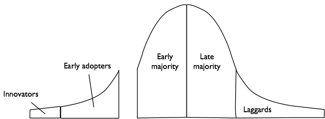

See also: [[blog-home | Home]]

### Update: It's not just eportfolios

16 September, 2012 - for some reason today has seen a fair bit of interest in this post from over 3 years ago. I though I'd take the opportunity to move this particular argument up a level.

Proposition: Attempts to improve or - heaven forbid - "innovate" university teaching and learning is largely driven by mindless innovation, fads and fashions. eportfolios was just one such fad. There have been and will be many more. Some of the more recent include: e-learning, the LMS, the enterprise LMS, the open source LMS (e.g. [an earlier post](/blog2/2009/01/21/open-source-learning-management-systems-the-latest-fad-in-e-learning/) where I proposed that the open source LMS was yet another fad), and more recently MOOCs.

[@downes seemed slightly annoyed](http://www.downes.ca/post/58911) when I wrote in this [earlier post](/blog2/2012/08/22/the-dilemma-of-open-courses-in-an-australian-university/)

> MOOCs are the latest fad to hit higher education.

. It was never my intent to denigrate the work he and others have done with cMOOCs. Rather it was to criticise how universities - especially Australian universities - were responding to the rise of MOOCs. Somewhat along the lines of what @bonstewart argues in [Is MOOC more than just a buzzword?"](http://www.guardian.co.uk/higher-education-network/higher-education-network-blog/2012/sep/13/mooc-buzzword-meaning-higher-education).

My argument is that rather than mindfully innovating - or simply improving - learning and teaching (either with or without), Universities are driven by outside influences. By fads, fashions and buzz words.

When I say I'm an eportfolio skeptic, I'm not necessarily denigrating eportfolios (or MOOCs or the LMS or any other fad, fashion or buzzword). I'm critiquing the institutional leadership and management that continues to be driven by these fads, fashions and buzzwords and is apparently unaware of the problems this entails.

Both this original post and [this post "Justificatory knowledge"](/blog2/2010/09/17/justificatory-knowledge/) use Swanson and Ramiller (2004) on innovating mindfully with technology. The "justificatory" post includes the following summary.

> An organisation which is mindful in innovating with IT, uses reasoning grounded in its own organisational facts and specifics when thinking about the innovation, the organisation recognises that context matters (Swanson and Ramiller 2004). Within mindful innovation, management have a responsibility to foster conditions that prompt collective mindfulness (Swanson and Ramiller 2004).

Especially when how the institution adopts the latest fad ends up corrupting some of the fundamental underpinnings of the original idea. e.g. how the adoption of a specific eportfolio system seems to create the situation where universities are mandating that students create a portfolio in the institutional system. So much for individual choice.

Or when institutional MOOCs are no longer MOOCs, which as @downes defines

> What makes a MOOC is the way it is designed - it supports thousands of users that fully interact because it is distributed. It's not located in just one place, it is located in many places.

### Original post starts here

Update: Donald Clark has [7 reasons why he doesn't want one](http://donaldclarkplanb.blogspot.com/2011/03/e-portfolios-7-reasons-why-i-dont-want.html).

I am a skeptic when it comes to ePortfolios. I believe they are a waste of time. Another fad that will take attention away from activities that will actually improve learning and teaching at universities. I believe they embody many of the faulty assumptions and mistakes that underpin most of e-learning within universities.

So, why do I think that? Why am I using such strong language to describe it? Am I right? (Answers to these questions are always open to change).

That second last question is easy to answer, given a range of contextual factors I'm increasingly annoyed at people making, what I see as, the same mistakes again and again and again. I'm also simply in a grumpy mood today. It's now over a month since I first wrote the start of this paragraph, that sentiment still stands. I also find myself in a position where I can be a little more critical.

I'm going to try and get this post published today to achieve something and also because I came across [this presentation](http://connect.educause.edu/Library/Abstract/AssessingImpactEPortfolio/48044) from the [EDUCAUSE](http://www.educause.edu/) Mid-Atlantic Regional Conference. It's called "Assessing Impact: E-Portfolios in Higher Education".

### Yet another fad - ignorance of place, emphasis on product

In an [earlier post](/blog2/2008/11/11/extending-the-classroom-open-content-and-open-teaching-summary-and-reflection/) I started some of this complaint. In the session which that post reports on there were lots of gleams of interest from [CQUniversity](http://www.cqu.edu.au/) folk when e-portfolios and [elgg](http://elgg.org/) were mentioned. I could see people, who had little or no idea about what e-portfolios or elgg were, becoming interested in looking at them. At the time I said

> This is one example of how the “product” (in terms of the [Ps Framework](/blog2/publications/the-ps-framework-mapping-the-landscape-for-the-plescquni-project/)) overwhelms consideration of “place”, of context. This is exactly how fads and fashions arise in educational technology and organisational/management practice in general.

Here's what Swanson and Ramiller (2004) said about fads and fashions.

> Attention deferral and contextual insensitivity may appear to be unproblematic in the face of the overwhelming “proof” afforded by the larger community’s rush toward the innovation

i.e. since everyone else is doing it, you don't have to worry about considering whether or not it actually makes sense for your context. In many cases you also don't have to worry about whether or not everyone else that is already using the fad is succeeding or not.

The educational technology/curriculum design community and consequently the broader university community is talking about e-portfolios. In Australia there is the [Australian ePortfolio Project](http://www.eportfoliopractice.qut.edu.au/) which is raising the profile of e-portfolios in the sector. I predict that this project will further increase awareness of e-portfolios within the sector and before the year is out (if they haven't already) some discussions will occur about their use at CQUniversity.

The EDUCAUSE presentation above suggests e-portfolios have been around for almost 10 years. So it's taken a while. The same presentation also reports on some less than stellar results from students and staff. It seems the people aren't that happy.

### The "technologists" alliance - ignorance of people

I'm guessing that if we did an analysis of the literature around ePortfolios that we would find three categories of people making up the majority, if not the entirety, of the list of authors. Those categories are

1. Vendors or developers of e-portfolio systems - the people that make and sell the systems.
2. Institutional instructional designers or instructional technology folk - the people implementing e-portfolio projects within universities.
3. Innovative academic staff - the people who adopt e-portfolios first.

In other words, a minority of the folk involved with education within universities.

In the words of William Geoghegan (1994) these three groups of folk are the "technologists" alliance. He had this to say about them (emphasis and some explanation added by me)

> Those involved include faculty innovators and early adopters, campus IT _(IT here is instructional technology - US phrase that includes instructional designers and information technology folk)_ support organizations, and information technology vendors with products for the instructional market. Ironically, while this alliance has fostered development of many instructional applications that clearly illustrate the benefits that technology can bring to teaching and learning, **it has also unknowingly worked to prevent the dissemination of these benefits into the much larger mainstream population.**

Geoghegan (1994) continued to say

> There seems to have been a naive assumption on the part of all three communities that what worked for those who were already committed to the use of instructional technology, were actively applying it in their own work and were serving as evangelists to others would work equally well with those who had not yet committed.

Geoghegan works with [Geoffrey Moore's concept of a chasm](http://en.wikipedia.org/wiki/Crossing_the_Chasm) that exists between the early adopters of a product (the enthusiasts and visonaries) and the early majority (the pragmatists). Represented something like this.

**Figure 1 - [Revised technical adoption cycle](http://en.wikipedia.org/wiki/File:Revised_technical_adoption_cycle.png)**

This is not to suggest the elgg or e-portfolios are a bad idea, there is some value in them. If they are appropriate for the organisational context and they are adopted because of a large organisational need and not because someone heard or read something positive about the idea. They are a good idea if they are implemented in a way that engages with the reality of what the people within the place are dealing with and with what they are ready to do.

The following table is an example of the differences which Geoghegan talks about between the folk that work with the technologists' alliance and those in the mainstream.

| Early Adopters | Mainstream |
| --- | --- |
| Like radical change | Like gradual change |
| Visionary | Pragmatic |
| Project oriented | Process oriented |
| Risk takers | Risk averse |
| Willing to experiment | Need proven uses |
| Self sufficient | Need support |
| Relate horizontally | Relate vertically |

The types of support and encouragement you give to the early adopters has to be radically different than that you give to the mainstream. Time and time again, I have heard senior university folk express the opinion "We'll concentrate on the people that are keen". This perspective only entrenches this gap, it only makes certain that the mainstream won't engage. It's a mistake.

There are many other differences between people that will impact upon perceptions and adoption. The process used to identify, design, develop and implement any technology, including e-portfolios, has to be aware of and work with these differences.

### Failure to adopt or work - ignorance of process

E-portfolios, like many other fads, are becoming a solution looking for the problem. The process used to implement these fads within higher education goes something like this

- **There is a problem.** A problem is identified and some one or some group is convinced that is important and requires that a project be set up.
- **Some analysis is performed.** A small group of folk, generally from the technologists' alliance with a few senior management folk added, go away and do some analysis. They may be helped by a consultant. Typically, the problem will have been framed so that the decision is a foregone conclusions. For example, rather than examining the question "How do we improve assessment?" the question will be "Which approach to e-portfolios should we take?"
- **A decision is made.** That analysis will be used by some smaller group to make a decision. From now on, this is the goal towards which the organisation and its resources are focused.
- **The decision is implemented.** A project group is set up to achieve the goal. The project group will be there to ensure that all work moves towards the goal. Than anything that is different is cut off.
- **Long period of support.** To recoup the costs involved in making and implementing the goal the organisation then has to use they "system" for a long period. During this time organisational resources are focused on supporting the system (and little or nothing else).
- **Eventually it will start to drift.** In some cases the people won't want to use it, they aren't convinced of the rationale. They may well appear to be working towards the goal, but they may simply be playing sufficient lip service so they don't get into trouble. Then there will be the problem of "stable systems drag" (Truex, Baskerville et al, 1999) where the world has moved on and the goal no longer makes any sense. Alternatively, a new senior executive could arrive with different approaches and kill one set of fads for another set.
- **Another problem is perceived, and the process starts again.**

You can see this with the notion of LMS churn going on with universities. In the 10 years since 1999 CQUniversity will have been through 3 separate process to replace an LMS.

The very nature of universities, the place, the people and of pedagogy makes this type of process completely and utterly inappropriate and destined to fail.

But that's a general perspective that applies to just about anything within universities, what about e-portfolios in particular.

### The wrong solution - the wrong product

The definition of e-portfolio used in the [EDUCAUSE presentation](http://connect.educause.edu/Library/Abstract/AssessingImpactEPortfolio/48044) is taken from Lorenzo and Ittelson (2005)

> a digitized collection of artifacts including demonstrations, resources, and accomplishments that represent an individual, group, or institution.

For the majority of the technologists alliance within universities this means that the university must purchase or build and then support a software system (almost certainly referred to as an enterprise software system to give it that badge of respectability - even though it means nothing in terms of reliability, flexibility, suitability and probably more in terms of cost and constraints) that resides on university hardware and is badged with the university look and feel.

The major problem with this product approach is that it ignores **One student = multiple learning experiences = multiple learning "institutions"**.

In the typical e-portfolio product there is an assumption that the students' only place for learning is the host institution. It ignores the observation that students attend multiple learning institutions (including work-place training) and it ignores that most learning is informal. In other words, an institution that plays a very small part in the learning of a student expects the student to place all of their "demonstrates, resources and accomplishments" onto the institution's server.

### What are we trying to solve - ignorance of purpose

The [EDUCAUSE presentation](http://connect.educause.edu/Library/Abstract/AssessingImpactEPortfolio/48044) gives the following primary uses of e-portfolios

- Academic advising
- Institutional accreditation
- Curricular development at program level
- Career planning and development
- Alumni development

I have two main problems around these stated purposes

1. **One system, multiple tasks.** One of my major problems with "enterprise systems" is that try to do everything. They try to be all things to all tasks and end up being really bad at all of them. I hear the information technology folk cry, "But they are all integrated!". Yea, but no-one uses them because they are really horrible to use. The above list includes a number of very different tasks performed by very different people. The assumption that one system can perform all of these well, is somewhat questionable. Rather than put all tasks in one system, adopt a best of breed approach and put your effort into making sure they are integrated. This requires the IT folk (rather than the users) do some work. Of course, there is [an alternate position](http://www.health-infosys-dir.com/select_0800.htm) that is based on a number of false assumptions, but that's a story for another day.
2. **The institutional, not adopter focus.** Take a look at the diffusion curve image above. The majority of people are **not** the innovators and early adopters. This applies to university academics. Most university academics are keen to do a good enough job in teaching their classes so they can concentrate on other pursuits. Look at the list of primary uses of e-portfolios. How many of them are going to be of direct interest to the majority of academics, most of the time? Perhaps academic advising, maybe institutional accreditation from time to time, but typically that's only a small number of academics. Perhaps curricular development at program level? Most of the programs in my context don't do this. Your context might be different. (Remember, place/context is important).
    
    How many of these tasks are seen as problematic by these academics? Remember the majority are very different from the innovators and early adopters. See the table above. Most people don't want to radically change the way they are doing things. They will only consider radical change if there are huge problems with current practice.
    
    The same applies to students. How many of the above tasks are students directly involved with regularly? How many of these tasks do students currently have huge problems with?
    

### Conclusions

There's more that can be put in here. For those who are wondering, yes much of this content is related to my PhD. To a large extent I believe that there are large collection of mistaken assumptions that underpin most of the practice of e-learning within Universities. Many of the above complaints about e-portfolios can be easily applied to other technologies and how they are implemented within universities. More on this as the thesis progresses.

### References

Geoghegan, W. (1994). Whatever happened to instructional technology? 22nd Annual Conferences of the International Business Schools Computing Association, Baltimore, MD, IBM.

George Lorenzo and John Ittelson, An Overview of E-Portfolios, ed. Diana Oblinger (Boulder, CO: EDUCAUSE Learning Initiative, July 2005), http://www.educause.edu/ir/library/pdf/ELI3001.pdf.

Truex, D., R. Baskerville, et al. (1999). "Growing systems in emergent organizations." Communications of the ACM 42(8): 117-123.

Swanson, E. B. and N. C. Ramiller (2004). "Innovating mindfully with information technology." MIS Quarterly 28(4): 553-583.