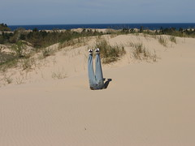

---
categories:
- addie
- c2d2
- elearning
- missingps
date: 2009-01-25 13:28:29+10:00
next:
  text: '"The "dominant" assumptions underlying university-based e-learning: an introduction"'
  url: /blog/2009/01/25/the-dominant-and-problem-assumptions-underlying-university-based-e-learning-introduction/
previous:
  text: Open source learning management systems - the latest fad in e-learning
  url: /blog/2009/01/21/open-source-learning-management-systems-the-latest-fad-in-e-learning/
title: Somethings that are broken with evaluation of university teaching
type: post
template: blog-post.html
comments:
    []
    
pingbacks:
    - approved: '1'
      author: The emperor has no clothes - why is the learning and teaching peformance
        fund naked &laquo; The Weblog of (a) David Jones
      author_email: null
      author_ip: 72.233.96.152
      author_url: https://djon.es/blog/2009/02/13/the-emperor-has-no-clothes-why-is-the-learning-and-teaching-peformance-fund-naked/
      content: '[...] couple of weeks ago I published a post titled &#8220;Somethings
        that are broken with the evaluation of university teaching&#8221;. [...]'
      date: '2009-02-13 09:29:29'
      date_gmt: '2009-02-12 23:29:29'
      id: '2082'
      parent: '0'
      type: pingback
      user_id: '0'
    - approved: '1'
      author: Further evidence of problems with evaluation of teaching &laquo; The Weblog
        of (a) David Jones
      author_email: null
      author_ip: 72.233.96.151
      author_url: https://djon.es/blog/2009/03/02/further-evidence-of-problems-with-evaluation-of-teaching/
      content: '[...] evidence of problems with evaluation of&nbsp;teaching  In a couple
        of recent posts (and ,a [...]'
      date: '2009-03-02 20:36:43'
      date_gmt: '2009-03-02 10:36:43'
      id: '2083'
      parent: '0'
      type: pingback
      user_id: '0'
    - approved: '1'
      author: The biggest flaw in university L&amp;T/e-learning and how to avoid it? &laquo;
        The Weblog of (a) David Jones
      author_email: null
      author_ip: 66.135.48.201
      author_url: https://djon.es/blog/2009/03/06/the-biggest-flaw-in-university-lte-learning-and-how-to-avoid-it/
      content: '[...] Level 1 smile sheets - i.e. the majority of what passes for learning
        and teaching &#8220;evaluation&#8221; at universities in Australia. Surveys of
        students at the end of courses or programs asking how they felt. This is broken.
        [...]'
      date: '2009-03-06 22:03:36'
      date_gmt: '2009-03-06 12:03:36'
      id: '2084'
      parent: '0'
      type: pingback
      user_id: '0'
    - approved: '1'
      author: Another perspective for the indicators project &laquo; The Weblog of (a)
        David Jones
      author_email: null
      author_ip: 72.233.96.139
      author_url: https://djon.es/blog/2009/03/12/another-perspective-for-the-indicators-project/
      content: '[...] given that most evaluation of learning at individual Australian
        Universities and within the entire sector rely almost entirely on &#8220;smile
        sheets&#8221; (i.e. low level [...]'
      date: '2009-03-12 13:47:44'
      date_gmt: '2009-03-12 03:47:44'
      id: '2085'
      parent: '0'
      type: pingback
      user_id: '0'
    - approved: '1'
      author: Quality assurance of learning and teaching &laquo; The Weblog of (a) David
        Jones
      author_email: null
      author_ip: 74.200.245.190
      author_url: https://djon.es/blog/2009/05/18/quality-assurance-of-learning-and-teaching/
      content: '[...] that level 1 smile sheets what do you [...]'
      date: '2009-05-18 17:11:36'
      date_gmt: '2009-05-18 07:11:36'
      id: '2086'
      parent: '0'
      type: pingback
      user_id: '0'
    - approved: '1'
      author: 1000 blog posts &#8211; a time to look back &laquo; The Weblog of (a) David
        Jones
      author_email: null
      author_ip: 66.155.8.213
      author_url: https://djon.es/blog/2013/01/24/1000-blog-posts-a-time-to-look-back/
      content: '[...] was during this time that I first posted about the silliness of
        L&amp;T evaluations, academic staff development, and minimum standards for course
        websites. Somethings which four/five [...]'
      date: '2013-01-24 15:06:01'
      date_gmt: '2013-01-24 05:06:01'
      id: '2087'
      parent: '0'
      type: pingback
      user_id: '0'
    
---
[This article](http://www.trainingmag.com/msg/content_display/training/e3iwtqVX4kKzJL%2BEcpyFJFrFA%3D%3D) from a Training industry magazine raises a number of issues, well known in the research literature, about the significant limitations that exist with the evaluation of university teaching.

Essentially the only type of evaluation done at most universities is what the article refers to as "level 1 smile sheets". That is student evaluation forms that ask them to rank what they felt they learn, what they felt about the course and the teacher. As [Will Thalheimer](http://www.willatworklearning.com/2008/07/smile-sheets-th.html) describes

> Smile sheets (the feedback forms we give learners after learning events) are an almost inevitable practice for training programs throughout the workplace learning industry. Residing at Donald Kirkpatrick's 1st level—the Reaction level—smile sheets offer some benefits and some difficulties.

His [post](http://www.willatworklearning.com/2008/07/smile-sheets-th.html) goes on to list some problems, benefits and a potential improvement. Geoff Parkin [shares his negative view](http://parkinslot.blogspot.com/2005/01/self-delusion-of-smile-sheets.html) on them.

The highlight for me from the [Training mag article](http://www.trainingmag.com/msg/content_display/training/e3iwtqVX4kKzJL%2BEcpyFJFrFA%3D%3D) was

> In some instances, there is not only a low correlation between Level I and subsequent levels of evaluation, but a negative one.

### The emphasis on level 1 evaluation - why

Most interestingly, the article then asks the question, "why do so many training organisations, including universities, continue to rely on level 1 smile sheets?"

The answer it provides is that they are too scared to do them in case of what they find. It's the ostrich approach of sticking the head in the sand.

### What else should be done?

[This google book search result](http://books.google.com.au/books?id=AnU7zZO5QtgC&pg=PA80&lpg=PA80&dq=level+1+smile+sheets&source=web&ots=jak9-dUzaM&sig=WnuDm0N2HQPX1Vsgc6b3MrCZBlc&hl=en&sa=X&oi=book_result&resnum=5&ct=result) offers some background on "level 1" and talks about the other 3 levels. [Another resource](http://www.llrx.com/columns/guide49.htm) provides some insights and points to other resources. I'm sure if I dug further there would be a lot more information about alternatives.

Simply spreading the above findings amongst the folk at universities who rely and respond to findings of level 1 smile sheets might be a good start. Probably necessary to start moving beyond the status quo.