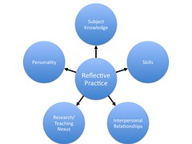

---
categories:
- addie
- c2d2
- chapter-2
- design-theory
- elearning
- foult
- missingps
- thesis
date: 2009-01-29 14:47:27+10:00
next:
  text: Using a blog for course design foult sessions
  url: /blog/2009/01/30/using-a-blog-for-course-design-foult-sessions/
previous:
  text: The design of a 6 hour orientation to course analysis and design
  url: /blog/2009/01/28/the-design-of-a-6-hour-orientation-to-course-analysis-and-design/
tags:
- staffdevelopment-learning-teaching-university-highereducation-academicstaffdevelopment
title: Good teaching is not innate, it can be "learned" - and what's wrong with academic
  staff development
type: post
template: blog-post.html
comments:
    []
    
pingbacks:
    - approved: '1'
      author: Improving university teaching - learning from constructive alignment by
        *NOT* mandating it &laquo; The Weblog of (a) David Jones
      author_email: null
      author_ip: 74.200.244.107
      author_url: https://djon.es/blog/2009/02/26/improving-university-teaching-learning-from-constructive-alignment-by-not-mandating-it/
      content: '[...] This is based on the assumption that what we really want academic
        staff to be doing in order to ensure that they are always improving their learning
        and teaching is &#8220;being reflective&#8221;. That they are engaging in deliberate
        practice. I&#8217;ve talked a bit about this in an earlier post. [...]'
      date: '2009-02-26 00:01:26'
      date_gmt: '2009-02-25 14:01:26'
      id: '2094'
      parent: '0'
      type: pingback
      user_id: '0'
    - approved: '1'
      author: 1000 blog posts &#8211; a time to look back &laquo; The Weblog of (a) David
        Jones
      author_email: null
      author_ip: 66.155.8.213
      author_url: https://djon.es/blog/2013/01/24/1000-blog-posts-a-time-to-look-back/
      content: '[...] was during this time that I first posted about the silliness of
        L&amp;T evaluations, academic staff development, and minimum standards for course
        websites. Somethings which four/five years later has changed [...]'
      date: '2013-01-24 15:06:04'
      date_gmt: '2013-01-24 05:06:04'
      id: '2095'
      parent: '0'
      type: pingback
      user_id: '0'
    
---
The title to this post is included in a quote from [Kane, Sandretto and Heath](http://www.springerlink.com/content/p4h723u36x1850r5/) (2004)

> The research team, comprising two teacher educators and an academic staff developer, embarked upon this research confident in the belief that good teaching is not innate, it can be learned. With this in mind, the project sought to theorise the attributes of excellent tertiary teachers and the relationships among those attributes, with the long-term goal of assisting novice academics in their development as teachers.

This coincides nicely with my [current task](/blog/2009/01/28/the-design-of-a-6-hour-orientation-to-course-analysis-and-design/) and also with an idea I came across on the week-end about deliberate practice and the work of [Anders Ericsson](http://www.psy.fsu.edu/faculty/ericsson.dp.html).

The combination of these "discoveries" is also providing some intellectual structure and support for the [REACT](/blog/research/reflection-evaluation-and-collaboration-in-teaching/) idea about how to improve learning and teaching. However, it's also highlighting some flaws in that idea. Though the flaws aren't anywhere near as large as what passes for the majority of academic staff development around learning and teaching.

The following introduces these ideas and how these ideas might be used to improve academic staff development.

### Excellent tertiary teaching

Kane et al (2004) close the introduction of their paper with

> We propose that purposeful reflection on their teaching plays a key role in assisting our participants to integrate the dimensions of subject knowledge, skill, interpersonal relations, research/teaching nexus and personality into recognised teaching excellence. We conclude with a discussion of the implications of our model for staff development efforts.

Their proposition about the role of reflection in contributing to excellent teaching matches with my long held belief and perception that all of the best university teachers I've seen have been those that engage in on-going reflection about their teaching, keep looking for new knowledge and keep trying (and evaluating) innovations based on that knowledge in the hope to improve upon their teaching.

The authors summarise a long history of research into excellent teaching that focused on identifying the attributes of excellent teachers (e.g. well prepared, stimulate interest, show high expectations etc.) but they then suggest a very important distinction.

> While these, and other studies, contribute to understanding the perceived attributes of excellent teachers, they have had limited influence on improving the practice of less experienced university teachers. Identifying the elements of “good” university teaching has not shed light on **how** university teachers develop these attributes.

The model the develop is shown below. The suggest

> Reflection lies at the hub of our model and we propose that it is the process through which our participants integrate the various dimensions

The authors don't claim this model to have identified any novel sets of attributes. But they do suggest that

> the way in which the participants think about and understand their own practice through purposeful reflection, that has led to their development of excellence

### What's been said about reflection?

The authors have a few paragraphs summarising what's been said about reflection in connection to tertiary teaching, for example

> Day (1999) wrote “it is generally agreed that reflection in, on and about practice is essential to building, maintaining and further developing the capactities of teachers to think and act professionally over the span of their careers”

.

They trace reflection back to Dewey and his definition

> “an active, persistent, and careful consideration of any belief or supposed form of knowledge in light of the grounds supporting it and future considerations to which it tends

The also mention a framework of reflection outlined by Hatton and Smith (1995) and use it to provide evidence of reflection from their sample of excellent teachers.

### Expertise and deliberate practice

Among the many quotes Kane et al (2004) provide supporting the importance of reflection is this one from Stenberg and Horvath (1995)

> in the minds of many, the disposition toward reflection is central to expert teaching

Another good quote (Common 1989, p. 385).

> “Master teachers are not born; they become. They become primarily by developing a habit of mind, a way of looking critically at the work they do; by developing the courage to recognize faults, and by struggling to improve”

Related to this view is the question "Was Mozart, and other child prodigies, brilliant because of some innate talent?". This is a question that [this blog post](http://scienceblogs.com/cortex/2008/07/deliberate_practice.php) takes up. The answer it gives is no. Instead, it's the amount and quality of practice they engage in which makes the difference. Nurture wins the "nature versus nurture" battle.

The blog post builds on the work of [Anders Ericsson](http://www.psy.fsu.edu/faculty/ericsson.dp.html) and the concept of "deliberate practice". The abstract for Ericsson et al (1993) is

> The theoretical framework presented in this article explains expert performance as the end result of individuals' prolonged efforts to improve performance while negotiating motivational and external constraints. In most domains of expertise, individuals begin in their childhood a regimen of effortful activities (deliberate practice) designed to optimize improvement. Individual differences, even among elite performers, are closely related to assessed amounts of deliberate practice. Many characteristics once believed to reflect innate talent are actually the result of intense practice extended for a minimum of 10 years. Analysis of expert performance provides unique evidence on the potential and limits of extreme environmental adaptation and learning.

### Implications for academic staff development

If reflection or deliberate practice are key to developing mastery or expertise, then how do approaches to academic staff development and associated policies, processes and structures around university learning and teaching help encourage and enable this practice?

Seminars and presentations probably help those that are keen to become aware of new ideas that may aid their deliberate practice. However, attendance at such events are minimal. Much of existing practice seems to provide some level of support to those, the minority, already engaging in deliberate practice around learning and teaching.

The majority seem to be able to get away without engaging like this. Perhaps there's something here?

### References

Common, D.L. (1989). ‘Master teachers in higher education: A matter of settings’, The Review of Higher Education 12(4), 375–387.

Hatton, N. and Smith, D. (1995). ‘Reflection in teacher education: Towards definition and implementation’, Teaching & Teacher Education 11(1), 33–49.

Kane, R., S. Sandretto, et al. (2004). "An investigation into excellent tertiary teaching: Emphasising reflective practice." Higher Education 47(3): 283-310.

Sternberg, R. and Horvath, J. (1995). ‘A prototype view of expert teaching’, Educational Researcher 24(6), 9–17.