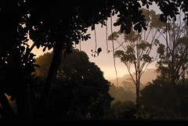
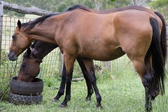
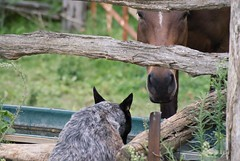

---
categories:
- moneyburner
date: 2009-02-02 07:57:59+10:00
next:
  text: What is a PLE? More than a suite of tools? More than social media?
  url: /blog/2009/02/02/what-is-a-ple-more-than-a-suite-of-tools-more-than-social-media/
previous:
  text: EasyCrop - preparing photos for the rotating banner
  url: /blog/2009/02/01/easycrop-preparing-photos-for-the-rotating-banner/
title: Joining the landed gentry - getting a money burner
type: post
template: blog-post.html
comments:
    []
    
pingbacks:
    - approved: '1'
      author: More detail on the money burner &laquo; The Weblog of (a) David Jones
      author_email: null
      author_ip: 72.233.2.30
      author_url: https://djon.es/blog/2009/02/03/more-detail-on-the-money-burner/
      content: '[...] an earlier post I shared my joy at joining the horse racing set
        as the proud half owner of a broodmare. In an [...]'
      date: '2009-02-03 09:36:29'
      date_gmt: '2009-02-02 23:36:29'
      id: '2100'
      parent: '0'
      type: pingback
      user_id: '0'
    
---

For the last 6 years or so the family and I have had the great pleasure of living on a couple of hundred acres in the "Rockhampton hinterland". Ahh, the serenity. The view from the front veranda can be quite nice. Especially since we can't see nor hear the neighbours.

Friends of ours from Europe have expressed surprise at the size of our place. Apparently, in Europe we'd have to be lords and ladies to afford such an expanse. I'm not sure our life-style quite fits with the stereotypes of the European upper-class. However, we seem to have taken the first step in putting on those types of airs (and going by someone's current predilection for expensive house improvements it won't be the last step).

Our first step toward joining the landed gentry has been to purchase a half-share in a brood-mare. Not content to simply own horses that we ride on our place for a hobby, the decision has been made to go into race horses. If you're going to burn money, one may as well do it in style (and at a much faster rate). So, yesterday morning Malina (unsure of the spelling or of the full appellation, which is certain to be pretentious enough to justify the expense) joined our little crew of animals.

Malina is the one in front. Yes, there are two. Not content to have one it was decided we could also "host" another broodmare - one wouldn't want one's money burner to get lonely - owned by the culprit who connived and convinced my poor, deprived better half to enter into the money burning enterprise. So, Malina is joined by Hermione who probably has an equally long and expensive, quality name. The following photo is Hermione introducing herself to Scruff.

Disclaimer: It's my role in our family to play the curmudgeon, the nay-sayer. Without this occasional brake on ambitions there is no telling what ideas my partner may develop. Having Malina and Hermione around will be just fine and possibly even positive. At least in an "ambience" kind of way.

Disclaimer's disclaimer: I have yet to be told or request financial information about this transaction, which has almost certainly prevented a significant deepening in the level of my negativity around this happy event.