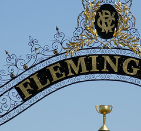
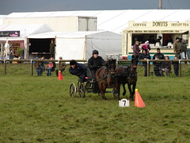

---
categories:
- moneyburner
date: 2009-02-03 09:36:19+10:00
next:
  text: The ritual dissent method shows great promise
  url: /blog2/2009/02/08/the-ritual-dissent-method-shows-great-promise/
previous:
  text: Data mining of online courses - dominant assumptions and innovation potential
  url: /blog2/2009/02/02/data-mining-of-online-courses-dominant-assumptions-and-innovation-potential/
title: More detail on the money burner
type: post
template: blog-post.html
---

In an [earlier post](/blog2/2009/02/02/joining-the-landed-gentry-getting-a-money-burner/) I shared my joy at joining the horse racing set as the proud half owner of a broodmare. In an attempt to draw me further into this fiscal nightmare I've been provided with more information about our "investment" and it's likelihood of success.

Success that has had the emphasis placed on the Melbourne Cup, but is just as likely to end up at venues far less salubrious.

### Existing successful off-spring

It appears that Princess Melina has an existing offspring Monashee Princess that is developing quite a [successful bit of form](http://www.virtualformguide.com/cgi-bin/tvf/mem/memformout.pl?horse=Monashee%20Princess). This apparently is meant to indicate that there is a strong likelihood of future offspring being successful and consequently we will be overwhelmed by Middle Eastern potentates keen to spend huge buckets of cash for the privilege of owning future foals.

### Quality sire

Princess Melina is currently "up the duff". Always a useful state for a money-burning brood mare. And it's not just any old money burner that she's slept around with. Princess Melina is currently carrying the offspring of [Hidden Dragon](http://www.lyndhurststud.com/HiddenDragon.htm). A promising race horse from Hong Kong.

I wonder, based on the naming conventions evident above, does this mean that the offspring will most likely be known as "Dragon Princess"?