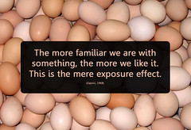

---
categories:
- chapter-2
- design-theory
- elearning
- quotes
- thesis
date: 2009-02-09 09:15:53+10:00
next:
  text: On the silliness of "best practice" - or why you shouldn't (just) copy successful
    organisations
  url: /blog2/2009/02/09/on-the-silliness-of-best-practice-or-why-you-shouldnt-just-copy-successful-organisations/
previous:
  text: VoiceThread as a mechanism for feedback to students
  url: /blog2/2009/02/08/voicethread-as-a-mechanism-for-feedback-to-students/
title: Plato on the problems that writing will create for student learning
type: post
template: blog-post.html
comments:
    []
    
pingbacks:
    - approved: '1'
      author: One reason people don&#8217;t take to new e-learning technology &laquo;
        The Weblog of (a) David Jones
      author_email: null
      author_ip: 74.200.246.66
      author_url: https://djon.es/blog/2009/02/11/one-reason-people-dont-take-to-new-e-learning-technology/
      content: '[...] reason people don&#8217;t take to new e-learning&nbsp;technology  In
        a recent post I started my collection of quotes on this blog. I also talked about
        the &#8220;mere exposure [...]'
      date: '2009-02-11 14:39:29'
      date_gmt: '2009-02-11 04:39:29'
      id: '2113'
      parent: '0'
      type: pingback
      user_id: '0'
    
---
This is the first post in my new "quotes" section. Acting as a storage place for all the interesting insights I come across.

I came across this one as part of the [keynote presentation](http://punya.educ.msu.edu/2008/03/18/site-2008-keynote/) given by [Mat Koehler](http://mkoehler.educ.msu.edu/blog/) and [Punya Mishra](http://punya.educ.msu.edu/) at the SITE'2008 conference.

They quote it as being from Plato's Phaedrus

> \[Writing\] will implant forgetfulness in their souls... _calling things to remembrance no longer from within themselves, but by means of external marks_...\[students will\] seem to know much, while for the most part they know nothing, and as men filled, not with wisdom, but with the conceit of wisdom

This illustrates the fear and the actual loss of something as the world moved from an oral to a written culture. For me it highlights that there will always be fear around the potential implications of a new technology. It also really highlights that people can be limited by their in-built and unquestioned assumptions that have been formed by their environment and can find it difficult to evaluate the positives of the new in some sort of objective way.

An example of the [mere exposure effect](http://en.wikipedia.org/wiki/Mere_exposure_effect)