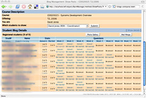

In [a post](/blog2/2009/02/09/the-protean-nature-of-modern-technology-another-limitation-of-most-views-of-e-learning/) yesterday I talked about how most applications of e-learning within universities seems to actively prevent students and staff leveraging the protean nature of information technology. That is the nature of computer software to be flexible, malleable and customisable.

The rise of "web 2.0" and related concepts has made it easier to put in place elearning technology that is designed to be more protean. In this post I talk about the [Blog Aggregation Management (BAM) project](/blog2/research/bam-blog-aggregation-management/) and reflect on some of its ideas and implications for making e-learning technology more protean.

### What is BAM?

It's a research project aimed at extending ideas around how to implement e-learning technology at universities, particularly with an emphasis on what the rise of "web 2.0", software as a service and other related concepts might mean for this practice.

BAM is a set of Perl scripts that aggregates RSS feeds, it matters little from where those RSS feeds originate, registered to individual students and then provides a range of additional services required by university educators. For example, (click on the screenshots to see larger images)

- Link with the institutional teaching responsibilities database so that staff can see which of their students have (or haven't) registered their RSS feed.  
    
- Show how many posts each staff member's students have made.  
    
- If required, award a mark and make comments on a student's posts.  
    

Because of the original context in which BAM was designed (explained in some of the publications and presentations listed in the next section) there are also some scripts to detect plagiarism between student posts.

### Origins of BAM

BAM started life as a more flexible way of implementing student journals in a particular course with the intent of encouraging reflection, increasing interactions between students and staff and hopefully increasing student performance. The initial use of BAM for this purpose is talked about in a number of places including:

- Two presentations given at [CQUniversity](http://www.cqu.edu.au) in 2006 that are available on Google Video. The [first](http://video.google.com/videoplay?docid=965377384627246106#3m50s) talks about the initial design ideas while [the second](http://video.google.com/videoplay?docid=961814934919323661#3m30s) reflects on the experience about half way through the course.
- [A paper](/blog2/publications/blogs-reflective-journals-and-aggregation-an-initial-experiment/) describing the use in the initial course.
- This initial use was also covered in the [ELI Guide To Blogging](http://www.educause.edu/eli/guidetoblogging/13558) as [one](http://www.educause.edu/eli/guidetoblogging/13558) of the three case studies.

### System usage - examples of the protean nature

The initial application of BAM was intended to encourage student reflection and interaction between staff and students. It succeeded to varying levels of success depending on the staff involved. BAM has been used in all 8 offerings of that course from 2006 to 2008.

It has also been used in 8 other course offerings for a variety of different purposes. The most different was in the course [EDED11448, Creative Futuring](http://webfuse.cqu.edu.au/Courses/EDED11448/). EDED11448 was CQUni's first "Web 2.0 course site" where all of the services used by students and staff in the courses were hosted on external services including [del.icio.us](http://del.ico.us), [Wordpress.com](http://wordpress.com/), [Wetpaint](http://www.wetpaint.com/), and [RedBubble](http://redbubble.com/).

For EDED11448, BAM was used, in conjunction with [Yahoo Pipes](http://pipes.yahoo.com/) to create the [Portfolio](http://webfuse.cqu.edu.au/Courses/EDED11448/Portfolio/) and [Weblog](http://webfuse.cqu.edu.au/Courses/EDED11448/Weblog/) pages. This was done by

- Students create [RedBubble](http://redbubble.com/) accounts and using this to create their portfolio and their blog.
- Students register their RedBubble account with BAM.
- BAM aggregates both the portfolio and blog and produces aggregated RSS feeds.
- Pipes is used to turn those RSS feeds into a bit of JSON data that can be used by the Javascript on the course website to present the data.

The same idea has been used to create RSS feeds from BAM that aggregate all a staff members students' posts into one feed. A number of the courses that use BAM can have hundreds of students and tens of staff.

These application of BAM have moved beyond the original design. The protean nature of BAM includes the following:

- There is choice in what application they use to generate the RSS feeds.  
    In some courses that choice is left to the student. In EDED11448 the course designer made a specific choice - RedBubble - for her purpose.
- There is choice in what BAM is used for.  
    The original use was aimed specifically at individual student reflective journals reviewed and marked by staff. EDED11448 aggregated and made public to all students the work of individual students. In some cases the blog posts haven't been marked.

### Implications

I think BAM and the way it operates has the following implications for the practice of e-learning within universities.

- Increase efficacy and agility while liberating institutional resources.  
    This isn't my view. It's the one expressed by the authors of the ELI Guide to Blogging. When talking about [BAM they say](http://www.educause.edu/eli/guidetoblogging/13558)
    
    > One of the most compelling aspects of the project was the simple way it married Web 2.0 applications with institutional systems. This approach has the potential to give institutional teaching and learning systems greater efficacy and agility by making use of the many free or inexpensive—but useful—tools like blogs proliferating on the Internet and to liberate institutional computing staff and resources for other efforts.
    
- There is no need to pre-determine and specify all of the technology that staff and students must use.  
    Most of the students who have used BAM haven't really known what a blog is and very few have already had a blog. This lack of knowledge is not a reason to say we must use the blog provided by our LMS in order to minimise confusion. With BAM we recommend that students, who aren't sure what to do, should make use of [Wordpress.com](http://wordpress.com/) to create a blog. But we enable those with more knowledge to be able to use their own.
- [Small pieces loosely joined](http://www.smallpieces.com/) works.  
    To me this is a fundamental characteristic of Web 2.0, the ability to create something larger out of a bunch of small pieces that are all loosely joined. Where each small piece can be replaced or re-tasked depending on the contextual needs. This is simply not possible with traditional enterprise software such as a course management system.
- There are potential problems but they can be solved, and generally cheaper and easier with this approach.  
    The most common question that is asked about BAM is "What happens if a student's blog provider goes belly up and we can't access the student's work?". This is the "can we depend on external providers" question. The assumption is that organisationally provided systems are more reliable. While that is somewhat questionable, the concern can be mitigated quite easily.
    
    In BAM's case, this is done by mirroring. Every hour BAM
    
    - Visits each student's RSS feed.
    - If there have been any changes it creates/updates a local copy of the RSS feed.</li
    
    If the external blog provider ever disappears, we have a copy. These types of problems can be solved.
    
- Making existing systems more protean is a good thing.  
    A number of benefits arise from systems being more protean. For example, the tools are able to be used for a number of unintended applications and the users are able to use tools that they are familiar with and have a sense of ownership over. For me, this means that making existing systems more protean is a good and worthy thing to do.

### Future work

Future work might include:

- Making BAM more self-serve.  
    Currently setting up BAM requires some additional input from technical folk. Wouldn't be too hard to make this self-serve.
- Extending the RSS generation capabilities in BAM.  
    These are still fairly limited in terms of capabilities. The need some extension in capabilities, especially in increasing the protean nature of such capabilities.
- Improvements to the BAM interface.  
    It was designed by me. Enough said.
- Enabling more complex group-based manipulation, tagging and commenting within BAM.  
    Beyond simple aggregation there is little that can be done. Even marking is not performed with RSS but with databases. One extension might be to create RSS feeds that include comments/marks from markers. Enabling peer marking, commenting and tagging and a range of more complex approaches might also be useful.
- Looking at supporting privacy capabilities in BAM.  
    At the simplest form adding the ability for the student's RSS feed to be password protected might be useful. At the moment the RSS feed fed into BAM must be freely available. Supporting broader privacy settings makes the tool more flexible.
- Making existing systems more protean.  
    Add RSS feeds to the discussion forums and other features of a learning management system to enable staff and students to start mashing up.
- Integrating BAM into an existing LMS.  
    BAM's current use is limited to CQUniversity. BAM, at the moment, is essentially a set of scripts that integrate RSS feeds with several CQUniversity systems (online assignment marking, results processing, staff teaching responsibilities, student enrollment etc). This means it doesn't make sense to sell or release BAM's code (beyond having people look at it). Another institution would have to rewrite all of BAM to fit with its systems and practices.
    
    One solution to this might be to integrate BAM with a system like [Moodle](http://moodle.org/). These systems already should have data about which staff are responsible for which students, which students are in which course etc.
    
- Working closely with a range of different staff to explore and enable different applications of BAM, to extend its protean capabilities and leverage them to improve the learning and teaching experience.  
    This is where the real benefit is. Working with staff with different purposes and problems to collaboratively identify approaches and necessary changes to BAM.