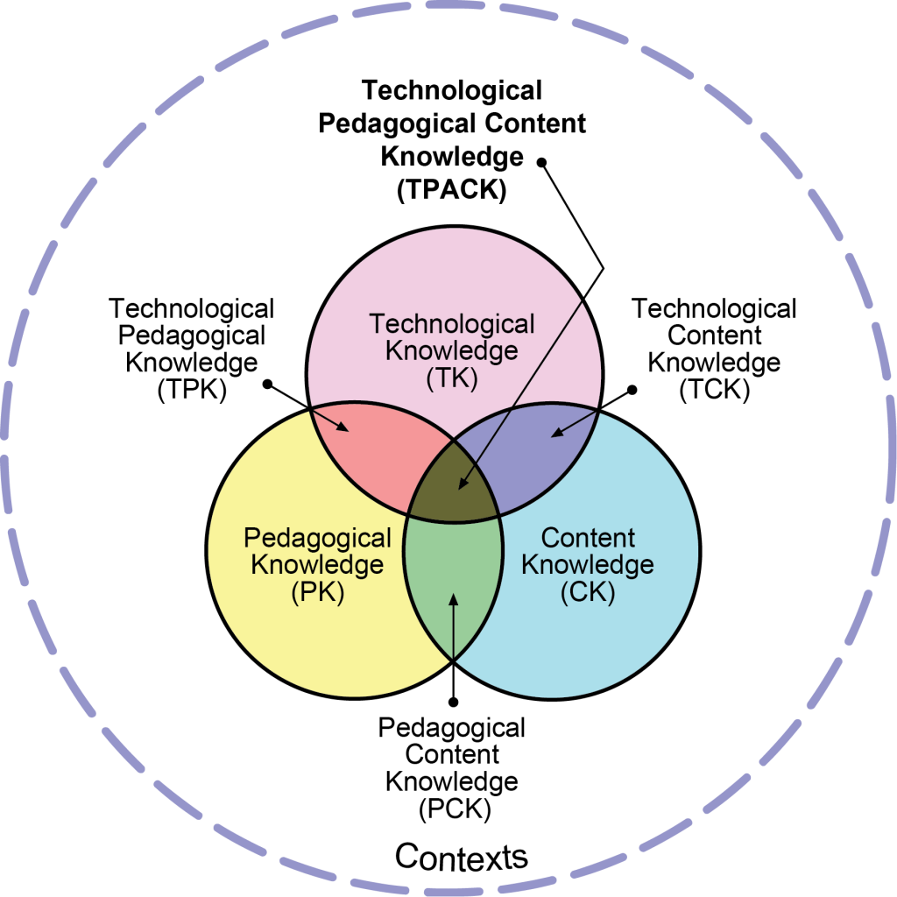
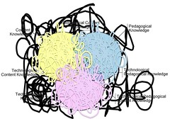
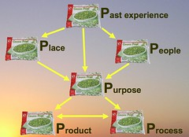
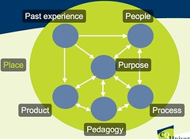
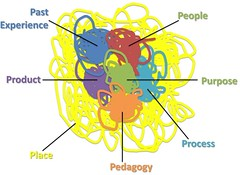

---
categories:
- chapter-2
- missingps
- psframework
coverImage: 3281484480_254917ef79_b.jpg
date: 2009-02-16 00:24:44+10:00
next:
  text: Common sense (the things we take for granted) is the big obstacle for innovation
  url: /blog2/2009/02/16/common-sense-the-things-we-take-for-granted-is-the-big-obstacle-for-innovation/
previous:
  text: New ways of thinking - quote
  url: /blog2/2009/02/15/new-ways-of-thinking-quote/
title: Frameworks and representation - tidy versus messy
type: post
template: blog-post.html
comments:
    []
    
pingbacks:
    - approved: '1'
      author: An information systems design theory for e-learning &laquo; The Weblog of
        (a) David Jones
      author_email: null
      author_ip: 66.135.48.141
      author_url: https://djon.es/blog/2009/02/21/an-information-systems-design-theory-for-e-learning/
      content: '[...] of the content of the presentation is focused on chapter 2 and the
        Ps Framework. In fact, must of it is related around the content of a paper I&#8217;ve
        proposed for later in the [...]'
      date: '2009-02-21 03:58:35'
      date_gmt: '2009-02-20 17:58:35'
      id: '2139'
      parent: '0'
      type: pingback
      user_id: '0'
    - approved: '1'
      author: Task corruption in teaching @ university - negative impact of Place? &laquo;
        The Weblog of (a) David Jones
      author_email: null
      author_ip: 72.233.96.143
      author_url: https://djon.es/blog/2009/03/04/task-corruption-in-teaching-university-negative-impact-of-place/
      content: '[...] thesis, currently reading a collection of literature to flesh out
        Chapter 2 which is drawing on the Ps Framework to illustrate the current state
        of e-learning within Universities. As the last post illustrates, [...]'
      date: '2009-03-04 08:08:39'
      date_gmt: '2009-03-03 22:08:39'
      id: '2140'
      parent: '0'
      type: pingback
      user_id: '0'
    - approved: '1'
      author: Place - the industrial society&#8217;s impact on schools - and universities?
        &laquo; The Weblog of (a) David Jones
      author_email: null
      author_ip: 74.200.245.227
      author_url: https://djon.es/blog/2009/03/05/place-the-industrial-societys-impact-on-schools-and-universities/
      content: '[...] Then there is also the unspoken assumptions that &#8220;the way
        we do things around here&#8221; is the best and only way of &#8220;doing things
        around here&#8221;. This starts to overlap with another component of the Ps -
        &#8220;Past Experience&#8221; (the overlapping nature of these components is one
        reason the framework image is so messy - real life is messy). [...]'
      date: '2009-03-05 10:17:48'
      date_gmt: '2009-03-05 00:17:48'
      id: '2141'
      parent: '0'
      type: pingback
      user_id: '0'
    - approved: '1'
      author: The IRIS model of Technology Adoption - neat and incomplete? &laquo; The
        Weblog of (a) David Jones
      author_email: null
      author_ip: 72.233.96.150
      author_url: https://djon.es/blog/2009/03/06/the-iris-model-of-technology-adoption-neat-and-incomplete/
      content: "[...] I&#8217;ve argued before that frameworks and their graphical representations\
        \ tend to make the inherently messy, too neat. One of the things I don\u2019t\
        \ like about frameworks is that they have (for very good reasons) to be tidy.\
        \ This certainly helps understanding, a key purpose of frameworks, but it also\
        \ can give the false impression of tidiness, of simplicity of a tame problem.\
        \ My interest is currently in e-learning within universities, which I consider\
        \ to be extremely messy. To me it is an example of a wicked problem. [...]"
      date: '2009-03-06 09:19:03'
      date_gmt: '2009-03-05 23:19:03'
      id: '2142'
      parent: '0'
      type: pingback
      user_id: '0'
    
---
I'm a fan of frameworks and taxonomies. Also known as theories for understanding (Gregor, 2006). It's the understanding part that I like. They provide, or at least good ones do, a leg up in understanding difficult concepts. As Mischra and Koehler (2006, p 1019) say

> Having a framework goes beyond merely identifying problems with current approaches; it offers new ways of looking at and perceiving phenomena and offers information on which to base sound, pragmatic decision making.

As it happens, I'm currently doing a lot of work around [one framework and its application](/blog2/2009/02/15/alternatives-for-the-institutional-implementation-of-e-learning-lessons-from-13-years-of-webfuse/) and the following arises out of that work.

Two of my current most used frameworks include Dave Snowden's [cynefin framework](http://en.wikipedia.org/wiki/Cynefin) (Snowden and Boone, 2007) and Mischra and Koehler's [TPACK](http://tpack.org/) (2006). Representation is important to frameworks. The cynefin framework, in particular, has a very specific representation that has very specific meaning and purpose.

The TPACK crew have just released an updated representation of their framework (see the image to the left). I particularly like the addition of 'contexts' around the outside. The use of ven diagrams is important, one of the contributions of TPACK is the overlaps.

### Tidy versus messy

One of the things I don't like about frameworks is that they have (for very good reasons) to be tidy. This certainly helps understanding, a key purpose of frameworks, but it also can give the false impression of tidiness, of simplicity of a tame problem. My interest is currently in e-learning within universities, which I consider to be extremely messy. To me it is an example of a [wicked problem](http://en.wikipedia.org/wiki/Wicked_problem).

Last week I ran a session on [course analysis and design](http://coursedesign.wordpress.com/) for some [CQUniversity](http://www.cqu.edu.au/) academic staff. I used TPACK as one of the major themes. However, at one point I really wanted to emphasise to the participants that none of our discussions should be taken to assume that this is a neat and simple problem. The image to the left is the one I used to reinforce this (they'd already seen the tidy version of TPACK).

In doing this, I sacrificed much of the representational value of TPACK to highlight the messiness involved.

### The Ps Framework - Tidy versus messy

For about 3 years (this [presentation](http://www.slideshare.net/davidj/the-missing-ps-lessons-for-the-adoption-and-implementation-of-learning-management-systems) is the first public evidence) I've been working on what is now known as the Ps Framework as part of my PhD.

The first representation of the Ps Framework, taken from [the first presentation](http://www.slideshare.net/davidj/the-missing-ps-lessons-for-the-adoption-and-implementation-of-learning-management-systems) is included below. A photo of some frozen peas used as a "pun". The arrows are included, but don't really mean anything. Still very early days.

The next public iteration of a graphical representation of the Ps Framework was the following one for a [more recent presentation](http://www.slideshare.net/davidj/the-ps-framework-mapping-the-educational-technology-landscape-for-the-plescquni-project) (you can even [watch the video](http://video.google.com/videoplay?docid=-3435750403101888039#3m05s) of this one). In this "Place" becomes the underlying context for all the other Ps. Much like the addition of context in TPACK. The frozen peas disappear for nice tidy circles (to some extent each one is meant to be a pea) and the arrows are still there. The arrows are meant to indicate that each of the Ps impacts upon the other in some unspecified way.

I had to prepare the above images to deadlines for presentations. I never liked them. Too tidy and they appeared to indicate linear or simple connections between the individual Ps. I don't believe that. The relationships between these Ps when talking about e-learning implementation within universities is messy, complex and unpredictable - at least beforehand.

So I had to come up with something else. For the last few months of last year [Jocene](http://jocene.edublogs.org/), [Nathaniel](http://nfhood.wordpress.com/) and I spent a lot of time discussing and arguing about how to represent the Ps Framework. The following is my current best effort - it's the effort I'll be using this week at [ANU](http://www.anu.edu.au/).

I have a range of problems with this representation including:

- It's still a little too structured.  
    i.e. People only overlaps with Past Experience, Purpose and Process. Those overlaps aren't intentional. They aren't meant to represent some specific connection. I'm not sure what the connections are, I have an inkling that each and everyone is connected/overlaps with the other but I am stuck with this current conceptualisation.
- It's too static.  
    The relationships between these components is forever changing. Universities and the place they inhabit are continually changing, each of the other components are changing and each change has some, unpredictable impact on the other components. In my mind I see this dynamic representation of this image where each component is seething and roiling and impacting upon each other.
- It doesn't capture perspective.  
    Still not certain if this should be another P added to the framework or whether different instantiations of the Ps Framework represent different perspectives. I tend to prefer the latter, but then that leaves unsaid the important point about the perspectives of different groups being very diverse and that this is one of the fundamental problems with e-learning within universities.

Any suggestions?

### References

Gregor, S. (2006). "The nature of theory in information systems." MIS Quarterly 30(3): 611-642.

Mishra, P. and M. Koehler (2006). "[Technological pedagogical content knowledge: A framework for teacher knowledge.](http://punya.educ.msu.edu/publications/journal_articles/mishra-koehler-tcr2006.pdf)" Teachers College Record 108(6): 1017-1054.

Snowden, D.J. Boone, M. "A Leader's Framework for Decision Making". Harvard Business Review, November 2007, pp. 69-76.