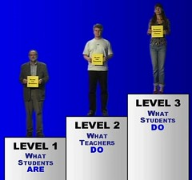
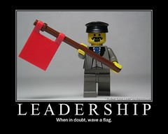

---
categories:
- c2d2
- elearning
- innovation
- teaching
date: 2009-02-26 00:01:05+10:00
next:
  text: Minute papers - encouraging reflection?
  url: /blog2/2009/02/27/minute-papers-encouraging-relection/
previous:
  text: 'Down with the cookie-cutter LMS: the Edupunk ideology and why integrated
    systems might go away'
  url: /blog2/2009/02/25/down-with-the-cookie-cutter-lms-the-edupunk-ideology-and-why-integrated-systems-might-go-away/
title: Improving university teaching - learning from constructive alignment by *NOT*
  mandating it
type: post
template: blog-post.html
comments:
    - approved: '1'
      author: deltapool
      author_email: deltapool@hotmail.com
      author_ip: 152.226.7.211
      author_url: http://deltapool.wordpress.com
      content: I am doing staff development in a Polytechnic in Singapore and I totally
        subscribe to what you are advocating. I run a workshop titled, "The Reflective
        Practitioner" that attempts to drive home the importance of what you wrote about
        - reflective alignment. Enjoyed reading your blog...thanks.
      date: '2011-02-18 11:09:44'
      date_gmt: '2011-02-18 01:09:44'
      id: '2176'
      parent: '0'
      type: comment
      user_id: '0'
    - approved: '1'
      author: davidtjones
      author_email: davidthomjones@gmail.com
      author_ip: 203.51.78.21
      author_url: https://djon.es/blog/
      content: Thanks for taking the time to comment.  Do you have any details of your
        workshop up online that folk could look at? Sounds interesting.
      date: '2011-02-18 11:19:56'
      date_gmt: '2011-02-18 01:19:56'
      id: '2177'
      parent: '2176'
      type: comment
      user_id: '1'
    
pingbacks:
    - approved: '1'
      author: Dimensions delimiting conceptions of online teaching - something to guide
        the indicators and the evaluation of LMS data? &laquo; The Weblog of (a) David
        Jones
      author_email: null
      author_ip: 66.135.48.186
      author_url: https://djon.es/blog/2009/02/28/dimensions-delimiting-conceptions-of-online-teaching-something-to-guide-the-indicators-and-the-evaluation-of-lms-data/
      content: '[...] There is a large amount of research, quite a research tradition,
        around understanding the different conceptions of teaching (and subsequently learning)
        that academics bring to their experience. Much of this work believes that the
        quality of student learning is directly influenced and constrained by the conceptions
        of teaching held by teaching staff. (Following from this is the idea that to improve
        the quality of student learning you have to target teachers&#8217; conceptions
        of teaching, but that is another story.) [...]'
      date: '2009-02-28 22:30:00'
      date_gmt: '2009-02-28 12:30:00'
      id: '2155'
      parent: '0'
      type: pingback
      user_id: '0'
    - approved: '1'
      author: Reflective problematisation - description of reflection in &#8220;reflective
        alignment&#8221;? &laquo; The Weblog of (a) David Jones
      author_email: null
      author_ip: 74.200.245.227
      author_url: https://djon.es/blog/2009/03/02/reflective-problematisation-description-of-reflection-in-reflective-alignment/
      content: '[...] - description of reflection in &#8220;reflective&nbsp;alignment&#8221;?  Thinking
        about reflective alignment, I came across the following quote in Booth and Anderberg
        (2005). Thought it might be useful so am [...]'
      date: '2009-03-02 08:29:32'
      date_gmt: '2009-03-01 22:29:32'
      id: '2156'
      parent: '0'
      type: pingback
      user_id: '0'
    - approved: '1'
      author: Task corruption in teaching @ university - negative impact of Place? &laquo;
        The Weblog of (a) David Jones
      author_email: null
      author_ip: 72.233.96.143
      author_url: https://djon.es/blog/2009/03/04/task-corruption-in-teaching-university-negative-impact-of-place/
      content: '[...] I&#8217;ve thought most learning and teaching at universities is
        increasingly of less than stellar quality and this provides an interesting (and
        at current glance, appropriate) perspective on [...]'
      date: '2009-03-04 08:08:46'
      date_gmt: '2009-03-03 22:08:46'
      id: '2157'
      parent: '0'
      type: pingback
      user_id: '0'
    - approved: '1'
      author: How to improve L&amp;T and e-learning at universities &laquo; The Weblog
        of (a) David Jones
      author_email: null
      author_ip: 74.200.246.66
      author_url: https://djon.es/blog/2009/03/09/how-to-improve-lt-and-e-learning-at-universities/
      content: '[...] A focus on what management do. Where, given the difficulty of getting
        individual academics (let alone a significant number of them), to change and/or
        improve their learning and teaching (often because of the problems with point
        #1), the management/leadership/committee/support hierarchy within universities
        embark on a bit of task corruption and start to focus on what they do, rather
        than on what the teaching staff do. [...]'
      date: '2009-03-09 23:01:33'
      date_gmt: '2009-03-09 13:01:33'
      id: '2158'
      parent: '0'
      type: pingback
      user_id: '0'
    - approved: '1'
      author: '&#8220;Blame the teacher&#8221; and its negative impact on learning and
        e-learning &laquo; The Weblog of (a) David Jones'
      author_email: null
      author_ip: 72.233.96.150
      author_url: https://djon.es/blog/2009/03/18/blame-the-teacher-and-its-negative-impact-on-learning-and-e-learning/
      content: '[...] promulgating the idea of reflective alignment I borrowed and reworked
        Biggs (Biggs and Tang, 2007) ideas of constructive alignment to take it [...]'
      date: '2009-03-18 09:38:43'
      date_gmt: '2009-03-17 23:38:43'
      id: '2159'
      parent: '0'
      type: pingback
      user_id: '0'
    - approved: '1'
      author: Technology will *not* change the way we teach - an example why we&#8217;re
        an amnesiac field &laquo; The Weblog of (a) David Jones
      author_email: null
      author_ip: 66.135.48.209
      author_url: https://djon.es/blog/2009/03/19/technology-will-not-change-the-way-we-teach-an-example-why-were-an-amnesiac-field/
      content: '[...] all an example of &#8220;level 2&#8243; knowledge about how to improve
        learning and teaching (see this post introducing reflective alignment) [...]'
      date: '2009-03-19 16:26:53'
      date_gmt: '2009-03-19 06:26:53'
      id: '2160'
      parent: '0'
      type: pingback
      user_id: '0'
    - approved: '1'
      author: Poor craftsman - or the &#8220;blame the teachers&#8221; excuse &laquo;
        The Weblog of (a) David Jones
      author_email: null
      author_ip: 72.233.96.143
      author_url: https://djon.es/blog/2009/03/23/poor-craftsman-or-the-blame-the-teachers-excuse/
      content: '[...] what I&#8217;ve called the &#8220;blame the teacher&#8221; approach
        to university management. (This earlier post explains the origins of the &#8220;blame
        the teacher&#8221; idea and how it is borrowed from [...]'
      date: '2009-03-23 17:07:47'
      date_gmt: '2009-03-23 07:07:47'
      id: '2161'
      parent: '0'
      type: pingback
      user_id: '0'
    - approved: '1'
      author: Improving university teaching, learning theory, and curriculum design &laquo;
        Damo&#8217;s World
      author_email: null
      author_ip: 74.200.245.187
      author_url: http://damosworld.wordpress.com/2009/03/27/improving-university-teaching-learning-theory-and-curriculum-design/
      content: "[...] university teaching, learning theory, and curriculum&nbsp;design\
        \ By damoclarky  I read this article by David Jones some time ago, and have been\
        \ thinking it over.\_ As an early career curriculum [...]"
      date: '2009-03-27 22:29:36'
      date_gmt: '2009-03-27 12:29:36'
      id: '2162'
      parent: '0'
      type: pingback
      user_id: '0'
    - approved: '1'
      author: Prescription, adaptation and failure around improving univeristy teaching
        &laquo; The Weblog of (a) David Jones
      author_email: null
      author_ip: 74.200.245.187
      author_url: https://djon.es/blog/2009/03/30/prescription-adaptation-and-failure-around-improving-univeristy-teaching/
      content: '[...] practiced around improving teaching at universities. This is one
        example of what I label within the reflective alignment idea as &#8220;level 2&#8243;
        knowledge, which is defined [...]'
      date: '2009-03-30 12:27:11'
      date_gmt: '2009-03-30 02:27:11'
      id: '2163'
      parent: '0'
      type: pingback
      user_id: '0'
    - approved: '1'
      author: 'The new educational technologists: A call for evidenced change &laquo;
        The Weblog of (a) David Jones'
      author_email: null
      author_ip: 72.233.96.139
      author_url: https://djon.es/blog/2009/04/06/the-new-educational-technologists-a-call-for-evidenced-change/
      content: '[...] opinion I&#8217;ve had for quite some time. i.e. that most learning
        and teaching at universities is somewhat less than effective and that most attempts
        to improve that teaching are just as, if not more, [...]'
      date: '2009-04-06 10:51:53'
      date_gmt: '2009-04-06 00:51:53'
      id: '2164'
      parent: '0'
      type: pingback
      user_id: '0'
    - approved: '1'
      author: Models of growth - responding to the grammar of school &laquo; The Weblog
        of (a) David Jones
      author_email: null
      author_ip: 66.135.48.210
      author_url: https://djon.es/blog/2009/04/24/models-of-growth-responding-to-the-grammar-of-school/
      content: '[...] This perspective connects nicely to the ideas of reflective alignment
        [...]'
      date: '2009-04-24 14:36:28'
      date_gmt: '2009-04-24 04:36:28'
      id: '2165'
      parent: '0'
      type: pingback
      user_id: '0'
    - approved: '1'
      author: When senior management lose the plot &laquo; The Weblog of (a) David Jones
      author_email: null
      author_ip: 74.200.245.227
      author_url: https://djon.es/blog/2009/07/17/when-senior-management-lose-the-plot/
      content: '[...] feel that this perception arises because the new managerial approach
        focuses too much on level 2 of reflective alignment. It focuses too much on &#8220;what
        management does&#8221;. They pass policies, minimum standards [...]'
      date: '2009-07-17 11:22:24'
      date_gmt: '2009-07-17 01:22:24'
      id: '2166'
      parent: '0'
      type: pingback
      user_id: '0'
    - approved: '1'
      author: Losing weight, improving learning and teaching and complex systems &laquo;
        The Weblog of (a) David Jones
      author_email: null
      author_ip: 74.200.245.188
      author_url: https://djon.es/blog/2009/08/06/loosing-weight-improving-learning-and-teaching-and-complex-systems/
      content: '[...] compliance and task corruption, models of growth &#8211; responding
        to the grammar of school, improving university teaching and learning: learning
        from constructive alignment by not mandating it) knows that I think there are
        fundamental mistakes being made at most universities when it comes to [...]'
      date: '2009-08-18 09:12:04'
      date_gmt: '2009-08-17 23:12:04'
      id: '2167'
      parent: '0'
      type: pingback
      user_id: '0'
    - approved: '1'
      author: Nudging as paternalism &laquo; The Weblog of (a) David Jones
      author_email: null
      author_ip: 72.233.96.141
      author_url: https://djon.es/blog/2009/08/18/nudging-as-paternalism/
      content: '[...] teaching within universities and how they are implemented are very
        paternalistic. I phrase it as level 2 approaches to learning and teaching. It
        is my belief that these approaches get in the way and actively reduce [...]'
      date: '2009-08-18 15:49:01'
      date_gmt: '2009-08-18 05:49:01'
      id: '2168'
      parent: '0'
      type: pingback
      user_id: '0'
    - approved: '1'
      author: Change the environment, not the culture &laquo; The Weblog of (a) David
        Jones
      author_email: null
      author_ip: 72.233.96.141
      author_url: https://djon.es/blog/2009/12/09/change-the-environment-not-the-culture/
      content: '[...] argued before that there are 3 observable levels of improving learning
        and teaching (re-purposing Biggs work on [...]'
      date: '2009-12-09 08:59:28'
      date_gmt: '2009-12-08 22:59:28'
      id: '2169'
      parent: '0'
      type: pingback
      user_id: '0'
    - approved: '1'
      author: Questions about alternatives to curriculum mapping &laquo; The Weblog of
        (a) David Jones
      author_email: null
      author_ip: 76.74.248.141
      author_url: https://djon.es/blog/2010/01/19/questions-about-alternatives-to-curriculum-mapping/
      content: '[...] is especially true given my belief that most universities are currently
        at the level 2 of 3 levels of improving teaching. In particular, I would suggest
        that curriculum mapping, like most large-scale suggestions for [...]'
      date: '2010-01-19 13:19:52'
      date_gmt: '2010-01-19 03:19:52'
      id: '2170'
      parent: '0'
      type: pingback
      user_id: '0'
    - approved: '1'
      author: Loosing weight, nudging and changing the L&amp;T environment &#8211; early
        foundations of my work &laquo; The Weblog of (a) David Jones
      author_email: null
      author_ip: 72.233.96.181
      author_url: https://djon.es/blog/2010/02/03/loosing-weight-nudging-and-changing-the-lt-environment-early-foundations-of-my-work/
      content: '[...] learning and teaching suffer the same fundamental flaw. They attempt
        to herd cats, they focus on what management does, rather than focus on what the
        teachers and learners do every day and in particular the tremendous [...]'
      date: '2010-02-03 11:46:22'
      date_gmt: '2010-02-03 01:46:22'
      id: '2171'
      parent: '0'
      type: pingback
      user_id: '0'
    - approved: '1'
      author: Identifying and designing interventions to improve L&amp;T &#8211; a behaviour
        change framework? &laquo; The Weblog of (a) David Jones
      author_email: null
      author_ip: 72.233.2.32
      author_url: https://djon.es/blog/2010/04/14/identifying-and-designing-interventions-to-improve-lt-a-behaviour-change-framework/
      content: '[...] The aim is to understand what they are experiencing and develop
        ideas about how that experience can be improved, as perceived by the staff and
        students and not as perceived by management, the government or some research ideal.
        The focus is on what the teacher does, not what management does. [...]'
      date: '2010-04-14 13:02:43'
      date_gmt: '2010-04-14 03:02:43'
      id: '2172'
      parent: '0'
      type: pingback
      user_id: '0'
    - approved: '1'
      author: Qualms about the alignment project &laquo; The Weblog of (a) David Jones
      author_email: null
      author_ip: 76.74.254.72
      author_url: https://djon.es/blog/2010/05/14/qualms-about-the-alignment-project/
      content: '[...] gives a summary of the stages involved in achieving Bigg&#8217;s
        goal. I&#8217;ve actually written about the idea previously back in February last
        year I wrote However, the detail of his suggested solution is, I think, [...]'
      date: '2010-05-14 14:14:22'
      date_gmt: '2010-05-14 04:14:22'
      id: '2173'
      parent: '0'
      type: pingback
      user_id: '0'
    - approved: '1'
      author: The need for a third way &laquo; The Weblog of (a) David Jones
      author_email: null
      author_ip: 72.233.96.156
      author_url: https://djon.es/blog/2010/05/31/the-need-for-a-third-way/
      content: '[...] last year I borrowed and slightly modified Bigg&#8217;s 3 levels
        of teaching to identify 3 levels of improving learning and teaching. Obviously
        there is a numerical connection between these 3 levels and the &#8220;3 ways&#8221;
        [...]'
      date: '2010-05-31 11:28:33'
      date_gmt: '2010-05-31 01:28:33'
      id: '2174'
      parent: '0'
      type: pingback
      user_id: '0'
    - approved: '1'
      author: A vision for enhancement of learning and teaching at CQUniversity &laquo;
        The Weblog of (a) David Jones
      author_email: null
      author_ip: 72.233.104.70
      author_url: https://djon.es/blog/2010/07/24/a-vision-for-enhancement-of-learning-and-teaching-at-cquniversity/
      content: '[...] particular, the &#8220;vision&#8221; expressed will be the idea
        of reflective alignment, which is what is argued for in the herding cats/losing
        weight presentation. The vision is that the [...]'
      date: '2010-07-24 09:03:12'
      date_gmt: '2010-07-23 23:03:12'
      id: '2175'
      parent: '0'
      type: pingback
      user_id: '0'
    - approved: '1'
      author: Three likely paths for learning analytics and academic in Oz higher education
        &laquo; The Weblog of (a) David Jones
      author_email: null
      author_ip: 69.170.134.162
      author_url: https://djon.es/blog/2012/10/11/three-likely-paths-for-learning-analytics-and-academic-in-oz-higher-education/
      content: '[...] of you who know me, can probably see some correspondence between
        these three paths and the 3 levels of improving teaching. There is a definite
        preference in the following for the 3rd path, this is not to suggest that it [...]'
      date: '2012-10-11 15:32:51'
      date_gmt: '2012-10-11 05:32:51'
      id: '2178'
      parent: '0'
      type: pingback
      user_id: '0'
    - approved: '1'
      author: 1000 blog posts &#8211; a time to look back &laquo; The Weblog of (a) David
        Jones
      author_email: null
      author_ip: 66.155.8.213
      author_url: https://djon.es/blog/2013/01/24/1000-blog-posts-a-time-to-look-back/
      content: '[...] back to the idea of cooked feeds for BIM. Other vague ideas and
        interests from that time include: reflective alignment, task corruption, the myth
        of rationality, the fad cycle and management fashions, the grammar of [...]'
      date: '2013-01-24 15:06:16'
      date_gmt: '2013-01-24 05:06:16'
      id: '2179'
      parent: '0'
      type: pingback
      user_id: '0'
    - approved: '1'
      author: Content &amp; Assignments | Wrote Learning
      author_email: null
      author_ip: 66.155.38.27
      author_url: http://wrote-learning.net/2014/06/02/content-assignments/
      content: '[&#8230;] This is a really important area, too easily overlooked. A lack
        of consistency in layout/structure is one of the most common complaints we get
        in student feedback about the online component of blended courses. There is a
        fine-line to be walked between a common structure and effectively dictating the
        structure of a course. When I started at University I was firmly in the camp of
        let staff structure their course as they see fit (railing against any institutional
        template &#8211; think PowerPoint). As time has gone by and I have discussed these
        issues with students (see a recent Student-Led project I was involved in with)
        I have changed position and am now in the minimum thresholds camp that seems to
        be gathering momentum in UK HEI (e.g. this fine example from Newcastle University)
        &#8211; though not everyone agrees (see David Jones&#8217; blog). [&#8230;]'
      date: '2014-06-03 07:55:55'
      date_gmt: '2014-06-02 21:55:55'
      id: '2180'
      parent: '0'
      type: pingback
      user_id: '0'
    
---
### The problem

Most university teaching is crap. Too general, too sweeping? Maybe, but based on my experience I'm fairly comfortable with that statement. The vast majority of what passes for teaching at Universities has a number of really significant flaws. It's based more on what the teaching academic is familiar with (generally based on the discipline experience) than on any idea of what might be effective.

So, how do you improve it? This is not a simple question to answer. However, I also believe that most of the current and proposed answers being used by universities to answer this question are are destined to fail. That is, they will be able to show some good practice amongst a small percentage of academic staff, but have the vast majority of learning and teaching to be less than good.

I should point out that almost all of my attempts to describe why I think this is the case and to outline a more appropriate solution have been, essentially, failures.

The following is an attempt to draw on Biggs' (2001) three levels of teaching to formulate three levels of improving teaching that can be used to understand approaches to improving learning and teaching. I'll briefly outline an important part of what I think is a better solution. I'll also reject the approach Bigg's (2001) outlines as being too teleological, too complex, simply not likely to be effectively implemented and consequently, fail.

By the end of writing this post, I've come up with a name "reflective alignment" for my suggested solution.

### Biggs' three levels of teaching

The image to the right is taken from a [short film](http://www.daimi.au.dk/~brabrand/short-film/) that explains constructive alignment, an approach developed by [John Biggs](http://www.johnbiggs.com.au/). (I recommend the film if you want another perspective on this.)

These levels of knowledge about teaching lays the blame for poor student outcomes in the hands of the teachers and what they perceive teaching to be about. The three levels are as a focus on:

1. What the student is.  
    This is the horrible "blame the student" approach to teaching. I'll keep doing what I do. If the students can't learn then it is because they are bad students. It's not my fault. Nothing I can do.
2. What the teacher does.  
    This is the horrible "look at me and all the neato, innovative teaching that I'm doing". I'm doing lots of good and difficult things in my teaching. Are the students learning?
3. What the student does.  
    Obviously this is the good level. The focus is on teaching and leads to learning. Biggs (2001) uses a quote from Tyler (1949) to illustrate that this is not a new idea
    
    > \[learning\] takes place through the active behavior of the student: it is what he does that he learns, not what the teacher does
    

Flowing from these levels is the idea of [constructive alignment](http://www.engsc.ac.uk/er/theory/constructive_alignment.asp) that encompasses the type of teaching likely to suggest a level 3 teacher. Constructive alignment is based on the simple steps of:

- Clearly specifying detailed learning objectives for students.
- Arrange teaching and learning activities that encourage/require students to carry out tasks that provide the student with exposure, practice and feedback on the learning objectives.
- Design a grading/marking system that requires the student to demonstrate how well they achieve the stated learning objectives.

Performing these 3 simple steps well results in the situation that Biggs (2001) describes

> In aligned teaching, where all components support each other, students are “trapped” into engaging in the appropriate learning activities, or as Cowan (1998) puts it, teaching is “the purposeful creation of situations from which motivated learners should not be able to escape without learning or developing” (p. 112). A lack of alignment somewhere in the system allows students to escape with inadequate learning.

Sounds simple, doesn't it? So why don't more people use it?

### "Staff development" is crap!

That's my characterisation of the position Biggs (2001) espouses (SDC = Staff Development Centre). This includes the following comments

> ...getting teachers to teach better, which is what staff development is all about.....staff development...is being minimized in many universities, not only in the UK but also in Australia and New Zealand.....Typically, staff development is undertaken in workshops run by the staff development centre...This is the fundamental problem facing SDCs: the focus is on individual teachers, not on teaching

I particularly liked the following comment from Biggs (2001) and find a lot of resonances with local contextual happenings.

> Too often SDCs are seen from a Level 2 theory as places providing tips for teachers, or as remedial clinics for poor or beginning teachers. Most recently, they are being replaced by training in educational technology, in the confused belief that if teachers are using IT then they must be teaching properly for the new millennium.

### Biggs' solution

Biggs' (2001) own summary is hard to argue with

> In sum, QE cannot be left to the sense of responsibility or to the priorities of individual teachers. The institution must provide the incentives and support structures for teachers to enhance their teaching, and most importantly, to involve individuals through their normal departmental teaching in QE processes.

However, the detail of his suggested solution is, I think, hideously unworkable to such an extent as likely to have a negative impact on the quality of teaching if any institution of a decent size tried to implement it. As Biggs (2001) says, but about a slightly different aspect, "the practical problems are enormous".

I've been involved with the underbelly of teaching and learning at universities to have a significant amount of doubt about whether the reality of learning and teaching matches this representation to the external world. I've seen institutions struggle with far simpler tasks than the above and individual academics and managers "game the system" to be seen to comply while not really fulfilling (or even understanding) the requirements.

### 3 levels of improving teaching

I'd like to propose that there are 3 levels of improving teaching that have some connection with Biggs' 3 levels of teaching. My 3 levels are:

1. What the teacher is.  
    This is where management put teachers into good and bad categories. Any problems with the quality of teaching is the fault of the academic staff. Not the system in which they work.
2. What the management does.  
    This is the horrible simplistic approach taken by most managers and typically takes the forms of fads. i.e. where they think X (where X might be generic skills, quality assurance, problem-based learning or even, if they are really silly, a new bit of technology) will make all the different and proceed to take on the heroic task of making sure everyone is doing X. The task is heroic because it usually involves a large project and radical change. It requires the leadership to be "leaders". To wield power, to re-organise i.e. complex change that is destined to fail.
3. What the teacher does.  
    The focus is on what the teacher does to design and deliver their course. The aim is to ensure that the learning and teaching system, its processes, rewards and constraints are aiming to ensure that the teacher is engaging in those activities which ensure quality learning and teaching. In a way that makes sense for the teacher, their course and their students.

### Reflective alignment - my suggested solution

Biggs' constructive alignment draws on active student construction of learning as the best way to learn. Hence the "constructive" bit in the name. I'm thinking that "reflective alignment" would be a good name for what I'm thinking.

This is based on the assumption that what we really want academic staff to be doing in order to ensure that they are always improving their learning and teaching is "being reflective". That they are engaging in deliberate practice. I've talked a bit about this in an [earlier post](/blog2/2009/01/29/good-teaching-is-not-innate-it-can-be-learned-and-whats-wrong-with-academic-staff-development/).

I'm just reading a paper (Kreber and Castleden, 2009) that includes some support for my idea

> We propose that teaching expertise requires a disposition to engage in reflection on core beliefs.....The value attributed to the notion of ‘reflective practice’ in teaching stems from the widely acknowledged view that reflection on teaching experience contributes to the development of more sophisticated conceptual structures (Leinhardt and Greeno 1986), which in turn lead to enhanced teaching practice and eventually, it is hoped, to improved student learning.

So, simply and without detail, I believe it is important that if a university wants to significantly improve the quality of the majority, if not all, of its learning and teaching then it is to create a context within which academic staff can't but help to engage in reflective practice as part of their learning and teaching.

That's the minimum, and not all that easy. The next step would be to create an environment in which academic staff can receive support and assistance in carrying out the ideas which their reflection identifies. But this is secondary. In the absence of this, but the presence of effective reflection, they will work out solutions without the support.

(There is some potential overlap with Biggs' (2001) solution, but I don't think his focuses primarily on encouraging reflection. It has more in common with Level 2 approaches to improving learning and teaching, especially in how it would be implemented in most universities. Yes, the implementation problem still remains for my solution and could also most likely be implemented as a Level 2 approach. But any solution should be contextually sensitive.)

### References

Biggs, J. (2001). "The Reflective Institution: Assuring and Enhancing the Quality of Teaching and Learning." Higher Education 41(3): 221-238.

Kreber, C. and H. Castleden (2009). "Reflection on teaching and epistemological structure: reflective and critically reflective processes in 'pure/soft' and 'pure/hard' fields." Higher Education 57(4): 509-531.