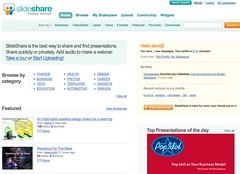

The editorial team over at [Slideshare](http://slideshare.net/) have decided my [recent PhD presentation](/blog2/2009/02/21/an-information-systems-design-theory-for-e-learning/) is worth of featuring on the Slideshare home page. The following screen shot of the Slideshare home page is included as proof and also as a record. 105 views before being featured. How high can you go?

This is another example of the "you scratch my back, I'll scratch your back" approach to networking, links and social software. In the email I got from Slideshare with the good news was this

> p.s. Why not blog/twitter this and let the world know about your awesome creation?

So here I am, blogging about it. So, maybe I'll raise views on the presentation. Maybe I'll make more people aware of Slideshare as a service. Plus, by featuring my presentation on the home page, my presentation gets more hits.

Of course the $64K is, "what value is all of this"?. Well, apart from the small amount of pleasure I get from "running up some good numbers" (apparently there is a bit of brain science or psychology that explains this good feeling - must look that up at some stage), the main benefit is the unknown.

There may not be any positive value in it, at least not to me, at least not this time. However, there could also be something really valuable and something that would never have happened otherwise.

Just this week, a [post of mine on patterns for e-learning](/blog2/2009/02/22/patterns-for-e-learning-a-lost-opportunity-or-destined-to-fail/) has started a conversation with the head of an Art and Design Research centre in the UK about design and some of the very interesting work that he and his students/colleagues are doing. Without the blog post, I would never have made that connection.

Punya Mishra [posted something](http://punya.educ.msu.edu/2009/02/21/gandhi-ambigrams-creativity-the-power-of-small-pieces-loosely-joined/) this week on this same topic. His post makes the point much more poetically than mine and he uses a good term for it "serendipitous connectabilty".

In the time it has taken me to write this post, the number of views on the presentation has gone to 122 views - 17 views while writing.

### Update

A couple of days after being feature, and by now having moved from the Slideshare home page, the presentation statistics are now: 1265 views, 118 downloads, 5 favourites (including the [co-founder](http://www.webyantra.net/about/) of slideshare), 5 comments and being added to 1 group.