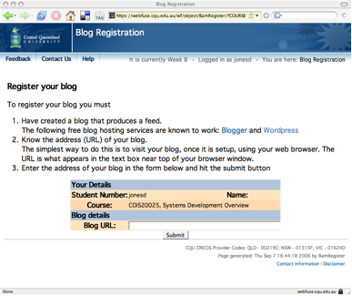

---
categories:
- bam
- chapter-2
- design-theory
- elearning
- ple
- plescquni
- psframework
- thesis
- webfuse
date: 2009-03-02 15:39:47+10:00
next:
  text: Further evidence of problems with evaluation of teaching
  url: /blog2/2009/03/02/further-evidence-of-problems-with-evaluation-of-teaching/
previous:
  text: Reflective problematisation - description of reflection in &quot;reflective
    alignment&quot;?
  url: /blog2/2009/03/02/reflective-problematisation-description-of-reflection-in-reflective-alignment/
title: Some potential updates to BAM - a step towards breaking the LMS/CMS orthodoxy
type: post
template: blog-post.html
comments:
    []
    
pingbacks:
    - approved: '1'
      author: Getting feeds out of BAM - the first steps &laquo; The Weblog of (a) David
        Jones
      author_email: null
      author_ip: 74.200.245.227
      author_url: https://djon.es/blog/2009/03/10/getting-feeds-out-of-bam-the-first-steps/
      content: '[...] I&#8217;ve been thinking about changes to enable teaching staff
        to use RSS readers as their primary interface. This post details [...]'
      date: '2009-03-10 15:37:38'
      date_gmt: '2009-03-10 05:37:38'
      id: '2196'
      parent: '0'
      type: pingback
      user_id: '0'
    - approved: '1'
      author: 1000 blog posts &#8211; a time to look back &laquo; The Weblog of (a) David
        Jones
      author_email: null
      author_ip: 66.155.8.213
      author_url: https://djon.es/blog/2013/01/24/1000-blog-posts-a-time-to-look-back/
      content: '[...] get finished. I also worked and thought more about BAM and BIM.
        Must get back to the idea of cooked feeds for BIM. Other vague ideas and interests
        from that time include: reflective alignment, task [...]'
      date: '2013-01-24 15:06:13'
      date_gmt: '2013-01-24 05:06:13'
      id: '2197'
      parent: '0'
      type: pingback
      user_id: '0'
    
---
The [initial design and use](/blog2/publications/blogs-reflective-journals-and-aggregation-an-initial-experiment/) of the [Blog Aggregation Management (BAM) system](/blog2/research/bam-blog-aggregation-management/) was, in part, designed to try out approaches that leverage the [protean nature](/blog2/2009/02/11/bam-making-e-learning-technology-more-protean/) of information technology. A major part of this is a move to something different, and hopefully better, than the current, broken e-learning orthodoxy within universities that is stuck on the idea of course management systems (CMS - aka learning management systems) as the only possible solution.

The vast majority of what BAM does was designed and implemented over a couple of months almost 3 years ago. Since then we've learned a bit about using BAM and also have some time to extend BAM in appropriate ways. This post seeks to explain the next major expansion of BAM, which will see it move further away from CMS orthodoxy. In particular, the plan to expand BAM's generation of RSS/OPML feeds so academic staff can avoid badly designed web-based management interfaces and use an RSS reader of their choice as the major interface to BAM.

### Current limitations of BAM

One of the assumptions underpinning BAM was to significantly question the ability for a university to provide a blogging service that could compete with existing free blog services in terms of reliability, quality of features and quality of support services and resources. This is an extension of one of the principles behind the [design of the Webfuse e-learning system](/blog2/publications/the-design-of-an-integrated-online-learning-environment/) (Jones and Buchanan, 1996) within which BAM is currently implemented. This principle is talked about under the heading "Flexibility and don't reinvent the wheel"

> The design of the M&C OLE (online learning environment) will attempt to maximise adaptability by concentrating on providing the infrastructure required to integrate existing and yet to be developed online learning tools. The M&C OLE will provide the management infrastructure and consistent interface to combine existing tools such as WWW servers, online quizzes, assignment submission etc. into a single integrated whole. While a number of the component systems will be developed at CQU, **the emphasis is on integrating existing tools into the OLE**.

At the moment, BAM provides a management interface for academic staff around existing blogging engines. Actually it is designed so that students can maintain a reflective journal in anything that will produce an RSS feed. The only direct interaction with BAM by students is at the start of term when they register their blog using the interface shown in the next image.

Academic staff currently use a web-based interface provided by BAM to track student blog registration and posts, view student posts and mark student posts. See the screenshots in this [paper](/blog2/publications/blogs-reflective-journals-and-aggregation-an-initial-experiment/) for what they look like. That is, BAM is still stuck in the CMS orthodoxy.

### Moving to RSS readers and OPML feeds

Late last year there was a simple extension of BAM to allow academic staff to obtain an OPML feed pointing to all their students' blogs. This could be imported into an RSS reader of their choice, in order that they could keep a track of posts by their students. There were a number of limitations of this approach:

- It wasn't automated.  
    Someone had to run a script, generate the OPML feed, send it to the staff member who could then import it. They should be able to do it themselves.
- It only provided access to the student posts, none of the other BAM services.  
    The OPML was using the RSS feeds straight from individual student blogs. It did not go through BAM and consequently could not provide any additional BAM/institutional related information. For example, which students hadn't yet registered their blog, no direct access to the BAM marking interface, etc.

### Implementing BAM "cooked" feeds

The premises on which this extension of BAM is based are:

- Increasingly people will have an application they use to access, manipulate and store RSS, OPML and other feeds.  
    e.g. I believe the Outlook, the spawn of the devil, even supports feed reading now.
- Using this application(s) to track information of interest will become part of their daily life.  
    The "come to me" web will become increasingly important. It's certainly part of my everyday life at the moment and it is an improvement over the "I go get web". These two assumptions were the basis for the work [in this presentation](http://www.slideshare.net/davidj/using-the-come-to-me-web-to-save-time-and-keep-up-presentation) aimed at adding RSS feed generation to discussion forums in Blackboard course sites.
- BAM's interface does provide some additional information about the student, the course etc. that isn't provided in the "raw" RSS feeds from each students' blog.

The fundamental idea is that BAM will generate "cooked" RSS feeds and that academic staff will be able to access the feeds for their students via their choice of RSS reader. The outstanding questions are:

1. What ingredients need to go into the cooking?
2. What's the best (and easiest) technical approach to implementing "cooked" feeds?
3. Why are academics going to use this?  
    This is the big one, if they don't want to use it, then there's no point doing it. The aim will be that this will be easier and more effective than using the BAM interface.

### What the cooked feeds need to do

At the very least cooked feeds will need to support all of the existing functionality provided by BAM and where possible provide additional functionality.

Existing functionality

- Which students have registered their blogs and which haven't.
- A method to view photos and details about the students who fall into either group (registered or not).
- Provide a link to a "mail merge" facility for those students who fall into either group.
- View statistics about student blogs - e.g. how many posts in total, when was the last time they posted an entry and a link to the student blog.

- A marking interface for each post.
- A question allocation interface for each post.  
    BAM was originally designed to implement individual student reflective journals where students are expected at fixed times during a term to answer specific questions. BAM automatically examines each student post and attempts to determine if it is a response to one of these fixed questions.
- Information about whether the post has been marked or allocated.
- Whether or not a student has answered all of the necessary questions.
- Ability for the course coordinator (academic in charge of a course) to view and track student posts for other teaching staff and also the staff's marking progress.

Potential new features

- Indication of what new posts there have been since the academic last visited.  
    This is essentially what would be provided by an RSS reader.
- Addition of institutional/student based information to individual blog posts.  
    Currently a post to a student blog does not include any information about who the student is, their institutional student number, whether or not the post is a match for one of the required questions they must answer, a link to the marking and question allocation interfaces for BAM posts
- On the fly copy detection of student posts.  
    Currently there is a half-baked script that will compare all student posts against each other to check of copying. There's questionable educational value for this, but something that is perceived to be useful by staff.
- A daily summary of activity by related staff and students.  
    Each staff member could see a single post that summarises activity by their students. For example, who posted, which questions they answered, who still hasn't registered, who did register, what copy detection incidents were identified etc. In addition, staff who are supervising other staff could recieve a daily post on the progress of staff. For example, how many of each staff member's students haven't registered, haven't posted, haven't been marked etc.
    
    This idea could serve the basis for a broader service associated with courses and perhaps attached to some [current work around indicators](http://beerc.wordpress.com/2008/12/21/more-on-the-indicators/)
    

### Technical implementation

Initial quick ideas might include

- The provision of two top level feeds for each staff member.
    1. Activity summary - this is the daily summary of activity by related staff and students. Staff and students might be updated as separate feed items. Non-supervisory staff simply wouldn't see an item of that type. Alternatively, the would see such a feed. It would simply summarise what they did over the last day or so. Staff who are supervising other staff, would also see posts summarising the activity of the staff they are supervising.
    2. Student posts - similar to the existing feed, this would consist of numerous feeds (one per student) summarising what they have posted to their blog.
- Perhaps a "staff activity" feed.  
    Supervisory academic staff might also have a third collection of feeds. The "Staff student activity" feed would include one collection of feeds for each staff member being supervised. This collection of feeds per staff member would be exactly the same as "Student Posts" feed that the supervised staff member would see. This would allow supervisory staff to see the detail, if they wanted to.
- Cook the individual student blogs  
    The individual student feeds would not be from the blog feeds. They would be cooked versions from BAM that will have added a range of additional institutional and BAM related links and information.

Initial implementation ideas might include:

- Each of the individual feeds would be implemented as simple RSS files on the institution's server  
    i.e. static files that are updated by BAM, but staff are requesting the static files, not a script or similar. The drawback here is that a Perl access module will have to be written to control access to the appropriate folk. The advantage is that some of the "cooking" will require some significant processing (e.g. copy detection). Also the OPML feeds that bring these feeds together for staff could be implemented in a simple hierarchical file system.
    
    For example, **BAM/_YEAR_/_PERIOD_/_COURSE_/Staff/_username_/{all.opml|summary.rss|students.rss}**. And for each student **..../_COURSE_/Students/_STUDNUMBER_.rss**
    
- Updating of these feed files would be done at the end of the current BAM "mirror" process.  
    Every hour or so BAM goes out and checks each student's blog for any new entries. If it finds any, it updates a local mirror of the raw RSS file. Could add to the end of this process all of the necessary steps required to "cook" the feeds.

### Questions

- What features are missing?
- What potential implementation approaches have I missed?
- What problems exist with the above implementation plan?
- Is the cost/benefit ratio sufficient for me to implement these plans given the PhD etc.?