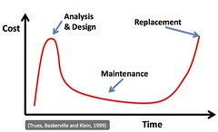
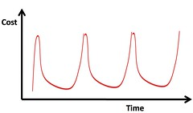

George Siemens has a [post](http://www.elearnspace.org/blog/2009/03/05/iris-model/) introducing the IRIS model of technology adoption - image shown below.

!!! warning "Broken image link"

I always start off having a vague disquiet about these types of models. I think the main reason is the point George makes at the start of the post

> In many instances, it’s a matter of misunderstanding (determining the context from which different speakers are arguing)

i.e. some of my disquiet arises from bringing a different context/perspective to this. The following is my attempt to clearly identify the source of my vague sense of disquiet about this model.

At the moment, I think I'm going to identify three sources:

1. It's too neat.
2. Misinterpretation based on different definitions.
3. It misses the most important part.

### It's too neat

[I've argued before](/blog2/2009/02/16/frameworks-and-representation-tidy-versus-messy/) that frameworks and their graphical representations tend to make the inherently messy, too neat.

> One of the things I don’t like about frameworks is that they have (for very good reasons) to be tidy. This certainly helps understanding, a key purpose of frameworks, but it also can give the false impression of tidiness, of simplicity of a tame problem. My interest is currently in e-learning within universities, which I consider to be extremely messy. To me it is an example of a wicked problem.

Innovation in any reasonably complex social system is also a wicked problem.

Part of my disquiet about the neatness is how I've seen models, frameworks and taxonomies used within organisations. They've been used as a replacement for recognising, understanding and dealing with the complexities and messiness of the real situation. Some of the [sentiment expressed by Jim Groom](http://bavatuesdays.com/edupunk-battle-royale-part-3/) about leadership captures some of this. I've seen this problem lead too often to [faddish and fashionable adoption](/blog2/2009/01/21/open-source-learning-management-systems-the-latest-fad-in-e-learning/) of innovations. I tend to think much of the organisational implementation of e-learning is based on fads and fashions.

That said, a neat graphical representation is a good way to start understanding, but it's not the end game.

### Misinterpretation based on definitions

Perhaps getting back to the point about misunderstandings arising from context. In my current context fads and fashions are something I see regularly and am thinking about. Hence when I see "How do we duplicate it?" under the _systematization_ component of the IRIS model, I immediately think of fads and fashions. I wonder if "How do we scale it?" or "How do we encourage widespread appropriate adoption?" might capture better what George's intent might be.

### It doesn't go far enough

The IRIS model, as it stands, appears to make (based on my interpretation) the same problem that almost all of these types of models make. It focuses mostly on the development and pays little or no attention to the long term use, adaptation and evolution of innovations. I hesitate to label it as such, but the IRIS model seems to have a very strong basis in [teleological design](/blog2/publications/the-teleological-brake-on-icts-in-open-and-distance-learning/) (Jones et al, 2005; Jones and Muldoon, 2007). Again, this could be the impact of perspective and context. It could be me falling into the hole provided by [Kaplan's law of instrument](/blog2/2008/11/19/tool-users-research-hammers-and-the-law-of-instrument/).

Going back to a major component of my [information systems design theory for e-learning](http://www.slideshare.net/davidj/an-information-systems-design-theory-for-elearning) and a quote from an old paper (Jones, Lynch and Jamieson, 2003)

> The world in which systems are developed is not static and entirely predictable - systems will need to be altered and maintained. Maintenance typically consumes about 40 to 80 percent of software costs and 60% of that maintenance cost is due to enhancement (Glass, 2001). That is, adding new capabilities that were not known of during the analysis phase. If maintenance is such a large part of system development the assumption of a period of low-cost maintenance to recoup costs from the analysis and development phases seems less valid. If an organization is operating in a continually changing context then a large investment in up front analysis is a poor investment as requirements change before the end of the analysis stage (Truex & Klein, 1999).

I think there is another step in the IRIS model - let's call it _Evolution_. It's a step that comes after _Systematization_ and has a cyclical relationship with both _Systematization_ and _Innovation_. No innovation survives in its original form once it starts to be used. A whole range of limitations and unexpected affordances of the innovation are discovered as it is used in new and complex settings. This is especially true if the innovation makes use of [some form protean technology](/blog2/2009/02/09/the-protean-nature-of-modern-technology-another-limitation-of-most-views-of-e-learning/) that enables and even encourages the modification of the innovation by people within a given context.

### Time for the hobby horse

The lack of attention paid to this _Evolution_ phase is perhaps the aspect of university-based e-learning that annoys me most. The processes used and the products selected generally don't pay sufficient attention to the need and benefits of actively enabling this evolution. It's the type of thinking that leads to systems and practices that aren't moving with the times and require organisations to enter into large-scale replacement projects - e.g. the selection of a new LMS.

This approach is based on the idea of "big up-front design" as shown in the following model from Truex et al (1999). There is a period of analysis and design which is expensive. Then, to recoup costs, there is a period of stable use until the system no longer is suitable and hence the need for replacement.

The major problem with this process is evident if you look at universities and their use of learning management systems and expand the timelines out to 10 years or so, you get the following.

That is, because they don't pay enough attention to _Evolution_ and because they don't treat their "Product" (i.e. the LMS) as protean, every 5 years or so they have to go through the expensive and onerous process of replacing their systems.

### References

Glass, R. (2001). Frequently Forgotten Fundamental Facts about Software Engineering. IEEE Software, 110-112.

David Jones, Teresa Lynch, Kieren Jamision, Emergent Development of Web-based Education, Proceedings of Informing Science + IT Education Conference, Pori, Finland

David Jones, Jo Luck, Jeanne McConachie, P. A. Danaher, The teleological brake on ICTs in open and distance learning, To appear in Proceedings of ODLAA’2005

David Jones, Nona Muldoon, The teleological reason why ICTs limit choice for university learners and learning, In ICT: Providing choices for learners and learning. Proceedings ASCILITE Singapore. pp 450-459

Truex, D., & Klein, B. (1999). Growing Systems in Emergent Organizations. Communications of the ACM, 42(8), 117-123.