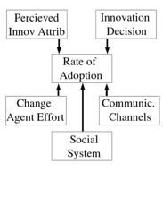
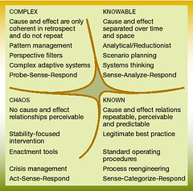

See also: [[blog-home | Home]]

Over the last week or so I've been criticising essentially all current practice used to improve learning and teaching. There are probably two main prongs to my current cynicism:

1. [Worse than useless evaluation of learning and teaching](/blog2/2009/03/06/the-biggest-flaw-in-university-lte-learning-and-how-to-avoid-it/); and  
    Universities are using evaluation methods that are known to be worthless and/or can't get significant numbers of folk to agree as some definition of "good" learning and teaching.
2. [A focus on what management do](/blog2/2009/02/26/improving-university-teaching-learning-from-constructive-alignment-by-not-mandating-it/).  
    Where, given the difficulty of getting individual academics (let alone a significant number of them), to change and/or improve their learning and teaching (often because of the problems with point #1), the management/leadership/committee/support hierarchy within universities embark on a bit of [task corruption](/blog2/2009/03/04/task-corruption-in-teaching-university-negative-impact-of-place/) and start to focus on what they do, rather than on what the teaching staff do.
    
    For example, the university has improved learning and teaching if the academic board has successfully mandated the introduction of generic attributes into all courses, had the staff development center run appropriate staff development events, and introduced "generic attributes" sections within course outlines. They've done lots of things, hence success. Regardless of what the academics are really doing and what impacts it is having on the quality of learning and teaching (i.e. see point #1).
    

### So do you just give up?

So does this mean you can't do anything? What can you do to improve learning and teaching? Does the fact that learning and teaching (and improving learning and teaching are wicked problems mean that you can't do anything? This is part of the problem [Col](http://beerc.wordpress.com/) is asking about with his [indicators project](http://beerc.wordpress.com/2009/03/07/shades-of-gray-an-opinion-piece/). This post is mostly aimed at trying to explain some principles and approaches that might work. As well as attempting to help Col, it's attempting to make concrete some of my own thoughts. It's all a work in progress.

In this section I'm going to try and propose some generic principles that might help inform how you might plan something. In the next section I'm going to try and apply these principles to Col's problem. **Important:** I don't think this is a recipe. The principles are going to be very broad and leave a lot of room for the application of individual knowledge. Knowledge of both generic theories of teaching, learning, people etc. and also of the specific contexts.

The principles I'm going to suggest are drawn from:

- Reflective alignment - a focus on what the teachers do.
- Adopter-based development processes.
- A model for evaluating innovations informed by diffusion theory.
- Emergent/ateleological design.
- The Cynefin framework.

#### Reflective alignment

In proposing [reflective alignment](/blog2/2009/02/26/improving-university-teaching-learning-from-constructive-alignment-by-not-mandating-it/) I believe it is possible to make a difference. But only if

> The focus is on what the teacher does to design and deliver their course. The aim is to ensure that the learning and teaching system, its processes, rewards and constraints are aiming to ensure that the teacher is engaging in those activities which ensure quality learning and teaching. In a way that makes sense for the teacher, their course and their students.

The last sentence is important. It what make sense for the teacher. It is not what some senior manager thinks should work, or what the academic board thinks is important or good. Any attempt to introduce something that doesn't engage with the individual teacher and doesn't encourage them to reflect on what they are doing and hopefully make a small improvement, will fail.

#### Adopter-based development

This has strong connections with the idea of adopted-based development processes, which are talked about in this [paper](/blog2/publications/a-model-for-the-design-of-web-based-systems-that-supports-adoption-appropriation-and-evolution/) (Jones and Lynch, 1999)

> places additional emphasis on being adopter-based and concentrating on the needs of the individuals and the social system in which the final system will be used.

Forget about the literature, forget about the latest fad (mostly) and concentrate first and foremost on developing a deep understanding of the local context, the social system and its mores and the people within it. What they experience, what their problems are, what their strengths are and what they'd like to do. Use these as the focus for deciding what you do next, not the latest, greatest fad.

#### How do you decide?

In [this paper](/blog2/publications/a-model-for-evaluating-potential-web-based-education-innovations/) (Jones, Jamieson and Clark, 2003) we drew on Rogers' diffusion theory (Rogers, 1995) to develop a model that might help folk make these sorts of decisions. The idea was to evaluate a potential innovation against the model in order to

> increase their awareness of potential implementation issues, estimate the likelihood of reinvention, and predict the amount and type of effort required to achieve successful implementation of specific ... innovations.

The model consists of five characteristics of an innovation diffusion process that will directly influence the rate of adoption of the innovation. These characteristics, through the work of Rogers and others, also help identify potential problems facing adoption and potential solutions.

This model can be misused. It can be used as an attempt to encourage adoption of Level 2 approaches to improving learning and teaching. i.e. someone centrally decides on what to do and tries to package it in a way to encourage adoption. IMHO, this is the worst thing that can happen. Application of the model has to be driven by a deep understanding of the needs of the people within the local context. In terms of reflective alignment, driven by a desire to help encourage academics to reflect more on their learning and teaching.

#### Emergent/ateleological design

Traditional developer-based approaches to information systems are based on a broadly accepted and unquestioned set of principles that are completely and utterly inappropriate for learning and teaching in universities. Since at least [this paper](/blog2/publications/emergent-development-and-the-virtual-university/) (Jones, 2000) I've been arguing for different design processes based on emergent development (Truex, Baskerville and Klein, 1999) and ateleological design (Introna, 1996).

Truex, Baskerville and Klein (1999) suggest the following principles for emergent development:

- Continual analysis;
- Dynamic requirements negotiation;
- Useful, incomplete specifications;
- Continuous redevelopment; and
- The ability to adapt.

They are expanded in more detail in the [paper](/blog2/publications/emergent-development-and-the-virtual-university/). There have been many similar discussions about processes. [This paper](/blog2/publications/the-teleological-brake-on-icts-in-open-and-distance-learning/) talks about Introna's ateleological design process and its principles. Kurtz and Snowden (2007) talk about idealistics versus naturalistic approaches that are summarised in the following table.

| Idealistic | Naturalistic |
| --- | --- |
| Achieve ideal state | Understand a sufficiency of the present in order to stimulate evolution |
| Privilege expert knowledge, analysis and interpretation | Favour enabling emergent meaning at the ground level |
| Separate diagnosis from interfention | Diagnosis and intervention to be intertwined with practice |

No surprises for guessing that I believe that a naturalistic process is much more appropriate.

#### Protean technologies

Most software packages are severely constraining. I'm thinking mostly of enterprise systems here that tend to illustrate the underlying assumptions in their design where the control of what users do is necessary to ensure efficiency. I believe it just constrains what people can do, limits innovation and in an environment like learning and teaching this is a huge problem.

Truex et al (1999) make this point about systems and include "ability to adapt" as a prime requirement for emergent development. The software/systems in play have to be adaptable. As many people as possible, as quickly as possible, need to be able to modify the software to enable new functionality as the need becomes apparent. The technology has to enable, in Kurtz and Snowden's (2007) words, "emergent meaning at the ground level". It also to allow "diagnosis and intervention to be intertwined with practice".

That is the software has to [be protean](/blog2/2009/02/09/the-protean-nature-of-modern-technology-another-limitation-of-most-views-of-e-learning/). As much as possible the users of the system need to be able to play with the system, to try new things and where appropriate there have to be developers who can help and enable these things to happen more quickly. This implies that the software has to enable and support discussion, amongst many different people, to occur. To help share perspectives and ideas. The mixing of ideas help generate new and interesting ideas for change to the software.

#### Cynefin framework

Which brings us to the [Cynefin framework](http://en.wikipedia.org/wiki/Cynefin). As a wicked problem, I place teaching and attempting to improve teaching into the Complex domain of the Cynefin framework. This means that the most appropriate approach is to "Probe - Sense - Respond". i.e. do something small, see how it works and then encourage the stuff that works and cease/change the stuff that doesn't.

### Some ideas for a way forward

So to quickly finish this off, some off the cuff ideas for the [indicators project](http://beerc.wordpress.com/2009/03/01/indicators-update-february/):

- Get the data from the indicators into a form that provides some information to real academics in a form that is easy to access and preferably as a part of a process or system they already use.
- Make sure the form is perceived by the academics to provide some value.
- Especially useful if the information/services provided by the indicators project enables/encourages reflection on the part of the academics.  
    For example, giving a clear, simple, regular update on some information about student activity that is currently unknown. Perhaps couched with advice that helps provide options for a way to solve any potential problems.
- Use a process and/or part of the product that encourages a lot of people talking about/contributing to ideas about how to improve what information/services the indicators provides.
- Adopt the "open source" development ethos "release early, release often"
- Perhaps try and create a community of academics around the project that are interested and want to use the services.
- Pick people that are likely to be good change agents. Keep in mind [Moore's chasm and Geohegan's identification of the technologists alliance](/blog2/2009/01/21/why-am-i-a-eportfolio-skeptic/).

### References

Introna, L. (1996). "Notes on ateleological information systems development." Information Technology & People 9(4): 20-39.

David Jones, Teresa Lynch, (1999). A Model for the Design of Web-based Systems that supports Adoption, Appropriation, and Evolution, Proceedings of the 1st ICSE Workshop on Web Engineering, Murugesan, S. & Deshpande, Y. (eds), Los Angeles, pp 47-56

David Jones, Kieren Jamieson, Damien Clark, (2003). “A Model for Evaluating Potential WBE Innovations,” Hawaii International Conference on System Sciences, vol. 5, no. 5, pp. 154a, 36th Annual Hawaii International Conference on System Sciences (HICSS’03) - Track 5, 2003.

Kurtz, C. and D. Snowden (2007). Bramble Bushes in a Thicket: Narrative and the intangiables of learning networks. Strategic Networks: Learning to Compete. Gibbert, Michel, Durand and Thomas, Blackwell.

Rogers, E. (1995). Diffusion of Innovations. New York, The Free Press.

Truex, D., R. Baskerville, et al. (1999). "Growing systems in emergent organizations." Communications of the ACM 42(8): 117-123.