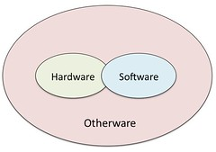
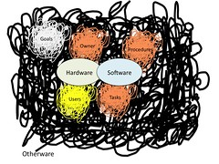

---
categories:
- chapter-2
- design-theory
- elearning
- lmsreview
- thesis
date: 2009-03-12 11:31:00+10:00
next:
  text: Another perspective for the indicators project
  url: /blog2/2009/03/12/another-perspective-for-the-indicators-project/
previous:
  text: Validity is subjective
  url: /blog2/2009/03/11/validity-is-subjective/
title: Messiness of information systems - another reason institutional e-learning
  struggles
type: post
template: blog-post.html
comments:
    - approved: '1'
      author: adrianyarrow
      author_email: adrian.yarrow@gmail.com
      author_ip: 118.208.77.103
      author_url: null
      content: 'DJ,
    
    
        Good post. Is this a small typo ...."Rather than recognise that the otherware
        is inherently messy, will continue to be message..." should it be ..."will continue
        to be messy...."?
    
    
        Cheers,
    
    
        Ado'
      date: '2009-03-13 23:13:07'
      date_gmt: '2009-03-13 13:13:07'
      id: '2242'
      parent: '0'
      type: comment
      user_id: '0'
    - approved: '1'
      author: davidtjones
      author_email: d.jones@cqu.edu.au
      author_ip: 59.154.24.147
      author_url: https://djon.es/blog/
      content: 'G''day Ado,
    
    
        I''m surprised that''s the only one.  Fixed.  Thanks for letting me know.
    
    
        Added a little extra.
    
    
        David.'
      date: '2009-03-14 10:50:06'
      date_gmt: '2009-03-14 00:50:06'
      id: '2243'
      parent: '0'
      type: comment
      user_id: '1'
    
pingbacks:
    - approved: '1'
      author: 'Comparing VLEs/LMS to the past: flaws and implications for development
        models &laquo; The Weblog of (a) David Jones'
      author_email: null
      author_ip: 72.233.96.147
      author_url: https://djon.es/blog/2009/03/15/comparing-vleslms-to-the-past-flaws-and-implications-for-development-models/
      content: '[...] For me this approach ignores the messiness of information systems.
        [...]'
      date: '2009-03-15 23:31:37'
      date_gmt: '2009-03-15 13:31:37'
      id: '2244'
      parent: '0'
      type: pingback
      user_id: '0'
    - approved: '1'
      author: Performance degradation - impact of new LMS implementation &laquo; The Weblog
        of (a) David Jones
      author_email: null
      author_ip: 72.233.96.139
      author_url: https://djon.es/blog/2009/04/20/performance-degradation-impact-of-new-lms-implementation/
      content: '[...] ignoring the messiness of e-learning; [...]'
      date: '2009-04-20 15:30:48'
      date_gmt: '2009-04-20 05:30:48'
      id: '2245'
      parent: '0'
      type: pingback
      user_id: '0'
    
---
My current disciplinary home is within the [information systems community](http://home.aisnet.org/), which, not surprisingly, concerns itself with research and practice around information systems. This begs the question, "What is an information system?". This post provides one answer to this question and in doing so suggests another reason why most institutional, university-based e-learning implementations enjoy less than stellar success. Of course, it's not limited to just e-learning, but that's what my focus is.

### What is an information system?

DuPlooy (2003) describes an information system as consisting of three subsystems: the hardware, software and “otherware” and uses the following figure to represent their relationship.

The hardware component is the computer hardware, the processing units, printers, network equipment, monitors etc. The software component, as you may expect, are the software applications that make use of the hardware to help users of the system to perform various tasks. “Otherware” is defined as including the system’s goals, the owner, users, operational procedures, and the tasks and responsibilities of the people involved.

DuPlooy (2003) makes the point that the hardware and software components are deterministic. That is, given the same inputs, the outputs of these components will generally be the same. On the otherhand, he makes the point that otherware is not deterministic. One reason why otherware is not deterministic is the involvement of people and the observation by Markus (1983) that people may have agendas and goals that differ vastly from those of the organization.

Given this fundamental difference in the nature of otherware when compared to the other two components, I believe DuPlooy's (2003) representation is somewhat less than effective. I suggest the following representation is more appropriate.

This better captures the messy, non-deterministic nature of otherware. It illustrates that otherware is different, that it can't be treated the same as software and hardware.

It is the consideration of all three subsystems, and in particular the addition of “otherware”, which differentiates information systems from other related disciplines such as computer science and information technology. The inadequacy of computer science in addressing problems associated with the use of computers in organisational contexts has played a large part in the emergence of the IS discipline (Fitzgerald and Adam 1996).

The inadequacy of computer science and information technology in addressing problems with organisational information systems is the main reason I've moved from the information technology discipline to that of information systems. Of course, it must be said that much of the research into information systems doesn't fully engage with the messiness of otherware. For one example take a look at [Behrens (2007)](http://aisel.aisnet.org/icis2007/9/).

### What's wrong with e-learning?

Essentially, the vast majority of practice in university-based e-learning radically under-estimates the messiness of the otherware invovled within a university context. Within the pantheon of organisations, I believe that universities are amongst the elite in terms of just how messy their otherware can be.

Whether it be a computer scientist developing an "adaptive LMS" by applying some algorithm and mathematics, the central information technology support division applying some project management methodology or management applying some top-down management approach, they all under-estimate the messiness of the otherware and the impact this has on their nice, neat plans and assumptions.

In some cases, it appears that the neatness of the software, hardware or of the traditional methodologies is used as a haven from the messiness of the context. The messiness is too hard, so one must ignore it and focus on the neatness of the process or the product.

For example, selecting one piece of software (e.g. an LMS) from a set of such software, which all have a pre-defined, limited set of features and expect those limited set of features to fulfill all the requirements of a messy "otherware". Rather than recognise that the otherware is inherently messy, will continue to be messy, and will continue to change the nature of its messiness over time and subsequently adopt an approach that is able to respond to that messiness. Institutions insist on attempting to limit the messiness within the confines of the product. The phrase "we'll implement a vanilla version" in connection with an enterprise system, including learning management systems, sums this up very nicely.

It shows a perspective that thinks it is too hard to change the information system, so the solution is to force the messiness of the otherware to comply with the confines of the information system. This perspective assumes that you can force messy otherware to conform.

Personally, I don't think this is possible. It is possible to create the illusion that it is conforming, but scratch the surface and you will find it isn't. Personally, I think it is better to engage with, seek to understand and respond to the messiness of the otherware.

### References

Behrens, S. (2007). Diversity in IS Research; Metaphor, Meaning and Myth. ICIS'2007, Montreal, Canada.

duPlooy, N. F. (2003). Information systems as social systems. Critical Reflections on Information Systems: A Systematic Approach. J. Cano. Hershey, IDEA Group Inc.

Markus, M. L. (1983). "Power, politics and MIS implementation." Communications of the ACM 26: 430-440.