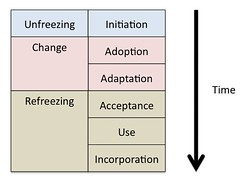
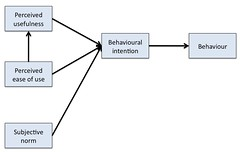
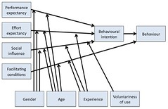

---
categories:
- chapter-2
- design-theory
- elearning
- psframework
- thesis
date: 2009-03-13 21:34:03+10:00
next:
  text: '"Comparing VLEs/LMS to the past: flaws and implications for development models"'
  url: /blog2/2009/03/15/comparing-vleslms-to-the-past-flaws-and-implications-for-development-models/
previous:
  text: 'PhD update - week #3'
  url: /blog2/2009/03/13/phd-update-week-3/
title: '"Virtual learning environments: three implementation perspectives"'
type: post
template: blog-post.html
comments:
    []
    
pingbacks:
    - approved: '1'
      author: Coordination, support and knowledge sharing associated with e-learning -
        where does your organisation fit? &laquo; The Weblog of (a) David Jones
      author_email: null
      author_ip: 72.233.96.147
      author_url: https://djon.es/blog/2009/03/18/coordination-support-and-knowledge-sharing-associated-with-e-learning-where-does-your-organisation-fit/
      content: '[...] and knowledge sharing associated with e-learning - where does your
        organisation&nbsp;fit?  A recent post summarised a paper that was taking some
        insights from the information systems discipline and [...]'
      date: '2009-03-18 23:46:58'
      date_gmt: '2009-03-18 13:46:58'
      id: '2247'
      parent: '0'
      type: pingback
      user_id: '0'
    - approved: '1'
      author: 'PhD Update - Week #4 - Frustration and progress &laquo; The Weblog of (a)
        David Jones'
      author_email: null
      author_ip: 66.135.48.204
      author_url: https://djon.es/blog/2009/03/20/phd-update-week-4-frustration-and-progress/
      content: '[...] A summary of a paper that applies some insights from information
        systems to e-learning implementation. [...]'
      date: '2009-03-20 10:19:59'
      date_gmt: '2009-03-20 00:19:59'
      id: '2248'
      parent: '0'
      type: pingback
      user_id: '0'
    - approved: '1'
      author: IS Implementation Phases and Lewin&#8217;s organisational change | Tus Clases
        Blog
      author_email: null
      author_ip: 173.236.169.35
      author_url: http://www.tusclases.bestmkng.com/2010/10/is-implementation-phases-and-lewins-organisational-change/
      content: '[...] Initially used in this blog post &#8211; davidtjones.wordpress.com/2009/03/13/virtual-learning-env&#8230;
        [...]'
      date: '2010-10-14 12:31:54'
      date_gmt: '2010-10-14 02:31:54'
      id: '2249'
      parent: '0'
      type: pingback
      user_id: '0'
    
---
The aim of this post is to summarise my current reading - Keller (2005). I believe it will have some connection with the thesis.

_Aside:_ Using the United Kingdom term - virtual learning environment (VLE) - as a synonym for the more common (in Australia and elsewhere) - learning management system (LMS). Have to say I still prefer course management system (CMS) as a more appropriate label.

Apart from the PhD, this article has contextual implications as [my existing institution](http://www.cqu.edu.au/) is currently adopting Moodle as [mentioned elsewhere](http://e-learning-engagement.blogspot.com/2008/12/are-we-asking-too-much-of-university-it.html).

### Summary

This is an interesting conceptual paper - there are no empiricial data - that is a bit light on in detail (e.g. how the CoP approach can be used to improve a VLE implementation is very abstract and repetitive). This may also be true for the innovation and acceptance perspectives. I am more familiar with those so may be automatically inserting my own experiences.

For me it provides a reference for the complementary value of adding an IS perspective to VLE implementation.

It does open up some possibilities for some interesting empirical work examining what is being done and how within VLE implementation within institutions.

### Abstract

Seems to suggest that the common theoretical framework for implementing VLES - instructional design - can be complemented by 3 different perspectives of VLE implementation from the information systems implementation research and organisation theory. Would appear to suggest that these perspectives have important things to say about the successful use and implementation of VLES. The three complementary perspectives are

- technology acceptance;  
    Sees the VLE as a new technology that will be accepted or rejected by users.
- diffusion of innovations; and  
    VLE implementation is seen as the effort to diffuse the VLE within the user community.
- learning process.

### Introduction

Some typical stuff about the impact of ICTs and e-learning on students and institutions.

Refers to an earlier publication of the authors (Keller & Cernerud, 2002) in an attempt to justify why there is a "strong need for closer study of models of implementation and an exploration of their underlying theoretical frameworks". But I haven't got it yet - Is it too late on a Friday afternoon to be starting this?

The basic point seems to be that factors such as age, gender, learning style, degree programmes and previous knowledge of computers have been assumed to influence students' perceptions of e-learning and the implementation strategy found. They reference (Mitra et al., 2000; Nachmias & Shany, 2002) for this point. However, they claim that the author's earlier study found that these only exert a minor influence.

Sounds weak to me.

The rest of the introduction is broken up into sections:

- Virtual learning environments;  
    Mentions that e-learning encompasses an awful lot. Narrows things down to VLEs and defines what they are.
- Concept of implementation;  
    This is the bit the explains that the instructional design view of VLE implementation is somewhat narrow - has some references. Argues for the view of VLE implementation that sees the VLE as an information system and the university as being an organisation. Outlines a number of different theoretical views of information systems implementation - most around initiation, development and implementation/termination. Includes mention of [Lewin's freeze/unfreeze model](/blog2/2007/01/11/freeze-and-unfreeze-one-problem-with-herding-cats/), but makes this point
    
    > six-phase view of the information systems implementation process compared to Lewin’s model of organizational change (adapted from Kwon & Zmud, 1987) Within these models, implementation is seen as a continuous process. This is in accordance with Mintzberg and Quinn’s (1996) view of implementation as being intertwined with formulation of organizational goals in a complex interactive process.
    
    This is an important distinction and salves my problems with this view somewhat, however, I don't think it goes far enough. I think the reality in most organisations and most information systems demands that evolution and termination receive specific treatment - but that's an argument for elsewhere.
    
- Three perspectives of implementation  
    Briefly names the three implementation perspectives to be examined and explains that the point is to see what these perspectives can tell us about VLE implementation. The next 3 sections introduce each perspective.

The concept of implementation section refers to a figure like the following to show the linkage between Lewin's model of organisational change and the stages of an implementation model.

There seems to be some connection with [George Siemens' IRIS model](http://www.elearnspace.org/blog/2009/03/05/iris-model/), some similarities and some differences. I've expressed some reservations about both [the IRIS model](/blog2/2009/03/06/the-iris-model-of-technology-adoption-neat-and-incomplete/) and also [Lewins model](/blog2/2007/01/11/freeze-and-unfreeze-one-problem-with-herding-cats/). A few things have come together that mean I do need to revisit these.

### Implementation as technology acceptance

Explains how technology acceptance is seen as one of the most mature research streams in IS. In fact, some see it as one of the few original contributions that IS has made. Others see it as an example of a flawed adoption of a perspective from another discipline (psychology and sociology mentioned in this paper) that has failed to keep up with the improved understandings of that original discipline.

Keller explains

> The models focus on explaining individual decisions of accepting and using a new technology. The factors influencing these decisions are seen as variables measured at a specific point. Relationships between the variables are identified by statistical correlation analysis. Among the most influential models of this research stream are technology acceptance model (TAM) and social cognitive theory (SCT) (Venkatesh et al., 2003).

And then goes onto examine each of these.

#### Technology acceptance model (TAM)

Some friends and I have used the TAM in a couple of previous papers. One for an e-learning audience and another for an information systems audience. But we used an older version with an emphasis on perceived usefulness and perceived ease of use.

Keller uses a later version from Venkatesh & Davies (2000) that adds subjective norm and behavioural intention. See the following figure.

#### Social cognitive theory (SCT)

A different theory developed by other researchers from Bandura. Includes elements such as computer self-efficacy, outcome expectations (performance), outcome expectations (personal), affect, anxiety, and usage. Won't go into detail, because Keller mentions UTAUT next.

### Unified theory of acceptance of use of technology (UTAUT)

This is where 8 of the influential models of user acceptance have been integrated into a theory that has been found to explain 70% of the variance in users acceptance and use of information systems.

### Implementation as diffusion of innovations

Mostly drawing on Rogers diffusion of innovation work - we gave a summary of this in [this paper](/blog2/publications/a-model-for-evaluating-potential-web-based-education-innovations/). Though I did like this quote, particularly the last part

> Innovation research indicates that there is a significant positive relationship between participation in innovation decisions and rate of adoption of innovations (Jahre & Sannes, 1991) and that internally induced innovations are more likely to be accepted than those induced externally (Marcus & Weber, 2000).

Uses the following structure to suggest how the innovation process occurs within an organisation

1. Inititation - information gathering, conceptualizing and planning of the innovation adoption
    1. Agenda-setting - define the problem or need for the innovation. Identify a performance gap.
    2. Matching - tailor the innovation to fill the gap.
2. Implementation - all events, actions and decisions involved in putting an innovation into use.
    1. Redefining/restructuring - modify innovation to accommodate org needs more closely.
    2. Clarifying - meaning of innovation becomes more clear to members of the organisation and use broadens
    3. Routinizing - the innovation becomes a part of the organisation and ceases to be an innovation.

Damn, that's a [teleological view](/blog2/publications/the-teleological-brake-on-icts-in-open-and-distance-learning/) of diffusion. No surprise in guessing I don't like that characterisation. But I guess that is how it is likely to be used within an organisation.

### Implementation as a process of learning

Suggests that "learning in organisations" can be studied from different perspectives including:

- action theory
- organisational learning
- knowledge management
- communities of practice

The emphasis here is on community of practice because of

> its capability to describe social learning, but also interactions that occur between man (communities of practice) and technology (boundary objects).

CoP arises from situated learning and based on two basic premises

1. activity-based nature of knowledge (practice)
2. group-based character of organisational activities (communities)

talks about work done by Hislop (2003) examining innovation in IT from the perspective of CoP. Finding is that the CoP and innovation implementation are mutually dependent. Innovation creates new communities and change the knowledge distribution within the organisation. The CoP affect how the innovation is supported.

CoPs connect through boundary objects. VLE connects student and teacher communities - boundary object. Four characteristics enable artefacts to be boundary objects:

1. Modularity - different users, different views
2. abstraction - distinguishing certain important features of described concepts in the system
3. accommodation - different functions to support different activities
4. standarisation - functions can be organised in the same way?? this sounds somewhat funny.

Suggests Wegner wants information systems to be designed to facilitate participation, rather than to facilitate use. Connected with Brown and Duguid's (1998) statement that technology aimed at supporting knowledge distribution should support informal communication between communities and deal with reach and reciprocity.

### Conclusions

The guts of this appears to be summarised in the two tables. The first summarises the differences between these perspectives. The second derives implications for implementation of VLEs.

A comparison of 3 implementation perspectives (adapted from Keller, 2005)
|  | Technology acceptance | Diffusion of innovations | Learning process |
| --- | --- | --- | --- |
| Basic concepts | Variables influencing decisions of acceptance or rejection by individual users at specific points | The individual decision process of adapting an innovation.   The diffusion process of innovations in organizations | The learning process of different communities of practice within an organization |
| Regards the VLE as | A new technology to be accepted or rejected by users | An innovation to be diffused in an organization | A boundary object connecting different communities of practice |
| Regards the users of the VLE as: | Individual users making personal decisions of accepting or rejecting a technology | Individuals making personal decisions of adopting or rejecting an innovation; an organization adopting or rejecting an innovation | Different communities of practice interacting through a boundary object |
| Considers the different roles of teachers and students | No | No | Yes |

I have some disagreements with the above

- Both UTAUT (TAM) and diffusion theory include consideration of the social system in adoption. While the group is perhaps not as central as with CoP etc., it is still a consideration. To some extent it would depend on how the approaches we're implemented. To say for certain it sees the users as individuals making decisions....is not entirely true.
- Similarly, to suggest that diffusion theory and TAM don't consider the students is not neccesarily entirely correct. In applying diffusion theory to the implementation of online assignment submission we have employed it both to encourage use by students and staff. Yes, CoP may well support the notion of boundary objects to connect students and staff. But a lot of CoP doesn't necessarily take that on board, just like a lot of TAM/DoI work doesn't - they all can, but don't have to.

Implications for the use and implementation of VLEs
|  | Technology acceptance | Diffusion of innovations | Learning process |
| --- | --- | --- | --- |
| Successful use | The VLE should: enhance the resolving of educational tasks; be easy to use; improve user’s self-efficacy | The VLE should: fill a performance gap; create positive visible outcomes; be consistent with existing beliefs; be less complex to use | The VLE should: provide modularity, abstraction, accommodation and standardization; support informal communication; be designed for participation |
| Successful implementation | The implementation process should be supported by: formal and informal leaders; a reliable technological infrastructure | The implementation process should: be internally induced; be based on a consensus decision; provide possibilities of trying the VLE beforehand | The implementation process should: allow peripheral participation; consider the impact of the VLE on different communities of practice |

Again, some potential points of disagreement:

- This one is probably more a matter of definition. "Educational tasks" in the TAM/successful use box could be interpreted as mostly emphasising the instructional design perspective. i.e. directly and only at learning and teaching. In some, perhaps many contexts, the administrative tasks associated with education (results processing, assignment submission etc.) are of more interest to the academics. Especially if the context is problematic. That's the point we made in the papers applying TAM to online assignment submission - the main reason academics perceived it as useful, was it solved a range of workload issues. Learning perspectives (e.g. rapid return of feedback to students) were a long last.
- I'm not sure the DoI approach necessarily excludes input from leaders. In fact, appropriate change agents (informal leaders?) can be important.

### Implications

One obvious application of this work would be to apply the different lenses to understanding what is happening in the actual implementation of a new LMS at a university. Is the project being sold as any one of these three perspectives and if so is the implementation plan following any of the guidelines? What, if any, impact will this have on adoption and use.

Or is the implementation taking a different perspective entirely. For example, the "build it and they will come" approach. Is it simply implementing the tech and assuming people will use it.

Are these the only perspectives that could inform VLE implementation? Are there others? What?

As with most discussion of this sort of thing, I don't think this paper pays sufficient attention to more ateleological processes. All of these assume that the VLE will be used, it's just a nature of what processes we surround the VLE with. i.e. is it technological determinist?

It's a very conceptual paper. Obvious thing would be to use this type of approach to examine implementation.

#### Different performance gaps and the impacts

The diffusion perspective requires that "decisions of implementing a VLE must be based on a performance gap, and hence create a visible and tangible positive outcome for the university". What happens if the performance gap is perceived differently by different folk? For example, at my institution I can see the following performance gaps being discussed:

- A prime performance gap seen by IT and management was cost. The institution was seen to have two LMSes, one would be cheaper. Also we were paying licence fees to a commercial VLE vendor. A single, open source LMS solves this performance gap nicely.
- Some "educational determinists" see the performance gap as the vast majority of online courses at our institution not following a particular type of "good pedagogy". The new LMS is seen as a solution to this. As a different system it will enable, support or perhaps require "good" pedagogy.
- Some pragmatic folk see the current systems as old and out of date. In need of updating. The new LMS is seen as a way to be more modern.

Perhaps talking to folk, observing documents and meetings would be a way of surfacing additional performance gaps that the new LMS is seen to solve.

The presence of different percieved gaps raise some other questions:

- How will a single implementation project plan cater for all these different performance gaps? i.e. how you solve the problem of licence fees is very different to the problem of "good" pedagogy or modern features. Is the plan focusing on solving a particular performance gap at the expense of others?
- Which gap is the most important? Are some gaps just silly? How do you handle this?

### References

Keller, C. (2005). "Virtual learning environments: three implementation perspectives." Learning, Media and Technology 30(3): 299-311.