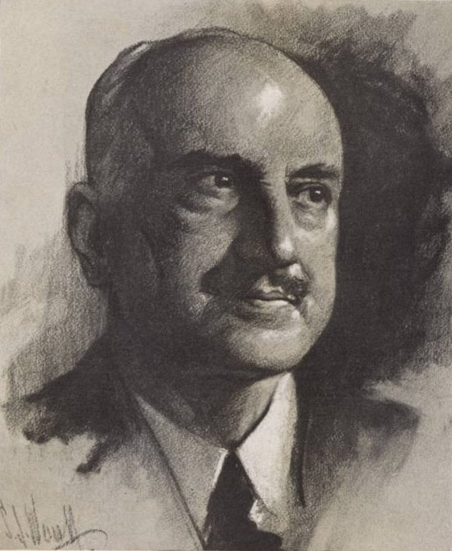

See also: [[blog-home | Home]]

I'm working on chapter 2 of [the thesis](/blog2/research/phd-thesis/) and, in particular, on the "Past Experience" section. As part of the [Ps Framework](/blog2/publications/the-ps-framework-mapping-the-landscape-for-the-plescquni-project/), "Past Experience" is meant to talk about

> What has gone on before with e-learning, both within and outside of this particular place? What worked and what didn’t? What other aspects of previous experience at this particular institution will impact upon current plans?

. So it's fairly obvious that at some stage I'm going to use the following quote from [George Santayana](http://en.wikipedia.org/wiki/George_Santayana)

> Progress, far from consisting in change, depends on retentiveness. When change is absolute there remains no being to improve and no direction is set for possible improvement: and when experience is not retained, as among savages, infancy is perpetual. Those who cannot remember the past are condemned to repeat it.

### Early and new insights

The thesis is aimed at e-learning and, in particular, web-based education. Based on my experience and resulting perspectives I've had quite a few ideas about what might come out in this section (remember the aim of chapter 2 of the thesis is to illustrate I know the area and also to identify some problems). The point of this post is to summarise a couple of new perspectives that have been brought to bear by my first reading in the area.

The reading is [Jesse Heines](https://www.cs.uml.edu/~heines/) 2004 chapter on "[Technology for Teaching: Past Masters Versus Present Practices](https://www.cs.uml.edu/~heines/academic/papers/2004history/Heines_Final_JMH.pdf)" (Heines, 2004). This chapter goes back into the history of technology use for learning and compares what was known and possible with systems from last century with what is possible with more modern technology. Given the tone of this post, I doubt it's any surprise that his is not a favourable comparison for the modern systems.

The two insights that have been highlighted for me are:

1. VLEs/LMSes/CMSes are not informed by best practice.
2. The commercial model of these systems constrains the ability to be informed by best practice.

Consideration of these points raised a question for me about the open source systems and whether they suffer from the same problem - which I kind of think they do. More on this in the last section of the post.

### VLEs/LMSes/CMSes are not informed by best practice

In the early noughties the vendors of course management systems (CMSes) caught onto the growing adoption of enterprise resource planning systems within universities. They knew that this trend created all sorts of advantages for them in convincing universities to fork out big money on their systems. So they started labeling their systems as "enterprise" systems.

Now one of the assumed features of "enterprise" systems is that their design is meant to be informed by and encapsulate "best practice" (Jones et al, 2004). This is used as one excuse why the organisation should adapt its processes to suit the new system, because it encapsulates "best practice".

One of the more common features of an CMS that academics use is the quiz facility. Heines (2004) describes much of the history of work around programmed instruction - i.e. automated testing using technology. He relates this story

> In a recent conversation with a representative of one of the leading CMS vendors about their testing subsystem, I asked about the system’s capability to analyze the data it stored and present it to teachers. \[CMS stands for “course management system,” another new term applied to a capability that’s been around for years.\] I was told that the system can show the teacher each student’s response to every question. OK, I responded, but can a busy teacher see a summary of that data so that s/he can see trends and identify widespread class misunderstandings? The representative didn’t know. He said something about computing an average, but he was not familiar with the terms “item analysis,” “difficulty index,” “discrimination index,” and “standard deviation.” (Sigh.)

He then proceeds to highlight some additional limitations

- Many CMS don't even store the data necessary to do item analysis and other features available in much earlier systems.
- Facilities to construct test banks doesn't enforce "even the most basic, long-established rules of good test construction".

Questions:

- Is this still true of more recent versions of these systems?
- Is this true of the open source alternatives - e.g. Moodle, Sakai etc.

### The commercial model causes this

Heines (2004) then makes the point that economic and commercial system used to produce these systems may be somewhat to blame. He starts by offering this quote from [Sidney Pressey](http://www.coe.uh.edu/courses/cuin6373/idhistory/pressey.html) (who developed the "teaching machine" in the image to the left in 1928)

> The writer has found from bitter experience that one person alone can accomplish very little.”

i.e. he funded much of the development of his machine and without commercial support had difficulty.

Heines (2004) then suggests that you need "product commercialization" to have a real impact on the education system. But, he also suggests a flaw for this approach

> the cost of developing and marketing commercial products today is so huge that they must often cater to the lowest common denominator in an effort to appeal to the widest possible audience

If this is true, and I do think this is fairly well accepted, then what does it say for the assumption that "enterprise" systems embody "best practice".

### Is open source the solution?

Heines (2004) suggests that showing the vendors how to expand their product capabilities is the solution. Funny that. Just last week I saw someone from an Australian university asking about a basic function within the most recent, commercial version of Blackboard. Apparently, Blackboard had been told that this basic function was necessary quite sometime ago but still hadn't included it.

This basic function was a simple "reporting" problem, i.e. how information was being displayed. It wasn't some as difficult as storing additional data about student performance on quizzes and implementing known algorithms for item analysis. But even it hadn't been done yet. And this is for a function that was reported through vendor initiated "user dialogue".

So, of course, open source must be the answer. That seems to be [what the latest fad](/blog2/2009/01/21/open-source-learning-management-systems-the-latest-fad-in-e-learning/) sweeping higher education might suggest. As [that previous post](/blog2/2009/01/21/open-source-learning-management-systems-the-latest-fad-in-e-learning/) suggests, I have my doubts.

One simple empirical test might be to look at the testing engines within existing open source CMSes and see if they suffer the same flaw. My quick look at Moodle suggests that it does.

Do you know better?

### Limitations

Okay, complicated quiz reporting systems may not be the best example of modern pedagogy. Consequently, it may not be the best test. But I'm sure you could find similar things in terms of discussion forums, student/staff interaction etc. There's probably an interesting paper in this.

### How do you solve it?

So, if both the commercial and the open source "enterprise" systems suffer this same flaw, how do you solve this problem?

Heines (2004) suggests that a "plug-in" approach might be possible. The reality of this, however, may be a little more complex. Some of the features that need changing may be "core" to the system, something a plug-in couldn't change. Being able to change the "core" also raises some problems.

If I can't give an answer to how you would do it, I can at least describe a situation that would not solve it. That's the old "implement vanilla" approach to enterprise systems - the situation where the local organisation actively decides not to make any changes.

For me this approach [ignores the messiness of information systems](/blog2/2009/03/12/messiness-of-information-systems-another-reason-institutional-e-learning-struggles/).

### References

Jones, D., S. Behrens, et al. (2004). [The rise and fall of a shadow system: Lessons for enterprise system implementation](/blog2/publications/the-rise-and-fall-of-a-shadow-system-lessons-for-enterprise-system-implementation/). Managing New Wave Information Systems: Enterprise, Government and Society, Proceedings of the 15th Australasian Conference on Information Systems, Hobart, Tasmania.

Heines, J. (2004). Technology for Teaching: Past Masters Versus Present Practices. Online Learning: Personal Reflections on the Tranformation of Education. G. Kearsley, Educational Technology Publications: 144-162.