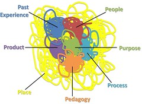

See also: [[blog-home | Home]]

The following is a section of my [thesis](/blog2/research/phd-thesis/) - chapter 2. As I get first drafts of this stuff done, I'm going to post it to the blog - where appropriate. This is the first.

This section is the first major part of chapter 2 - the literature review. It explains the background of the Ps Framework which will be used to structure the rest of the chapter.

### The Ps Framework

This chapter aims to illustrate knowledge of the extant literature and associated worthy research issues around the problem of designing and implementing e-learning and the supporting information systems within universities. The development of this understanding and its description in the remainder of this chapter has been achieved through the formulation of the Ps Framework as a theory to enable analysis, understanding and description of that extant literature. Elsewhere (Jones 2008; Jones, Vallack et al. 2008) the Ps Framework has been used to illustrate how the framework can be a useful tool for helping the diverse stakeholders to effectively share and negotiate their various perspectives and consequently, make sound and pragmatic decisions around e-learning. In this chapter, the Ps Framework helps illustrate that the literature survey is "constructively analytical rather than merely descriptive" (Perry 1998) and its components make the main section headings in this chapter.

The first part of this section (Why the Ps Framework?) provides a brief description of why the Ps Framework is necessary. Next (Components of the Ps framework), the individual components of the Ps Framework and their graphical representation is explained. The next section (_hopefully online later this week_) begins the use of components of the Ps Framework, in this case "Past Experience", to describe one aspect of what is currently known about e-learning.

#### Why the Ps Framework?

The focus of this work is the development of an Information Systems Design Theory (ISDT) for e-learning. The aim is to develop insight into appropriate approaches to the design and implementation of e-learning. Consequently, the research in this thesis can be seen as a design problem. There is growing interest in design, design research and design theory in fields such as management (Boland 2002; van Aken 2004; van Aken 2005), information systems (Walls, Widmeyer et al. 1992; Hevner, March et al. 2004; Walls, Widmeyer et al. 2004; Gregor and Jones 2007), and education (Brown 1992; Collins 1992; Savelson, Phillips et al. 2003). Design is the core of all professional training (Simon 1996). Design can be seen as a transformation from some known situation (the initial state) which is deemed to be problematic by some interested parties into a target state (Jarvinen 2001). The formulation of the initial state into an effective representation is crucial to finding an effective design solution (Weber 2003). Representation has a profound impact on design work (Hevner, March et al. 2004) particularly on the way in which tasks and problems are conceived (Boland 2002).

The organisational selection, adoption and use of educational technology by universities is increasingly seen as an information systems implementation project (Jones, Vallack et al. 2008). How such projects are conceptualised significantly influence the design of the resulting system. Jamieson and Hyland (2006) suggest that there are relationships between decisions made in the pre-implementation phase of an information systems project, the factors considered in those decisions and the degree of success of the project outcomes. During the pre-implementation phase, decisions involve a high volume of information, are incredibly complex, and are associated with a high degree of uncertainty (Jamieson and Hyland 2006). There remains some distance until there is complete understanding of the complexity of innovation and change around university implementation of e-learning (Cousin, Deepwell et al. 2004).

Bannister and Remenyi (1999) contend that given such difficult decisions, both individual and corporate decision makers will more than likely base their decisions on instinct. Given the non-linear nature of e-learning implementation it becomes more complex to handle and there is a need for meaning-makers or mediators between the different elements of the "implementation ecology" (Cousin, Deepwell et al. 2004). How a design problem is conceptualised by the members of an organization influences what they see as valid solutions to that problem, it impacts directly on the quality of the decisions they make about projects. Different members of an organization will, as a result of their different experiences, have varying perspectives on a design problem. Too often, the full diversity of experience is so difficult to capture, compare and contrast that decision-making processes often, both consciously and unconsciously, avoid the attempt.

Frameworks offer new ways of looking at phenomena and provide information on which to base sound, pragmatic decisions (Mishra and Koehler 2006). Gregor (2006) defines taxonomies, models, classification schema and frameworks as theories for analysing, understanding and describing the salient attributes of phenomena and the relationships therein. The development of taxonomies, models and frameworks to aid understanding is common in most disciplines. Examples from the educational technology field include:

- the 4Es conceptual model (Collis, Peters, & Pals, 2001);  
    This is a model to predict the acceptance of ICT innovations by an individual within an educational context. It proposes that an individual’s acceptance of educational ICT innovations is based upon four concepts: environment, effectiveness, ease of use and engagement.
- the ACTIONS model (Bates, 2005); and  
    This framework provides guidance to the process of selecting a particular educational technology by drawing on 7 components: Access, Costs, Teaching and learning, Interactivity and user-friendliness, Organisational issues, Novelty and Speed.
- E-learning ecology elements (Cousin, Deepwell et al. 2004).  
    Four elements or domains are identified as requiring consideration during the implementation of e-learning within universities: pedagogical, technological, cultural and organisational.

#### Components of the Ps Framework

The Information Technology (IT) artifact is often taken for granted or assumed it to be unproblematic which often results in narrow conceptualisations of what technology is, how it has effects and how and why it is implicated in social change (Orlikowski and Iacono 2001). Such limited conceptualisations often view IT as fixed, neutral and independent of their context of use. The position taken in this thesis, and demonstrated in this chapter through the use of the Ps framework, is that IT is one of a number of components of an emergent process of change where the outcomes are indeterminate because they are situationally and dynamically contingent (Markus and Robey 1988). On-going change is not solely “technology led” or solely “organisational/agency driven”, instead, change arises from a complex interaction between technology, people and the organization (Marshall and Gregor 2002). This view of the Ps framework and the IT artifact connects with Orlikowski and Iacono's (2001) ensemble view of the IT artifact where technology is seen to be embedded with the conditions of its use.

The Ps Framework consists of 7 components. Only one of which – Product – specifically encompasses technology. The remaining six seek to describe and understand the parts of the complex and dynamic social context within which e-learning is applied. The seven components of the Ps framework are: (_as work progresses and I post additional sections of the chapter, I'll link to them from the following_)

1. The problem and purpose;  
    What is the purpose or reason for the organization in adopting e-learning or changing how it currently implements e-learning? What does the organization hope to achieve? How does the organization conceptualise e-learning?
2. Place;  
    What is the nature of the organization in which e-learning will be implemented? What is the social and political context within which it is placed?
3. People;  
    What type of people and roles existing within the organization? Management, professional and academic staff, students. What are their beliefs, biases and cultures?
4. Pedagogy;  
    What are the conceptualisations about learning and teaching which the people within the place bring to e-learning? What practices are being used to learn and teach? What practices might they like to adopt?
5. Past experience;  
    What has gone on before with e-learning, both within and outside of this particular place? What worked and what didn't?
6. Product; and  
    What system has been chosen or designed to implement e-learning? Where system is used in the broadest possible definition to include the hardware, software and support roles.
7. Process.  
    What are the characteristics of the process used to choose how or what will be implemented and what process will be used to implement the chosen approach?

One, of potentially many, explanation of the relationship between the seven components starts with purpose. Some event, problem or factor arises that will require the organization to change the way in which it supports e-learning. This becomes the purpose underlying a process used by the organization to determine how (process) and what it (product) will change. This change will be influenced by a range of factors including: characteristics of the organization and its context (place); the nature and conceptions of the individuals and cultures within it (people); the conceptualisations of learning and teaching (pedagogy) held by the people and the organization; and the historical precedents by within and outside the organisation (past experience).

This is not to suggest that there exists a simple linear, or even hierarchical, relationship between the components of the Ps Framework. The context of implementing educational technology within a university is too complex for such a simple reductionist view (Jones, Vallack et al. 2008). As stated above, the perspective underpinning the Ps Framework is one where the technology is one of even components of an emergent process of change where the outcomes are indeterminate because they are situationally and dynamically contingent (Markus and Robey 1988).

Figure 1 provides a representation of the 7 components of the Ps Framework for E-Learning. The situationally contingent nature of these components is represented by the Place component encapsulating all of the remaining six. The dynamically contingent nature of these components is represented by the messiness of their representation. It is intended also that each component be connected in someway to every other component as a representation that each component can influence the other, and vice versa.

