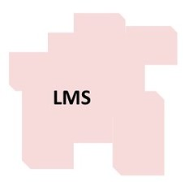
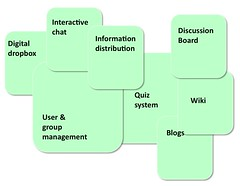
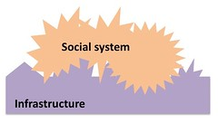
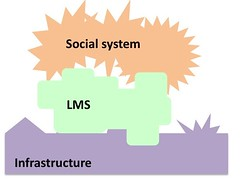
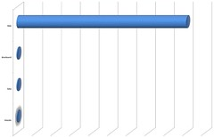

As part of [the PhD](/blog2/research/phd-thesis/) I'm developing the [P Frameworks](/blog2/2009/03/18/the-ps-framework/) as a theory for analysing/understanding the factors the impact the organisational implementation of e-learning. Essentially, [I argued that](http://www.slideshare.net/davidj/an-information-systems-design-theory-for-elearning) that the current institutional practice of e-learning within universities demonstrates an orthodoxy. Further, I argue that this orthodoxy has a number of flaws that limit, some significantly, potential outcomes.

In this post, and a few following, I'm going to develop a description of what I see as the orthodoxy associated with the "Product" component of the Ps Framework, what I see as the flaws associated with that orthodoxy, and the impacts it has on the institutional impact of e-learning. The "Product" component of the Ps Framework is concerned with

> What system has been chosen or designed to implement e-learning? Where system is used in the broadest possible definition to include the hardware, software and support roles.

The emphasis in this post is on the "one ring to rule them all" approach characteristic of an enterprise system like a learning management system (LMS)/virtual learning environment (VLE).

### The product is almost always a LMS

It is broadly accepted that the almost universal response to e-learning within universities has been a selection of a Learning Management System (LMS) aka Virtual Learning Environment (VLE) or Course Management System (CMS). By 2005 there was an almost universal adoption of just two commercial LMSs (Coates, James, & Baldwin, 2005). The 2003 Campus Computing project reports that more than 80% of United States universities and colleges utilize a LMS (Morgan 2003). Elgort (2005) cites work that indicates that 86% of 102 UK universities are using a LMS and all 18 surveyed New Zealand based institutions used a LMS. Smissen and Sims (2002) found that 34 of the 37 Australian universities were using one of two LMS – Blackboard or WebCT. If not already adopted, Salmon (2005) suggests that almost every university is planning to make use of an LMS. Indeed, the speed with which the LMS strategy has spread through universities is surprising (West, Waddoups, & Graham, 2006).

The trend in recent years has been a move away from commercial systems to open or community source systems such as Moodle or Sakai. Whether or not your LMS is open source or commercial, doesn't change the underlying product model. All LMS are based on the enterprise or "one ring to rule them all" approach.

In terms of the limitations this brings to e-learning and its implications for practice, there is no significant difference between open source and commercial LMSes.

### What is an LMS?

LMSes are software systems that are specifically designed and marketed to educational institutions to support teaching and learning and that typically provide tools for communication, student assessment, presentation of study material and organisation of student activities. A university’s LMS forms the academic system equivalent of enterprise resource planning (ERP) systems in terms of pedagogical impact and institutional resource consumption (Morgan, 2003).

There are more similarities than differences between individual learning management systems. Each LMS consist of a standard set of tools for communication, assessment, information distribution and management. Beyond these standard features LMS distinguish themselves through micro-detailed features (Black, Beck, et al. 2007).

An LMS is an integrated system. A unified collection of different services or tools produced by a single vendor that can be managed through a single interface. While the interface, abstractions and some of the tools will be different between different LMS, the underlying model of an integrated system remains the same.

Based on experience (I've been trying to explain this since around 2000) the points I'm trying to make are somewhat easier made, if the argument is accompanied by graphical representations. So let's start with the next two images. These are intended to represent, at a very high level, two different LMSes. There's a different colour, a slightly different shape, however, there is some commonality in the structure. They are a collection of services, slightly different sized/shaped squares, and both have an overall shape. The overall shape is meant to represent the functionality perceived by the organisation and its users. There is some commonality in shape between the two systems, but moving from one to another does involve some negotiation, translation and change.

LMS design largely focuses on satisfying certain functional requirements, such as the creation and distribution of on-line learning material and the communication and collaboration between the various actors (Avgeriou, Retalis et al. 2003) . There is a list of common functions that are now expected of an LMS (quiz tool, discussion forum, calendar, collaborative work space, grade book etc) consequently there are more similarities than differences between different LMS (Black, Beck et al, 2007). The only real difference between LMS, lie in marketing approaches (Carriere, Challborn and Moore, 2005).

The following image provides an expanded view of one LMS, where the individual features have been identified. This will be revisited later.

### What's the product model of an LMS? - one ring to rule them all

The following sentence was used above. A university’s LMS forms the academic system equivalent of _enterprise resource planning (ERP) systems_ in terms of pedagogical impact and institutional resource consumption (Morgan, 2003). The LMS product model is essentially equivalent to that of the ERP system. It's an integrated system. i.e. it contains lots of different modules which are all tightly integrated, generally because they are provided by a single vendor (or in the case of open source, by a single community). The ERP model has become "the dominant strategic platform for supporting enterprise-wide business processes" and have been generally implemented to overcome issues arising from custom development (Light, Holland et al, 2001).

### What are the limitations of this model?

The focus of this post is **not** to talk about the limitations and implications of the design decisions that have gone into most LMS. For example, the decision to use the "course" as the major approach for organising content and interactions. This particular topic has gotten broad coverage within the e-learning literature. For example, and in a obvious case of self-citation, Beer and Jones (2008) provide a brief discussion of these limitations and provide pointers to relevant literature. I will cover this topic in the thesis, but not in this post.

The focus here is on the limitations associated with the "product model" - the one ring to rule them all approach. The list of limitations of this approach suggested here includes:

- You _can't change the system_.
- The organisation and its people are _Forced to adapt to the system_.
- You are limited to a _single vendor or community_.

These limitations have some significant ramifications for the practice of e-learning within a university. These limitations:

- increase risk;
- reduce quality;
- increase complexity of implementation and support;
- reduce flexibility and competitiveness; and
- significantly constrain innovation and differentiation.

#### Can't change the system

The nature of enterprise systems and the main reasons for adopting them mean that they cannot be changed. Modifying enterprise systems will: increase development time, increase required staff resources during and after implementation, reduce the capability to upgrade the system by making it more difficult, and go against the reasons for adopting an enterprise system in the first place (Light, Holland and Wills, 2001). Modifying such a complex system leads to expensive maintenance requirements (Dodds, 2007)

Hence the phrase "vanilla implementation". When you implement an enterprise system, you cannot change it. You must/should implement it as is. This is supposed to be a good thing as enterprise systems are expected to implement "best practice".

This creates a mismatch between the LMS and the nature of the context and activity it is meant to be supporting. e-learning or learning and teaching more generally takes place within a context that is rapidly changing in terms of technology, understandings of how to use the technology and a broad array of other societal trends and influences.

Let's take the simplest of these, technology. Both the hardware and the software technologies underlying online education are undergoing a continuing process of change and growth (Huynh, Umesh, & Valacich, 2003). Any frozen definition of ‘best’ technology is likely to be temporary (Haywood, 2002). Increasing consumer technological sophistication adds to demand for sustained technological and pedagogical innovations (Huynh et al., 2003).

With an enterprise system the institution can't change the system, they have to rely on the vendor or community to change the system. This might work for broader societal trends, but it certainly doesn't work for organisational requirements. Commercial vendors aren't interested in the unique customisation needs of an individual organisational client.

#### Forced to adapt to the system

Over the last 10/15 years many universities have implemented enterprise systems for a range of tasks. All too often these sytems make the organisation conform to the system, the system forces teaching and research to conform to the IT system (Duderstadt, Atkins et al, 2002). Such systems lack the end-users view of business processes and require the institution to modify its practices to accommodate the system (Dodds, 2007). Theoretically, not doing so forgoes an opportunity for positive change, as such systems are meant to embody best practice (Dodds, 2007).

However, the 'best practice' view embodied in the LMS, may not be a match for the institution's interests (Jones, 2004). Such systems impose their own logic on a companies strategy, structure and culture and push the company towards generic processes even when customised processes may be a source of competitive advantage (Davenport, 1998) Technology is not, of itself, liberating or empowering but serves the goals of those who guide its design and use (Lian, 2000). The tools themselves are never value-neutral but are replete with values and potentialities which may cause unexpected responses (Westera, 2004).

For an LMS, this implies some level of standardisation of teaching and learning processes towards those supported by the LMS. As two of the most highly personalised sets of processes within institutions of higher education, any attempt at standardising teaching and learning is likely to be radical, painful and problematic (Morgan, 2003). It will increase the difficulty of implementation and most likely cause resentment amongst academics and students due to the imposition of a change of uncertain value.

The standardisation of, and the values embedded in, CMS design can create a number of operational conditions for the client institution that push teaching and learning in a particular direction. For example, most CMS vendors assume a self-paced learner and so these systems are not rich in interaction or collaboration tools (Bonk, 2002) beyond simple chat rooms, email and discussion forums. CMSs are by nature structured and have limited capability for customisation (Morgan, 2003). A choice for enterprise CMS made for administrative reasons can result in students having access to different pools of electronic resources, thus affecting the quality of their educational experiences (Dutton & Loader, 2002).

Let's illustrate this graphically. I'm going to reuse these graphical representations in latter posts as I develop and suggest a much better alternative.

First, let's look at the organisation in its pre-enterprise system state. For these purposes I'll suggest that there are two main components:

- the social system; and  
    This is the collection of practices, expectations and beliefs about how learning and teaching and related activities are performed. It can range from how big a course is, what a course is called (my institution used call a "course" a "unit"), how teaching responsibilities are allocated, what happens at the start of term, teaching preferences etc.
- the infrastructure.  
    The hardware, software and other support systems and processes that support the social system and how it works.

The above representation is very optimistic. It assumes that the infrastructure and the social system integrate very well. There are few gaps between the infrastructure and the social system. The reality I believe is much worse, there are usually significant gaps that require people within the social system to take on busy work to overcome the limitations.

If the institution is looking at adopting an LMS, then chances are the gaps - or least the gaps as perceived by some people - are quite large and require the implementation of an LMS to fill them.

Post LMS implementation the representation looks something like the following.

Note the insertion of one of the LMS representations from above. Also note that the LMS has over-riden aspects of the structure of the Social System. This represents the necessity of the social system to be changed in order to fit with the unchanging nature of the LMS.

I should point out that the similar over-riding of infrastructure by the LMS is probably not 100% accurate. There may be a bit of over-riding, where the infrastructure is changed to suit the LMS. For example, I know of one institution that had to buy completely new server hardware because the new LMS didn't like the existing hardware. However, in many cases the gap between existing infrastructure and the LMS will be bridged by "middleware". An odds and sods collection of technical approaches used to manipulate the structure/output of the infrastructure to suit the middleware.

**Important:** This type of "modification" is deemed to be appropriate and efficient. However, any "modification" that helps bridge the gap between the LMS and the social system, is deemed to be "bad".

#### Single vendor or community

Any changes that are made to the enterprise system must be made by the vendor (commercial) or community (open source). As the previous two limitations point out, the institution cannot change the system. They must rely on the vendor/community to do so.

**Motiviations** In many cases this can cause a problem because the motivations of the vendor/community (more so the vendor) don't always match those of the organisation. For example, Avgeriou, Retalis et al (2003) suggest

> ...the quality requirements of LMSs are usually overlooked and underestimated. This naturally results in inefficient systems of poor software, pedagogical and business quality. Problems that typically occur in these cases are: bad performance which is usually frustrating for the users; poor usability, that adds a cognitive overload to the user; increased cost for purchasing and maintaining the systems; poor customizability and modifiability; limited portability and reusability of learning resources and components; restricted interoperability between LMSs.

**A question of scale.** The single vendor or community now becomes the development bottleneck. Very early on with my involvement with e-learning I suggested that it would be impossible for a single institution (in this case a university) to provide all of the services and functionality required of e-learning within a university (Jones and Buchanan, 1996). My argument here is that the same thing applies to a single vendor or open source community.

At its simplest the single vendor or community (no matter how large the community) is always going to be smaller than the broader community. As a simple example I performed a number of Google searches, the following list shows what I searched for and the number of "hits" Google found:

- moodle discussion forum - 167,000 hits;
- sakai discussion forum - 234,000 hits;
- blackboard discussion forum - 238,000 hits; and
- web discussion forum - 45,100,000 hits.

The following graph of the above figures reinforces that we're talking about an order of magnitude difference.

Given the relative sizes of the community, where do you think the best discussion forum is going to come from. One of the minute communities around a specific LMS, or the much larger general web-based community? This is one aspect of the idea of ["worldware"](http://tlt-swg.blogspot.com/2009/01/worldware-to-cloud-and-beyond.html) developed by Steve Erhman and [defined as](http://www.tltgroup.org/resources/visions/Outcomes.html)

> Let’s define worldware to be hardware or software that is used for education but that was not developed or marketed primarily for education.

### Is there an alternative?

So, if the enterprise system approach has so many problems, is there an alternative? The simple answer is yes, best of breed. Though, as with any wicked problem, it's not necessarily the answer. In fact, as I'll argue in a latter post, I don't believe the traditional best of breed approach is appropriate for e-learning. Until then, I'll finish with the following table from Light, Holland and Wills (2001) that seeks to compare best of breed with the ERP approach.

| Best of breed | Enterprise |
| --- | --- |
| Organisation requirements and accommodations determine functionality | The vendor of the ERP system determines functionality |
| A context sympathetic approach to BPR is taken | A clean slate approach to BPR is taken |
| Good flexibility in process re-design due to a variety in component availability | Limited flexibility in process re-design, as only one business process map is available as a starting point |
| Reliance on numerous vendors distributes risk as provision is made to accommodate change | Reliance on one vendor may increase risk |
| The IT department may require multiple skills sets due to the presence of applications, and possibly platforms, from different sources | A single skills set is required by the IT department as applications and platforms are common |
| Detrimental impact of IT on competitiveness can be dealt with, as individualism is possible through the use of unique combinations of packages and custom components | Single vendor approaches are common and result in common business process maps throughout industries. Distinctive capabilities may be impacted on |
| The need for flexibility and competitiveness is acknowledged at the beginning of the implementation. Best in class applications aim to ensure quality | Flexibility and competitiveness may be constrained due to the absence or tardiness of upgrades and the quality of these when they arrive |
| Integration of applications is time consuming and needs to be managed when changes are made to components | Integration of applications is pre-coded into the system and is maintained via upgrades |

### References

Avgeriou, P., S. Retalis, et al. (2003). An Architecture for Open Learning Management Systems. Advances in Informatics. Berlin, Springer-Verlag. 2563: 183-200.

Beer, C. and D. Jones (2008). [Learning networks: harnessing the power of online communities for discipline and lifelong learning](/blog2/publications/learning-networks-harnessing-the-power-of-online-communities-for-discipline-and-lifelong-learning/). Lifelong Learning: reflecting on successes and framing futures. Keynote and refereed papers from the 5th International Lifelong Learning Conference, Rockhampton, Central Queensland University Press.

Black, E., D. Beck, et al. (2007). "The other side of the LMS: Considering implementation and use in the adoption of an LMS in online and blended learning environments." Tech Trends 51(2): 35-39.

Bonk, C. (2002). Collaborative tools for e-learning. Chief Learning Officer: 22-24, 26-27.

Carriere, B., C. Challborn, et al. (2005). "Contrasting LMS Marketing Approaches." International Review of Research in Open and Distance Learning 6(1): 1492-3831.

Coates, H., R. James, et al. (2005). "A Critical Examination of the Effects of Learning Management Systems on University Teaching and Learning." Tertiary Education and Management 11(1): 19-36.

Davenport, T. (1998). "Putting the Enterprise into the Enterprise System." Harvard Business Review 76(4): 121-131.

Dodds, T. (2007). "Information Technology: A Contributor to Innovation in Higher Education." New Directions for Higher Education 2007(137): 85-95.

Duderstadt, J., D. Atkins, et al. (2002). Higher education in the digital age: Technology issues and strategies for American colleges and universities. Westport, Conn, Praeger Publishers.

Dutton, W. and B. Loader (2002). Introduction. Digital Academe: The New Media and Institutions of Higher Education and Learning. W. Dutton and B. Loader. London, Routledge: 1-32.

Elgort, I. (2005). E-learning adoption: Bridging the chasm. Proceedings of ASCILITE'2005, Brisbane, Australia.

Haywood, T. (2002). Defining moments: Tension between richness and reach. Digital Academe: The New Media and Institutions of Higher Education and Learning. W. Dutton and B. Loader. London, Routledge: 39-49.

Huynh, M., U. N. Umesh, et al. (2003). "E-Learning as an emerging entrepreneurial enterprise in universities and firms." Communications of the AIS 12: 48-68.

Jones, D. (2004). "The conceptualisation of e-learning: Lessons and implications." Best practice in university learning and teaching: Learning from our Challenges. Theme issue of Studies in Learning, Evaluation, Innovation and Development 1(1): 47-55.

Lian, A. (2000). "Knowledge transfer and technology in education: Toward a complete learning environment." Educational Technology & Society 3(3): 13-26.

Light, B., C. Holland, et al. (2001). "ERP and best of breed: a comparative analysis." Business Process Management Journal 7(3): 216-224.

Salmon, G. (2005). "Flying not flapping: a strategic framework for e-learning and pedagogical innovation in higher education institutions." ALT-J, Research in Learning Technology 13(3): 201-218.

Smissen, I. and R. Sims (2002). Requirements for online teaching and learning at Deakin University: A case study. Eighth Australian World Wide Web Conference, Noosa, Australia.

West, R., G. Waddoups, et al. (2006). "Understanding the experience of instructors as they adopt a course management system." Educational Technology Research and Development.

Westera, W. (2004). "On strategies of educational innovation: between substitution and transformation." Higher Education 47(4): 501-517.