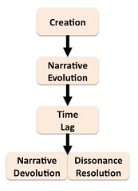
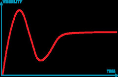
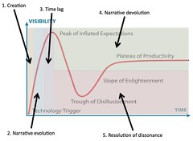

---
categories:
- chapter-2
- design-theory
- elearning
- psframework
- thesis
date: 2009-04-06 15:31:52+10:00
next:
  text: Early indications of "blame the student" that continues today
  url: /blog/2009/04/06/early-indications-of-blame-the-student-that-continues-today/
previous:
  text: Quotes from Snowden and the mismatch between what univeristy e-learning does
    and what it needs
  url: /blog/2009/04/06/quotes-from-snowden-and-the-mismatch-between-what-univeristy-e-learning-does-and-what-it-needs/
title: Birnbaum's fad cycle in higher education
type: post
template: blog-post.html
comments:
    - approved: '1'
      author: VRBones
      author_email: vrbones@hotmail.com
      author_ip: 115.64.241.18
      author_url: http://www.vrbones.com
      content: 'The tail is definitely different and I''d agree with your optimistic/pessimistic
        view of the outcomes. On the whole I''d tend to stray toward the fad cycle where
        the tail indicates a rational embedding of the fundamentals of the fad.
    
    
        As an example we''ve implemented smartboards for all of primary school. At the
        start there was a very positive vibe about the possibilities spruked by the salesmen
        and in-school advocates. Once a couple of months had passed and the general teaching
        populace had given a concerted effort, there was a backlash about the hype with
        all the negative aspects (time lost preparing, tech failing, alignment issues,
        higher tech expectation) in full light. Once the issues were all out in the open
        though, a general period of enlightenment ensued where the boards were used in
        a more targeted fasion where the it made more rational sense. I doubt the ''fad''
        will ever hit the heights attempted in the first couple of months (everything
        done religiously through IWBs), but the experience has changed even the most stubborn
        teachers in embedding the positive goals of interactive teaching.
    
    
        I doubt anyone could argue that the experience of going through a fad DIDN''T
        impact the populace at all, but I guess where you''re attempting to head is whether
        the populace actually learns from the fad cycle itself and actively attempts to
        smooth out the next hype cycle. My gut feeling is that there will always be the
        positive boom followed by a negative swing purely because of the way information
        flows. A relatively close knit group builds out the concept based on the perceived
        advantages in their situation while the general populace is more or less apathetic.
        Once the general populace gets exposed to the new technology far removed from
        the original intent and execution, there are much more factors leading to a negative
        outcome. Like giving a computer to your grandparents without instructing them
        on how to use the internet; they may figure it out by themselves, but would they
        find google immediately or find anything of worth to keep them interested? If
        they were closer to the people at the core of the concept then the true intent
        of the technology (highlight your interest first, google/wiki up articles, get
        involved) would be far more likely to be transmitted.
    
    
        So how do you stop a game of chinese whispers? Get the original source to tell
        everyone. In our day and age where no-one could possibly follow all new inventions
        and ideas even if they wanted to, so I''m guessing there''s always going to be
        the original bubble that grows out of proportion to the sentiment of the whole
        populace. Fast dissemination should alleviate the the size of the swings though
        ...'
      date: '2009-04-09 22:52:18'
      date_gmt: '2009-04-09 12:52:18'
      id: '2373'
      parent: '0'
      type: comment
      user_id: '0'
    - approved: '1'
      author: davidtjones
      author_email: d.jones@cqu.edu.au
      author_ip: 59.154.24.147
      author_url: https://djon.es/blog/
      content: 'G''day Tony,
    
    
        I''m not sure there are any silver bullets.  This is a really complex question/problem.
    
    
        I guess that''s where I''d like to start.  My first step would be for people to
        be aware of the fad cycle, to be aware that teaching is complex and that there
        is no silver bullet.  No single technology or process is going to radically improve
        all teaching.
    
    
        I have a later post about a paper that introduces the ideas of Technology I, II
        and III and technological gravity.  My current thought is that it is important
        for schools and universities to create amongst teachers a tendency towards a Technology
        III approach (which I think fits with the current talk of Edupunk).
    
    
        I''ve got earlier posts about "reflective alignment".  That''s what I think is
        a better solution.  Get staff to engage in reflective alignment, rather than going
        hunting for the latest fad.
    
    
        I think management tend to the fad idea because it is easier.  I think the on-going
        fascination with fads is management escaping the difficulty of "reflective alignment"
        for something that is perceived to be easier, but which is also known not to really
        work.
    
    
        David.'
      date: '2009-04-13 11:10:05'
      date_gmt: '2009-04-13 01:10:05'
      id: '2375'
      parent: '2373'
      type: comment
      user_id: '1'
    - approved: '1'
      author: davidtjones
      author_email: d.jones@cqu.edu.au
      author_ip: 59.154.24.147
      author_url: https://djon.es/blog/
      content: 'G''day Tony,
    
    
        Just wanted to comment on one other aspect of your response.
    
    
        In particular, I''m not sure that all fads always get embedded usefully into the
        context.
    
    
        In your experience, how often have you come across applications of instructional
        radio, television or movies.  i.e. radio programs, television shows and motion
        pictures designed specifically to teach.  (Apart from the "educational movies"
        shown on the Simpsons with Troy McClure).
    
    
        These movements were really big during the 20th century. Journals, research conferences,
        educational programs at Universities etc, but all gone now.
    
    
        Yes, there is some indication that these things were used, at one stage.  However,
        there are also historical reviews that suggest the use was never all that informed
        nor widespread.
    
    
        Perhaps these "fads" were only kept alive by the technologists alliance and once
        the next fad came along the alliance moved on. Perhaps these fads were never really
        broadly used.
    
    
        I agree that there are some fads that might be around to stay and/or used fairly
        widely. However, I wonder if how you can identify that.
    
    
        I wonder if smartboards have really moved beyond a fad.
    
    
        When does a fad stop being a fad and become an accepted part of every day teaching?  e.g.
        textbooks or blackboards.
    
    
        David.'
      date: '2009-04-13 12:22:24'
      date_gmt: '2009-04-13 02:22:24'
      id: '2376'
      parent: '2373'
      type: comment
      user_id: '1'
    - approved: '1'
      author: VRBones
      author_email: vrbones@hotmail.com
      author_ip: 150.101.181.34
      author_url: http://www.vrbones.com
      content: 'Maybe the definition of a fad''s life is the continued participation by
        the "technologists alliance"? Once they jump ship to a new technology that''s
        the end of the fad, and what''s left is reality. If what''s left survives by its
        own merit (rather than the pushing of the original group), then the fad has turned
        into an accepted part of the community.
    
    
        Thinking of it that way it''s more like a critical mass. The point at where propagation
        occurs without the original stimulus.'
      date: '2009-04-15 09:26:27'
      date_gmt: '2009-04-14 23:26:27'
      id: '2377'
      parent: '2373'
      type: comment
      user_id: '0'
    - approved: '1'
      author: davidtjones
      author_email: d.jones@cqu.edu.au
      author_ip: 59.154.24.147
      author_url: https://djon.es/blog/
      content: 'That''s an interesting point.
    
    
        I wonder if that''s a part of the technology becoming "mythic".  I think the LMS
        approach
    
        to e-learning has become "mythic" within universities.  They don''t even question
        whether
    
        they need one or whether there are better approaches.
    
    
        I''m also wondering whether or not the "technologists alliance" ever goes away.
    
        The alliance includes those folk employed by the organisation to support the
    
        technology.  e.g. the LMS/e-learning folk in universities.  Because their job
        is specifically
    
        tied to a technology, they have a vested interest in boosting that technology.
    
    
        A related question might be whether or not the combination of improving technologies
    
        (like the social media stuff) combined with increasing knowledge of technology
        from
    
        users might do away with the need for the organisation to have people to specifically
    
        support a technology?
    
    
        No quick answers, I don''t think.  Back to the thesis.'
      date: '2009-04-15 10:00:20'
      date_gmt: '2009-04-15 00:00:20'
      id: '2378'
      parent: '2377'
      type: comment
      user_id: '1'
    
pingbacks:
    - approved: '1'
      author: 'Edupunk rules: Technology I, II and 3 - understanding and improving the
        practice of instructional technology &laquo; The Weblog of (a) David Jones'
      author_email: null
      author_ip: 66.135.48.206
      author_url: https://djon.es/blog/2009/04/09/edupunk-rules-technology-i-ii-and-3-understanding-and-improving-the-practice-of-instructional-technology/
      content: '[...] I and II directly connects with my thoughts about the almost universal
        acceptance of fads and fashions in higher education, especially around [...]'
      date: '2009-04-09 13:21:09'
      date_gmt: '2009-04-09 03:21:09'
      id: '2371'
      parent: '0'
      type: pingback
      user_id: '0'
    - approved: '1'
      author: Post to fix the feed &laquo; The Weblog of (a) David Jones
      author_email: null
      author_ip: 72.233.96.150
      author_url: https://djon.es/blog/2009/04/09/post-to-fix-the-feed/
      content: '[...] to fix the&nbsp;feed  It appears that this post and its use of a
        poll has broken the RSS feed for this blog. Am hoping that this post will knock
        [...]'
      date: '2009-04-09 15:16:05'
      date_gmt: '2009-04-09 05:16:05'
      id: '2372'
      parent: '0'
      type: pingback
      user_id: '0'
    - approved: '1'
      author: literature review in a thesis about investing opportunities | Reviewered.com
      author_email: null
      author_ip: 72.52.145.81
      author_url: https://reviewered.com/?p=22
      content: "[...] Birnbaum\u2019s fad cycle in higher education \xAB The Weblog of\
        \ (a) David &#8230; [...]"
      date: '2009-04-12 05:45:32'
      date_gmt: '2009-04-11 19:45:32'
      id: '2374'
      parent: '0'
      type: pingback
      user_id: '0'
    - approved: '1'
      author: 'PhD Update #7 - a fortnight in review &laquo; The Weblog of (a) David Jones'
      author_email: null
      author_ip: 72.233.96.143
      author_url: https://djon.es/blog/2009/04/17/phd-update-7-a-fortnight-in-review/
      content: '[...] Fad cyclesFollows on from a post above about cycles in higher education.
        Talks in some detail about Birnbaum&#8217;s fad cycle and the Gartner technology
        hype cycle. [...]'
      date: '2009-04-17 14:23:11'
      date_gmt: '2009-04-17 04:23:11'
      id: '2379'
      parent: '0'
      type: pingback
      user_id: '0'
    - approved: '1'
      author: Pedagogy of the impressed - how teachers become victims of technology vision
        &laquo; The Weblog of (a) David Jones
      author_email: null
      author_ip: 66.135.48.206
      author_url: https://djon.es/blog/2009/04/22/pedagogy-of-the-impressed-how-teachers-become-victims-of-technology-vision/
      content: '[...] with some of my recent posts about how a new LMS will improve L&amp;T,
        the paradigms of e-learning, the fad cycle in higher education and its application
        to technology-mediated learning, the technologists alliance (more on this soon)
        [...]'
      date: '2009-04-22 11:14:32'
      date_gmt: '2009-04-22 01:14:32'
      id: '2380'
      parent: '0'
      type: pingback
      user_id: '0'
    - approved: '1'
      author: What can history tell us about e-learning and its future? &laquo; The Weblog
        of (a) David Jones
      author_email: null
      author_ip: 74.200.245.188
      author_url: https://djon.es/blog/2009/06/18/what-can-history-tell-us-about-e-learning-and-its-future/
      content: '[...] and teaching. It will draw on some of the ideas and content from
        here. It will also draw on related hype cycle literature including Birnbaum&#8217;s
        fad cycle and Gartner&#8217;s hype [...]'
      date: '2009-06-18 10:49:49'
      date_gmt: '2009-06-18 00:49:49'
      id: '2381'
      parent: '0'
      type: pingback
      user_id: '0'
    - approved: '1'
      author: 'Technology in education: The track record | The Weblog of (a) David Jones'
      author_email: null
      author_ip: 72.233.44.23
      author_url: https://djon.es/blog/2012/10/29/technology-in-education-the-track-record/
      content: '[...] don&#8217;t forget Birnbaum&#8217;s fad life-cycle and the Gartner
        Hype [...]'
      date: '2012-10-29 16:30:58'
      date_gmt: '2012-10-29 06:30:58'
      id: '2382'
      parent: '0'
      type: pingback
      user_id: '0'
    
---
In [a previous post](/blog/2009/04/02/the-fad-cycle-in-learning-teaching-a-historical-perspective/) I gave an early conceptualisation of a cycle I was seeing in the history of educational technology I've been working on as part of the "Past Experience" section of the [Ps Framework](/blog/2009/03/18/the-ps-framework/) - chapter 2 of my [thesis](/blog/research/phd-thesis/). In this post I try and give an overview of a similar cycle already well established: Birnbaum's (2000) Life Cycle of the Fads Process.

As I near the end of this post, I recognise the overlap/connection with [Gartner's Hype Cycle](http://en.wikipedia.org/wiki/Hype_cycle), so I've added some discussion of that. Since it appears to pre-date Birnbaum's work.

### Fads and Robert Birnbaum

[Robert Birnbaum](http://www.education.umd.edu/EDPA/faculty/birnbaum.htm) is both an academic researcher and writer about management of higher education and someone who has taken on various senior management roles within universities. His 2000 book [Management fads in higher education: Where they come from, what they do, why they fail](http://www.amazon.com/Management-Fads-Higher-Education-education/dp/0787944564/ref=pd_bbs_sr_1?ie=UTF8&s=books&qid=1238909813&sr=8-1) seeks to demonstrate and understand why universities and their management appear to have an on-going interest in the slavish and unquestioned drive towards adoption of the latest fad to come along.

It does this be examining 7 recent management fads in higher education: Program planning budgeting system, management by objectives, zero-base budgeting, strategic planning, benchmarking, Total Quality Management and Business Process Reengineering. After describing the development of each of these, the book develops a conceptual model of a fad life-cycle. A life-cycle that is used, in conjunction with other material, to understand why fads arise, what they do and how to work with them.

### Birnbaum's fad life-cycle

A version of the life-cycle's graphical representation is shown in the following image. Birnbaum also uses the graphical representation to suggest that some institutions approach tends to be the on-going adoption of one fad after the other. i.e. the devolution and resolution of the previous fad, leads directly into the creation of the next. He also shows how fads move between sectors. In particular, how fads generally develop in the business/non-academic sector and then move into the higher education sector. He suggests that this movement between sectors usually comes after the end of the narrative evolution stage. i.e. the next sector adopts the fad once the wrinkles in the fad really start to show in the original sector.

#### Stage 1 - Creation

Fads are created by the observation of some crisis for which the fad provides the solution. The fad is supported by advocates, generally folk whose livelihood depends on creating and disseminating the new fad. The fad is accompanied by unified stories of success by external champions and early organisational adopters. A new fad can be supported or driven by the availability of a new technology.

People or organisations who adopt the fad are demonstrated to be more successful than those who don't. Resistance is described as reluctance and may lead to loss of status.

#### Stage 2 - Narrative Evolution

Stories about the fad continue to evolve, particularly those hailing the innovation and describing successful implementation. "Consultants, champions, purveyors of the technology and adopters" contribute these stories in various forums, internal and external to the organisation. These stories position the author and organisation as innovative and forward thinking and are often picked up by newspapers and other media and reported using a label, slogan or other simplistic descriptions.

The pressure increases on those who haven't adopted. Lack of adoption is seen as recalcitrance, conservative, self-interested or resistant to change.

#### Stage 3 - Time lag

This is the period between the creation and dissemination of the fad and the wide availability of user reactions and independent analyses. Stories of success continue during this period and are usually written by organisational members with a vested interest in being associated with a success. This is the period when adoption of the innovation peaks.

#### Stage 4 - Narrative Devolution

The pendulum starts to swing back the other way. Initial optimistic stories are replaced by overly pessimiatic stories. Disenchantment sets in. Stories arise in various media about how this fad is just like all those that came before. Adoption by new institutions ceases, however, believers may continue or increase their commitment.

#### Stage 5 - Resolution of dissonance

Stages 4 and 5 overlap in time, but have different properties.

Adopters and uses of the fad attempt to account for the failure of the fad in ways that protect their status and credibility. Hence common forms of rationalisation occur:

- Poor quality of leadership;
- Intransigence of followers;
- poor implementation;
- insufficient resources;
- choosing to implement a "bad" version of the fad;  
    e.g. in terms of open source learning management systems - Implementing Moodle rather than Sakai (or vice versa).

> Identifying failure as resulting from the weaknesses of specific individuals, unforeseeable external forces, or correctable flaws in implementation sets the stage for reinventing the innovation and recycling it with minor modifications and a major change of name (Rogers, 1995), or for proposing a better innovation (clearly labeled as "not a fad").

This is where the cycle returns back to the creation stage and starts all over again, with a re-badged fad.

### Gartner's Hype Cycle

[Gartner's Hype Cycle](http://en.wikipedia.org/wiki/Hype_cycle) is a graphic representation of the cycle that new technologies go through. It has five phases and is graphed as visibility over time.

The five phases are:

1. Technology trigger - Something generates significant interest in the technology.
2. Peak of inflated expectations - Over-enthusiasm and unrealistic expectations arise from a "frenzy of publicity". Some successful stories arise, but there are typically more failures.
3. Trough of disillusionment - Failure to meet expectations leads to technology losing its fashionable status and is abandoned by the press.
4. Slope of enlightenment - Some businesses continue to use the technology and experiment to understand how it can be used effectively.
5. Plateau of productivity - Benefits become widely demonstrated and accepted either broadly or within a niche.

### Differences between Gartner and Birnbaum

Gartner's view is inherently more positive than Birnbaum. As you might expect given that Gartner makes a living out of promoting technologies, while Birnbaum makes a living out of being cynical (to give the broadest and most simple characterisation). Gartner assumes that all technologies reach a plateau of productivity, they never die. Birnbaum's assumes things die and get reinvented as something new and lessons aren't learnt.

_Aside:_ I wonder if this makes Birnbaum's approach more a modern Battlestar Galatica approach? What does that make Gartner?

The following image is an attempt to connect the two in someway. There remains the question of whether or not this type of "joining" makes sense? Are they talking about the same thing? Hype and fads? I think there is a connection.

### The next step?

I believe it is possible to see evidence of these cycles, or at least something close to it - especially Birnbaum's - in the history of technology-mediated learning. My interest in this arises from the section of the PhD I'm working on - Past Experience. In a [previous post](/blog/2009/04/02/the-fad-cycle-in-learning-teaching-a-historical-perspective/) I proposed a much simpler/simplistic cycle:

1. Recognition of the revolution.
2. Creation of the technologists alliance.
3. Evidence of limited impact.
4. Blame the teacher.

As you can probably see, the other cycles are more complete. I'll have to think about incorporating them into the thesis. However, I wonder about the "technologists alliance", this is a point Birnbaum makes, have to re-read what he has to say. I increasingly think that the technologists alliance around e-learning is problematic.

### References

Birnbaum, R. (2000). Management Fads in Higher Education: Where They Come From, What They Do, Why They Fail. San Francisco, Jossey-Bass.