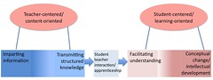

---
categories:
- chapter-2
- design-theory
- elearning
- phd
- psframework
- thesis
date: 2009-04-22 12:36:39+10:00
next:
  text: Usage of e-learning - quantity
  url: /blog2/2009/04/23/usage-of-e-learning-quantity/
previous:
  text: Pedagogy of the impressed - how teachers become victims of technology vision
  url: /blog2/2009/04/22/pedagogy-of-the-impressed-how-teachers-become-victims-of-technology-vision/
title: E-learning usage - quality
type: post
template: blog-post.html
comments:
    - approved: '1'
      author: novice9
      author_email: soaringorb@yahoo.com
      author_ip: 129.210.146.32
      author_url: http://novice9.wordpress.com/
      content: 'Minor typo: "The focus in on the learning process and most associated
        with a focus on what the student does. Students are seen as actively involved
        in the construction of their own learning" should be "The focus is on..." instead
        of "The focus in on." I''m not done reading this, but it''s been an interesting
        read thus far.'
      date: '2009-04-23 07:58:09'
      date_gmt: '2009-04-22 21:58:09'
      id: '2422'
      parent: '0'
      type: comment
      user_id: '0'
    - approved: '1'
      author: davidtjones
      author_email: d.jones@cqu.edu.au
      author_ip: 138.77.2.131
      author_url: https://djon.es/blog/
      content: Thanks muchly.  Have fixed this up in the post and in my thesis.
      date: '2009-04-23 08:48:49'
      date_gmt: '2009-04-22 22:48:49'
      id: '2423'
      parent: '2422'
      type: comment
      user_id: '1'
    - approved: '1'
      author: Julia
      author_email: juliaitani@gmail.com
      author_ip: 130.156.1.75
      author_url: http://
      content: Interesting piece. American community colleges make a great profit out
        of online courses because most of their students are located remotely or have
        schedule conflicts. And these colleges are expanding their online course offerings
        every semester. The school has one faculty to develop content (with or without
        any instructional design preparation) and then they hire an adjunct, that makes
        money out of teaching, to teach different sessions online. The model works fine.
        The faculty who developed that material is still faculty- or content-centered
        and mostly of what they do is to upload HTML files filled with texts and handouts.
        Sad for learners. (juliaitani.wordpress.com)
      date: '2009-04-24 01:28:41'
      date_gmt: '2009-04-23 15:28:41'
      id: '2425'
      parent: '0'
      type: comment
      user_id: '0'
    - approved: '1'
      author: davidtjones
      author_email: d.jones@cqu.edu.au
      author_ip: 59.154.24.147
      author_url: https://djon.es/blog/
      content: 'G''day Julia,
    
    
        There''s an approach used by a number of Australian universities that, while somewhat
        different, comes from the same pedigree and has a similar effect. But that approach
        has become so ingrained into the operations of those institutions it''s very difficult
        to break. And yet, while it can''t be broken I don''t think there''ll be any major
        changes in the quality of learning - let alone e-learning.
    
    
        David.'
      date: '2009-04-24 07:40:38'
      date_gmt: '2009-04-23 21:40:38'
      id: '2426'
      parent: '2425'
      type: comment
      user_id: '1'
    
pingbacks:
    - approved: '1'
      author: Usage of e-learning - quantity &laquo; The Weblog of (a) David Jones
      author_email: null
      author_ip: 74.200.245.187
      author_url: https://djon.es/blog/2009/04/23/usage-of-e-learning-quantity/
      content: '[...] The Weblog of (a) David Jones Another voice in the blogosphere    &laquo;
        E-learning usage -&nbsp;quality [...]'
      date: '2009-04-23 13:44:32'
      date_gmt: '2009-04-23 03:44:32'
      id: '2424'
      parent: '0'
      type: pingback
      user_id: '0'
    - approved: '1'
      author: 'Phd Update #8 - steaming ahead &laquo; The Weblog of (a) David Jones'
      author_email: null
      author_ip: 74.200.244.85
      author_url: https://djon.es/blog/2009/04/24/phd-update-8-steaming-ahead/
      content: '[...] of e-learning: quantity and quality (which has had a couple of comments
        - including a typo fix). [...]'
      date: '2009-04-24 15:01:39'
      date_gmt: '2009-04-24 05:01:39'
      id: '2427'
      parent: '0'
      type: pingback
      user_id: '0'
    - approved: '1'
      author: Lessons for e-learning &laquo; The Weblog of (a) David Jones
      author_email: null
      author_ip: 74.200.245.190
      author_url: https://djon.es/blog/2009/04/25/lessons-for-e-learning/
      content: '[...] already on the blog, including: History of technology-mediated learning,
        Paradigms of e-learning, e-learning usage - quality, and e-learning usage - [...]'
      date: '2009-04-25 16:10:21'
      date_gmt: '2009-04-25 06:10:21'
      id: '2428'
      parent: '0'
      type: pingback
      user_id: '0'
    - approved: '1'
      author: What can history tell us about e-learning and its future? &laquo; The Weblog
        of (a) David Jones
      author_email: null
      author_ip: 74.200.245.188
      author_url: https://djon.es/blog/2009/06/18/what-can-history-tell-us-about-e-learning-and-its-future/
      content: '[...] of what we know from the literature and also from the local institution
        about the quantity and quality of past usage of e-learning. With a particular
        focus on the [...]'
      date: '2009-06-18 10:49:59'
      date_gmt: '2009-06-18 00:49:59'
      id: '2429'
      parent: '0'
      type: pingback
      user_id: '0'
    - approved: '1'
      author: The adoption and acceptance of learning analytics | The Weblog of (a) David
        Jones
      author_email: null
      author_ip: 66.155.8.213
      author_url: https://djon.es/blog/2013/12/12/the-adoption-and-acceptance-of-learning-analytics/
      content: '[&#8230;] 10+ years later that usage of the LMS by academics was limited
        in terms of both quantity and quality, and more recent reports that understanding
        the information provided by learning analytics is [&#8230;]'
      date: '2013-12-12 16:35:11'
      date_gmt: '2013-12-12 06:35:11'
      id: '2430'
      parent: '0'
      type: pingback
      user_id: '0'
    
---
The following post is a continuation of posts from the "Past Experience" section of chapter 2 of [my thesis](/blog2/research/phd-thesis/). It follows on from previous posts including: [Ps Framework](/blog2/2009/03/18/the-ps-framework/), [History of technology-mediated learning](/blog2/2009/04/17/a-history-of-technology-mediated-learning/), and [the paradigms of e-learning](/blog2/2009/04/20/the-paradigms-of-e-learning/).

I'm currently working on the "e-learning usage" section. The aim here is to look at the quality and quantity of usage of e-learning over the last 10 years or so - i.e. in the industrial e-learning paradigm. The quality and quantity overviews are part of the same section, so the following includes the current introduction to the overall section and then gets into the discussion of quality. Hopefully the quantity section will be up ASAP.

As always, I'm more than happy to here suggestions for improvement, disagreement or any comments in general.

Eventually, at some stage in the thesis, I will be arguing that the reason behind the less than stellar quality of most industrial e-learning is due to a combination of over-emphasis on the technology and its promise; and an on-going ignorance of what it takes to improve the majority of learning and teaching at a university. In particular, I think I'll argue that this is the same ignorance that results in the majority of face-to-face teaching suffering from the same limited quality and that the current practices around industrial e-learning, rather than helping, are actually making things worse. At least for the majority of academics, though not the "long rangers" or Edupunks.

### Industrial e-learning usage - quantity and quality

This section seeks to summarise what is known about the usage of e-learning within higher education. As shown in the [previous section](/blog2/2009/04/20/the-paradigms-of-e-learning/), the use of e-learning within higher education can be traced back to around the early 1990s. Rather than examine the entire history of e-learning, this section will focus on the usage of the predominant and current e-learning paradigm – industrial e-learning. This section examines usage of industrial e-learning from two perspectives. The first perspective is that of the quality of the learning experience for all participants. The second perspective is in terms of the quantity of usage, in terms of number of staff and students, organizations and the tools they use. In summary, while there has been widespread adoption of industrial e-learning by institutions, the quality of the e-learning is questionable and the level of use, while growing, is still not deep nor broad.

#### Quality

Research into teaching within higher education has developed a rich body of knowledge that links the quality of student learning outcomes with the conceptions of learning and a link between the conceptions of teaching held by academics and their approaches to teaching (Kember and Kwan 2000; Norton, Richardson et al. 2005; Eley 2006; Gonzalez 2009). Kember (1997) identified two main orientations to teaching and five underlying conceptions positioned as well-defined points on a continuum. The two main orientations are:

1. teacher-centered/content-oriented; and  
    The focus is on the content to be taught and most associated with a focus on what the teacher does. Students are considered to be passive recipients of information.
2. student-centered/learning-oriented.  
    The focus is on the learning process and most associated with a focus on what the student does. Students are seen as actively involved in the construction of their own learning.

Figure insert cross ref is a representation of Kember's (1997) multiple-level categorisation model. An important point is that a transition from content-oriented to learning-oriented is a significant transition, while moving along the spectrum between the two conceptions under-pinning each orientation is relatively easy (Kember 1997).

_Figure 1 – A multiple-level categorisation model of conceptions of teaching (Kember 1997)_

In terms of which of these orientations is of the higher quality, it seems that the research literature is in increasing agreement. Herrington et al (2005) offer a 1974 quote from Olson and Bruner: "The acquisition of knowledge as the primary goal of education can be seriously questioned". A model of learning that focuses on the deep engagement of students with complex and realistic tasks is preferable to a model that focuses on information provision (Herrington, Reeves et al. 2005). Theories of learning that currently hold greatest sway are those based on constructivist principles that suggest learning occurs through the active construction of knowledge supported by various perspectives within meaningful contexts with social interactions playing a critical role (Oliver 2000). These theories fit directly within Kember's (1997) student-centred/learning-oriented orientation to teaching.

Given this recognition and fit it would be expected that the primary use of e-learning would be to support a student-centered/learning oriented orientation to teaching. In fact, it appears that the teacher-centred/content oriented dominants the practice of industrial e-learning. Much of the current research shows that academics use LMSes primarily to transmit course documents to students (Morgan 2003; Dutton, Cheong et al. 2004; Malikowski, Thompson et al. 2006). In the rush for universities to place courses on the Internet it is evident that the acquisition of knowledge remains the paramount goal for many educators (Herrington, Reeves et al. 2005). With few exceptions, almost all universities that have adoped a VLE have taken an approach where the VLE substitutes for existing media and have retained existing pedagogy (Salmon 2005) based on information distribution. For example, Dutton et al (2004) founding their study that most uses were anchored in traditional approaches to teaching with the technology primarily used as a substitute for the copier or projector.

Reeves, cited in Nichols (2003) describes the use of technology in education as far from innovative. From the evidence it is clear that there is an increasing use of industrial e-learning, however, there is not widespread change in pedagogy (Browne, Jekins et al. 2006). Industrial e-learning, for the most part, has involved fairly unsophisticated use of the available tools (Benson and Palaskas 2006). What limited use of technology there has been has sought to extend classroom pedagogy, either through the modest addition of resources or to extend the physical reach of the seat time-based teaching paradigm (Duderstadt, Atkins et al. 2002). Evidence suggests that universities are primarily using the LMS for administrative purposes with only a limited impact on pedagogy (OECD 2005). The vase majority of e-learning uses the same design and delivery model as on-campus courses (Twigg 2001).

Consequently, it is possible to suggest that the impact of industrial e-learning on the quality of learning has been somewhat limited. Harrington et al (2004) There is no evidence to suggest that adoption of an LMS leads to any increase in student learning to increases in the quality of teaching. Instead, the primary advantage behind use of an LMS was considered to be convenience to students (Harrington, Gordon et al. 2004). The value of e-learning is in maximising access to training opportunities and falls short of the potential for engaging learners in new ways (Pittard 2004). On most campuses the LMS is used to supplement traditional classroom courses (Warger 2003). In stark contrast to the imaginative and informal uses that students and faculty make of technologies, formal use of technology in most of higher education can be best described as sporadic, uneven and often low-level (Selwyn 2007).

However, given that web-based teaching is still less than ten years old, the application of the web to teaching and learning is still evolving (Bates 2004). Research into how people learn online is still in its infancy and more research is needed in order to understand the design of online learning that is engaging and effective (Herrington, Reeves et al. 2005). Research into the pedagogical issues that arise from the implementation of an LMS is still in its infancy (Coates, James et al. 2005). There is a need for further research to refine strategy dimensions defining approaches to teaching using the web (Gonzalez 2009). There are suggestions that no one approach, theory or solution is adequate for the design of e-learning (McLoughlin and Luca 2001).

### References

Bates, T. (2004). The promise and myths of e-learning in post-secondary education. The Network Society: A Cross-cultural Perspective. M. Castells. Cheltenham, UK, Edward Elgar**:** 271-292.

Benson, R. and T. Palaskas (2006). "Introducing a new learning management system: An institutional case study." Australasian Journal of Educational Technology **22**(4): 548-567.

Browne, T., M. Jekins, et al. (2006). "A longitudinal perspective regarding the use of VLEs by higher education institutions in the United Kingdom." Interactive Learning Environments **14**(2): 177-192.

Coates, H., R. James, et al. (2005). "A Critical Examination of the Effects of Learning Management Systems on University Teaching and Learning." Tertiary Education and Management **11**(1): 19-36.

Duderstadt, J., D. Atkins, et al. (2002). Higher education in the digital age: Technology issues and strategies for American colleges and universities. Westport, Conn, Praeger Publishers.

Dutton, W., P. Cheong, et al. (2004). "The social shaping of a virtual learning environment: The case of a University-wide course management system." Electronic Journal of e-Learning **2**(1): 69-80.

Eley, M. (2006). "Teachers' conceptions of teaching, and the making of specific decisions in planning to teach." Higher Education **51**(**_???_**): 191-214.

Gonzalez, C. (2009). "Conceptions of, and approaches to, teaching online: a study of lecturers teaching postgraduate distance courses." Higher Education **57**(3): 299-314.

Harrington, C., S. Gordon, et al. (2004). "Course Management System Utilization and Implications for Practice: A National Survey of Department Chairpersons." Online Journal of Distance Learning Administration **7**(4).

Herrington, J., T. Reeves, et al. (2005). "Online Learning as Information Delivery: Digital Myopia." Journal of Interactive Learning Research **16**(4): 353-367.

Kember, D. (1997). "A reconceptualisation of the research into university academics' conceptions of teaching." Learning and Instruction **7**(3): 255-275.

Kember, D. and K.-P. Kwan (2000). "Lecturers' approaches to teaching and their relationship to conceptions of good teaching." Instructional Science **28**(5): 469-490.

Malikowski, S., M. Thompson, et al. (2006). "External factors associated with adopting a CMS in resident college courses." Internet and Higher Education **9**(3): 163-174.

McLoughlin, C. and J. Luca (2001). Quality in online delivery: What does it mean for assessment in e-learning environments? 18th Annual Conference of the Australian Society for Computers in Learning in Tertiary Education, Melbourne.

Morgan, G. (2003). Faculty use of course management systems, Educause Centre for Applied Research**:** 97.

Nichols, M. (2003). "A theory for eLearning." Journal of Educational Technology and Society **6**(2): 1-10.

Norton, L., J. Richardson, et al. (2005). "Teachers' beliefs and intentions concerning teaching in higher education." Higher Education **50**(**_????_**): 537-571.

OECD (2005). E-Learning in Tertiary Education: Where do we stand? Paris, France, Centre for Educational Research and Innovation, Organisation for Economic Co-operation and Development.

Oliver, R. (2000). When teaching meets learning: Design principles and strategies for Web-based learning environments that support knowledge construction. ASCILITE'2000, Coffs Harbour.

Pittard, V. (2004). "Evidence for E-learning Policy." Technology, Pedagogy and Education **13**(2): 181-194.

Salmon, G. (2005). "Flying not flapping: a strategic framework for e-learning and pedagogical innovation in higher education institutions." ALT-J, Research in Learning Technology **13**(3): 201-218.

Selwyn, N. (2007). "The use of computer technology in university teaching and leanring: a critical perspective." Journal of Computer Assisted Learning **23**(2): 83-94.

Twigg, C. A. (2001). "Innovations in Online Learning: Moving Beyond No Significant Difference."   Retrieved 30 December, 2006, from [http://www.center.rpi.edu/Monographs/Innovations.html](http://www.center.rpi.edu/Monographs/Innovations.html).

Warger, T. (2003, July 2003). "Calling All Course Management Systems." University Business  Retrieved 30 December, 2006, from [http://universitybusiness.ccsct.com/page.cfm?p=315](http://universitybusiness.ccsct.com/page.cfm?p=315).