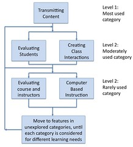

---
categories:
- chapter-2
- design-theory
- elearning
- phd
- psframework
- thesis
date: 2009-04-23 13:44:00+10:00
next:
  text: Models of growth - responding to the grammar of school
  url: /blog/2009/04/24/models-of-growth-responding-to-the-grammar-of-school/
previous:
  text: E-learning usage - quality
  url: /blog/2009/04/22/e-learning-usage-quality/
title: Usage of e-learning - quantity
type: post
template: blog-post.html
comments:
    []
    
pingbacks:
    - approved: '1'
      author: 'Phd Update #8 - steaming ahead &laquo; The Weblog of (a) David Jones'
      author_email: null
      author_ip: 74.200.244.85
      author_url: https://djon.es/blog/2009/04/24/phd-update-8-steaming-ahead/
      content: '[...] of e-learning: quantity and quality (which has had a couple of comments
        - including a typo fix). [...]'
      date: '2009-04-24 15:01:33'
      date_gmt: '2009-04-24 05:01:33'
      id: '2431'
      parent: '0'
      type: pingback
      user_id: '0'
    - approved: '1'
      author: Lessons for e-learning &laquo; The Weblog of (a) David Jones
      author_email: null
      author_ip: 74.200.245.190
      author_url: https://djon.es/blog/2009/04/25/lessons-for-e-learning/
      content: '[...] Lessons for&nbsp;e-learning  This posts contains the last content
        of what (I hope) will become the &#8220;Past Experience&#8221; section of Chapter
        2 of my thesis. Previous content for this section is already on the blog, including:
        History of technology-mediated learning, Paradigms of e-learning, e-learning usage
        - quality, and e-learning usage - quantity. [...]'
      date: '2009-04-25 16:10:27'
      date_gmt: '2009-04-25 06:10:27'
      id: '2432'
      parent: '0'
      type: pingback
      user_id: '0'
    - approved: '1'
      author: What can history tell us about e-learning and its future? &laquo; The Weblog
        of (a) David Jones
      author_email: null
      author_ip: 74.200.245.188
      author_url: https://djon.es/blog/2009/06/18/what-can-history-tell-us-about-e-learning-and-its-future/
      content: '[...] provide a summary of what we know from the literature and also from
        the local institution about the quantity and quality of past usage of e-learning.
        With a particular focus on the [...]'
      date: '2009-06-18 10:49:54'
      date_gmt: '2009-06-18 00:49:54'
      id: '2433'
      parent: '0'
      type: pingback
      user_id: '0'
    
---
The following post is a continuation of posts from the "Past Experience" section of chapter 2 of [my thesis](/blog/research/phd-thesis/). This part of chapter 2 is looking at the usage of e-learning within higher education. A [previous post](/blog/2009/04/22/e-learning-usage-quality/) provided the introduction to the section and also covered usage from a quality perspective - i.e. how good is the learning and teaching.

The aim of this post is to briefly examine what is known about the quantity of usage of e-learning within institutions. It does this by focusing on three different perspectives:

- Institutional - how many universities have adopted an LMS (just about all).
- Course of faculty - how many courses/staff are using an LMS (was low, but now increasing)
- Service or feature - how many of the features of an LMS are being used in those courses (predominantly content distribution).

As with the previous posts this is a summary. Consequently I have probably missed aspects and nuances. If you have any suggestions please fire away.

Also, as with other posts, I have not done a good proof-reading job on the content before I post them on the blog. At the moment, my emphasis is getting the content done as quickly as possible. Proof-reading will need to wait until later, when I have the energy and state of mind. If you pick up any, let me know.

### Quantity - how much is done

The previous section provided an overview of the quality of usage of industrial e-learning. This section seeks to examine the quantity of usage of industrial e-learning and will do so at three levels: organisational, courses and academics and features. The organisational section briefly examines what level of adoption industrial e-learning, in the form of LMSes, has amongst individual universities. The primary unit of teaching within a university and the primary organising construct within the LMS is that of a course. Typically the design and nature of each course is the responsibility of a particular academic. The course and academics examines adoption of LMSes at this level. Finally, each LMS provides a broad array of features and services that can be used to support learning. The features section examines how broadly these features are adopted within courses.

#### Organisations

The almost universal approach to the adoption of e-learning at universities has been the implementation of Learning Management Systems (LMS) such as Blackboard, WebCT, Moodle or Sakai (Jones and Muldoon 2007). Despite the associated complexities and risks almost every university seems compelled to have one (Coates, James et al. 2005). CMS have become perhaps the most widely used educational technologies within universities, behind only the Internet and common office software (West, Waddoups et al. 2006). Harrington, Gordon et al (2004) suggest that higher education has seen no other innovation result in such rapid and widespread use as the CMS. By 2005 almost every higher education institutions is or has plans to make use of a CMS (Salmon 2005). West, Waddoups et al (2006) express surprise at how quickly CMS have been adopted by universities, institutions which are know for reluctance towards change. Oblinger and Kidwell (2000) comment that the movement by universities to online learning was to some extent based on an almost herd-like mentality. Even though the perceived drivers for CMS are contestable, the perceived need for a CMS seems to be entrenched in the higher education sector (Wise and Quealy 2006).

Course Management Systems (CMS) are an essential feature of instructional technology at universities (Warger 2003). The 2003 Campus Computing project reports that more than 80% of United States universities and colleges utilize a CMS (Morgan 2003). Elgort (2005) cites work that indicates that 86% of 102 UK universities are using a CMS; all 18 surveyed New Zealand based institutions used a CMS; and all 33 Australian universities participating in a survey also used a CMS. Smissen and Sims (2002) found that 34 of the 37 Australian universities were using one of two CMS – Blackboard or WebCT. The almost universal adoption within the Australian higher education sector, a sector that has traditionally aimed for diversity and innovation, of just two commercial LMSs, which are now owned by the same company, is somewhat surprising (Coates, James et al. 2005). The mindset in recent times has focused on the adoption of the one-size-fits-all LMS (Feldstein 2006).

#### Courses

Even with the universal implementation of the LMSs, the level of adoption of those systems within many institutions has been limited (Jones and Muldoon 2007). In 2002, Lynch, reported in Shea et al (2005), estimates that while eighty percent of US-based four year colleges provide faculty access to LMSes, only twenty percent of staff use them in their courses. Vodanovich and Piotrowski (2005) report that of the 74% of faculty surveyed as being positive towards using the Internet for education, 70% view it as effective but only 47% actually used it for education. Other best practice implementations, recommended by LMS vendors, report no more than 55% staff adoption rates (Sausner 2005). Most universities are struggling to engage a significant percentage of students and staff in e-learning (Salmon 2005).

Even with a concerted effort to encourage adoption of the LMS, less than two-fifths of faculty in some disciplines use the LMS, and even then usage is limited to a small number of tools (Yohon, Zimmerman et al. 2004). Experience from one Australian university shows that as late as the second half of 2006, after over six years of institutional use of an LMS, only just over half of all courses offered had course websites (Jones and Muldoon 2007). Badge et al (2005) report about sixty percent adoption amongst staff but use is almost entirely for content distribution with some limited use of online assessment.

### Features

Coates et al (2005) suggest that it is the uptake and use of features, rather than their provision, that really determines their educational value. While there is not sufficient research into LMS usage for a formal meta-analysis, patterns have begun to appear (Malikowski 2008). A pattern that fits with the content-centric focus of the quality of industrial e-learning observed in the previous section. The usage pattern observed by West et al (2006) is that instructors rarely adopt all of the features of an LMS. Malikowski (2008) found the nearly half of all faculty members use one feature or less with those using multiple features significantly more likely to have experience with interactive technologies. Rather than adopt all features of an LMS, instructors face many smaller adoption decisions as they perform a cost/benefit analysis of each individual feature (West, Waddoups et al. 2006).

Malikowski et al (2007) propose a model for synthesising research into LMS feature usage that consists of five categories of feature, a suggested order in which features are adopted and an indication of how often features are used. The model is shown in Figure 1.

Figure 1 – Flowchat of LMS feature usage research categories (adapted from Malikowski, Thompson et al. 2007)

The five categories in the Malikowski et al (2007) model are:

1. transmitting course content;  
    Including the provision of files, grade information, and announcements to the entire class.
2. Creating class interactions;  
    Interaction between course members either synchronously or asynchronously including LMS email, discussion forums, interactive chat etc.
3. Evaluating students;  
    Tools, such as quizzes and assessment drop boxes, that aid in the evaluation of student learning.
4. Evaluating courses and instructors;  
    Features, primarily surveys, that enable the evaluation of the course or instructor.
5. Computer-based instruction;  
    Based on very simple features, when compared to much earlier research mentioned in a previous section. Features in current LMS relate to the adaptive release of content or other services based on student activity.

The Malikowski et al (2007) model also identifies these categories based on level of observed use with transmitting content most used; evaluating students and creating class interactions moderately used; and evaluating courses and instructions and computer-based instruction rarely used. This is illustrated through a series of tables that draw on usage figures from research literature. Table 1 is an adaptation and summary of this work. The last two categories are not shown in Table 1 due to extremely limited reported data on usage.

**Note:** In the thesis this is one table. However, that doesn't work on the narrow confines of the blog. So I have to break it up into 3 different tables - which is what Malikowski et al (2007) did. They actually discussed in much more detail each category.

| Location | N | Transmitting content |  |  |
| --- | --- | --- | --- | --- |
| \>38 American institutions (Woods, Baker et al. 2004) | 862 | 86% | Not reported | 59% |
| University of Wisconsin-Milwaukee (Morgan, 2003) | 342 | 80% | 81% | 57% |
| University of Wisconsin-Whitewater (Morgan, 2003) | 276 | 67% | 87% | 47% |
| University of Wisconsin-Stout (Morgan, 2003) | 166 | 71% | 67% | 58% |
| University of Nebraska at Lincoln (Ansorge and Bendus 2003) | 192 | 69% | not reported | not reported |
| Private US University (Dutton, Cheong et al. 2004) | 191 | 1st and 2nd of 17 | 5th of 17 | 9th of 17 |

Table 1 - Summary of LMS usage for transmitting content (adapted from Malikowski, Thompson et al. 2007)  
a Results were provided for multiple semesters, only the most recent semester (spring 2002) shown here.  
b Results presented as a ranked list of 17, most used features first.  

| Location | N | Creating class interaction |  |
| --- | --- | --- | --- |
|  |  | Asyncrhonous | Synchronous |
| 38 American institutions (Woods, Baker et al. 2004) | 862 | 25% | 3% |
| University of Wisconsin-Milwaukee (Morgan, 2003) | 342 | 28% | "Low levels" |
| University of Wisconsin-Whitewater (Morgan, 2003) | 276 | 28% | "Low levels" |
| University of Wisconsin-Stout (Morgan, 2003) | 166 | 24% | "Low levels" |
| University of Nebraska at Lincoln (Ansorge and Bendus 2003) | 192 | 17% | 1% |
| Private US University (Dutton, Cheong et al. 2004) | 191 | 5th of 17 | Last of 17 |

Table 2 - Summary of LMS usage for creating class interaction (adapted from Malikowski, Thompson et al. 2007)  

a Results were provided for multiple semesters, only the most recent semester (spring 2002) shown here.  
b Results presented as a ranked list of 17, most used features first.  

| Location | N | Evaluating students |  |
| --- | --- | --- | --- |
|  |  | Quiz | Drop box |
| 38 American institutions (Woods, Baker et al. 2004) | 862 | 75% never in exams   59% never for quizzes | 56% never use |
| University of Wisconsin-Milwaukee a (Morgan, 2003) | 342 | 25% used assessments | Not reported |
| University of Wisconsin-Whitewater a (Morgan, 2003) | 276 | 21% used assessments | Not reported |
| University of Wisconsin-Stout a (Morgan, 2003) | 166 | 27% used assessments | Not reported |
| University of Nebraska at Lincoln (Ansorge and Bendus 2003) | 192 | Not reported | Not reported |
| Private US University b (Dutton, Cheong et al. 2004) | 191 | 15th of 17 | Not reported |

Table 3 - Summary of LMS usage for evaluating students (adapted from Malikowski, Thompson et al. 2007)  
a Results were provided for multiple semesters, only the most recent semester (spring 2002) shown here.  
b Results presented as a ranked list of 17, most used features first.  

### References

Ansorge, C. and O. Bendus (2003). The pedagogical impact of course management systems on faculty, students, and institution. Web-based learning: What do we know? Where do we go? R. Benning, C. Horn and L. PytlikZillig. Greenwich, CT, Information Age Publishing: 169-190.

Badge, J. L., A. J. Cann, et al. (2005). "e-Learning versus e-Teaching: Seeing the Pedagogic Wood for the Technological Trees." _Bioscience Education E-Journal_ **5**.

Coates, H., R. James, et al. (2005). "A Critical Examination of the Effects of Learning Management Systems on University Teaching and Learning." _Tertiary Education and Management_ **11**(1): 19-36.

Dutton, W., P. Cheong, et al. (2004). "An ecology of constraints on e-learning in higher education: The case of a virtual learning environment." _Prometheus_ **22**(2): 131-149.

Elgort, I. (2005). _E-learning adoption: Bridging the chasm_. Proceedings of ASCILITE'2005, Brisbane, Australia.

Feldstein, M. (2006). Unbolting the chairs: Making learning management systems more flexible. _eLearn Magazine_. **2006**.

Harrington, C., S. Gordon, et al. (2004). "Course Management System Utilization and Implications for Practice: A National Survey of Department Chairpersons." _Online Journal of Distance Learning Administration_ **7**(4).

Jones, D. and N. Muldoon (2007). _The teleological reason why ICTs limit choice for university learners and learning_. ICT: Providing choices for learners and learning. Proceedings ASCILITE Singapore 2007, Singapore.

Malikowski, S. (2008). "Factors related to breadth of use in course management systems." _Internet and Higher Education_ **11**(2): 81-86.

Malikowski, S., M. Thompson, et al. (2007). "A model for research into course management systems: bridging technology and learning theory." _Journal of Educational Computing Research_ **36**(2): 149-173.

Morgan, G. (2003). Faculty use of course management systems, Educause Centre for Applied Research**:** 97.

Oblinger, D. and J. Kidwell (2000). "Distance learning: Are we being realistic?" _EDUCAUSE Review_ **35**(3): 30-39.

Salmon, G. (2005). "Flying not flapping: a strategic framework for e-learning and pedagogical innovation in higher education institutions." _ALT-J, Research in Learning Technology_ **13**(3): 201-218.

Sausner, R. (2005). Course management: Ready for prime time? _University Business_.

Shea, P., A. Pickett, et al. (2005). "Increasing access to Higher Education: A study of the diffusion of online teaching among 913 college faculty." _International Review of Research in Open and Distance Learning_ **6**(2).

Smissen, I. and R. Sims (2002). _Requirements for online teaching and learning at Deakin University: A case study_. Eighth Australian World Wide Web Conference, Noosa, Australia.

Vodanovich, S. J. and C. Piotrowski (2005). "Faculty attiudes towards web-based instruction may not be enough: Limited use and obstacles to implementation." _Journal of Educational Technology Systems_ **33**(3): 309-318.

Warger, T. (2003, July 2003). "Calling All Course Management Systems." _University Business_  Retrieved 30 December, 2006, from _[http://universitybusiness.ccsct.com/page.cfm?p=315](http://universitybusiness.ccsct.com/page.cfm?p=315)_.

West, R., G. Waddoups, et al. (2006). "Understanding the experience of instructors as they adopt a course management system." _Educational Technology Research and Development_.

Wise, L. and J. Quealy. (2006, May, 2006). "LMS Governance Project Report." from _[http://www.infodiv.unimelb.edu.au/telars/talmet/melbmonash/media/LMSGovernanceFinalReport.pdf](http://www.infodiv.unimelb.edu.au/telars/talmet/melbmonash/media/LMSGovernanceFinalReport.pdf)_.

Woods, R., J. Baker, et al. (2004). "Hybrid structures: Faculty use and perception of web-based courseware as a supplement to face-to-face instructions." Internet and Higher Education 7(4): 281-297.

Yohon, T., D. Zimmerman, et al. (2004). "An exploratory study of adoption of Course Management Systems and accompanying instructional changes by faculty in the Liberal Arts and Sciences." _Electronic Journal of e-Learning_ **2**(2): 313-320.