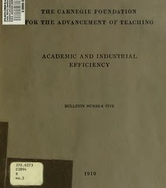

---
categories:
- chapter-2
- design-theory
- phd
- psframework
- thesis
date: 2009-05-10 13:12:22+10:00
next:
  text: Quotes about innovation and creativity
  url: /blog2/2009/05/13/quotes-about-innovation-and-creativity/
previous:
  text: Why don&#039;t we (e-)learn - over emphasis on rationality and defensive routines
  url: /blog2/2009/05/08/why-dont-we-e-learn-over-emphasis-on-rationality-and-defensive-routines/
title: Everything old is new again - universities should be more business like
type: post
template: blog-post.html
comments:
    []
    
pingbacks:
    - approved: '1'
      author: 'Phd Update #11 &#8211; very short week &laquo; The Weblog of (a) David
        Jones'
      author_email: null
      author_ip: 74.200.245.176
      author_url: https://djon.es/blog/2009/05/15/phd-update-11-very-short-week/
      content: '[...] Everything old is new again &#8211; sparked by one of the texts
        I used in the Institution section. It examines how much of the concern shown today
        about universities, has been going on for sometime. [...]'
      date: '2009-05-15 15:38:59'
      date_gmt: '2009-05-15 05:38:59'
      id: '2499'
      parent: '0'
      type: pingback
      user_id: '0'
    
---
In [a previous post](/blog2/2009/05/06/university-change-or-die-and-another-problem-with-the-lms-model/) I mentioned the current raft of "the university will die" discussions going on online and soon in print. Many of these, and especially [this one](http://www.popecenter.org/clarion_call/article.html?id=2161), embody some sort of argument along the lines of "those silly, impractical academics will only be helped if they become more like business". This is not a new perspective.

The book cover to the left is from Cooke (1910), the full text of which is available on the [Internet archive](http://www.archive.org/details/academicindustri05cookuoft). I'm aware of it because of Birnbaum (2000). Cooke (1910) illustrates that there have been "huge problems" for universities and that they will be saved by those wonderful business men (and yes, I'd say that in 1910 they were mostly men) has a long history.

Some quotes, origins

> The reason for such a study as is set forth in the present bulletin is found partly in the existence in the college of new and large problems and partly in the criticisms of American colleges and universities made during the past few years by business men.

Universities are expanding, growing and dealing with change

> it will be generally admitted that in a few decades our colleges and universities have expanded enormously, and that they have undertaken, under new and hitherto unknown conditions, operations of far greater complexity than they dealt with during the previous quarter century.

Recognition that there are some differences

> The college is partly a business, and partly something very different from a business. Mr Cooke is concerned only with the former aspect. It will be interesting for those to whom the latter viewpoint is more natural to consider how far his observations have suggestive significance.

The above quotes are by Henry Pritchett in the preface to the report.

Findings of Cooke

> As a result of this inquiry, the writer is convinced that there are very few, if any, of the broader principles of management which obtain generally in the industrial and commercial world which are not, more or less, applicable in the college field, and as far as we discovered, no one of them is now generally observed.

The "perfect" version of business.

> Management by experts suffers from the fact that too often in the past experts have not only held themselves aloof, but held their opinions to be above lay criticism or comment. Functional management seems to guard against this by providing that all standards shall be written out and thus clearly understood by everyone; that they shall be capable of scientific demonstration rather than the result of personal opinion; and that they shall be at all times subject to scientific re-examination and analysis. In thise way only can expert judgements be given the benefit of the corrective influence of lay minds.

Sounds very much like [mode 1 behaviour](/blog2/2009/05/08/why-dont-we-e-learn-over-emphasis-on-rationality-and-defensive-routines/)

### References

Birnbaum, R. (2000). Management Fads in Higher Education: Where They Come From, What They Do, Why They Fail. San Francisco, Jossey-Bass.

Cooke, M. (1910). Academic and Industrial efficiency. New York, Carnegie Foundation for the Advancement of Teaching.