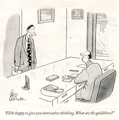

Theoretically, I'm in the process of starting [a new job](/blog2/2009/08/20/elearning-and-innovation-specialist-report-1-4-20-august)/ that is focused on encouraging e-learning and innovation within a university context. The following post is an early attempt to try and make sense of this job, what it might do and how it might do it. It's probably of little value to others, but I'm trying to be open about this.

This is still early days and the understanding will continue to grow and change. Due to the nature of human beings as [pattern matching intelligences](http://www.cognitive-edge.com/blogs/dave/2008/08/imperium_cogito.php) this exploration will necessarily, as arising out of my own attempts to make sense of this job, illustrate my past experiences and patterns of action. Feel free to disagree and suggest alternative perspectives.

### The model

The following started out as a 2x2 framework but has evolved as I've been writing this post. The attempt of the model is to represent the process and two of the decisions that have to be answered went attempting a change or innovation within an organisation. In summary, the idea is that:

- Some **spark** creates the need for the change or innovation.
- This makes it necessary to decide **what to do** in order to respond to the spark.
- Once what is decided it is necessary to decide **how to do it**.
- How things are done can also contribute to the next or different sparks.

I've purposely not included numbers in the above list. Cycles can start in any of these stages and there isn't always a cycle. In fact, some might argue a significant flaw in many organisations is a failure to draw knowledge from how things were done in order to inform the next spark. Alternatively, it may not always be possible to connect the causal cycle until after the fact.

#### The spark

There is generally a spark, some event, thing, or knowledge that makes it necessary to make some change or undertake some action. It might be to solve a problem or achieve a goal. The spark may not be identified prior to the change, only after. The model suggests that such a spark can arise from a spectrum with two extreme dimensions:

1. Idealistic; and  
    In this context, something at the idealistic end would generally be something created by an expert, management or government. For example last night the Australian Federal Government released it's budget for the next year and it includes [a number of projects and changes](http://www.theaustralian.news.com.au/story/0,25197,25470917-12332,00.html) that will require strategic responses from Australian Universities. Alternatively, it might be something internal to an organisation such as the [appointment of a new Vice-Chancellor](http://uninews.cqu.edu.au/UniNews/viewStory.do?story=5831).
2. Naturalistic.  
    In this context, this is understood to be something that arises from the "coal-face" of the organisation. An extreme example might be an individual academic faced with a group students not understanding a particular concept.

This is meant to be a spectrum, an example from the middle might be an institution (not a single academic) identifying long turnaround times on assignment feedback.

#### What to do

Given a spark, it is necessary to identify what to do. What can be done to respond to the spark? Of all the different projects that might work, how does an institution or individual identify what to do?

The model represents two extreme ends of a spectrum:

1. Fad; and  
    This is where a project is chosen simply because someone else has done it. e.g. "boys with toys" represents a lone-ranger academic adopting the use of Twitter because he saw the Oprah show on Twitter.
2. Knowledge.  
    The chosen project is identified based on some theoretical knowledge - be it organisational, learning, technical etc - and its application to the local context. For example, the adoption of constructive alignment based on the ideas of Biggs.

#### How to do it

Having decided what to do, it is now necessary to plan how to do it. This spectrum draws on a distinction made by Kurtz and Snowden (2007) and is [one I've used before](/blog2/2009/03/09/how-to-improve-lt-and-e-learning-at-universities/). The following table compares the two approaches.

| Idealistic | Naturalistic |
| --- | --- |
| Achieve ideal state | Understand a sufficiency of the present in order to stimulate evolution |
| Privilege expert knowledge, analysis and interpretation | Favour enabling emergent meaning at the ground level |
| Separate diagnosis from intervention | Diagnosis and intervention to be intertwined with practice |

Snowden's point - and I agree - is that idealistic approaches only work in contexts in which there is a clear connection between cause and effect. i.e. you can predict that if you do X, then Y will happen. Snowden points out in his Cynefin framework and associated writing that there are other contexts, that require different approaches.

### Putting the model in context

The rest of the post attempts to use the above model to begin understanding the context within which the [new job](/blog2/2009/08/20/elearning-and-innovation-specialist-report-1-4-20-august)/ takes place. The aim is to help me formulate plans for the position that I need to raise with the hierarchy to get approval. It covers

- the spark; and  
    An attempt to identify factors, both naturalistic and idealistic, that are creating a need for change or innovation within the institution.
- a list of projects.  
    Based on combination of "what to do" and "how to do it" and knowledge/prejudices around the local context identify an initial list of potential projects.

Some of the thinking that follows does (or will/should) include a range of existing projects and processes within the organisation. While the new position may not be directly connected with these projects and processes it is necessary for the position to be aware of an work with those projects and processes.

This is only an initial list - it will grow and change as time goes by.

### The spark

The following aims to provide an initial list of potential sparks that might be important for the new position to either do something about or at least work with or inform. I've attempted to group them in some initial rough categories as a way to help brainstorm:

- From the position description.
- Organisational strategic plans.
- Organisational factors.
- Government policies and other external factors.

#### From the position description

The new position comes with a list of accountabilities by which the incumbent will be judged. Not surprisingly, this focuses the attention. The following are drawn from those accountabilities.

- [Teaching/Research nexus](/blog2/elearning-and-innovation/#SoTL).
- [Scholarship of teaching and learning](/blog2/elearning-and-innovation/#SoTL).
- [Industry development and trends](/blog2/elearning-and-innovation/#Trends).  
    [George Siemens](http://www.elearnspace.org/blog/2009/04/30/analysis-of-emerging-trends-affecting-the-use-of-technology-in-education/) points to some sources for emerging trends including [BECTA analysis of emerging trends](http://emergingtechnologies.becta.org.uk/index.php?section=etr&rid=14522), the [Horizon project](http://www.nmc.org/horizon) and [ideas about future thinking](http://www.icvet.tafensw.edu.au/resources/futures_thinking.htm). There's also [TrendWatching.com](http://trendwatching.com/trends/innovationjubilation/).
    
    Of course, I have some questions about how people and their pattern matching intelligences can be good at futures thinking. I tend to prefer the aproach embodied in Alan Kay's quote
    
    > The best way to predict the future is to invent it.
    
- [Literature](/blog2/elearning-and-innovation/#CommunicateAndPublish).

#### Organisational strategic plans

Like most institutions mine has developed a [strategic plan](http://content.cqu.edu.au/FCWViewer/view.do?page=8281), but it also has a range of other organisational goals, understandings and cultures that also have to be considered. I need to better understand these.

First, focus on the strategic plan which is divided up into 8 main sections. Many of the components of these aims are the responsibility of existing organisational units. I'll focus on the ones that appear to connect with the new job, but leave the others in but struck through. Each component is further divided into: what we need to do; how we will do it; how will we know that we are doing it well.

1. Learning and Teaching
    - What we need to do
        - Provide a multimodal educational platform supported by appropriate technology.
        - Ensure that programs meet future industry and community needs.
        - Provide multiple pathways and a seamless fit for articulating students.
        - Improve student retention and progression rates.
        - Support collaboration within and across campus and administrative structures to ensure successful student learning.
        - Develop and reward staff capability in innovative curriculum design, teaching and assessment, and the scholarship of learning and teaching
    - How we will do it
        - Progress the implementation of the Student Learning Journey.
        - Benchmark programs against relevant industry and labour market needs.
        - Review graduate attributes and improve integration into programs.
        - Provide formal and informal mentoring for new academic and casual teaching staff.
        - Identify, develop and support learning and teaching leaders.
        - Support staff to engage in the scholarship of learning and teaching and develop innovative practices.
    - Doing it well?
        - Improved Course Experience Questionnaire (CEQ) and Graduate Destination Survey (GDS) outcomes against benchmarked universities.
        - Improved Learning and Teaching Performance Fund outcomes.
        - Increase in the quality of Australian Learning and Teaching Council (ALTC) awards and grants applications and maintenance of success in an increasingly competitive arena.
        - Improved student engagement as measured by the Australasian Survey of Student Engagement.
        - Improved Student Evaluations of Teaching and an increase in the number of students participating.
2. Research and innovation
    - What we need to do
        - Support research excellence in the University’s priorities for research that contribute to the Resource Industries; Community Health and Social Viability; and Intercultural Education and that this research meets the needs of the communities we serve.
        - Develop and support a vibrant research culture and intellectual environment.
        - Enhance the quality and dissemination of research outcomes.
        - Support quality research programs to enable staff and students to achieve success and realise their full potential.
        - Provide quality, relevant services and support to research stakeholders.
        - Increase the University’s research performance.
    - How we will do it
        - Increase external research income through effective policies, training and processes and focus investment for growth in the Research Institutes.
        - Provide training, staff development, networking and mentoring for staff involved in research and reward excellence and encourage exploration and innovation.
        - Research and university leaders will work strategically with industry, community, government and other stakeholders to align research priorities with industry needs.
        - Foster an environment of active enquiry, innovative development and effective dissemination
    - Doing it well?
        - External research income to increase by 50% in the next 2 years and to be benchmarked against other institutions.  
            _There is an interesting split between "innovation"/L&T funding and research funding._
        - Receipt of external research investments other than research project income.
        - Improvement in the quantum of quality publication outputs registered each year by category and compared with other institutions.
        - Improvement in the University ranking for external research performance funds relative to the sector.
        - Increase in the number of research active staff by 5% per annum.
        - Increase in the number of Research Higher Degree enrolments and increase in the number of Research Higher Degree students completing on time or earlier
3. Community engagement
4. Domestic engagement
    - What we need to do
        - Address the shortfall in domestic student enrolments as a matter of urgency through a range of strategies to build demand, attract students to CQUniversity and improve retention.
        - Develop appropriate contemporary programs and courses to meet the needs of domestic students, increasing participation, access, retention and success of students.
        - Develop new ways to attract students to CQUniversity including building on marketing initiatives, the re-branding exercise and redressing reputational issues.
        - Develop new ways to engage with industry, business and the community via new learning initiatives.
        - Develop new educational models for the future that are aligned with our broad mission “to be what you want to be”.
        - Explore ways to increase distance education offerings and enhance our reputation as a renowned distance education provider
    - How we will do it
        - Continue the development of new suites of contemporary programs in areas of demonstrated demand.
        - Implement the new brand.
        - Improve customer service led by Navigate CQUniversity.
        - Implement Alternative Pathways in 2008.
    - Doing it well?
        By achieving our student enrolment targets (not necessarily DEEWR targets).- Increase in domestic student retention rates by 1% per annum.
        - 5% increase per annum in number of students entering bridging programs and progressing to award studies.
        - Increase in access and participation rates for equity students.
        - Increase the access and participation of Aboriginal and Torres Strait Islander students
5. International engagement
    - What we need to do
    - How we will do it
        - Build staff capability in learning and teaching related to international students, especially curriculum design and culturally inclusive teaching practices which meets the needs and expectations of international students.
        - Establish priorities and encourage engagement in research through IERI (Intercultural Education Research Institute) that informs international education in areas of policy, systems, planning, pedagogy and others.
        - Develop and implement the new CQUniversity/CMS interface and maximise the benefits resulting from 100% ownership of CMS by expanding the range of academic programs at the Australian International Campuses.
        - Explore low risk delivery mechanisms and pathway linkages.
        - Increase student and staff mobility through improved Study Abroad and Exchange programs.
    - Doing it well?
6. People and performance
    - What we need to do
        - Fully integrate the human resource strategy with the organisational strategy, via the implementation of the Management Plan – Human Resources.
        - Invest in the development of staff to ensure that they have the requisite skills and abilities to support the attainment of the University’s strategic objectives.
        - Develop whole of University strategies in support of improved staff morale.
        - Facilitate opportunities for collaborative projects across organisational boundaries. - **this is interesting**
        - Provide a safe workplace for staff and students and meet all Workplace Health & Safety legislative requirements.
    - How we will do it
        - Complete the organisational restructure process by end 2008.
        - Implement revised PRPD processes.
        - Develop workforce planning and succession planning tools.
        - Develop recruitment strategies to attract and recruit high performing staff.
        - Provide management and leadership training for all managers and supervisors.
        - Negotiate a new Union Collective Agreement prior to the nominal expiry date of the current agreement.
        - Encourage active staff involvement in professional bodies.
        - Conduct focus groups with staff on ways to improve staff morale.
        - Facilitate greater opportunities for meaningful communication between staff and University managers at all levels across the University.
        - Develop Service Level Agreements for the delivery of human resources services across the University.
        - Reduce the number of staff and student injuries on University property through a range of strategies.
    - Doing it well?
7. Resources, systems and infrastructure
    - What we need to do
        - Increase revenue and decrease costs.
        - Ensure an appropriate linkage between the planning and budget functions of the organisation.
        - Ensure management has access to the appropriate and timely information and reporting tools.
        - Ensure the University has a Strategic Asset Management Plan to support our strategic initiatives.
        - Ensure the University has an ICT Management Plan which supports our strategic initiatives.
        - Ensure campus development plans are in place to support the future operational and strategic needs of the university.
        - Ensure the University has a Financial Management Plan which supports the strategic direction of the University.
        - Work towards sustainable resource management and leadership in environmental outcomes from our operations
    - How we will do it
    - Doing it well?
8. Governance and quality

Need to find out which parts of the organisation are responsible for the above and what they are doing.

#### Organisational factors

Perhaps the most open to debate, given lack of agreement amongst stakeholders and some of the points about Model 1 behaviour, but just as important. Some of the following connect with strategic plans.

- Evaluation of learning and teaching - beyond just course based and other limitations.
- Flexibility and quality of learning platforms and technologies.
- Actual quality of learning and teaching, administration, e-learning.
- An emphasis on fad and idealistic dimensions.

#### Government strategies

- Teaching funding linked to performance outcomes on quality, particiaption and completion rates.
- Student centred funding.

### List of projects

An early version of the model in this post was a traditional 2x2 model (with slightly different labels). While I've moved on from there and think the two dimensions are spectrums the 2x2 model offers some help in understanding what could be done. The following table summarises.

| Sector | Description | What can be done |
| --- | --- | --- |
| Idealistic-fads | The pre-dominant mode within organisations. | This position will probably have little influence on these projects as they are driven by senior management. The best that can be hoped is to provide evidence and insight to those making decisions. Focused on nature of the organisation and the experience of students and staff. Helping increase the quality and quantity of the feedback to these folk. Make them aware of the limitations of the chosen approaches. Make sure that the knowledge generated from these projects is available and used to inform subsequent projects. Be aware of the fads/trends that are rising and become familiar with them. Perhaps attempt. |
| Idealistic-knowledge | Generally limited use at the organisational level, some use in isolated areas | The insights from the projects are likely to be useful. Ensure that the knowledge is disseminated and informs subsequent projects. Be aware of the types of knowledge that can help inform proejcts and their implementation.  This is probably where traditional university "innovation" grants sit. Probably have to engage with these but the cartoon below stikes me as saying a few things about these grants and there's also the [work of Findlow.](/blog2/2009/03/18/blame-the-teacher-and-its-negative-impact-on-learning-and-e-learning/)   |
| Naturalistic-fads | A common approach - often seen in lone rangers | No point, ability or benefit in stopping these. Better to help inform their implementation and learn their lessons. How to do this effectively is another question. There are some connections here or perhaps in the next sector with [incremental, cumulative improvement](http://tlt-swg.blogspot.com/2008/02/fostering-incremental-cumulative.html) arising out of the work of the [Teaching, Learning, Technology group](http://www.tltgroup.org/). |
| Naturalistic-knowledge | Rarely used and the sector I feel most appropriate for innovation around learning and teaching. | Have talked previously about the idea of reflective alignment. Something I'd like to try. Perhaps there are others. |

