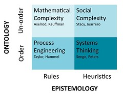
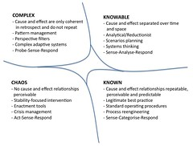

For longer than I care to remember, I've been working on the [Place](/blog2/2009/05/06/place-component-of-the-ps-framework/) component of the [Ps Framework](/blog2/2009/03/18/the-ps-framework/) for chapter 2 of my [thesis](/blog2/research/phd-thesis/). This post brings the penultimate section for the Ps component - institution. The last section will be the "lessons from place" section that attempts to draw some lessons from the Place component for the practice of e-learning. Who knows when that will arrive.

As with previous parts of the thesis, this is a first draft with only a modicum of re-reading. There are likely to be mistakes. More in-depth editing will wait for a later time.

### Institution

The previous sections have focused on the nature of changes to the society ([2.1.1 - Society](/blog2/2009/05/08/society-an-aspect-of-place-impacting-on-e-learning/)) and the impact of these changes on the higher education sector ([2.1.2 - Sector](/blog2/2009/05/08/sector-another-part-of-place/)). This section moves toward examining the factors associated with individual institutions that can enable, hinder and inform the implementation of e-learning. The institutional context plays a dominant role in shaping the content and process of user participation and change management in systems development (Butler and Fitzgerald 2001). An understanding of the driving and restraining forces within an individual academic context is important to determining whether a broad-scale e-learning strategy is feasible (Parchoma 2006). In terms of the adoption of e-learning, institutional context is all important (Nichols 2007).

This section examines institutional factors through three parts. First, it examines the differences that are visible between different approaches to understanding universities and organizations more broadly. Finally, the nature and features of the culture and sub-cultures within higher education are examined. The next section (2.1.4 - Lessons from Place) seeks to draw on the information presented as part of the Place component of the Ps Framework to identify some lessons for e-learning implementation within universities.

#### Types of institution - points of difference

New ideas in business, many of which become fads, are often presented as universally applicable quick-fix solutions (Birnbaum 2000). Ideas that have universal applicability (Snowden 2005), which regardless of obvious differences between sectors and organizations assume, at some level, that there is sufficient similarity so as to not negatively impact the migration of the idea and its success from one context to another. As observed in the previous section there is a trend towards the standardisation of universities to enable interoperability, comparison and ranking that increasingly illustrates this assumption of similarity. At the same time there is an on-going and long standing push to perceive and manage universities in ways very similar to other commercial organizations. Birnbaum (2000) provides examples of attempts to treat universities as commercial businesses throughout the 20th century.

However, writing in the preface to Cooke (1910) Henry Pritchett suggests "college is partly a business, and partly something very different from a business". This is suggestive that there are differences and one of the main aims of this section to illustrate those differences. The assumption is that these differences suggest that migration of ideas between different organizations may be more problematic than apparently accepted in some of the literature. The particular differences highlighted here include differences: in abstractions for understanding organizations; in types of organizations; and between universities.

**Differences in abstractions for understanding organizations.** It has been suggested that, at least theoretically and anecdotally, there is evidence to suggest that organisational science has a conceptual bias at the level of their key object of research and practice, the organisation (Adams and Ingersoll 1985). There is an over-emphasis on organisational metaphors that seek to structure and understand organizations as rational, stable and purpose driven entities (Behrens 2007). This fits with the current age and culture which is one of technical rationality with a pre-disposition to the use of scientific-analytic lenses that provide overly rationalised accounts of organisational life and keep much of the nature of organizations invisible (Adams 1994). Organisational science has been criticised for an over emphasis on metaphors that view organizations as machines or organisms in a preference to the culture metaphor (Behrens 2007).

Even with the over-emphasis on the purpose-driven, the literature does contain a number of examples where organisational diversity is shown. Handy (2005) identifies four different types of organizational culture – role, achievement, power and support. Mintzberg (1993) grouped organizational structures into five clusters (see Table 2.3) based on the prime coordinating mechanism, the key level within the organisation and the type of decentralization. Maister (1993) suggests that professional firms differ from other business enterprises in that they provide highly customized services in highly personalized ways. Differences that mean many of the management principles such as standarisation, routinisation, and supervision difficult to apply (Maister 1993). In addition, it is not structure, culture or systems alone that determine outcomes, human agency means that individuals and groups within the organisation have a choice about how they act and respond (Knight and Trowler 2000).

Table 2.3 - Mintzberg's structural configuration of organizations (adapted from Unger, Macq et al. 2000)
| Structural Configuration | Prime coordinating mechanism | Key part of organisation | Type of decentralization |
| --- | --- | --- | --- |
| Simple structure | Direct supervision | Strategic apex | Vertical and horizontal centralisation |
| Machine bureaucracy | Standardisation of work processes | Technostructure | Limited horizontal decentralisation |
| Professional bureaucracy | Standisation of skills | Operating core | Vertical and horizontal decentralisation |
| Adhocracy | Mutual adjustment |  | Selective decentralisation |

The ability of human systems to shape their perception and consequently to co-evolve concept and practice in order to create a new reality is one of the insights that arise from social complexity (Snowden and Stanbridge 2004) and is one of the factors that leads Snowden and others to develop a landscape of management (Figure 2.1) and the Cynefin framework (Snowden and Stanbridge 2004; Snowden 2005; Snowden and Boone 2007). Snowden and Stanbridge (2004) suggest that the dominant ideology of management – discussed above as the over emphasis on technical rationality – arises from a focus on a single-ontology approach to sense making that assumes that through proper investigation things are known or knowable and that once cause and effect relationships are discovered, they repeat. This view is not seen as incorrect or denied, but it is, however, seen as only appropriate in certain bounded circumstances (Snowden 2005).

  
_Figure 2.1 - Landscape of Management (adapted from Snowden and Stanbridge 2004)_

The reliance on this single-ontology perspective and it's overgeneralization has subsequently led to an absence of understanding of different perspectives that may be more appropriate for different circumstances. As an alternative Snowden and others develop models (Figure 2.1 and Figure 2.2) based on a multi-ontology sense-making model of decision-making. Within these models there is a space for traditional business oriented approaches that assume ordered systems that have clearly identifiable cause and effect relationships that enable prediction of future events (Snowden 2005). However, there is also recognition of different types of system that demonstrate un-order. Un-ordered systems do not demonstrate a lack of order, but instead demonstrate an "emergent" order that is understandable in retrospect, but cannot be predicted (Snowden and Stanbridge 2004). Within the landscape of management (Figure 2.1) order and un-order are seen as disjoint domains, whereas epistemology is presented as a continuum from very specific rules through to heuristics, guiding principles or implicit rules of thumbs with high levels of ambiguity (Snowden and Stanbridge 2004).

  
_Figure 2.2 – Cynefin Domains (adapted from Kurtz and Snowden 2003)_

The Cynefin framework establishes five different domains (Figure 2.2). The four named domains in Figure 2.2 require diagnosis and action in contextually appropriate ways, while the fifth – disorder – implies that it is not know which of the four other contexts is predominant (Snowden and Boone 2007). The major benefit underpinning both the landscape of management and the Cynefin Framework is that it draws attention to the possibility of different ontologies or contexts (e.g. types of organizations) and the consequences of applying an ill-matched epistemology (e.g. decision-making or other process).

**Difference in types of organizations.** There is a long history of government and business seeking to apply management insights and practices from the broader business community to universities. An early example of this is Cooke (1910) that aims to offer insight into the operation of universities from "those who conduct industrial enterprises". There exist a number of problems with this practice. Not the least of which is that the adequacy of such techniques has been challenged in business (Meister-Scheytt and Scheytt 2005). Such an approach also assumes that there is sufficient similarity to enable the successful transference of practices between different organizations.

One example of the differences between business and higher education is the question of success and measurement. Success in conventional businesses is more easily defined with objective performance criteria, predicted outcomes and clearer causal performance relationships than in universities where the definition of success is open to interpretation and identity-related attributes (Churchman 2006). While approaches from business should not be regarded as false in principle, they appear to be insufficient when examined against the model of universities as knowledge-intensive organizations (Meister-Scheytt and Scheytt 2005). Unlike private enterprises which relate primarily to one societal subsystem - the economy (Meister-Scheytt and Scheytt 2005) - a university is a meta-institution which interacts and is intertwined with the professions, governments, social movements, business, ethics and morality, education, culture, science, art (Agre 1999; Meister-Scheytt and Scheytt 2005). Universities can be characterized by distributed decision making, a high degree of local autonomy and distributed resource allocation (Dodds 2007). Kezar (2001) describe a non-exhaustive list of thirteen features that are distinctive to universities and suggests that mistakes in analysis and strategy may result if these factors are overlooked and that concepts foreign to the academic will fail to engage those who must bring about change.

**Differences between universities.** In terms of university species, Martin and Etzkowitz (2000) identify four: the classical university, the technical university, the regional university, the teaching university and a number of hybrids. Based on the extent to which policy is defined and operations controlled, McNay (1995) identify four distinct types of university - collegiate, bureaucracy, corporate and enterprise – all four of which co-exist, with different balances between them, in most universities. Danaher et al (2008) discuss two types of institutions: survivalist – which perceive higher education as a competition resulting in the survival of the fittest, and; remedialist – oriented to a more inclusive culture. Valimaa and Hoffman (2008) distinguish between older, established universities and other types of institutions in terms of their ability to resist, even generate change. Even between universities, there are differences.

#### Structure

The practice of e-learning is enterprise-wide and involves many different departments and sub-units within an organization. Consequently it involves many parties which magnifies traditional problems of politics, management expectations, hidden agendas, disruption to the balance of power, technical concerns and differences in cultural values (Gregor, Jones et al. 1999). The structure of an organisation - which in human systems includes how decisions are made, the operating policies, norms, and actions - influences behavior (Senge 1994). Adoption of an innovation, like e-learning, can be hindered if it does not fit within the structure of the social system or challenges the system’s established behaviour patterns and beliefs (Jones, Jamieson et al. 2003). Implementation of e-learning will require organisational realignments (Hitt and Hartman 2002).

Fragmentation is a common characteristic of university structures with institutions typically composed of nearly autonomous schools and faculties and individual academics within these that decide what to teach and how (Green 1997). As a result central support units are faced with a need to facilitate new practices within a context with a wide heterogeneity of needs and potentialities (Zellweger 2005). These central units are growing in importance as influential gatekeepers between the university and its external stakeholders; and also acting as a bridge between management and academic staff (Jongbloed, Enders et al. 2008). Provision of adequate support for educational technology involves many support units including information technology, libraries and faculty development between which it is possible to observe latent cultural conflicts (Zellweger 2005).

As a response to this conflict and also to external forces discussed above the structure of some instiutions have seen a move towards accountability, corporatisation and centralized control. Stiles and Yorke (2006) argue that centralised control and associated moves create challenges for innovation and also create conflict with the traditional structure of universities. Centralisation is a key feature of tightly coupled organizations that are also non-differentiated, highly coordinated and have a strict division of labour (Kezar 2001).

Traditionally, universities have been seen as fitting within Mintzberg's (1993) idea of a ‘professional bureaucracy’. This traditional structure is also seen as a barrier to innovation (Stiles and Yorke 2006). Traditionally, universities are loosely coupled (Weick 1976) in that they illustrate a lack of central coordination, have greater differentiation amongst components, higher degress of specialization amongst workers and lower predictability of future action (Kezar 2001). If change occurs it is flexible, improvisational and focused on self-design with major change being less necessary as continuous change is more likely (Weick 1976). Within loosely coupled systems the diffusion of major change is difficult to achieve as diffusion, imitation and social comparison is not as are prevalent (Morgan 2006).

Adding information technology into universities changes structures, it makes existing connections closer and more complex and creates new connections to vendors and standards bodies who control IT standards (Agre 1999). Expanding the use of information technology within learning and teaching requires and creates changes to connections, especially in the form of policies. While some aspects of institutional policies can be seen as positive influences, others are seen as less helpful (Gonzalez 2009). Dutton and Loader (2002) identify institutional incentive structures and copyright and intellectual property policies. The systems and policies associated with teaching evaluation can discourage risk taking in the classroom (Dutton, Cheong et al. 2004). Parchoma (2006) identify eight potential restraining forces from the policies around e-learning, including: tinancial risk, pervasive fiscal challenges, existing residency requirements, imbalanced research and teaching reward systems, problematic intellectual property policies, inadequate levels of application of research-based distributed learning strategies, and potentially misaligned organizational structures and functions.

#### Culture

Though others have suggested that we still cannot define culture (Lewis 1998), Schein (1991) offers the following formal definition, culture is:

1. a pattern of shared basic assumptions,
2. invented, discovered, or developed by a given group,
3. as it learns to cope with its problems of external adaptation and interal integration,
4. that has worked well enough to be considered valid, and, therefore,
5. is to be taught to new members of the group as the
6. correct way to perceive, think, and feel in relation to those problems.

Green (1997) suggests that academic values such as unfettered inquiry, the pursuit of knowledge for its own sake, the quest for freedom from external interference and others contribute to the notion of a universal academic culture. However, considerable evidence exists to suggest that different academic disciplines have their own culture, language and practices which influence their learning and teaching and hence, the kind of support required for the enhancement of learning and teaching (Harpe and Radloff 2006). Indeed, it has been pointed out that the disciplines themselves may also have a fragmented nature (Knight and Trowler 2000). Notions of a universal academic culture may be obsolete within an environment in which the academic role is becoming more obsolete (Churchman 2006).

In terms of constraining innovation, the expectations and values of students can be as much of a constraint as the expectations and values of top administrators (Dutton, Cheong et al. 2004). Radical change, change that challenges existing communities, can provoke partisan reactions that create significant management problems (Stiles and Yorke 2006). In large-scale technology innovations, such as university-wide e-learning, it is likely that adoption will require an increase in dependence on other individuals or organizational units. Allen (2000) found that perceptions of the other units, rather than perceptions of the innovation, played a larger role in adoption decisions. Similarly, Ayers (2004) observes that academic and information technology cultures, two of the main sub-cultures involved with e-learning within universities, do not mix together well. The differing viewpoints and subsequently the varying and competing priorities of the different sub-cultures within an organisation can lead to considerable internal tension (Luck, Jones et al. 2004). Consequently, it is not uncommon for conflict to exist between the management, academic, technical and administrative cultures (Luck, Jones et al. 2004).

Traditionally, teaching has been a solo act with primary responsibility laying with an individual academic (Coates, James et al. 2005; Folkers 2005). However, e-learning requires a high level of expertise from a number of different fields including: content matter, technology, management, and instructional design (Jones, Stewart et al. 1999). Faculty developers, instructional designers and IT workers speak different languages, represent different values and are assigned tasks that bear a number of inherent conflicts (Zellweger 2005). While this can be empowering for staff it does raise questions about the role of academics (Folkers 2005).

Academics have considerable autonomy and often can and do resist the imposition of new technology and changes to routine (Jones, Gregor et al. 2003). Mesiter-Scheytt and Scheytt (2005) make the related point that universities are 'knowing organisations' and academics are experts in argument. Consequently, it is not surprising to see a variety of defensive routines (Argyris 1990) employed within universities (Tagg 2007). The professional bureaucracy emphasises authority of a professional nature – the power of the academic's expertise – and consequently the strategies of such an organisation are largely those of the individual professionals who will resist changes that remove autonomy or drive the organisational structure to a machine bureaucratic form (Mintzberg 1993).

Existing group norms, standards, values and perceptions are potentially restraining forces in the adoption of e-learning (Parchoma 2006). The many parties involved magnify traditional problems of politics, management expectations, hidden agendas, disruption to the balance of power, technical concerns and differences in cultural values (Gregor, Jones et al. 1999). There has been inadequate recognition of the inherent differences in organisational cultures, academic cultures, education and training philosophies, and teaching and learning values and traditions within different cultural groups (Calder 2000). Even though it is the organisational culture and environment, rather than the technology, that determines the learning experience (Saunders 1998) studies of e-learning within universities have displayed unsophisticated perspectives of the nature of culture and how to achieve effective cultural change (Lisewski 2004). A critical strategy for effective e-learning is to recognise the different cultures of learning among and within organizations (Lea 2003). Accepting the view described by Trowler and Knight (1999) - that organizations can be understood by the multiple discursive practices arising from the interplay of not-necessarily compatible cultures and sub-cultures - results in the nature of the organisation being seen as political and contested.

This perspective, shared by many, suggests that managerialism is not as settled within universities as is assumed and that resistance in its many manifestation is often underplayed (Barry, Chandler et al. 2001). Consequently it has been suggested that rather than establish success factors, policy makers should focus on whether or not change is contextualised appropriately within a correct characterisation of the organisational culture (Lisewski 2004). Given the ambiguity, uncertainty and conflicts inherent within academic organizations it may be more appropriate to accept these values and focus less on rational decision-making and more on sense making and practical reasoning (Askling and Stensaker 2002).

### References

Adams, G. (1994). "Blindsided by the Elephant." Public Administration Review **54**(1): 77-83.

Adams, G. and V. Ingersoll (1985). The difficulty of framing a perspective on organizational culture. Organizational Culture. P. J. Frost, L. F. Moore, M. R. Louis, C. C. Lundberg and J. Martin. Beverly Hills, CA, Sage Publications**:** 223-234.

Agre, P. (1999). "The Distances of Education." Academe **85**(5): 37-41.

Allen, J. (2000). "Information systems as technological innovation." Information Technology & People **13**(3): 210-221.

Argyris, C. (1990). Overcoming Organisational Defenses: Facilitating Organisational Learning, Prentice Hall.

Askling, B. and B. Stensaker (2002). "Academic Leadership: Prescriptions, Practices and Paradoxes." Tertiary Education and Management **8**(2): 113-125.

Ayers, E. L. (2004). "The academic culture and the IT culture: Their effect on teaching and scholarship." EDUCAUSE Review **39**(6): 48-62.

Barry, J., J. Chandler, et al. (2001). "Between the ivory tower and the academic assembly line." Journal of Management Studies **38**(1): 87-101.

Behrens, S. (2007). Diversity in IS Research; Metaphor, Meaning and Myth. ICIS'2007, Montreal, Canada.

Birnbaum, R. (2000). Management Fads in Higher Education: Where They Come From, What They Do, Why They Fail. San Francisco, Jossey-Bass.

Butler, T. and B. Fitzgerald (2001). "The relationship between user participation and management of change surrounding the development of information systems: A European perspective." Journal of End User Computing **13**(1): 12-25.

Calder, J. (2000). "Beauty lies in the eye of the beholder." International Review of Research in Open and Distance Learning **1**(1).

Churchman, D. (2006). "Institutional Commitments, Individual Compromises: Identity-related responses to compromise in an Australian university." Journal of Higher Education Policy and Management **28**(1): 3-15.

Coates, H., R. James, et al. (2005). "A Critical Examination of the Effects of Learning Management Systems on University Teaching and Learning." Tertiary Education and Management **11**(1): 19-36.

Cooke, M. (1910). Academic and Industrial efficiency. New York, Carnegie Foundation for the Advancement of Teaching.

Danaher, P. A., D. Bowser, et al. (2008). "The student departure puzzle: do some faculties and programs have answers?" Higher Education Research & Development **27**(3): 271-280.

Dodds, T. (2007). "Information Technology: A Contributor to Innovation in Higher Education." New Directions for Higher Education **2007**(137): 85-95.

Dutton, W., P. Cheong, et al. (2004). "The social shaping of a virtual learning environment: The case of a University-wide course management system." Electronic Journal of e-Learning **2**(1): 69-80.

Dutton, W. and B. Loader (2002). Introduction. Digital Academe: The New Media and Institutions of Higher Education and Learning. W. Dutton and B. Loader. London, Routledge**:** 1-32.

Folkers, D. A. (2005). "Competing in the Marketspace: Incorporating Online Education into Higher Education - An Organisational Perspective." Information Resources Management Journal **18**(1): 61-77.

Gonzalez, C. (2009). "Conceptions of, and approaches to, teaching online: a study of lecturers teaching postgraduate distance courses." Higher Education **57**(3): 299-314.

Green, M. (1997). Institutional Leadership in the Change Process. Transforming Higher Education: Views from Leaders Around the World. M. Green. Phoenix, Arizona, The Oryx Press**:** 27-53.

Gregor, S., D. Jones, et al. (1999). Web information systems development: some neglected aspects. Proceedings of the International Business Association Conference, Cancun, Mexico.

Handy, C. (2005). Understanding Organizations, Penguin.

Harpe, B. d. l. and A. Radloff (2006). Building on AUQA Learning and Teaching Commendations in Devolved Institutional Contexts. Australian University Quality Forum, Perth, Australia.

Hitt, J. and J. Hartman (2002). Distributed learning: New challenges and opportunities for institutional leadership. Washington, American Council on Education**:** 28.

Jones, D., S. Gregor, et al. (2003). An information systems design theory for web-based education. IASTED International Symposium on Web-based Education, Rhodes, Greece, IASTED.

Jones, D., K. Jamieson, et al. (2003). A model for evaluating potential Web-based education innovations. 36th Annual Hawaii International Conference on System Sciences, Hawaii, IEEE.

Jones, D., S. Stewart, et al. (1999). Patterns: Using Proven Experience to Develop Online Learning. Proceedings of ASCILITE'99, Brisbane, QUT.

Jongbloed, B., J. Enders, et al. (2008). "HIgher education and its communities: Interconnections, interdependencies and a research agenda." Higher Education **56**(3): 303-324.

Kezar, A. (2001). "Understanding and Facilitating Organizational Change in the 21st Century: Recent Research and Conceptulizations." ASHE-ERIC Higher Education Report **28**(4).

Knight, P. and P. Trowler (2000). "Department-level Cultures and the Improvement of Learning and Teaching." Studies in Higher Education **25**(1): 69-83.

Kurtz, C. and D. Snowden (2003). "The new dynamics of strategy: Sense-making in a complex and complicated world." IBM Systems Journal **42**(3): 462-483.

Lea, P. (2003). "Understanding the culture of e-learning." Industrial and Commercial Training **35**(4/5): 217-219.

Lewis, D. (1998). "How useful a concept is organizational culture?" Strategic Change **7**(5): 251-260.

Lisewski, B. (2004). "Implementing a learning technology strategy: top-down strategy meets bottom-up culture." ALT-J, Research in Learning Technology **12**(2): 175-188.

Luck, J., D. Jones, et al. (2004). "Challenging Enterprises and Subcultures: Interrogating 'Best Practice' in Central Queensland University's Course Management Systems." Best practice in university learning and teaching: Learning from our Challenges.  Theme issue of Studies in Learning, Evaluation, Innovation and Development **1**(2): 19-31.

Maister, D. (1993). Managing the professional service firm. New York, Free Press.

Martin, B. and H. Etzkowitz (2000). "The origin and evolution of the university species." Journal for Science and Technology Studies **13**(3-4): 9-34.

McNay, I. (1995). From the collegial academy to the corporate enterprise: The changing cultures of universities. The Changing University. T. Schuller. Buckingham, Open University Press**:** 105-115.

Meister-Scheytt, C. and T. Scheytt (2005). "The complexity of change in universities." Higher Education Quarterly **59**(1): 76-99.

Mintzberg, H. (1993). Structure in fives. Designing effective organizations. Englewood Cliffs, NJ, Prentice-Hall.

Morgan, G. (2006). Images of Organization, SAGE Publications.

Nichols, M. (2007). "Institutional perspectives: The challenges of e-learning diffusion " British Journal of Educational Technology **39**(4): 598-609.

Parchoma, G. (2006). "A Proposed e-Learning Policy Field for the Academy." International Journal of Teaching and Learning in Higher Education **18**(3): 230-240.

Saunders, M. (1998). "Organisational culture: electronic support for occupational learning." Journal of Computer Assisted Learning **14**(3): 170-182.

Schein, E. (1991). What is Culture? Reframing organizational culture. P. Frost, L. Moore and M. Louis. Newbury Park, California, SAGE**:** 243-253.

Senge, P. (1994). The Fifth Discipline: The Art and Practice of the Learning Organisation, Doubleday Business.

Snowden, D. (2005). Multi-ontology sense making: A new simplicity in decision making. Management Today, Yearbook 2005. R. Havenga.

Snowden, D. and M. Boone (2007). "A leader's framework for decision making." Harvard Business Review **85**(11): 68-76.

Snowden, D. and P. Stanbridge (2004). "The landscape of management: Creating the context for understanding social complexity." Emergence: Complexity and Organization **6**(1): 140-148.

Stiles, M. and J. Yorke (2006). "Technology supported learning - Tensions between innovation, and control and organisational and professional cultures." Journal of Organisational Transformation and Social Change **3**(3): 251-267.

Tagg, J. (2007). "Double-Loop Learning in Higher Education." Change **39**(4): 36-41.

Trowler, P. and P. Knight (1999). "Organizational socialization and induction in universities: Reconceptualizing theory and practice." Higher Education **37**(2): 177-195.

Unger, J.-P., J. Macq, et al. (2000). "Through Mintzberg's glasses: a fresh look at the organisation of ministries of health." Bulletin of the World Health Organization **78**(8): 1005-1014.

Valimaa, J. and D. Hoffman (2008). "Knowledge society discourse and higher education." Higher Education **56**(3): 265-285.

Weick, K. (1976). "Educational Organizations as Loosely Coupled Systems." Administrative Science Quarterly **21**(1).

Zellweger, F. (2005). Strategic Management of Educational Technology: The Importance of Leadership and Management. 27th Annual EAIR Forum. Riga, Latvia.