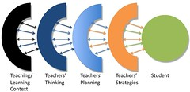

---
categories:
- elearning
- innovation
- reflectivealignment
date: 2009-05-21 10:27:45+10:00
next:
  text: '"Learning spaces: expenditure and time spent learning"'
  url: /blog2/2009/05/21/learning-spaces-expenditure-and-time-spent-learning/
previous:
  text: Purpose - a component of the Ps Framework
  url: /blog2/2009/05/20/purpose-a-component-of-the-ps-framework/
title: Where's the inspiration? Where's the desire to improve?
type: post
template: blog-post.html
comments:
    - approved: '1'
      author: bradmarshall
      author_email: brad@humbug.org.au
      author_ip: 118.208.3.72
      author_url: null
      content: 'David,
    
    
        The fact that people know the answer and don''t follow thru was covered very well
        in the time management course I recently went on, basically discipline.  Knowing
        the right thing and doing it are two very different things, it takes significant
        effort to do it, and keep doing it until it becomes habit.
    
    
        Also, I''ve heard it said that it takes 21 times doing something to form a habit
        - thats a significant amount of discipline to keep going.  I''m sure teaching
        is more complex than that, but perhaps there''s something to it.
    
    
        Brad.'
      date: '2009-05-21 20:24:44'
      date_gmt: '2009-05-21 10:24:44'
      id: '2521'
      parent: '0'
      type: comment
      user_id: '0'
    - approved: '1'
      author: davidtjones
      author_email: d.jones@cqu.edu.au
      author_ip: 59.154.24.147
      author_url: https://djon.es/blog/
      content: "G'day Brad,\n\nI'm not sure that discipline alone is the answer. However,\
        \ if you read the first review of Maister's book you'll see that this is a view\
        \ that goes back to some early Greek philosophers.\n\nPlato's view from the review\
        \ \"For Plato, the incontinent is either un-reflective, or of weak character.\
        \ The fat smoker either doesn\u2019t really understand how self-harmful he is\u2014\
        or he is just a moral weakling\".\n\nBut the review seems to indicate that there's\
        \ more to it than just that. I also think there's more to it than just that. Especially\
        \ when we're talking about something like teaching within a university context.\
        \  At the very least, that context can't be  completely without influence.\n\n\
        But I feel also that blaming the context is an easy cop out.\n\nMore thinking\
        \ to do.\n\nDavid."
      date: '2009-05-21 22:25:17'
      date_gmt: '2009-05-21 12:25:17'
      id: '2522'
      parent: '2521'
      type: comment
      user_id: '1'
    - approved: '1'
      author: bradmarshall
      author_email: brad@humbug.org.au
      author_ip: 118.208.3.72
      author_url: null
      content: 'David,
    
    
        Definately, I completely believe that discipline isn''t the complete answer -
        but it probably contributes to it.  I know I''m unaware of many of the factors
        related to this, not being an academic.  It seems to me to be quite a hard problem
        with many facets to it.
    
    
        Brad.'
      date: '2009-05-22 07:45:40'
      date_gmt: '2009-05-21 21:45:40'
      id: '2523'
      parent: '0'
      type: comment
      user_id: '0'
    - approved: '1'
      author: davidtjones
      author_email: d.jones@cqu.edu.au
      author_ip: 59.154.24.147
      author_url: https://djon.es/blog/
      content: 'G''day Brad,
    
    
        I agree entirely with the observation that it is "quite a hard problem with many
        facets to it".
    
    
        I don''t even pretend to begin to understand the full variety of the problems
        that it entails, let alone have specific solutions.
    
    
        This is why I don''t think "plan-driven" approaches, like those commonly adopted
        in universities, are appropriate.  They are based on the assumption that we know
        the problems and have identified solutions ahead of time.
    
    
        I prefer emergent or learning approaches. Approaches where we agree we don''t
        know and design our processes and choices to allow identification of problems
        and experimental solutions to evolve from our experience.
    
    
        This is why I get pissed when people refer to Webfuse as an LMS.  Adoption of
        an LMS is a plan-driven approach.  Webfuse is intended as an emergent process,
        not as a product. What ever the current state or structure of Webfuse, it''s all
        temporary and meant to change as we learn a little bit more about what is needed
        and what works.
    
    
        What Webfuse can do at the moment is not important, it''s what it can help us
        learn and do in the future that''s important.
    
    
        Sorry, I''m working on the thesis at the moment, particularly on the process section.
        Hence I''m currently writing about the above, it''s on my mind.
    
    
        David.'
      date: '2009-05-22 09:21:29'
      date_gmt: '2009-05-21 23:21:29'
      id: '2524'
      parent: '2523'
      type: comment
      user_id: '1'
    
pingbacks:
    - approved: '1'
      author: Continuing to bash the consultant model &laquo; The Weblog of (a) David
        Jones
      author_email: null
      author_ip: 74.200.245.188
      author_url: https://djon.es/blog/2009/05/24/continuing-to-bash-the-consultant-model/
      content: '[...] on their vast knowledge, recommends some ways forward. I started
        my &#8220;bashing wave&#8221; in a post comparing this model with the &#8220;fat
        smoker&#8221; problem (telling them what they already know [...]'
      date: '2009-05-24 09:09:59'
      date_gmt: '2009-05-23 23:09:59'
      id: '2525'
      parent: '0'
      type: pingback
      user_id: '0'
    
---
The title and spark for this post comes [from this post](http://www.convergemag.com/blog/bridge/Biggest-Loser-Inspiration.html) entitled "A night of 'Biggest Loser' Inspiration". I came across it via a tweet from [Gardner Campbell](http://www.gardnercampbell.net/) and in particular the quote from the post he tweeted (included here sans the 140 character tweet limit)

> People follow inspiration and that's where students will go — where they are inspired to learn, collaborate, build and innovate.

I'm guessing, though am currently not 100% certain, that my current institution will want me to contribute to creating this sort of inspiration in my [new role](/blog2/2009/08/20/elearning-and-innovation-specialist-report-1-4-20-august)/. I'm excited by that, but I'm also concerned that it will be really difficult. When I'm looking at the difficulties I will face, the biggest is perhaps embodied in the second question from this quote from [the post](http://www.convergemag.com/blog/bridge/Biggest-Loser-Inspiration.html) (caps in original, I've added the emphasis)

> I want to scream, "WHERE'S THE INSPIRATION? **WHERE’S THE DESIRE TO IMPROVE?**"

### Where's the desire to improve?

When it comes to improving learning and teaching I am a firm believer in the absolute centrality of teacher's conception of learning and teaching. Yes, I agree that student learning is the focus, you want to inspire students to learn, collaborate, build and innovate. However, I work within a university setting and am tasked with helping improve the learning students receive from the university. In that setting the conceptions of learning held by the teaching staff directly impact upon the quality of the student learning.

Consequently, I currently believe that an important, if not the most important, aim for my position should be to encourage academics to reflect upon their conceptions of learning and teaching. The theory being, see the following figure from Trigwell (2001), change in those conceptions is the only way to achieve sustainable improvements in the quality of learning experience by students.

The problem is that for this will only happen if there is a desire on the part of the academics to reflect. If there's no desire, it won't work. My current institution has been going through some tough times which may make it hard to find that inspiration.

### Further connections with the biggest loser

[The post](http://www.convergemag.com/blog/bridge/Biggest-Loser-Inspiration.html) that started this, was sparked by watching the Biggest Loser - one of the recent franchises of reality shows to go global. Since I listened to some of David Maister's [podcasts](http://davidmaister.com/podcasts/) from a recent book of this ([Strategy and the Fat Smoker](http://davidmaister.com/books.strategyFatSmoker/) - there's a [good review/overview here](http://trustedadvisor.com/trustmatters/310/Aristotle--Maister--and-the-Fat-Smoker)) I've been pondering the connection between weight loss and encouraging innovation and improvement in learning and teaching (I can see at least a presentation and maybe some research arising from this work but it's been put aside until I finish other tasks).

I particularly like this quote

> If you truly want to succeed (and many people do not want it badly enough to make it happen) then you must never settle, never give up, never coast, never just accept what is, even if you are currently performing at a high level.

which I took from [this review of the book](http://ezinearticles.com/?David-Maisters-Strategy-and-the-Fat-Smoker&id=1121145). The review was done by a lawyer who focused on one chapter of Maister's book - Chapter 17: The Trouble with Lawyers. The review includes this

> He highlights four problems that prevent "lawyers from effectively functioning in groups:"
> 
> - problems with trust;
> - difficulties with ideology, values, and principles;
> - professional detachment; and
> - unusual approaches to decision making (referring to lawyers' propensity to attack any idea presented to locate and highlight its weaknesses, with the result that "within a short time, most ideas, no matter who initiates them, will be destroyed, dismissed, or postponed for future examination.")

A list which I find fairly appropriate for university academics.

One of the observations that arise from the book is the examination of consultants and the businesses that employ them and a comparison with health professionals and fat smokers. Consultants are brought in to tell the business how to improve itself, just as health professionals are brought in to help fat smokers. The trouble is, that like fat smokers, most business people already know what they are doing wrong. Fat smokers know they need to stop smoking, eat well and start exercising. What do health professionals tell fat smokers? Stop smoking, eat well and start exercising. Duh!

Of course, consultants know that most business people know what the consultants know. Increasingly most of the business people have been through the same education processes and read the same literature as the consultants. Though the business people often have the huge benefit of long-term and in-depth practical experience within the specific context of the business. A consultant knows this and has to justify his/her fee. So consultants come in with a barrage of jargon and technologies (in the broadest possible senses) that the business person doesn't have. However, in the end it all boils down to the same knowledge.

I can see a lot of similarities here between instructional designers (and other folk employed to help academics) and academics. The instructional designers are the consultants and the academics are the business people. I see instructional designers developing a barrage of jargon and technologies which essentially boil down to telling the fat smoker to stop smoking, eat well and exercise. Essentially telling the academic what they already know but making it so difficult to understand that the academic spends more time understanding than implementing.

Of course, this is a generalisation and metaphor with all the attendant limitations. But, I do believe there is a glimmer, possibly more, of truth. It also makes some assumptions and raises some questions:

- That academics do know the equivalent of "stop smoking, eat well and exercise" for learning and teaching.  
    Having worked in a number of positions that help academics in their teaching I've had an opportunity to see a large number of very different academics. Sadly and somewhat suprisingly, a fairly significant number appear to be somewhat clueless. However, I do wonder how much of this lack of knowledge or simply poor execution.
- If they know, why don't they follow through?  
    What are the factors or reasons why this knowledge isn't put into action? Can anything be done to address them.
- Is there really an equivalent of "stop smoking, eat well and exercise" for learning and teaching?

### It has to be intrinsic

Have to add this in before I close. This review of Maister's book mentions the following as one of the many answers provided by Maister

> Motivation must be intrinsic, not extrinsic. The biggest barrier to change is the feeling that “it’s OK so far.”

When I ask "where's the desire", I think this is perhaps the best answer. When the desire to improve and innovate is intrinsic to the academic, then the question becomes how does the university get out of their way and help them achieve?

But, how do you enable/encourage/create that intrinsic movitation? Can you? That's the question I'd like to investigate.