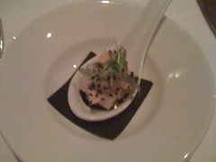
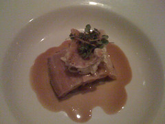
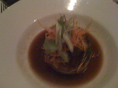
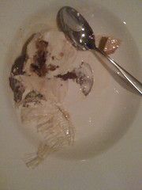

This is the second in an intermittent collection of posts associated with visits to nice restaurants. This one tells the story of the visit of my wife and I to [Ezard](http://www.ezard.com.au/main.html) in Melbourne.

_Disclaimer:_ I'm a philistine when it comes to food, but am attempting to improve my tastes and experience. I'm a clueless foodie.

In summary, fantastic. Fully recommend it. Service great. Food to die for. We'll be going back again, whenever possible.

There are photos of my meals but the questionable wireless in the hotel lobby leaves a significant amount to be desired.

### Appetizers

The meal started with some good crusty white bread, the house parmesan, garlic and rosemary infused olive oil (very nice) and some house spices (ranging from somewhat over-powering to the near sublime).

We were then presented with a mouthful of sashimi on a spoon, and that description doesn't do it justice. A range of other spices, sauces and other bits and pieces that combined worked very well together. I am not a seafood/raw fish type of person and I enjoyed this greatly.

As you might be able to tell, I couldn't remember the details nor find them on the Ezard menu (as I did with the following).

### Starters

The missus started with

> fried zucchini flowers, goat's cheese, mascarpone, panzanella salad, balsamic syrup

and loved it.

I started with

> five spiced korubuta pork belly with celeriac and apple remoulade and mustard sauce

As with all of the food, it was the combination of the ingredients that moved the overall experience to something greater than the sum of its parts.

### Mains

The missus went with

> seven score wagyu beef with sake roasted king brown mushrooms, garlic jam, black vinegar and shallot glaze

I beat her to the punch and got the duck

> roast duck with green chilli and shallot sauce, stir fried silk melon garlic shoots and rice noodle rolls

Since we expected the food to be good, we went for a side as well

> fried desiree potatoes with roasted garlic and rosemary

The waiter commented on how clean our plates were when he picked up the empties. There was good reason. Neither of us we're going to leave any of the flavours on the plate.

### Desserts

During the mains it became absolutely obvious that we would have to try dessert. The wife wanted the dessert tasting menu, I preferred to go with a single choice. To maximise pleasure.

The missus chose

> romage frais cheesecake with butternut and black sesame crunch, spiced rhubarb jelly

I'm not much of a dessert person so went with the ice cream

> honeycrunch icecream with toasted gingerbread and sugar swirl

The consensus between the wife and I was that I got the best end of the deal.

### Wine

Again, I'm not a wine drinker, but the house reisling the wife had by the glass was good enough we went with a bottle of it. A 2005 donnhoffriesling from German.

Yes I do recognise the mismatch that exists between the wine and the food described above. But I did say I'm a clueless foodie and not a wine drinker. My palette lacks the education to shudder at the combination.