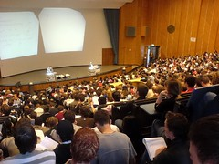

A [local Sunday paper](http://www.news.com.au/couriermail/sundaymail/) had an article last Sunday titled "Is this the future of our universities?" and with a sub-heading of "Attending lectures is 'old school'. This post is a first attempt to gather some thoughts about how the whole thinking about lectures in universities, including the notions around e-lectures in articles like this, are just so 'old school'. So much so that what passes for "digital lectures" is pretty limited.

### The perception

This quote from the article summarises the thinking in the article and also held by a number of other folk

> In a growing trend at campuses across the state, tech-savvy students say they no longer bother to attend lectures that are recorded and later posted online for free viewing.

Much of the initial half of the article talks about the growing trend to institutions purchasing systems like [Lectopia](http://www.lectopia.com.au), recording lectures and then finding students are making use of the recorded lectures and not attending the originals.

**Aside:** It appears Lectopia has morphed into (i.e. been acquired by) [Echo 360](http://www.echo360.com/).

I have a number of problems with this view:

1. It assumes that the technology has created a new problem.  
    The assumption seems to be that before the nasty, horrible technology arrived lectures were enjoying 100% attendance rates. Instead, it appears to be fairly widespread that purely physical lecture attendance has, for most courses, always tended to follow a standard curve. Near 100% at the start, dropping off over subsequent weeks, brief surges in attendance when assessment is due and then dropping off until the final surge at the end of term - again in preparation for final assessment.
2. It misses the point about why students are able to do this.  
    Systems like Lectopia record the lecture only. Students aren't able to interact with the recording, at least not with the people within it. I wonder how many of the lectures recorded on Lectopia actually include activities that require interaction. Would a lecture that involves useful interaction and other activities that students find help them learn suffer the same drop in attendance? Especially if those activities can't be experienced to the same extent with a recorded lecture.
    
    As an aside, George Siemens makes the point that lectures, even recorded, ones, aren't [necessarily passive](http://www.elearnspace.org/blog/2009/03/10/the-burden-of-proof-what-does-education-research-really-tell-us/). However, there are interesting and beneficial changes to the lecture approach that can be beneficial. For example, [this approach](http://www.nytimes.com/2009/01/13/us/13physics.html?_r=3&hp=&pagewanted=all) at MIT.
    
3. It uses anecdotal evidence.  
    Standard journalism. Ring around, get a couple of people to tell you what they experienced and then generalise it. Where are the figures showing attendance before and after the introduction of technology?
4. It accepts a whole lot of mythic understandings about the role and nature of the lecture.  
    This is where I have the biggest problem with the article. It essentially accepts as given that the lecture is important, that students who miss face-to-face lectures are actually missing out on something.

### Some research

The [Australian Learning and Teaching Council](http://www.atlc.edu.au) funded a project a year or so ago that looked [The impact of web-based lecture technologies on current and future practice in learning and teaching](http://www.altc.edu.au/project-impact-webbased-lecture-macquarie-2006). The best source I currently know of with some reasonable research into this problem.

#### Students are strategic

I don't think this finding will surprise too many people

> Our findings indicated that students are quite strategic about the choices they make, basing decisions on lecture attendance around three types of factors: educational value; convenience and flexibility; and social opportunities to meet other students, exchange ideas and make new friendships.

Students evaluate the value of lectures and make pragmatic decisions about whether they'll attend. What would happen if you were faced with the following? You find the lecturer boring, it's the only lecture scheduled for the day, it takes you an hour to get to campus, you have assignments due, and the lecture will be available electronically. Would you go to the lecture?

### Is there a better way?

The important and still incomplete question is gotten at in this quote from the report

> With students being offered the technologies and choosing not to attend, some academics have begun questioning the role of lectures. At least 80% of the staff surveyed use lectures to inspire and motivate students; build conceptual frameworks; establish connections with students; use multimedia content; provide structured experiences for students; impart information and make announcements. This raise the question of whether there are more effective ways of achieving these functions.

It's good to see some questioning of the role of lectures. But I find it disappointing that institutions still seem not to question the role of lectures or its mythic attributes. For example, with all that can be done with technology, what has been done with lectures? Use of Powerpoint presentations, some video and recording lectures in lecture theatres.

It strikes me that lecture recording sessions are horseless carriage versions of the lecture. Same idea, slightly different technology. As the ALTC report says, there must be more effective ways of using technology to achieve the educational goals. Mustn't there?

### Applying the Edupunk ethos

I've got a growing interest in investigating a ["Edupunk"](http://en.wikipedia.org/wiki/Edupunk) approach to "online" lectures that provides a more effective way of harnessing more modern technology to achieve educational goals. I'm hoping it's something I can follow up on.