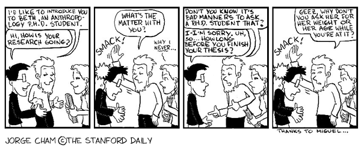

---
categories:
- phd
date: 2009-06-14 11:30:01+10:00
next:
  text: '"PhD Update #14 - Moving to a new day"'
  url: /blog2/2009/06/14/phd-update-14-moving-to-a-new-day/
previous:
  text: Another ill-informed point about connectivism versus behaviourism and cognitivism
  url: /blog2/2009/06/12/another-ill-informed-point-about-connectivism-versus-behaviourism-and-cognitivism/
title: To all my friends and colleagues out there - PhD etiquette
type: post
template: blog-post.html
comments:
    - approved: '1'
      author: VRBones
      author_email: vrbones@hotmail.com
      author_ip: 150.101.181.34
      author_url: http://www.vrbones.com
      content: Next time tell them <a href="http://everything2.com/title/How%2520Long%2520is%2520a%2520Chinaman"
        rel="nofollow">How Long is a Chinaman</a>
      date: '2009-06-15 11:39:04'
      date_gmt: '2009-06-15 01:39:04'
      id: '2599'
      parent: '0'
      type: comment
      user_id: '0'
    - approved: '1'
      author: davidtjones
      author_email: d.jones@cqu.edu.au
      author_ip: 59.154.24.147
      author_url: https://djon.es/blog/
      content: I like it
      date: '2009-06-15 11:43:42'
      date_gmt: '2009-06-15 01:43:42'
      id: '2600'
      parent: '2599'
      type: comment
      user_id: '1'
    - approved: '1'
      author: nonamuldoon
      author_email: n.muldoon@cqu.edu.au
      author_ip: 138.77.2.130
      author_url: http://
      content: I am one of the culprits... you know why because I wanted a measure/reassurance
        for my own progress or lack thereof :) Don't take it to heart!
      date: '2009-06-18 11:45:38'
      date_gmt: '2009-06-18 01:45:38'
      id: '2601'
      parent: '0'
      type: comment
      user_id: '0'
    - approved: '1'
      author: davidtjones
      author_email: d.jones@cqu.edu.au
      author_ip: 138.77.2.130
      author_url: https://djon.es/blog/
      content: 'So Nona, how''s your PhD going?
    
    
        ;)'
      date: '2009-06-18 11:56:20'
      date_gmt: '2009-06-18 01:56:20'
      id: '2602'
      parent: '2601'
      type: comment
      user_id: '1'
    
pingbacks:
    []
    
---
I've noticed over the last few weeks an increasing number of my colleagues, friends and relatives asking questions like "How long until you finish?"

My response has generally been "how long is a ball of string". After all, writing the thesis is a creative, knowledge intensive activity. Not one conducive to rational acts of planning and timetabling. Anyone who knows me should know how much I hate [teleological design and prefer ateleological design](/blog2/2009/05/25/teleological-and-ateleological-processes/) (for more detail feel free to read other sections of the thesis completed recently on [teleological processes](/blog2/2009/06/05/teleological-design-definition-and-weaknesses/) and [ateleological processes](/blog2/2009/06/05/ateleological-processes-definition-and-weaknesses/)) - see some progress is being made.

In addition, you folk really should get a grip on the etiquette associated with thesis writing and PhD study in general. The following comic from [Piled Higher and Deeper](http://www.phdcomics.com/) summarises it nicely.

My second most common response to these rude, inconsiderate and ill-informed folk is "It's all on the blog!". If you really want to know how the PhD is going, please feel free to check out:

- my PhD to do list;
    Newly updated today. This should give you an idea of how much stuff I think I have to do. Note: there is no connection with this volume and actual time.
- my sequence of PhD updates; and  
    Up to 14 (weekly) updates and counting.
- the on-going list of posts based on thesis content.  
    Most Many Some of the posts to my blog are filled with content straight from the thesis.

This should provide more than you ever need to know about "how the thesis is going?".

**So don't ask!**