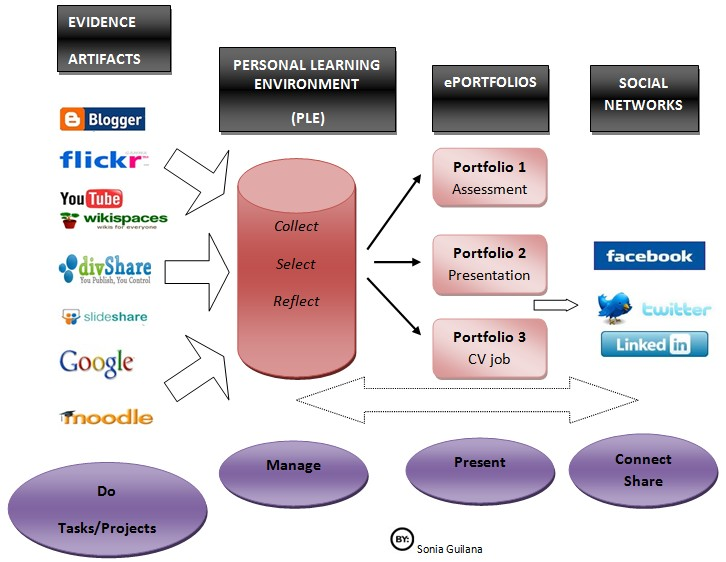

I continue to have [a high level of skepticism](/blog2/2009/01/21/why-am-i-a-eportfolio-skeptic/) around the concept of universities investing in ePortfolios. I feel that it is another example of how people within universities tend to over-emphasize their importance in the scheme of things, extend the university role into areas it where it should never have been and subsequently waste resources and more importantly the time and energy of academic staff that would be better spent focusing on other aspects of improving learning and teaching. In particular, I see ePortfolios being another approach that is being over-run by the [technologists alliance](/blog2/2009/01/21/why-am-i-a-eportfolio-skeptic/#alliance).

This latest restating of my prejudice arises from [a find](http://www.downes.ca/cgi-bin/page.cgi?post=49682) from [Stephen Downes](http://www.downes.ca/) OLDaily newsletter which eventually traces back to [this post](http://blocs.xtec.cat/portfolioproject/2009/07/24/portfolioroadmap/) from a Spanish higher school teacher which in turn draws on [this post](http://blog.core-ed.net/derek/2008/09/conceptualising-eportfolios.html) from Derek Wenmoth.

Perhaps this is some limitation of mine. I just don't see the point of ePortfolios. What is all the fuss about?

### The diagram

The core of the post is the following image that, at least for me, does a good job of giving a road map of what learner's do within their learning: do stuff, manage the outcomes, present it to various audiences, share it with others.

My immediate though was where in any of this is there a need for a formal institution of learning (e.g. university or school) to provide the learner with the tools to perform any of this? Why does the advent of elearning technologies change any of the relationships?

From the [discussion](http://blocs.xtec.cat/portfolioproject/2009/07/24/portfolioroadmap/) it appears that the institution's role can be seen in providing a VLE - shown as one place the learner might "do stuff" and also talked about one place they may "manage stuff" - and one part of "presenting stuff". The institution's role in "presenting stuff" is in assessment and accreditation.

Already the VLE provided by institution's is falling behind the usability and functionality provided by external tools. Sorry, but having seen both Moodle and Blackboard up close, I'd much prefer to be using external tools. I even prefer, for functionality and ease of use reason, using Google Mail to the email system provided by institution. Given they are already falling behind, why should an institution believe it can provide a better suite of systems for the learner to "present stuff" with.

Institution's providing portfolio systems becomes a bit more silly when you add in the observations that informal learning far outweighs formal learning and that increasingly learners will engage in formal learning from many different providers. One solution proposed to address these issues is for education systems to standardise portfolio systems so either they are all using the same one or have systems that talk to each other. Given the long history of failure of such attempts at standarisation, I'm surprised anyone still doesn't laugh uproariously when someone suggests such a project.

### What is an alternative?

Only very briefly, have to stop procrastinating and get back to the thesis, the following are some initial suggestions:

- Ensure that institutional systems integrate/interface simply and effectively with all the other tools that make up the above diagram.  
    e.g. it should be easy for learners to export the "stuff" they produce in a VLE into their own tools. As part of this, VLEs should be generating RSS feeds for most if not all of its functions. Ensure institutional systems work within global authentication systems (e.g. [OpenID](http://openid.net/)), rather than institutional or system specific authentication systems. (e.g. [Australian Access Federation](http://www.aaf.edu.au/))
- Focus institutional technology on only those tasks that the institution must perform and aim on doing it well.  
    e.g. Rather than providing an ePortfolio system that helps learners present their work (something they can do themselves). Focus on implementing significant improvements on the systems around assessment and accreditation. The assignment submission systems in most VLEs is woeful, and that's only in simple implementation details that would significantly increase the efficiency of the assessment process. Most don't offer any support for activities that might significantly improve learning and assessment from an educational perspective.

In part, this is one aspect of the [BAM project](/blog2/research/bam-blog-aggregation-management/). One area it is trying to experiment with. Rather than require students to use blogs provided within an institution LMS (which are mostly really limited), allow them to use real-world blog engines and focus the institutional information technology on the assessment aspect.