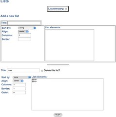
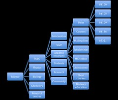
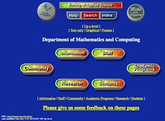
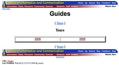

---
categories:
- chapter-4
- design-theory
- elearning
- phd
- thesis
- webfuse
date: 2009-07-29 11:27:50+10:00
next:
  text: The design and implementation of Webfuse - Part 2
  url: /blog/2009/07/29/the-design-and-implementation-of-webfuse-part-2/
previous:
  text: 'BAM into Moodle #7 - an eStudyGuide block'
  url: /blog/2009/07/28/bam-into-moodle-7-an-estudyguide-block/
title: The design and implementation of Webfuse - Part 1
type: post
template: blog-post.html
comments:
    []
    
pingbacks:
    - approved: '1'
      author: The design and implementation of Webfuse &#8211; Part 2 &laquo; The Weblog
        of (a) David Jones
      author_email: null
      author_ip: 74.200.245.227
      author_url: https://djon.es/blog/2009/07/29/the-design-and-implementation-of-webfuse-part-2/
      content: '[...] The Weblog of (a) David Jones Another voice in the blogosphere    &laquo;
        The design and implementation of Webfuse &#8211; Part&nbsp;1 [...]'
      date: '2009-07-29 16:52:35'
      date_gmt: '2009-07-29 06:52:35'
      id: '2674'
      parent: '0'
      type: pingback
      user_id: '0'
    - approved: '1'
      author: The design and implementation of Webfuse &#8211; Part 3 &laquo; The Weblog
        of (a) David Jones
      author_email: null
      author_ip: 66.135.48.209
      author_url: https://djon.es/blog/2009/07/29/the-design-and-implementation-of-webfuse-part-3/
      content: '[...] of the Webfuse system. These are part of chapter four of my thesis.
        The previous two parts are here and [...]'
      date: '2009-07-29 23:53:14'
      date_gmt: '2009-07-29 13:53:14'
      id: '2675'
      parent: '0'
      type: pingback
      user_id: '0'
    
---
This continues the collection of content that goes into Chapter 4 of my [PhD thesis](/blog/research/phd-thesis/). Chapter 4 is meant to tell the story of the first iteration of Webfuse from 1996 through 1999. The [last section](/blog/2009/07/27/the-intervention-webfuse-design-1996-1999/) I posted describes the design guidelines that informed the implementation of Webfuse. This post and at least one following post seeks to describe the details of the design and implementation of Webfuse.

As with all the previous posts of content from the thesis, this content is in a rough first draft form. It will need more work. Comments and suggestions are more than welcome.

### Design, implementation and support

This section outlines how the design guidelines for Webfuse introduced in the previous section [(Section 4.3.2)](/blog/2009/07/27/the-intervention-webfuse-design-1996-1999/) were turned into a specific system design and how that system was implemented and supported during the period from 1996 through 1999. First it briefly outlines the process, people and technology used during this period to design and implement Webfuse. It then explains how the abstractions that form the design of Webfuse were intended to fulfil the design guidelines introduced in Section 4.3.2. Lastly, it offers a description of the functionality offered by Webfuse towards the end of 1999. The next section (Section 4.3.4) will provide an overview of using Webfuse from both a student and academic staff member perspective.

#### Process, People and Technology

The initial design and implementation of Webfuse occurred over a period of about 12 months starting in mid-1996. The author performed most of the initial design and implementation work with additional assistance from a small number of project students who worked on particular components. In 1997, Webfuse was taken over by the Faculty of Informatics and Communication. The Faculty appointed a full-time Webmaster and used Webfuse for their faculty website and online learning. The Faculty webmaster helped staff use Webfuse, did some development and was supported by a small number of other Faculty technical staff. The development processes used Webfuse functionality during this period were fairly ad hoc.

From 1996 through 1999, Webfuse was implemented primarily as a collection of Perl CGI scripts and various support libraries and tools. The Perl scripting language was chosen because it was platform independent and scripting languages like Perl allowed rapid development of application via the gluing together of existing application and development was 5 to 10 times faster than through the use of traditional systems programming languages (Ousterhoust, 1998). An Apache web server served the Webfuse CGI scripts and the resulting web pages. For information storage, Webfuse used the file system and a variety of relational databases. All of the applications used in Webfuse were open source. During this the available open source relational databases were not full-featured, the lack of a full-feature relational database influenced some design decisions.

#### The design

The set of abstractions and decisions that underpin in the initial design of Webfuse drew on a number of existing concepts from the operating systems, information systems and hypermedia communities. The informing concepts included hypermedia templates (Catlin, Garret, & Launhardt, 1991), software wrappers (Bass, Clements, & Kazman, 1998, p. 339), micro-kernel architectures of operating systems (Liedtke, 1995) and known limitations of the World-Wide Web and its hypermedia model (Bieber, Vitali, Ashman, Balasubramanian, & Oinas-Kukkonen, 1997). The design was informed by the understanding of these concepts and the desire to fulfil the five broad design guidelines outlined in Section 4.3.2. The following links these guidelines to the informing concepts and explains the design of Webfuse.

#### A web publishing tool

From the start Webfuse was seen as a web-publishing tool. The implication of this is that Webfuse was seen as a system that produced web pages and web sites. In particular, Webfuse was intended to manage the website of the Faculty of Applied Science which includes a range of different departments and would be managed by a number of different people. There were a number of known problems with the authoring process of websites at this point in time. The authoring process was usually carried out without a defined process, lacked suitable tool support, and did little to separate content, structure and appearance (Coda, Ghezzi, Vigna, & Garzotoo, 1998). The process also made limited reuse of previous work (Rossi, Lyardet, & Schwabe, 1999) and required better group access mechanisms and online editing tools (K. Andrews, 1996).

The difficulty of authoring on the Web makes it difficult to create and maintain large websites and often the management of such content was, at this stage, assigned to one person or group who became the bottleneck for maintenance (Thimbleby, 1997). This is especially troubling when Nielsen (1997) suggested that rule of thumb that the annual maintenance budget for a website should be at least 50 percent, and preferably the same as, the initial cost of building the site. The nature of learning and teaching and its reliance on communication and collaboration suggested that for e-learning such a recommendation might need to be increased.

The World-Wide Web, at this stage, was a particularly primitive hypermedia system where the lack of functionality made the authoring process more difficult (Gregor et al., 1999). One recognition of this was that a key part of the problem definition outlined in Section 4.2.2 was the difficult and time-consuming nature of web-based learning. It was also recognised that ease of use was a key part of encouraging adoption amongst academic staff. To address this problem it was decided that Webfuse would make use of the concept of hypermedia templates (Catlin et al., 1991; Nanard, Nanard, & Kahn, 1998).

Hypermedia templates (Catlin et al., 1991) are an approach to simplifying the authoring process while still ensuring the application of good information design principles. Hypermedia templates would enable content experts to become responsible for maintaining Websites and thus increases ownership, decreases costs and addresses the authoring bottleneck problem (Jones, 1999b). Hypermedia templates also aid in reuse which is a strategic tool for reducing the cost and improving the quality of hypermedia design and development (Nanard et al., 1998). There initial purpose was to improve the application of information design principles to hypermedia collections (Catlin et al., 1991).

In their initial development hypermedia templates were sets of pre-linked documents that contain both content and formatting information used by authors to create a new set of information (Catlin et al., 1991). The intent was that graphic designers would create the templates, which would subsequently be used by content experts to place material into hypermedia (Catlin et al., 1991). The content experts would not need to become experts in information design, nor would the graphic designers need to become content experts. Editing a template did not require learning any new software or knowledge.

Nanard, Nanard and Kahn (1998) extended the idea into constructive templates with the intent of extending reuse in hypermedia design beyond information and software component reuse into the capture and reuse of design experience. A constructive template is a generic specification which makes it easier for a developer to build a hypermedia structure and populate it with its data (Nanard et al., 1998). While a model describes a structure, a constructive template helps produces instances of that structure by mapping source data into a hypertext structure (Nanard et al., 1998). Template-based hypermedia generation can be implemented using either programming or declarative means. Constructive templates are built on the principle of separating source data from hypermedia presentation and enables work on the structure to be done independently from the content, reducing the burden of production. Through automating large parts of the production process constructive templates drastically reduce cost (Nanard et al., 1998).

As a web-publishing system the primary output of Webfuse was web pages. Each Web page was of a specific type. The type of page specified which Webfuse hypermedia template, during this period they were called page types, would be used to produce the web page. A page type was implemented as a collection of pre-defined Perl functions that would obtain the necessary content from the author, convert that content into the HTML necessary to display the body of the page and carry out any additional necessary steps. Figure 4.1 is an example of a web page produced by Webfuse.

_Figure 4.1 – A simple web page produced by Webfuse_

On each web page produced by Webfuse there will be an "Edit" link. If an authorised person clicks on this link they are presented by a web form – called a page update form - that allows them to provide, edit and modify the content used to produce the web page. The structure and features of the page update form, as well as the conversion process applied to the content, is unique to the page type.

Figure 4.2 shows the page update form for the web page from Figure 4.1. A page type called TableList produces the web page shown in Figure 4.1. As the name suggests this page type is used to manage a series of lists containing individual elements, which are displayed in a series of separate tables. Each element in the list points to another web page that is created and then managed through Webfuse. In Figure 4.1 there is one list called "Years" which consists of the elements "2008" and "2009". Figure 4.2 contains HTML form elements to manage two lists. One for the existing list called "Years" and one that can be used to add a new list. As well as managing the elements of lists the form in Figure 4.2 also provides some formatting options including how to sort the list elements, how many columns to have in the table and how big the table borders should be.

_Figure 4.2 – Page update form for the web page shown in Figure 4.1_

The design of Webfuse as a web publishing system made it necessary to include into the Webfuse an abstraction for the websites it would manage. Such an abstraction was necessary in order to implement the services and interfaces Webfuse would provide to authors to manage their websites. Hypermedia and hypertext, of which the World-Wide Web is an example, have been defined on the basis of their support for non-linear traversal and navigation through a maze of interactive, linked, multiple format information (Kotze, 1998). The "disorientation problem" – getting "lost in hyperspace" – refers to the greater potential for the use to become lost or disoriented within a large hypertext network (Conklin, 1987).

The topology or structure of a hypertext directly affects navigation performance (McDonald & Stevenson, 1996). Oliver, Herrington and Omari (R. Oliver, Herrington, & Omari, 1999) identifies three main structures within hypermedia environments: linear, hierarchical and non-linear or networked. Shin, Schallert and Savenye (1994) suggests that the most popular structure for hypertext and hierarchical and network (non-linear) structures. Garzotto, Paolini and Schwabe (1993, p. 8) point to the observation of many authors that hierarchies are very useful to help user orientation when navigating in a hypertext. Advantages of hierarchies include: a strong notion of place; documents have clear superior/inferior relationships that are sometimes augmented with linear precedence relationships between nodes; they are familiar due to their use in other domains; and the rigidity, which creates some inflexibility, aids comprehension (Durand & Kahn, 1999). Hierarchical structures have also been recommended as the most appropriate structures for large websites (Sano, 1996).

The previous paragraphs draw on research literature to identify a number of advantages to justify the selection of a hierarchical structure for the model of a website use by Webfuse. There were, however, also two pragmatic reasons for this choice of structure. The open source relational databases that were available at the time and used in the implementation of Webfuse were not capable of storing amount and type of data that a large website would require. The use of a relational database to store information was limited to authentication and authorization data. For the most part, the storage of content to be used in generating web pages were stored on the file system of the computer hosting the Web server. The file systems of computers did and continue to use a hierarchical structure of directories and files. Having the website structure used by Webfuse match the structure used to store the information considerably simplified implementation.

Figure 4.3 is a partial, graphical representation of the hierarchical structure of the Faculty of Applied Science website created and managed via Webfuse during 1997. At the top level is the main science home page. The next level down has five main sections including one for the Faculty's research centre's and one for each of its four departments – Maths and Computing, Applied Physics, Biology and Chemistry. Each of the department websites followed a similar structure with main sections for information, staff, academic programs, students, research and community. The websites for individual courses – prior to 1998 these were called units – are all contained in their own folders with names based on the course codes (e.g. 85321, Systems Administration).

_Figure 4.3 – A partial hierarchy of the Faculty of Applied Science website in 1997_

Each of the boxes shown in Figure 4.3 represents an individual web tree but also represents a collection of related material. The "Units" box represents the "Units" web page (Figure 4.4) and the folder "Units" that contains all of the web sites for the units offered by the Department of Mathematics and Computing in the second term of 2007. By default all Webfuse pages are freely available to anyone on the Web. There is an access control facility that can optionally restrict access to specific people or groups.

The Webfuse access control system does not make any distinction between types of accounts; there is not concept of a course designer, administrator, or student account in Webfuse (McCormack & Jones, 1997, p. 365). Each user account belongs to a number of groups. Groups can be assigned permissions to perform certain operations on Webfuse objects, which are either individual web pages or entire websites. The directory path that specifies where the object resides on the web server is used to uniquely identify each object. Initially, there were three valid operations that could be performed on an object (McCormack & Jones, 1997, p. 366):

- access;  
    The ability to access or view the page. By default all objects are able to be viewed by anyone on the web.
- update; and  
    The ability to modify the page using the page update process.
- all.  
    The ability to perform any and all operations on the object.

_Figure 4.4 – The Units web page for M&C for Term 2, 2007_

Some page types recognise additional operations that are specific to the operation of the page. For example, an early assignment management page type recognised a "mark assignment" operation (McCormack & Jones, 1997).

Table 4.2 provides an example of two different Webfuse permissions. One which gives permission for members of the group "jones" to perform all operations on the entire website for the unit 85321, Systems Administration. Another which gives permission to edit just the home page for the 85321 website. An object that ends with a slash (/) indicates everything within that directory while an object without the slash at the end indicates just that web page.

_Table 4.3 - Example Webfuse permissions_
|   | Modify 85321 Web site | Modify 85321 Web page |
| --- | --- | --- |
| Object | /mc/Academic\_Programs/Units/85321/ | /mc/Academic\_Programs/Units/85321 |
| Operation | All | update |
| Group | jonesd | jonesd |

A Perl script, called the page update script, included a check of the permissions system to determine if a particular person could edit the requested page. The page update script was also responsible for identifying the type of page being edited, accessing the appropriate code for the page type and adding other information and services to the page update form. Other services available on the page update form fall into two main categories:

1. Webfuse services; and  
    A number of support services such as HTML validation, link checking, access control, file management and hit counters could be accessed via the page update form.
2. Page characteristics.  
    As well as the content managed by the page type each web page also contained a number of the characteristics including the page type, title, colours used and the style template.

The notion of a style or style template was used to further separate the appearance of a page from the content. This enabled the appearance of the same page, containing the same content to evolve over time for whatever reason (this feature was added before the concept of cascading style sheets – CSS – was widely used). Figure 4.5 is the same web page as shown in Figure 4.1, however, it is using a 1998 style for the Faculty of Informatics and Communication. This was done by editing the page, changing the style template and updating the page.

_Figure 4.5 – Guides web page (Figure 4.1) with a different style_

### References

Andrews, K. (1996). _Position paper for the workshop, Hypermedia Research and the World-Wide Web._ Paper presented at the Applying Hypermedia Research to the World-Wide Web, Hypertext'96.

Bass, L., Clements, P., & Kazman, R. (1998). _Software Architecture in Practice_. Boston: Addison-Wesley.

Bieber, M., Vitali, F., Ashman, H., Balasubramanian, V., & Oinas-Kukkonen, H. (1997). Fourth Generation Hypermedia: Some Missing Links for the World-Wide Web. _International Journal of Human-Computer Studies, 47_, 31-65.

Catlin, K., Garret, L. N., & Launhardt, J. (1991). _Hypermedia Templates: An Author's Tool._ Paper presented at the Proceedings of Hypertext'91.

Coda, F., Ghezzi, C., Vigna, G., & Garzotoo, F. (1998). _Toward a Software Engineering Approach to Web Site Development._ Paper presented at the 9th International Workshop on Software Specification and Design, Isobe, Japan.

Conklin, E. J. (1987). Hypertext: An introduction and survey. _IEEE Computer, 20_, 17-41.

Durand, D., & Kahn, P. (1999). _MAPA: a system for inducing and visualizing hierarchy in websites._ Paper presented at the Hypertext'98, Pittsburg, PA.

Garzotto, F., Paolini, P., & Schwabe, D. (1993). HDM - A model-based approach to hypertext application design. _ACM Transactions on Information Systems, 11_(1), 1-26.

Gregor, S., Jones, D., Lynch, T., & Plummer, A. A. (1999). _Web information systems development: some neglected aspects._ Paper presented at the Proceedings of the International Business Association Conference, Cancun, Mexico.

Jones, D. (1999). _Webfuse: An integrated, eclectic web authoring tool._ Paper presented at the Proceedings of EdMedia'99, World Conference on Educational Multimedia, Hypermedia & Telecommunications, Seattle.

Kotze, P. (1998). _Why the hypermedia model is inadequate for computer-based instruction._ Paper presented at the Sixth Annual Conference on the Teaching of Computing and the 3rd Annual Conference on Integrating Technology into Computer Science Education, Dublin City University, Ireland.

Liedtke, J. (1995). On micro-kernel construction. _Operating Systems Review, 29_(5), 237-250.

McCormack, C., & Jones, D. (1997). _Building a Web-Based Education System_. New York: John Wiley & Sons.

McDonald, S., & Stevenson, R. (1996). Disorientation in hypertext: the effects of three text structures on navigation performance. _Applied Ergonomics, 27_(1), 61-68.

Nanard, M., Nanard, J., & Kahn, P. (1998). _Pushing Reuse in Hypermedia Design: Golden Rules, Design Patterns and Constructive Templates._ Paper presented at the Proceedings of the 9th ACM Conference on Hypertext and Hypermedia.

Nielsen, J. (1997). Top ten mistakes of web management.   Retrieved 27 July, 2009, from [http://www.useit.com/alertbox/9706b.html](http://www.useit.com/alertbox/9706b.html)

Oliver, R., Herrington, J., & Omari, A. (1999). _Creating effective instructional materials for the World Wide Web._ Paper presented at the AUSWEB'96, Gold Coast, Australia.

Ousterhoust, J. (1998). Scripting: Higher Level Programming for the 21st Century. _IEEE Computer, 31_(3), 23-30.

Rossi, G., Lyardet, F., & Schwabe, D. (1999). Developing Hypermedia Applications with Methods and Patterns. _ACM Computing Surveys, 31_(4es).

Sano, D. (1996). _Designing large scale web sites_. New York: John Wiley & Sons.

Shin, E. C., Schallert, D. L., & Savenye, W. C. (1994). Effect of learner control, advisement, and prior knowledge on young students' learning in a hypertext environment. _Educational Technology, Research and Development, 42_(1), 33-46.

Thimbleby, H. (1997). Gentler: A Tool for Systematic Web Authoring. _International Journal of Human-Computer Studies, 47_, 139-168.