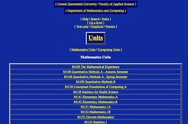

---
categories:
- chapter-4
- design-theory
- elearning
- phd
- thesis
- webfuse
date: 2009-07-29 23:53:00+10:00
next:
  text: '"BAM into Moodle #8 - finishing the eStudyGuide building block"'
  url: /blog/2009/07/30/bam-into-moodle-8-finishing-the-estudyguide-building-block/
previous:
  text: The design and implementation of Webfuse - Part 2
  url: /blog/2009/07/29/the-design-and-implementation-of-webfuse-part-2/
title: The design and implementation of Webfuse - Part 3
type: post
template: blog-post.html
---
The following is the last of, what is now, a three part series of blog posts outlining the design and implementation of the Webfuse system. These are part of chapter four of [my thesis](/blog/research/phd-thesis/). The previous two parts are [here](/blog/2009/07/29/the-design-and-implementation-of-webfuse-part-1/) and [here](/blog/2009/07/29/the-design-and-implementation-of-webfuse-part-2/).

The structure of this section is based on the design guidelines developed for Webfuse and outlined in a section in [this post](/blog/2009/07/27/the-intervention-webfuse-design-1996-1999/). Each of the three posts outlining the design and implementation of Webfuse are using the design guidelines as the structure through which to explain the implementation of Webfuse. This post closes out the implementation by looking at the final two guidlines - be flexible and support diversity, and encourage adoption.

### Webfuse will be flexible and support diversity

The aims which flexibility and support for diversity, as outlined in Section 4.3.2, were meant to achieve included enabling a level of academic freedom, being able to handle the continual change seen as inherent in the Web, and providing a platform to enable the design and use of Webfuse to change and respond in response to increased knowledge due to experience and research. It was intende to achieve these aims through a number of guidelines outlined in Section 4.3.2. The following seeks explain how the design and implementation of Webfuse fulfilled these guidelines and subsequently fulfil the stated goals.

**Do not specifically support any one educational theory.** The design of Webfuse as a web publishing system and integrated online learning environment gave no consideration to educational theory. The design of the functionality offered by the page types was seen to be at a level below educational theory. That is, the four categories of tasks required of a Web-based classroom – information distribution, communication, assessment, and class management – were seen as building blocks that could be used to implement a number of different educational theories. For example, a social constructivist learning theory might use a simple combination of a discussion board and an interactive chat room as the primary tools on the course site. A more information centric or objectivist approach would focus more on the use of the information distribution tools and the quiz tool. In addition, if a strong case was built for providing greater support for a particular educational theory then this could be provided by developing a collection of page types – using COTS products where appropriate – specific to that educational theory. Only those staff interested in using that educational theory would be required to use those page types.

**Separation of content and presentation.** The separation of content and presentation was achieved through a combination of the page types and the Webfuse styles. As shown in Figure 4.1 and Figure 4.5 it was possible to change the appearance of a Webfuse web page without modifying the content.

**Platform independence and standards.** This guideline was achieved through an emphasis on the use of platform independent open-source software, the use of the Perl scripting language and active support for compliance with Web standards. Webfuse was written in the Perl scripting language with user interaction occurring via the Webfuse CGI scripts. To run a copy of Webfuse it was necessary to have a web-server, simple relational database, a version of Perl and a small number of other open source products used to implement some of the "micro-kernel" services and page types (e.g. Ewgie required Java). During 1997 two project students successfully ported Webfuse to the Windows platform (Walker, 1997).

**Provide the tools not the rules.** The main support for this guideline was the absence of any specification of how an online course might be structured. An academic was free to choose the structure and the page types used in the design of the online course. Including simply using the Content page type that would allow them to provide any HTML content. With the development resources available and the widespread novelty of the Web, it was not possible to develop functionality that would enable academics to modify the available styles or write their own page types. However, the design of Webfuse did initially attempt to provide enough flexibility in the presentation of the pages managed by Webfuse to enable students and staff to adapt use of the system to their personal situation. At the time of the development of Webfuse, Internet access for the majority of students was through fairly slow modem access, which was charged on a time basis and made it important to minimise time spent connected (Jones & Buchanan, 1996). To support this goal Webfuse automatically produced three different versions of every page: a text only version, a graphical version and a version using frames. Figure 4.4 shows a graphical version of a page from the original science.cqu.edu.au site and near the top of the page it is possible to see navigation links to the three versions of the page. Figure 4.6 is the text only version of the page shown in Figure 4.4.

 for M&C for Term 2, 2007 by David T Jones, on Flickr")

_Figure 4.6 - The Units web page (text version) for M&C for Term 2, 2007_

### Webfuse will seek to encourage adoption

In order to encourage adoption of Webfuse four separate design guidelines were established and described in Section 4.3.2. The following seeks to explain how those guidelines were realised in the implementation of Webfuse.

**Consistent interface.** The Webfuse authoring interface was implemented through the page update script and supported through the use of page types. The page update script implemented a consistent model and main interface for the authoring process. The page types, working as software wrappers, provided a "Webfuse encapsulation" interface to work within the page update script. Whether using the TextIndex page type or the EwgieChatRoom page type the editing interface behaved in a consistent way. The websites produced by Webfuse also produced a consistent interface through the HTML produced by the page types and the Webfuse styles. Increased sense of control and ownership. It is unlikely that technology alone could achieve this guideline. Webfuse sought to move towards fulfilling this guideline by providing academics with the ability to control their own course sites where previously this was out of the reach of many. It was also hoped that the flexibility and support for diversity provided by Webfuse would help encourage a sense of ownership.

**Minimise new skills.** In 1996, the Web was for many people a brand new environment. Any web-publishing tool was going to require the development of new skills. Webfuse sought to minimise this by supporting and enhancing existing practice and by using common institutional terminology. This was achieved through the provision of page types such as Lecture, StudyGuide and Email2WWW that connected with existing practice and enabled it to be taken onto the Web. The page types also allowed for the use of CQU specific terminology in the interface. With the page type's wrapper capability performing the translation between CQU and COTS product terminology. Lastly, the flexibility of Webfuse as a web publishing system allowed the use of URLs that used CQU specific terminology. The URL for the course site used in Table 4.2 was http://science.cqu.edu.au/mc/Academic\_Programs/Units/85321/. The components of this URL, including "Academic Programs", "Units", "85321" and "mc", were all common terms used by the members of the M&C community. Not a feature of other e-learning tools.

**Automate.** As described above Webfuse automatically produced text only and graphical versions of all pages to help those users who required it, to minimse download times. Each of the page types were designed, where possible, to automate tasks that staff or students might have to do manually. For example, the Lecture page type automatically converted Powerpoint slides into individual lecture slides. The LectureSlide page type automatically converted audio into four different format to support the diversity of computer platforms of the time. The StudyGuide page type automatically produced tables of content.

### References

Jones, D., & Buchanan, R. (1996). The design of an integrated online learning environment. Paper presented at the Proceedings of ASCILITE'96, Adelaide.

Walker, M. (1997). Porting Webfuse to the Windows platform. Retrieved 29 July, 2009, from http://web.archive.org/web/19981205071012/webfuse.cqu.edu.au/People/Developers/Matthew\_Walker/