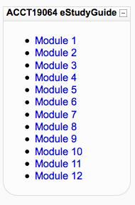

The [last post](/blog2/2009/07/30/bam-into-moodle-8-finishing-the-estudyguide-building-block/) finalised some bits of knowledge I needed, now it is time to put it into action and complete the eStudyGuide block to a barely useful level.

Steps required include:

- Add the username/password to global config.
- Retrieve the xml file for the course using curl.
- Parse the InDesign xml using Moodle.
- Modify the HTML produced to use that information.
- Retrieve the file for the name of the module, chapter etc.
- Generate the HTML for the block based on that content
- Initially, retrieve the PDF files via normal http connections to where the guides are located (will require user to login again).
- Replace that with the use of curl.

There's still an outstanding problem with the naming used in some courses. i.e. those that have an "introduction".

### Add username/password to global config

Fairly simple to add the form elements to the global config - simply edit config\_global.html. However, small problem the text elements are giving the following errors  
**Notice**: Undefined property: stdClass::$block\_estudy\_guide\_username in ... on line **8**  

Interesting, there doesn't seem to be any difference between the use of those variables in the code and the existing one for base\_url. The one difference is that base\_url already has a manually set value. Surely there should be a way to initialise these to empty?

Ahh, it turns out it's connected with the level of debug options, had everything turned on for development. Return it to normal levels for live box - no worries.

### Retrieve the xml file

All the necessary variables have been calculated, let's add a function to return the xml file as a variable.

function getXml() { global $CFG;

// $base\_url/YEAR/PERIOD/COURSE/eStudyGuide/COURSE.xml $url = $CFG->block\_estudy\_guide\_base\_url . $this->content->year . "/" . $this->content->period . "/" . $this->content->course . "/eStudyGuide/" . $this->content->course . ".xml"; $auth = $CFG->block\_estudy\_guide\_username . ":" . $CFG->block\_estudy\_guide\_password ;

$curl\_handle = curl\_init();

if ( $curl\_handle ) { // $fp = fopen("tmpfile", "w"); // Configure curl options curl\_setopt($curl\_handle, CURLOPT\_URL, $url ); curl\_setopt($curl\_handle,CURLOPT\_CONNECTTIMEOUT,2); curl\_setopt($curl\_handle,CURLOPT\_RETURNTRANSFER,1); curl\_setopt($curl\_handle,CULTOPT\_HTTPAUTH,CURLAUTH\_ANY); curl\_setopt($curl\_handle,CURLOPT\_USERPWD, $auth);

// get the stuff $buffer = curl\_exec($curl\_handle); curl\_close($curl\_handle);

return $buffer; } }

Well that compiles, all I have to do now is figure out how to call it properly. Ahh, $this of course.

Oops, undefined constant CULTOOPT\_HTTPAUTH - dyslexic fingers - CURLOPT

Next problem, the base url doesn't seem to be coming across properly. Ahh, web server error only gives path - the wrong course code. Testing course code doesn't have a guide for 2092. Yep, that's working. Now to parse the bugger.

### Parse the XML

The first question is exactly what information do I need to get out of the XML file. The file basically gives a summary of the chapters and headings within the study guide. The tag is used for the chapter titles. The original version gets the titles for each chapter from the XML file and displays that next to the number of the chapter. Given the sparse real estate in a Moodle block, the title of the chapter isn't going to fit. So we don't need that.

Essentially, all we need to do is count the number of TOClev1 entries in the XML file.

Xmlize uses a collection of nested associative arrays where, at least for some, the key is the tag. So, from one extent should be able to simply count the number of TOClev1 keys.

Ahh, there's a nice little function traverse\_xmlize within Xmlize that displays the array Xmlize produces in a format that is pretty readable. Here's an example

$xml\_\[Story\]\[#\]\[Heading1\]\[0\]\[#\] = "Contents
" $xml\_\[Story\]\[#\]\[TOClev1\]\[0\]\[#\] = "The auditing and assurance services profession 9
" $xml\_\[Story\]\[#\]\[TOClev1\]\[1\]\[#\] = "Ethics, independence and corporate governance 19
" $xml\_\[Story\]\[#\]\[TOClev1\]\[2\]\[#\] = "The legal liability of auditors 29
" $xml\_\[Story\]\[#\]\[TOClev1\]\[3\]\[#\] = "The financial report audit process 43
" $xml\_\[Story\]\[#\]\[TOClev1\]\[4\]\[#\] = "Planning and evaluating business risk 51
" $xml\_\[Story\]\[#\]\[TOClev1\]\[5\]\[#\] = "Assessing specific business risks and materiality 59
" $xml\_\[Story\]\[#\]\[TOClev1\]\[6\]\[#\] = "Internal control 65
" $xml\_\[Story\]\[#\]\[TOClev1\]\[7\]\[#\] = "Tests of controls 73
" $xml\_\[Story\]\[#\]\[TOClev1\]\[8\]\[#\] = "Substantive tests of transactions and balances 81
" $xml\_\[Story\]\[#\]\[TOClev1\]\[9\]\[#\] = "Audit sampling 97
" $xml\_\[Story\]\[#\]\[TOClev1\]\[10\]\[#\] = "Completion and review 105
" $xml\_\[Story\]\[#\]\[TOClev1\]\[11\]\[#\] = "The auditor’s reporting obligations 111
" $xml\_\[Story\]\[#\]\[TOClev2\]\[0\]\[#\] = "Introduction 9
" $xml\_\[Story\]\[#\]\[TOClev2\]\[1\]\[#\] = "Learning objectives 9
"

Very helpful. Essentially all I need do is count the number of elements in one of the arrays. How do you count array elements in PHP? Why, the [count function](http://au2.php.net/count) of course. That's easy

print "count is " . count( $data\['Story'\]\['#'\]\['TOClev1'\] ) . "  
";

Of course, Rolley was thinking about using the chapter titles in a roll over or some other GUI rubbish. We should probably get the titles after all. So, simple loop through and a bit of RE replacement to get rid of the page number.

$title = $data\['Story'\]\['#'\]\['TOClev1'\]\[0\]\['#'\]; $title = preg\_replace( '/s+\[0-9\]+/', '', $title );

### Modify the HTML

Well that's worked. Simple mod of existing for loop with all the above data.

Small problem, the title is being set to "Array", seems something is going wrong. Also no code in there to get rid of the page number either. Need to look at this.

Ahh, forgot the _\['#'\]_ needed at the end of the array de-reference. You've gotta love complicated, large nested associative arrays - maybe there was some benefit of all those years of Perl programming.

And here's the "proof", a "working" eStudyGuide block for Moodle - though it still needs a bit of polishing.

### Retrieve the name of the module

Different courses use different titles for the chapters. So far the options include: module, chapter, topic, and week. Need the block to use the appropriate name. Am wondering if the possible options should be part of the global configuration -- probably. Can I be bothered? Yes, probably should.

So, add a textarea to the global config and allow those options to be entered - one to a line. Idea will be that the code will split it up into an array and work on that. A simple kludge.

Oops, not so simple. I enter data into the chapter titles and it disappears. Why?

You know it's getting to be a long day, perhaps past when you should stop coding when you make a mistake like this. They are disappearing because you're not displaying the variable you are storing them in when you are showing the form.

How do you split a string in PHP into an array? Spoilt for choice. I'll go with preg\_split - like my REs.

Okay, got curl checking for the various files. However, there appears to be some issues with checking to see if the retrieval actually worked. We're returning straight away with the first title in the config, even though there should be a file for it. When it doubt, try the negation of what you just did - and that worked - ! $buffer

So, this should be a fully working. Time for some tests.

This is why you shouldn't test. SOCL11056 is a bit different. Not all the files use the file naming format that involves the "module title". The first one has "introduction". Bugger. And the old Perl scripts handle it. Will have to see what the deal is there. How did that work?

Ahh, the relied on being able to access the file system. That's not going to be possible here. That's going to have to change. Need to talk to some folk about that. Solution can wait.

### Serve PDFs with curl

This will be interesting. The problem is that the location of the eStudyGuide PDFs is behind a HTTP basic auth. Student accounts have permission to access the files, however, they will need to login again (having already logged into Moodle). Want to avoid this. One solution to this might be to have the block generate a link that points back to itself or another service. The "other service" uses curl to go through the HTTP auth, get the file and then send it back to the use.

Question: can you generate a URL to access a service provided by a block? This sounds like it might be beyond the scope of a block.

Actually, it might be as simple as putting a "standard" PHP file into the directory for the block and calling it directly from the block. This seems to work. Probably only need to pass the URL as the form element. The getPDF.php file simply takes a URL, checks that it is within the BASE\_URL and sends it back to the user's browser.

That means, I need to figure out how to:

- send a URL via http appropriately - urlencode probably, maybe not worry about it, at least for now.
- have the getPDF.php file access the global variables so it can get base\_url

Ahh, there's a whole rigmarole (good value though) setting up a form processing. No time to do that. Will have to leave it there.