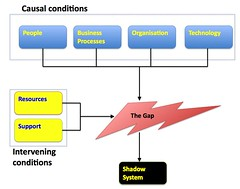

---
categories:
- chapter-2
- elearning
- moodle
- shadowsystems
date: 2009-07-31 11:51:19+10:00
next:
  text: Thinking about evaluating Webfuse (1996 through 1999) - evaluation of an LMS?
  url: /blog/2009/07/31/thinking-about-evaluating-webfuse-1996-through-1999-evaluation-of-an-lms/
previous:
  text: 'BAM into Moodle #9 - a working eStudyGuide block?'
  url: /blog/2009/07/30/bam-into-moodle-9-a-working-estudyguide-block/
tags:
- vle
title: Gaps, shadow systems and the VLE/LMS
type: post
template: blog-post.html
---
One of my continuing "rants" that long-time readers of this blog will be familiar with is the lack of fit between enterprise systems and what people want to do with them. I've [blogged about this with enterprise systems](/blog/2009/06/15/how-silly-can-enterprise-it-get-tools-should-fit-the-people-not-the-other-way-around/), learned to [live and thrive](/blog/publications/how-to-live-with-erp-systems-and-thrive/) in spite of that gap and [drawn some lessons from it](/blog/publications/the-rise-and-fall-of-a-shadow-system-lessons-for-enterprise-system-implementation/) for enterprise systems.

It's even become a bit of a family activity with my wife's Masters research being aimed at attempting to explain the most common response to the lack of fit between people's requirements and the enterprise systems put in place to fulfill them - shadow systems. The following image is of the model that arose out of Sandy's work (Behrens and Sedera, 2004).

One description of the model is that a gap arises (almost inevitably in my opinion) between the enterprise system and the needs of the users. It is created by a range of conditions and can be increased or reduced by two others. The existence of this gap leads to the development of shadow systems. These might simply be employing lots of other people to perform tasks manually that a system should provide. Or it might include developing additional systems to fill the gap.

### The gap, shadow systems and the VLE/LMS

My current institution is in the process of adopting [Moodle](http://moodle.org/) as its sole VLE/LMS. From one perspective Moodle will become another enterprise system supported by the IT folk to achieve business outcomes. That's certainly one perspective of how Moodle is being rolled out at the institution. For me this raises some interesting questions:

- Will Moodle suffer the same problems in terms of the gap and shadow system as other enterprise systems?  
    I tend to think this is almost certain to happen given the diversity and contrary nature of academics, the diversity inherent in L&T, attempts at the institution to standardise L&T at the same minimum and on-going lack of institutional support for L&T.
- What form will those shadow systems take?  
    The rise of social media, web 2.0 etc tools and their broader use by academics - especially those in the younger generation - and students offers one likely source of the shadow systems.
- How will the organisation respond?  
    The traditional, almost reactionary, response from organisations is that shadow systems are evil and need to be stamped out. That is, if the organisation even becomes aware of them.
- What are more appropriate ways for the organisation to respond?  
    Some colleagues and I have [made suggestions previously](/blog/publications/the-rise-and-fall-of-a-shadow-system-lessons-for-enterprise-system-implementation/).
- Where will the gaps arise?

### Where will the gaps arise? An example.

Thomas Duggan another member of staff at my current institution has recently posted [an outline of a paper](http://www.tduggan.com/2009/07/29/a-brief-outline-of-a-paper-i-am-working-on/) he is working on which seems to detail one of the sources for the gap. It's a source that seems to potentially fall within the "People" causal condition from Sandy's model above.

Tom teaches at the institution's [indigenous learning centre](http://nullooyumbah.cqu.edu.au/) Nulloo Yumbah. The paper Tom is working on is built on literature around indigenous learning styles and seeks to see how well Moodle can accommodate those styles. It will be interesting to see what he finds out.

My guess is that how well Moodle will fit these learning styles will depend on many of the factors covered in Sandy's model. For example:

- Technology/People;  
    Moodle is meant to embody/support a specific learning theory. If you accept that (I still question it) there will be a good fit if that learning theory matches the indigenous learning styles as outlined in the literature Tom is drawing up. If the Moodle learning theory and the indigenous learning styles don't match, then there will be trouble.
- Organisation;  
    Much is made of Moodle being open source and open source meaning flexible and able to be changed. This point was pushed quite hard in the various sessions promoting Moodle at the institution. However, such a point misses the significant role played by the policies adopted by an institution implementing Moodle. Open source might mean more flexibility, but if the organisation decides to implement as vanilla, that is meaningless. If the organisation doesn't set up the resources and processes to support and inform that flexiblity, then open source is meaningless.
- Business processes;  
    The institution as adopted a minimum standard for online courses. If there is a mismatch between the indigenous learning styles and the minimum standards, then it might be interesting.
- Organisation (again);  
    The minimum standards are mostly (almost entirely) being driven by the two faculties at our institution and their management. Nulloo Yumbah and the courses it teachers do not, I believe, fit within a faculty. Perhaps the minimum standards don't apply, or don't apply as strictly.
- People; and  
    Tom has a background in technology. This means that even if there is a mismatch between Moodle and the indigenous learning styles he may be able to come up with kludges within Moodle that overcome that mismatch. In part, this will come from Tom really understanding the Moodle model and then being able to innovate around it.
- People (again).  
    Tom, through the blogosphere, twitter and general disposition has established social networks with a range of people that also have experience in L&T and technology, including e-learning. He's also likely to be able to draw upon those people to come up with workarounds to any gaps.

### Just one example

There will be anywhere from about 500 to 1000 courses at this institution that will have to go into Moodle over the next year or so. The above process/set of conditions is likely to apply in each of them. There will be a large number of people having to go through this process. My fear/belief is that most of them, because of a range of contextual and personal reasons, simply won't bother. They will do the bare minimum of work necessary to meet the set minimal standard and won't bother overcoming the gap that exists.

Another fear is that many of the people who want to overcome the gaps won't have the knowledge, time or support to overcome the gap. Instead they will have to make do with what they have and over time get increasingly dispirited.

Lastly, those people that have the knowledge and time (a very small minority) will spend a large amount of time experimenting and will end up developing workarounds. The knowledge that goes into those workarounds will never be captured and disseminated, which makes it likely that many people will repeat the exploration process over and over again. Make the same mistakes and reinvent the wheel. Worse, few or none of these people will be recognised.

### Solutions?

Well, there's probably quite a few interesting little research projects and publications in keeping a close eye on how this rolls out. What are the gaps that people face?

Even more interesting would be putting in processes and resources that would enable people to effectively respond to these gaps. And this doesn't mean using the [traditional process](/blog/2009/07/24/wicked-problems-requirements-gathering-and-the-lms-approach-to-e-learning/) for requirements gathering with enterprise systems.

### References

Sandy Behrens, Wasana Sedera, (2004) [Why do Shadow Systems Exist after an ERP Implementation? Lessons from a Case Study](http://emergentresearchers.wordpress.com/?attachment_id=16), Proceedings of PACIS'2004, Shanghai, China

David Jones, How to live with ERP systems and thrive, Presented at the Tertiary Education Management Conference’2003, Adelaide

Jones, D., Behrens, S., Jamieson, K., & Tansley, E. (2004). The rise and fall of a shadow system: Lessons for enterprise system implementation. Paper presented at the Managing New Wave Information Systems: Enterprise, Government and Society, Proceedings of the 15th Australasian Conference on Information Systems, Hobart, Tasmania.